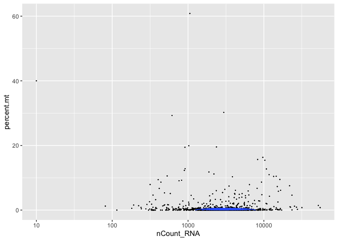
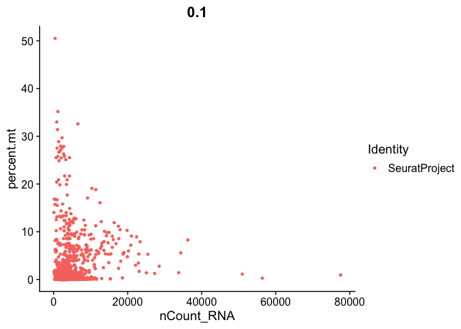
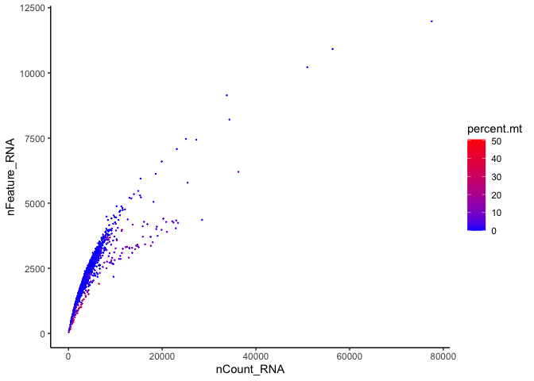

Preprocessing and QC
================
Rebecca O’Rourke
8/9/2022

Read in 10X Genomics files from HB10hpf, HB13hpf, HB16hpf and
HB13hpf\_DEAB samples, create SeuratObjects, do QC analysis, filter out
poor quality cells and process with Signac scRNA-seq/ATAC-seq pipeline.

set mybin &lt;- miniconda3/bin and mypath &lt;- path to cellranger
output files before running

``` r
mybin <- "/Users/becky/opt/miniconda3/bin"
mypath <- "~/Documents/Projects/Sagerstrom/scRNAseq_ATACseq_2021_02_09"
```

# 1. Libraries, annotation and palette

``` r
suppressPackageStartupMessages({
  library(Seurat)
  library(dplyr)
  library(org.Dr.eg.db)
  library(BSgenome.Drerio.UCSC.danRer11)
  library(Signac)
  library(ggplot2)
  library(ggsci)
  library(limma)
  library(AnnotationHub)
  library(reticulate)
  library(patchwork)
  use_python(paste0(mybin,"/python"))
  library(JASPAR2020)
  library(TFBSTools)
  library(motifmatchr)
}) 
```

    ## Warning: package 'AnnotationDbi' was built under R version 4.1.1

    ## Warning: package 'BiocGenerics' was built under R version 4.1.1

    ## Warning: package 'Biobase' was built under R version 4.1.1

    ## Warning: package 'IRanges' was built under R version 4.1.1

    ## Warning: package 'S4Vectors' was built under R version 4.1.3

    ## Warning: package 'BSgenome' was built under R version 4.1.1

    ## Warning: package 'GenomeInfoDb' was built under R version 4.1.1

    ## Warning: package 'GenomicRanges' was built under R version 4.1.1

    ## Warning: package 'Biostrings' was built under R version 4.1.1

    ## Warning: package 'XVector' was built under R version 4.1.1

    ## Warning: package 'rtracklayer' was built under R version 4.1.1

    ## Warning: package 'limma' was built under R version 4.1.3

    ## Warning: package 'AnnotationHub' was built under R version 4.1.1

    ## Warning: package 'BiocFileCache' was built under R version 4.1.1

    ## Warning: package 'TFBSTools' was built under R version 4.1.1

    ## Warning: package 'motifmatchr' was built under R version 4.1.1

``` r
options(future.globals.maxSize = 4000 * 1024^2)
```

``` r
ah = AnnotationHub()
```

    ## snapshotDate(): 2021-10-20

``` r
GRCz11.v99.EnsDb = ah[["AH78759"]]  ## cellranger_arc_genomes/zebrafishPlusGFP built on GRCz11.v99.gtf
```

    ## loading from cache

    ## require("ensembldb")

    ## Warning: package 'ensembldb' was built under R version 4.1.1

    ## Warning: package 'GenomicFeatures' was built under R version 4.1.1

    ## Warning: package 'AnnotationFilter' was built under R version 4.1.1

``` r
#GRCz11.v103.EnsDb <- ah[["AH89399"]]
```

``` r
mypal <- pal_igv(palette = "default",alpha = 1)(30)
```

# 2. Functions

## 2.1 Create Seurat object

``` r
SeuratFromMatrixh5 <- function(inputdata, annotation, frag){
  # the 10x hdf5 file contains both data types
  rna_counts <- inputdata$`Gene Expression`
  atac_counts <- inputdata$Peaks
  
  seurat <- CreateSeuratObject(counts = rna_counts, assay = "RNA")
  seurat[["percent.mt"]] <- PercentageFeatureSet(seurat, pattern = "^mt-")
  
  seurat[["ATAC"]] <- CreateChromatinAssay(
    counts = atac_counts,
    sep = c(":", "-"),
    fragments = frag,
    annotation = annotation)
  
  return(seurat)
}
```

## 2.2 QC plots

``` r
GetQCplots <- function(seurat, mitoPattern){
  seurat[["percent.mt"]] <- PercentageFeatureSet(seurat, pattern = mitoPattern)
  v <- VlnPlot(seurat, features = c("nFeature_RNA", "nCount_RNA", "percent.mt"), ncol = 3)
  f1 <- FeatureScatter(seurat, feature1 = "nCount_RNA", feature2 = "percent.mt")
  f2 <- FeatureScatter(seurat, feature1 = "nFeature_RNA", feature2 = "percent.mt")
  f3 <- FeatureScatter(seurat, feature1 = "nCount_RNA", feature2 = "nFeature_RNA")
  
  qc1 <- ggplot(seurat@meta.data, aes(x=nCount_RNA, y=nFeature_RNA, color=percent.mt)) + geom_point(size=0.1) +
    scale_color_gradient(low="blue",high="red") + theme_classic()

  qc2 <- ggplot(seurat@meta.data, aes(x=nCount_RNA, y=percent.mt)) + geom_point(size=0.1) + scale_x_log10() +
    geom_density2d()

  qc3 <- ggplot(seurat@meta.data, aes(x=nCount_RNA, y=nFeature_RNA ,color=percent.mt)) + geom_point(size=0.1) +
    scale_x_log10() + scale_y_log10() + geom_density2d() +
    scale_color_gradient(low="gray",high="darkblue") + theme_classic()

  print(v)
  print(f1)
  print(f2)
  print(f3)
  print(qc1)
  print(qc2)
  print(qc3)

  return(seurat)
}
```

``` r
GetATACplots <- function(seurat){
  DefaultAssay(seurat) <- "ATAC"
  
  seurat <- NucleosomeSignal(seurat)
  seurat <- TSSEnrichment(seurat)
  
  v1 <- VlnPlot(
    object = seurat,
    features = "nCount_ATAC",
    pt.size = 0
  ) + NoLegend()
  v2 <- VlnPlot(
    object = seurat,
    features = "nCount_ATAC",
    y.max = 100000,
    pt.size = 0
  ) + NoLegend()
  v3 <- VlnPlot(
    object = seurat,
    features = "nCount_ATAC",
    y.max = 5000,
    pt.size = 0
  ) + NoLegend()
  
  v4 <- VlnPlot(
    object = seurat,
    features = "TSS.enrichment",
    pt.size = 0
  ) + NoLegend()
  v5 <- VlnPlot(
    object = seurat,
    features = "TSS.enrichment",
    y.max = 10,
    pt.size = 0
  ) + NoLegend()
  
  v6 <- VlnPlot(
    object = seurat,
    features = "nucleosome_signal",
    pt.size = 0
  ) + NoLegend()
  v7 <- VlnPlot(
    object = seurat,
    features = "nucleosome_signal",
    y.max = 2,
    pt.size = 0
  ) + NoLegend()

  print(v1 + v2 + v3 + plot_layout(ncol = 3))
  print(v4 + v5 + plot_layout(ncol = 2))
  print(v6 + v7 + plot_layout(ncol = 2))
  
  return(seurat)
}
```

## 2.3 Call Peaks with macs2 and filter

``` r
CreatePeaksWithFilter <- function(seurat, frag, blacklist, annotation){
  peaks <- CallPeaks(seurat, macs2.path = paste0(mybin,"/macs2")) ## note this has changed so needs SeuratOjbect not fragment file
  len.ATAC <- length(seurat@assays$ATAC@ranges)
  len.peaks <- length(peaks)
  
  peaks <- keepStandardChromosomes(peaks, pruning.mode = "coarse")
  len.std <- length(peaks)
  peaks <- subsetByOverlaps(x = peaks, ranges = blacklist, invert = TRUE)
  len.bl <- length(peaks)
  ChrEnds <- GRanges(seqnames = annotation@seqinfo@seqnames,
                     ranges = IRanges(start = annotation@seqinfo@seqlengths - 300,
                                      end = annotation@seqinfo@seqlengths))
  ChrStarts <- GRanges(seqnames = annotation@seqinfo@seqnames,
                       ranges = IRanges(start = rep(1,26), end = rep(300,26)))
  RemoveChrEndsChrStarts <- c(ChrEnds,ChrStarts)
  peaks <- subsetByOverlaps(x = peaks, ranges = RemoveChrEndsChrStarts, invert = TRUE)
  len.rends <- length(peaks)
  
  cat("Number original ATAC-seq peaks: ",len.ATAC,"\n")
  cat("Number macs2 called ATAC-seq peaks: ",len.peaks,"\n")
  cat("Number macs2 ATAC-seq peaks with Standard Chromosomes: ",len.std,"\n")
  cat("Number macs2 ATAC-seq peaks after blacklist filter: ",len.bl,"\n")
  cat("Number macs2 ATAC-seq peaks after 300bp end filter: ",len.rends,"\n")
  
  macs2_counts <- FeatureMatrix(
    fragments = Fragments(seurat),
    features = peaks,
    cells = colnames(seurat)
  )
  
  seurat[["peaks"]] <- CreateChromatinAssay(
    counts = macs2_counts,
    fragments = frag,
    annotation = annotation,
    genome = 'GRCz11'
  )
  
  DefaultAssay(seurat) <- "peaks"
  
  seurat <- NucleosomeSignal(seurat)
  seurat <- TSSEnrichment(seurat)
  
  return(seurat)
  
}
```

## 2.4 UMAPS and clusters

``` r
GetUMAPandClusters <- function(seurat){
  # RNA analysis
  DefaultAssay(seurat) <- "RNA"
  seurat <- SCTransform(seurat, verbose = FALSE, return.only.var.genes = FALSE) 
  seurat <- RunPCA(seurat) 
  ElbowPlot(seurat,ndims = 50)
  seurat <- RunUMAP(seurat, dims = 1:50, reduction.name = 'umap.rna', reduction.key = 'rnaUMAP_')
  
  # ATAC analysis
  # We exclude the first dimension as this is typically correlated with sequencing depth
  DefaultAssay(seurat) <- "peaks"
  
  seurat <- FindTopFeatures(seurat, min.cutoff = 5)
  seurat <- RunTFIDF(seurat)
  seurat <- RunSVD(seurat)
  seurat <- RunUMAP(seurat, reduction = 'lsi', dims = 2:50, reduction.name = "umap.atac", reduction.key = "atacUMAP_")
  
  DefaultAssay(seurat) <- "SCT"
  seurat <- FindMultiModalNeighbors(seurat, reduction.list = list("pca", "lsi"), dims.list = list(1:50, 2:50))
  seurat <- RunUMAP(seurat, nn.name = "weighted.nn", reduction.name = "wnn.umap", reduction.key = "wnnUMAP_", assay = "RNA")
  seurat <- FindClusters(seurat, graph.name = "wsnn", algorithm = 3, verbose = FALSE)
  seurat <- FindClusters(seurat, graph.name = "wsnn", algorithm = 3, verbose = FALSE, resolution = 1.0)
seurat <- FindClusters(seurat, graph.name = "wsnn", algorithm = 3, verbose = FALSE, resolution = 1.5)
seurat <- FindClusters(seurat, graph.name = "wsnn", algorithm = 3, verbose = FALSE, resolution = 2.0)
seurat <- FindClusters(seurat, graph.name = "wsnn", algorithm = 3, verbose = FALSE, resolution = 2.5)
seurat <- FindClusters(seurat, graph.name = "wsnn", algorithm = 3, verbose = FALSE, resolution = 3.0)
seurat <- FindClusters(seurat, graph.name = "wsnn", algorithm = 3, verbose = FALSE, resolution = 3.5)
  
  p1 <- DimPlot(seurat, reduction = "umap.rna", label = TRUE, label.size = 5, repel = TRUE, group.by = "wsnn_res.0.8") + ggtitle("RNA") + scale_color_igv()
  p2 <- DimPlot(seurat, reduction = "umap.atac", label = TRUE, label.size = 5, repel = TRUE, group.by = "wsnn_res.0.8") + ggtitle("ATAC") + scale_color_igv()
  p3 <- DimPlot(seurat, reduction = "wnn.umap", label = TRUE, label.size = 5, repel = TRUE, group.by = "wsnn_res.0.8") + ggtitle("WNN") + scale_color_igv()
  print(p1 + p2 + p3 & NoLegend() & theme(plot.title = element_text(hjust = 0.5)))
  
  return(seurat)
}
```

# 3 Read in data

Use same annotation for each sample

``` r
# get gene annotations for GRCz11
annotation <- GetGRangesFromEnsDb(ensdb = GRCz11.v99.EnsDb, verbose = FALSE)
seqlevelsStyle(annotation) <- "UCSC"
genome(annotation) <- "GRCz11"
```

## 3.1 HB10hpf

``` r
inputdata.10 <- Read10X_h5(paste0(mypath,"/HB10hpf_analyses/HB10hpf/filtered_feature_bc_matrix.h5"))
```

    ## Warning in sparseMatrix(i = indices[] + 1, p = indptr[], x = as.numeric(x =
    ## counts[]), : 'giveCsparse' has been deprecated; setting 'repr = "T"' for you

    ## Genome matrix has multiple modalities, returning a list of matrices for this genome

``` r
frag.file.10 <- paste0(mypath,"/HB10hpf_analyses/HB10hpf/atac_fragments.tsv.gz")
HB10hpf <- SeuratFromMatrixh5(inputdata.10, annotation, frag.file.10)
```

    ## Warning: Feature names cannot have underscores ('_'), replacing with dashes
    ## ('-')

    ## Computing hash

``` r
HB10hpf
```

    ## An object of class Seurat 
    ## 171836 features across 2096 samples within 2 assays 
    ## Active assay: RNA (25108 features, 0 variable features)
    ##  1 other assay present: ATAC

## 3.2 HB13hpf

``` r
inputdata.13 <- Read10X_h5(paste0(mypath,"/HB13hpf/filtered_feature_bc_matrix.h5"))
```

    ## Warning in sparseMatrix(i = indices[] + 1, p = indptr[], x = as.numeric(x =
    ## counts[]), : 'giveCsparse' has been deprecated; setting 'repr = "T"' for you

    ## Genome matrix has multiple modalities, returning a list of matrices for this genome

``` r
frag.file.13 <- paste0(mypath,"/HB13hpf/atac_fragemnts_chr.tsv.gz")
HB13hpf <- SeuratFromMatrixh5(inputdata.13, annotation, frag.file.13)
```

    ## Warning: Feature names cannot have underscores ('_'), replacing with dashes
    ## ('-')

    ## Computing hash

``` r
HB13hpf
```

    ## An object of class Seurat 
    ## 170988 features across 2047 samples within 2 assays 
    ## Active assay: RNA (25108 features, 0 variable features)
    ##  1 other assay present: ATAC

## 3.3 HB16hpf

``` r
inputdata.16 <- Read10X_h5(paste0(mypath,"/HB16hpf_analyses/HB16hpf/filtered_feature_bc_matrix.h5"))
```

    ## Warning in sparseMatrix(i = indices[] + 1, p = indptr[], x = as.numeric(x =
    ## counts[]), : 'giveCsparse' has been deprecated; setting 'repr = "T"' for you

    ## Genome matrix has multiple modalities, returning a list of matrices for this genome

``` r
frag.file.16 <- paste0(mypath,"/HB16hpf_analyses/HB16hpf/atac_fragments.tsv.gz")
HB16hpf <- SeuratFromMatrixh5(inputdata.16, annotation, frag.file.16)
```

    ## Warning: Feature names cannot have underscores ('_'), replacing with dashes
    ## ('-')

    ## Computing hash

``` r
HB16hpf
```

    ## An object of class Seurat 
    ## 181937 features across 2157 samples within 2 assays 
    ## Active assay: RNA (25108 features, 0 variable features)
    ##  1 other assay present: ATAC

## 3.4 HB13hpf\_DEAB

``` r
inputdata.13deab <- Read10X_h5(paste0(mypath,"/HB13hpf_DEAB_analyses/HB13hpf_DEAB/filtered_feature_bc_matrix.h5"))
```

    ## Warning in sparseMatrix(i = indices[] + 1, p = indptr[], x = as.numeric(x =
    ## counts[]), : 'giveCsparse' has been deprecated; setting 'repr = "T"' for you

    ## Genome matrix has multiple modalities, returning a list of matrices for this genome

``` r
frag.file.13deab <- paste0(mypath,"/HB13hpf_DEAB_analyses/HB13hpf_DEAB/atac_fragments.tsv.gz")
HB13hpf_DEAB <- SeuratFromMatrixh5(inputdata.13deab, annotation, frag.file.13deab)
```

    ## Warning: Feature names cannot have underscores ('_'), replacing with dashes
    ## ('-')

    ## Computing hash

``` r
HB13hpf_DEAB
```

    ## An object of class Seurat 
    ## 194043 features across 3017 samples within 2 assays 
    ## Active assay: RNA (25108 features, 0 variable features)
    ##  1 other assay present: ATAC

# 4 QC Plots

## 4.1 RNA-seq QC plots

### 4.1.1 HB10hpf

``` r
HB10hpf <- GetQCplots(HB10hpf, "^mt-")
```

<!-- --><!-- --><!-- --><!-- --><!-- --><!-- --><!-- -->

### 4.1.2 HB13hpf

``` r
HB13hpf <- GetQCplots(HB13hpf, "^mt-")
```

<!-- --><!-- --><!-- --><!-- --><!-- --><!-- --><!-- -->

### 4.1.3 HB16hpf

``` r
HB16hpf <- GetQCplots(HB16hpf, "^mt-")
```

<!-- --><!-- --><!-- --><!-- --><!-- --><!-- --><!-- -->

### 4.1.4 HB13hpf\_DEAB

``` r
HB13hpf_DEAB <- GetQCplots(HB13hpf_DEAB, "^mt-")
```

<!-- --><!-- --><!-- --><!-- --><!-- --><!-- --><!-- -->

## 4.2 ATAC-seq QC plots

### 4.2.1 HB10hpf

``` r
HB10hpf <- GetATACplots(HB10hpf)
```

    ## Extracting TSS positions

    ## Extracting fragments at TSSs

    ## 
    ## Computing TSS enrichment score

    ## Warning: Removed 9 rows containing non-finite values (stat_ydensity).

    ## Warning: Removed 1247 rows containing non-finite values (stat_ydensity).

<!-- -->

    ## Warning: Removed 45 rows containing non-finite values (stat_ydensity).

<!-- --><!-- -->
\#\#\# 4.2.2 HB13hpf

``` r
HB13hpf <- GetATACplots(HB13hpf)
```

    ## Extracting TSS positions

    ## Extracting fragments at TSSs

    ## 
    ## Computing TSS enrichment score

    ## Warning: Removed 55 rows containing non-finite values (stat_ydensity).

    ## Warning: Removed 1755 rows containing non-finite values (stat_ydensity).

<!-- -->

    ## Warning: Removed 2 rows containing non-finite values (stat_ydensity).

<!-- -->

    ## Warning: Removed 1 rows containing non-finite values (stat_ydensity).

<!-- -->
\#\#\# 4.2.3 HB16hpf

``` r
HB16hpf <- GetATACplots(HB16hpf)
```

    ## Extracting TSS positions

    ## Extracting fragments at TSSs

    ## 
    ## Computing TSS enrichment score

    ## Warning: Removed 8 rows containing non-finite values (stat_ydensity).

    ## Warning: Removed 1579 rows containing non-finite values (stat_ydensity).

<!-- -->

    ## Warning: Removed 18 rows containing non-finite values (stat_ydensity).

<!-- -->

    ## Warning: Removed 1 rows containing non-finite values (stat_ydensity).

<!-- -->
\#\#\# 4.2.4 HB13hpf\_DEAB

``` r
HB13hpf_DEAB <- GetATACplots(HB13hpf_DEAB)
```

    ## Extracting TSS positions

    ## Extracting fragments at TSSs

    ## 
    ## Computing TSS enrichment score

    ## Warning: Removed 1 rows containing non-finite values (stat_ydensity).

    ## Warning: Removed 1778 rows containing non-finite values (stat_ydensity).

<!-- -->

    ## Warning: Removed 55 rows containing non-finite values (stat_ydensity).

<!-- -->

    ## Warning: Removed 1 rows containing non-finite values (stat_ydensity).

<!-- -->

# 5 Filter samples

## 5.1 HB10hpf

``` r
cells.orig <- table(HB10hpf@meta.data$orig.ident)[[1]]
HB10hpf <- subset(x = HB10hpf,
  subset = nCount_ATAC < 100000 & nCount_ATAC > 1000)
cells.atac <- table(HB10hpf@meta.data$orig.ident)[[1]]
HB10hpf <- subset(x = HB10hpf,
  subset = nCount_RNA < 20000 & nCount_RNA > 500)
cells.rna <- table(HB10hpf@meta.data$orig.ident)[[1]]
HB10hpf <- subset(x = HB10hpf,
  subset =percent.mt < 5)
cells.mt <- table(HB10hpf@meta.data$orig.ident)[[1]]
HB10hpf <- subset(x = HB10hpf,
  subset = nucleosome_signal < 2 )
cells.nuc <- table(HB10hpf@meta.data$orig.ident)[[1]]
HB10hpf <- subset(x = HB10hpf,
  subset = TSS.enrichment >1)
cells.tss <- table(HB10hpf@meta.data$orig.ident)[[1]]
cat("HB10hpf:","\n")
```

    ## HB10hpf:

``` r
cat("cells in original sample: ",cells.orig,"\n")
```

    ## cells in original sample:  2096

``` r
cat("cells after ATAC < 10000 & ATAC > 1000: ",cells.atac,"\n")
```

    ## cells after ATAC < 10000 & ATAC > 1000:  1759

``` r
cat("cells after RNA < 20000 and RNA > 500: ",cells.rna,"\n")
```

    ## cells after RNA < 20000 and RNA > 500:  1714

``` r
cat("cells after percent.mt < 5: ",cells.mt,"\n")
```

    ## cells after percent.mt < 5:  1654

``` r
cat("cells after nucleosome < 2: ",cells.nuc,"\n")
```

    ## cells after nucleosome < 2:  1654

``` r
cat("cells after TSS enrichment > 1",cells.tss,"\n")
```

    ## cells after TSS enrichment > 1 1654

## 5.2 HB13hpf

``` r
cells.orig <- table(HB13hpf@meta.data$orig.ident)[[1]]
HB13hpf <- subset(x = HB13hpf,
  subset = nCount_ATAC < 100000 & nCount_ATAC > 1000)
cells.atac <- table(HB13hpf@meta.data$orig.ident)[[1]]
HB13hpf <- subset(x = HB13hpf,
  subset = nCount_RNA < 20000 & nCount_RNA > 500)
cells.rna <- table(HB13hpf@meta.data$orig.ident)[[1]]
HB13hpf <- subset(x = HB13hpf,
  subset =percent.mt < 5)
cells.mt <- table(HB13hpf@meta.data$orig.ident)[[1]]
HB13hpf <- subset(x = HB13hpf,
  subset = nucleosome_signal < 2 )
cells.nuc <- table(HB13hpf@meta.data$orig.ident)[[1]]
HB13hpf <- subset(x = HB13hpf,
  subset = TSS.enrichment >1)
cells.tss <- table(HB13hpf@meta.data$orig.ident)[[1]]
cat("HB13hpf:","\n")
```

    ## HB13hpf:

``` r
cat("cells in original sample: ",cells.orig,"\n")
```

    ## cells in original sample:  2047

``` r
cat("cells after ATAC < 10000 & ATAC > 1000: ",cells.atac,"\n")
```

    ## cells after ATAC < 10000 & ATAC > 1000:  1901

``` r
cat("cells after RNA < 20000 and RNA > 500: ",cells.rna,"\n")
```

    ## cells after RNA < 20000 and RNA > 500:  1862

``` r
cat("cells after percent.mt < 5: ",cells.mt,"\n")
```

    ## cells after percent.mt < 5:  1828

``` r
cat("cells after nucleosome < 2: ",cells.nuc,"\n")
```

    ## cells after nucleosome < 2:  1828

``` r
cat("cells after TSS enrichment > 1",cells.tss,"\n")
```

    ## cells after TSS enrichment > 1 1828

## 5.3 HB16hpf

``` r
cells.orig <- table(HB16hpf@meta.data$orig.ident)[[1]]
HB16hpf <- subset(x = HB16hpf,
  subset = nCount_ATAC < 100000 & nCount_ATAC > 1000)
cells.atac <- table(HB16hpf@meta.data$orig.ident)[[1]]
HB16hpf <- subset(x = HB16hpf,
  subset = nCount_RNA < 20000 & nCount_RNA > 500)
cells.rna <- table(HB16hpf@meta.data$orig.ident)[[1]]
HB16hpf <- subset(x = HB16hpf,
  subset =percent.mt < 5)
cells.mt <- table(HB16hpf@meta.data$orig.ident)[[1]]
HB16hpf <- subset(x = HB16hpf,
  subset = nucleosome_signal < 2 )
cells.nuc <- table(HB16hpf@meta.data$orig.ident)[[1]]
HB16hpf <- subset(x = HB16hpf,
  subset = TSS.enrichment >1)
cells.tss <- table(HB16hpf@meta.data$orig.ident)[[1]]
cat("HB16hpf:","\n")
```

    ## HB16hpf:

``` r
cat("cells in original sample: ",cells.orig,"\n")
```

    ## cells in original sample:  2157

``` r
cat("cells after ATAC < 10000 & ATAC > 1000: ",cells.atac,"\n")
```

    ## cells after ATAC < 10000 & ATAC > 1000:  1909

``` r
cat("cells after RNA < 20000 and RNA > 500: ",cells.rna,"\n")
```

    ## cells after RNA < 20000 and RNA > 500:  1885

``` r
cat("cells after percent.mt < 5: ",cells.mt,"\n")
```

    ## cells after percent.mt < 5:  1750

``` r
cat("cells after nucleosome < 2: ",cells.nuc,"\n")
```

    ## cells after nucleosome < 2:  1750

``` r
cat("cells after TSS enrichment > 1",cells.tss,"\n")
```

    ## cells after TSS enrichment > 1 1750

## 5.2 HB13hpf\_DEAB

``` r
cells.orig <- table(HB13hpf_DEAB@meta.data$orig.ident)[[1]]
HB13hpf_DEAB <- subset(x = HB13hpf_DEAB,
  subset = nCount_ATAC < 100000 & nCount_ATAC > 1000)
cells.atac <- table(HB13hpf_DEAB@meta.data$orig.ident)[[1]]
HB13hpf_DEAB <- subset(x = HB13hpf_DEAB,
  subset = nCount_RNA < 20000 & nCount_RNA > 500)
cells.rna <- table(HB13hpf_DEAB@meta.data$orig.ident)[[1]]
HB13hpf_DEAB <- subset(x = HB13hpf_DEAB,
  subset =percent.mt < 5)
cells.mt <- table(HB13hpf_DEAB@meta.data$orig.ident)[[1]]
HB13hpf_DEAB <- subset(x = HB13hpf_DEAB,
  subset = nucleosome_signal < 2 )
cells.nuc <- table(HB13hpf_DEAB@meta.data$orig.ident)[[1]]
HB13hpf_DEAB <- subset(x = HB13hpf_DEAB,
  subset = TSS.enrichment >1)
cells.tss <- table(HB13hpf_DEAB@meta.data$orig.ident)[[1]]
cat("HB13hpf_DEAB:","\n")
```

    ## HB13hpf_DEAB:

``` r
cat("cells in original sample: ",cells.orig,"\n")
```

    ## cells in original sample:  3017

``` r
cat("cells after ATAC < 10000 & ATAC > 1000: ",cells.atac,"\n")
```

    ## cells after ATAC < 10000 & ATAC > 1000:  2523

``` r
cat("cells after RNA < 20000 and RNA > 500: ",cells.rna,"\n")
```

    ## cells after RNA < 20000 and RNA > 500:  2470

``` r
cat("cells after percent.mt < 5: ",cells.mt,"\n")
```

    ## cells after percent.mt < 5:  2423

``` r
cat("cells after nucleosome < 2: ",cells.nuc,"\n")
```

    ## cells after nucleosome < 2:  2423

``` r
cat("cells after TSS enrichment > 1",cells.tss,"\n")
```

    ## cells after TSS enrichment > 1 2423

# 6 Peak calling

Per recommendation from Signac tutorial call ATAC peaks with macs2 and
put in assay “peaks”

#### GRCz11.blacklist

Found GRCz10 blacklist in Yang, H., Luan, Y., Liu, T. et al. A map of
cis-regulatory elements and 3D genome structures in zebrafish. Nature
588, 337–343 (2020). <https://doi.org/10.1038/s41586-020-2962-9>
Supplementary table 19: Supplemental Table 19. ChIP-seq black list in
the zebrafish genome.xlsx

``` r
### code used to generate blacklist
# library(readxl)
# library(GenomicRanges)
# library(plyranges)
# GRCz10.blacklist <- read_excel("Supplemental_Table_19_ChIPseq_black_list_in_the_zebrafish_genome.xlsx", col_names = F)
# names(GRCz10.blacklist) <- c("seqnames","start","end")
# head(GRCz10.blacklist)
# GRCz10.blacklist <- as_granges(GRCz10.blacklist)
# head(GRCz10.blacklist)
# chain <- import.chain("danRer10ToDanRer11.over.chain")
# seqlevelsStyle(GRCz10.blacklist) = "UCSC"  # necessary
# GRCz11.blacklist = liftOver(GRCz10.blacklist, chain)
# class(GRCz11.blacklist)
# GRCz11.blacklist = unlist(GRCz11.blacklist)
# genome(GRCz11.blacklist) = "GRCz11"
# GRCz11.blacklist
# saveRDS(GRCz11.blacklist, file = "GRCz11.blacklist.granges.RDS")
```

``` r
GRCz11.blacklist <- readRDS(file = "~/Documents/Projects/R_General/GRCz11.blacklist.granges.RDS")
```

Call peaks with macs2 and filter with blacklist and filter out peaks in
300bp start and end of each chromosome which causes errors in Signac in
downstream analyses

## 6.1 HB10hpf

``` r
HB10hpf <- CreatePeaksWithFilter(HB10hpf, frag.file.10, GRCz11.blacklist, annotation)
```

    ## Number original ATAC-seq peaks:  146728 
    ## Number macs2 called ATAC-seq peaks:  143998 
    ## Number macs2 ATAC-seq peaks with Standard Chromosomes:  143998 
    ## Number macs2 ATAC-seq peaks after blacklist filter:  143271 
    ## Number macs2 ATAC-seq peaks after 300bp end filter:  143264

    ## Extracting reads overlapping genomic regions

    ## Computing hash

    ## Extracting TSS positions

    ## Extracting fragments at TSSs

    ## 
    ## Computing TSS enrichment score

## 6.2 HB13hpf

``` r
HB13hpf <- CreatePeaksWithFilter(HB13hpf, frag.file.13, GRCz11.blacklist, annotation)
```

    ## Number original ATAC-seq peaks:  145880 
    ## Number macs2 called ATAC-seq peaks:  195593 
    ## Number macs2 ATAC-seq peaks with Standard Chromosomes:  195592 
    ## Number macs2 ATAC-seq peaks after blacklist filter:  194864 
    ## Number macs2 ATAC-seq peaks after 300bp end filter:  194853

    ## Extracting reads overlapping genomic regions

    ## Computing hash

    ## Extracting TSS positions

    ## Extracting fragments at TSSs

    ## 
    ## Computing TSS enrichment score

## 6.3 HB16hpf

``` r
HB16hpf <- CreatePeaksWithFilter(HB16hpf, frag.file.16, GRCz11.blacklist, annotation)
```

    ## Number original ATAC-seq peaks:  156829 
    ## Number macs2 called ATAC-seq peaks:  159610 
    ## Number macs2 ATAC-seq peaks with Standard Chromosomes:  159609 
    ## Number macs2 ATAC-seq peaks after blacklist filter:  158889 
    ## Number macs2 ATAC-seq peaks after 300bp end filter:  158881

    ## Extracting reads overlapping genomic regions

    ## Computing hash

    ## Extracting TSS positions

    ## Extracting fragments at TSSs

    ## 
    ## Computing TSS enrichment score

## 6.4 HB13hpf\_DEAB

``` r
HB13hpf_DEAB <- CreatePeaksWithFilter(HB13hpf_DEAB, frag.file.13deab, GRCz11.blacklist, annotation)
```

    ## Number original ATAC-seq peaks:  168935 
    ## Number macs2 called ATAC-seq peaks:  164414 
    ## Number macs2 ATAC-seq peaks with Standard Chromosomes:  164413 
    ## Number macs2 ATAC-seq peaks after blacklist filter:  163710 
    ## Number macs2 ATAC-seq peaks after 300bp end filter:  163703

    ## Extracting reads overlapping genomic regions

    ## Computing hash

    ## Extracting TSS positions

    ## Extracting fragments at TSSs

    ## 
    ## Computing TSS enrichment score

# 7 UMAPs

## 7.1 HB10hpf

``` r
HB10hpf <- GetUMAPandClusters(HB10hpf)
```

    ## PC_ 1 
    ## Positive:  lama5, tp63, plekha6, pcdh19, bcam, pls3, tfap2c, itga3b, niban2a, alcama 
    ##     fermt1, myh9a, rpe65b, fn1a, fat2, gata2a, grhl2b, cdh1, lamb1a, smad6b 
    ##     bmp7a, ahnak, si:ch211-199g17.2, itga6b, dok4, znf385a, cldni, cnksr1, samd10a, fmo5 
    ## Negative:  hoxc3a, zeb1b, nova2, XKR4, ncam1a, tenm4, pappab, cntfr, cdh2, rfx4 
    ##     mllt3, zbtb16a, prickle2b, trps1, sox5, rnf220a, adgrv1, pax3a, ptprn2, efnb2b 
    ##     ntn1a, plxdc2, sulf1, hs3st3b1b, gli2a, lrp2a, plch1, sox13, ek1, zeb2a 
    ## PC_ 2 
    ## Positive:  ncam1a, gli3, nova2, cntfr, zbtb16b, col18a1a, pappab, ptprn2, epha7, plxdc2 
    ##     nr2f5, ror1, ek1, sox13, adgrv1, pax3a, rfx4, greb1l, foxp4, pkdcca 
    ##     zfhx4, tox, celsr1b, zeb1b, hs3st3b1b, six7, pcdh19, ZNF423, msi1, plch1 
    ## Negative:  hoxc3a, XKR4, mllt3, fn1b, tbx16, phc2a, sulf1, wnt5b, arid3c, serpinh1b 
    ##     rbm38, hoxc6b, msgn1, il17rd, si:dkey-261h17.1, fndc3ba, kif26ab, lef1, unc45b, samd10b 
    ##     evx1, pcdh8, her1, hoxb7a, lpar1, raraa, tbx16l, ttn.1, lhfpl6, greb1 
    ## PC_ 3 
    ## Positive:  hoxc3a, col18a1a, XKR4, nradd, pcdh19, dag1, greb1, hoxc6b, raraa, phc2a 
    ##     tp63, evx1, aopep, bcar3, mllt3, cdx4, hoxb3a, sulf1, lef1, kif26ab 
    ##     chrd, alcamb, arid3c, cadm1a, pax3a, RIMBP2, hoxb7a, rfx4, hoxd3a, zgc:110158 
    ## Negative:  slit3, rrbp1b, snd1, st6gal2a, dennd4a, eya1, tram1, zgc:174153, calr3b, si:dkey-239j18.2 
    ##     quo, zbtb46, si:dkey-26g8.5, ctslb.2, si:dkey-269i1.4.1, zgc:174855, sec24d, ctslb, fam214a, pitx2 
    ##     zgc:174154, fkbp11, si:ch211-163l21.8, si:dkey-269i1.4, sorl1, frzb, ctslb.1, camk1b, he1.2, plpp1a 
    ## PC_ 4 
    ## Positive:  plxna2, lhfpl6, plod2, fgfrl1a, fbn2b, serpinh1b, si:dkey-22o22.2, fstl1a, ntd5, ttn.2 
    ##     epha4a, ttn.1, cxcl12b, col11a1a, mtss1lb, si:dkey-261h17.1, bmpr1ba, loxl3b, fstl1b, rbm24a 
    ##     unc45b, zcchc24, enah, caskin1, aplp2, hmcn1, lrig1, arhgap24, qkia, agrn 
    ## Negative:  hoxc3a, mllt3, plxna3, zgc:174855, ctslb, si:dkey-239j18.2, si:dkey-269i1.4.1, nradd, si:ch211-163l21.8, ctslb.2 
    ##     aopep, zgc:174154, si:dkey-26g8.5, zgc:174153, camk1b, calr3b, he1.2, si:dkey-269i1.4, ctslb.1, quo 
    ##     adamts18, pcdh1b, stx3a, samd7, zbtb46, pkib, frzb, he1.1, klf17, bhlha15 
    ## PC_ 5 
    ## Positive:  unc45b, zbtb16a, tenm4, ttn.1, fn1b, samd10b, six7, msgn1, sox5, tbx16 
    ##     pcdh8, shisa2a, nr2f5, pde4cb, mef2d, hivep2a, zbtb16b, gli2a, lhx2b, hsp90aa1.1 
    ##     draxin, ek1, crb2a, large2, zeb1b, tbx6, ptprn2, fgfrl1a, vcana, ANOS1 
    ## Negative:  col11a1a, cdh11, mtss1lb, slit3, sema5bb, fndc3ba, hmcn1, gdf11, ddr1, rnf220a 
    ##     zgc:158328, nradd, prickle2b, plod2, si:dkey-261h17.1, ppp1r14c, arhgef10, pmp22b, serpinh1b, col2a1a 
    ##     loxl3b, hoxc3a, aopep, p4ha1b, col4a6, epha2a, agrn, kif26ab, caskin1, lypd6b

    ## Warning: The default method for RunUMAP has changed from calling Python UMAP via reticulate to the R-native UWOT using the cosine metric
    ## To use Python UMAP via reticulate, set umap.method to 'umap-learn' and metric to 'correlation'
    ## This message will be shown once per session

    ## 16:05:05 UMAP embedding parameters a = 0.9922 b = 1.112

    ## 16:05:05 Read 1654 rows and found 50 numeric columns

    ## 16:05:05 Using Annoy for neighbor search, n_neighbors = 30

    ## 16:05:05 Building Annoy index with metric = cosine, n_trees = 50

    ## 0%   10   20   30   40   50   60   70   80   90   100%

    ## [----|----|----|----|----|----|----|----|----|----|

    ## **************************************************|
    ## 16:05:05 Writing NN index file to temp file /var/folders/pz/z8hs91417hl_gzxjrv4pmvyw0000gp/T//RtmpkBldDP/filedd917a19222b
    ## 16:05:05 Searching Annoy index using 1 thread, search_k = 3000
    ## 16:05:05 Annoy recall = 100%
    ## 16:05:06 Commencing smooth kNN distance calibration using 1 thread
    ## 16:05:08 Initializing from normalized Laplacian + noise
    ## 16:05:08 Commencing optimization for 500 epochs, with 60790 positive edges
    ## 16:05:10 Optimization finished
    ## Performing TF-IDF normalization

    ## Warning in RunTFIDF.default(object = GetAssayData(object = object, slot =
    ## "counts"), : Some features contain 0 total counts

    ## Running SVD
    ## Scaling cell embeddings
    ## 16:05:25 UMAP embedding parameters a = 0.9922 b = 1.112
    ## 16:05:25 Read 1654 rows and found 49 numeric columns
    ## 16:05:25 Using Annoy for neighbor search, n_neighbors = 30
    ## 16:05:25 Building Annoy index with metric = cosine, n_trees = 50
    ## 0%   10   20   30   40   50   60   70   80   90   100%
    ## [----|----|----|----|----|----|----|----|----|----|
    ## **************************************************|
    ## 16:05:25 Writing NN index file to temp file /var/folders/pz/z8hs91417hl_gzxjrv4pmvyw0000gp/T//RtmpkBldDP/filedd9181273ad
    ## 16:05:25 Searching Annoy index using 1 thread, search_k = 3000
    ## 16:05:25 Annoy recall = 100%
    ## 16:05:26 Commencing smooth kNN distance calibration using 1 thread
    ## 16:05:27 Initializing from normalized Laplacian + noise
    ## 16:05:27 Commencing optimization for 500 epochs, with 63724 positive edges
    ## 16:05:30 Optimization finished
    ## Calculating cell-specific modality weights
    ## Finding 20 nearest neighbors for each modality.
    ## Calculating kernel bandwidths
    ## Finding multimodal neighbors
    ## Constructing multimodal KNN graph
    ## Constructing multimodal SNN graph
    ## 16:05:33 UMAP embedding parameters a = 0.9922 b = 1.112
    ## 16:05:34 Commencing smooth kNN distance calibration using 1 thread
    ## 16:05:35 Initializing from normalized Laplacian + noise
    ## 16:05:35 Commencing optimization for 500 epochs, with 44874 positive edges
    ## 16:05:38 Optimization finished

<!-- -->

## 7.2 HB13hpf

``` r
HB13hpf <- GetUMAPandClusters(HB13hpf)
```

    ## PC_ 1 
    ## Positive:  ttn.2, ttn.1, ahnak, unc45b, rbm24a, efemp2a, alcama, fat2, flncb, arid3c 
    ##     hsp90aa1.1, p3h2, fgfrl1a, eya1, rbfox1l, bcam, meox1, si:dkey-261h17.1, lama5, cdh1 
    ##     col5a1, fhl3a, kcnq5a, lsp1a, thbs4b, hey1, itga9, plxna2, emp2, efnb2a 
    ## Negative:  nova2, ncam1a, rfx4, cntfr, zbtb16b, pvrl2l, negr1, gli3, msi1, plch1 
    ##     plxdc2, zbtb16a, adgrv1, tet3, sema5ba, lrp2a, blmh, cadm1a, plekhh1, nat8l 
    ##     tenm4, crb2a, ncam1b, mbd3b, cgnl1, plp1a, cldn5a, epha4b, qkib, chl1a 
    ## PC_ 2 
    ## Positive:  cdh1, znf385a, bcam, plekha6, col14a1a, lama5, myh9a, cldni, actn1, epcam 
    ##     tfap2c, fn1a, cldn7b, tp63, flrt2, nrg2a, lima1a, jupa, flna, zyx 
    ##     pawr, grhl2b, lamb1a, niban2a, f11r.1, itga6b, rrbp1b, myh9b, fermt1, asap2b 
    ## Negative:  ttn.2, ttn.1, unc45b, efemp2a, hsp90aa1.1, rbm24a, flncb, meox1, rbfox1l, megf10 
    ##     efemp2b, enah, kcnq5a, zgc:92429, thbs4b, fgfrl1a, gli2a, cd81a, ryr1b, optc 
    ##     si:ch1073-268j14.1, col5a2a, si:ch211-131k2.3, plxna2, col4a2, ptk2ab, fam49al, kirrel3l, kcnn3, mef2d 
    ## PC_ 3 
    ## Positive:  cdh1, col14a1a, plekha6, myh9a, cldni, fat2, tfap2c, epcam, tp63, cldn7b 
    ##     nrg2a, flrt2, asap2b, bcar3, itga6b, fermt1, f11r.1, tiam1b, grhl2b, krt4 
    ##     col18a1a, si:ch211-264f5.6, niban2a, fn1a, ttn.1, palm3, myo9b, ank3a, rpe65b, fn1b 
    ## Negative:  slit3, col9a2, col11a1a, mtss1lb, ryr2b, col2a1a, col8a1a, loxl3b, arhgap24, col9a3 
    ##     p4ha1b, si:ch211-204c21.1.1, col5a3a, znf385b, caskin1, palmda, shha, si:ch211-200p22.4.1, crim1, FQ323119.1 
    ##     FP102018.1, sntb2, ablim2, zmp:0000000760, col9a1b, colgalt2, serpinh1b, arrdc3a, dlg1l, si:dkey-261h17.1 
    ## PC_ 4 
    ## Positive:  ddr1, ncam1a, actn1, dag1, fat2, zgc:162730, nedd9, myh9a, myo1cb, rfx4 
    ##     chl1a, bcam, ttn.1, col2a1a, hsp90aa1.1, cadm1a, cldni, pvrl2l, zyx, lrig1 
    ##     nova2, jupa, col5a3a, enah, fras1, rnf220a, p4ha1b, mdka, efemp2a, ptk2ab 
    ## Negative:  ebf3a, kcnab1a, pdgfra, abtb2b, snai1b, zfpm1, prex2, runx1t1, nrp2a, rbpms2a 
    ##     adgra2, zcchc24, alcama, sh3pxd2aa, tfap2a, foxn3, rxraa, sox10, colec12, col15a1b 
    ##     mtus1b, unc5b, osbpl10b, traf4a, sdk2b, lsp1a, cbfb, tgfbr3, p3h2, dlc1 
    ## PC_ 5 
    ## Positive:  zfpm1, rbpms2a, runx1t1, p3h2, adgra2, fgfr2, anks1b, si:ch211-250c4.4, unc5b, bmp6 
    ##     alcama, rassf7a, cntfr, tjp1b, tnnt2a, lama5, cdh11, si:ch73-22o12.1, crb2a, lsp1a 
    ##     podxl, colec12, si:dkey-49n23.1, si:dkey-261h17.1, adgrv1, gata5, ttn.2, pcdh10a, cxcl12a, arhgap29a 
    ## Negative:  kcnab1a, prex2, XKR4, tfap2a, pdgfra, rxraa, sox10, sox5, sdk2b, osbpl10b 
    ##     ednrab, sox6, hoxc3a, nrp2a, stard13b, col16a1, nr2f5, slc1a3a, snai1b, col15a1b 
    ##     foxd3, mmp15b, myo10l1, pcdh1b, kalrnb, gas2a, si:dkey-22o22.2, pcca, traf4a, zic2b

    ## 16:06:12 UMAP embedding parameters a = 0.9922 b = 1.112

    ## 16:06:12 Read 1828 rows and found 50 numeric columns

    ## 16:06:12 Using Annoy for neighbor search, n_neighbors = 30

    ## 16:06:12 Building Annoy index with metric = cosine, n_trees = 50

    ## 0%   10   20   30   40   50   60   70   80   90   100%

    ## [----|----|----|----|----|----|----|----|----|----|

    ## **************************************************|
    ## 16:06:13 Writing NN index file to temp file /var/folders/pz/z8hs91417hl_gzxjrv4pmvyw0000gp/T//RtmpkBldDP/filedd914b41e8e3
    ## 16:06:13 Searching Annoy index using 1 thread, search_k = 3000
    ## 16:06:14 Annoy recall = 100%
    ## 16:06:14 Commencing smooth kNN distance calibration using 1 thread
    ## 16:06:16 Initializing from normalized Laplacian + noise
    ## 16:06:16 Commencing optimization for 500 epochs, with 64894 positive edges
    ## 16:06:19 Optimization finished
    ## Performing TF-IDF normalization
    ## Running SVD
    ## Scaling cell embeddings
    ## 16:06:39 UMAP embedding parameters a = 0.9922 b = 1.112
    ## 16:06:39 Read 1828 rows and found 49 numeric columns
    ## 16:06:39 Using Annoy for neighbor search, n_neighbors = 30
    ## 16:06:39 Building Annoy index with metric = cosine, n_trees = 50
    ## 0%   10   20   30   40   50   60   70   80   90   100%
    ## [----|----|----|----|----|----|----|----|----|----|
    ## **************************************************|
    ## 16:06:39 Writing NN index file to temp file /var/folders/pz/z8hs91417hl_gzxjrv4pmvyw0000gp/T//RtmpkBldDP/filedd915420b5ae
    ## 16:06:39 Searching Annoy index using 1 thread, search_k = 3000
    ## 16:06:39 Annoy recall = 100%
    ## 16:06:40 Commencing smooth kNN distance calibration using 1 thread
    ## 16:06:41 Initializing from normalized Laplacian + noise
    ## 16:06:41 Commencing optimization for 500 epochs, with 62842 positive edges
    ## 16:06:44 Optimization finished
    ## Calculating cell-specific modality weights
    ## Finding 20 nearest neighbors for each modality.
    ## Calculating kernel bandwidths
    ## Finding multimodal neighbors
    ## Constructing multimodal KNN graph
    ## Constructing multimodal SNN graph
    ## 16:06:48 UMAP embedding parameters a = 0.9922 b = 1.112
    ## 16:06:48 Commencing smooth kNN distance calibration using 1 thread
    ## 16:06:50 Initializing from normalized Laplacian + noise
    ## 16:06:50 Commencing optimization for 500 epochs, with 47132 positive edges
    ## 16:06:53 Optimization finished

<!-- -->

## 7.3 HB16hpf

``` r
HB16hpf <- GetUMAPandClusters(HB16hpf)
```

    ## PC_ 1 
    ## Positive:  ttn.2, ttn.1, mef2d, rbfox1l, rbm24a, flncb, si:ch1073-268j14.1, ryr1b, megf10, unc45b 
    ##     tspan9a, kcnma1a, rc3h2, txlnba, kcnq5a, hsp90aa1.1, ldb3a, plxna2, mybphb, thrap3a 
    ##     smyd1b, nexn, svila, cdh15, srl, musk, fras1, eya1, tnni2b.1, plecb 
    ## Negative:  ncam1a, tenm4, nova2, rnf220a, sema5ba, rfx4, cadm1a, cntfr, ncam1b, negr1 
    ##     epha4b, plp1a, ptprnb, msi1, zbtb16b, cdh7a, adgrv1, efna2a, pcdh19, pvrl2l 
    ##     her4.2, sox13, jag2b, pax3a, zbtb16a, plch1, dacha, pax6a, chl1a, ptprn2 
    ## PC_ 2 
    ## Positive:  plekha6, lama5, pls3, camk2d1, ank3a, cdh1, col14a1a, tp63, myh9a, tfap2c 
    ##     palm3, slit2, actn1, col7a1, flrt2, pawr, sept12, niban2a, slit3, dock5 
    ##     fermt1, iqgap1, pcdh7b, myh9b, lamb1a, ppap2d, wu:fi36a10, arid3c, ahnak, bnc2 
    ## Negative:  ttn.1, ttn.2, ncam1a, si:ch1073-268j14.1, rbfox1l, ryr1b, rbm24a, mef2d, unc45b, rc3h2 
    ##     hsp90aa1.1, megf10, nova2, enah, ptprua, flncb, txlnba, tenm4, kcnma1a, tspan9a 
    ##     smyd1b, gli2a, srl, cdh15, musk, mybphb, myog, kcnq5b, kcnq5a, nexn 
    ## PC_ 3 
    ## Positive:  evpla, anxa1c, mboat1, pard6a, eppk1, krt4, si:cabz01007794.1, ppl, krt5, noxo1a 
    ##     znf185, agr1, gbgt1l4, myh14, zgc:100868, ppp2r5a, elovl7a, hsd17b12a, dhrs11a, zgc:194679 
    ##     grhl1, spaca4l, spint2, cldne, si:dkey-87o1.2, krt92, mctp2a, si:ch211-195b11.3, si:ch211-79k12.1, si:ch211-157c3.4 
    ## Negative:  itga9, ebf3a, col5a1, pdgfra, fgfrl1a, nrp2b, alcama, adamts6, lsp1a, adgra2 
    ##     colec12, slit3, si:dkey-261h17.1, eya1, serpinh1b, emp2, meis1a, anks1b, p3h2, col12a1b 
    ##     bnc2, lamb1a, nectin1b, sept12, lpar1, crim1, meis3, ror1, gse1, postnb 
    ## PC_ 4 
    ## Positive:  col14a1a, col18a1a, col7a1, tp63, lama5, col28a2a, pcdh19, rpe65b, actn1, dock5 
    ##     myh9a, bcam, dag1, tfap2c, fermt1, zgc:171775, ptk2bb, cldni, col4a6, hs6st1a 
    ##     itga3b, bcar3, palm3, ank3a, tiam1b, arhgef25b, flna, nrg2a, ppap2d, padi2 
    ## Negative:  ebf3a, itga9, fgfrl1a, col5a1, colec12, kif26ba, nrg1, pcdh1b, dnah5, tanc2a 
    ##     cfap57, kirrel1b, pdgfra, ism2a, gfra1a, cdh11, cadm4, lpar1, si:ch211-204c21.1.1, ptprga 
    ##     etnk1, syne1b, eya1, dnah2, rbm47, ebf3a.1, foxp1b, zfpm1, alcama, col5a2a 
    ## PC_ 5 
    ## Positive:  dnah5, cfap57, dnah2, syne1b, nfasca, pacrg, CCDC39, dnah6, cfap45, crocc2 
    ##     zbbx, rnf220a, wu:fi36a10, cfap58, armc4, hydin, chl1a, foxj1a, dnah7, cacna1db 
    ##     prickle2b, armc3, spata17, lrriq1, ttc12, whrna, bcam, col11a1a, kif6, lrrc9 
    ## Negative:  itga9, pax3a, pdgfra, fgfrl1a, kirrel3l, emp2, lpar1, pax7a, comp, colec12 
    ##     postnb, si:dkey-30e9.7, lef1, meox1, tgfbi, prex2, rdh10a, nr2f5, zcchc24, gli2a 
    ##     adgra2, aldh1a2, nectin1b, pax7b, meis3, zgc:158328, cast, pleca, ahnak, snai1b

    ## 16:07:25 UMAP embedding parameters a = 0.9922 b = 1.112

    ## 16:07:25 Read 1750 rows and found 50 numeric columns

    ## 16:07:25 Using Annoy for neighbor search, n_neighbors = 30

    ## 16:07:25 Building Annoy index with metric = cosine, n_trees = 50

    ## 0%   10   20   30   40   50   60   70   80   90   100%

    ## [----|----|----|----|----|----|----|----|----|----|

    ## **************************************************|
    ## 16:07:25 Writing NN index file to temp file /var/folders/pz/z8hs91417hl_gzxjrv4pmvyw0000gp/T//RtmpkBldDP/filedd91667958f0
    ## 16:07:25 Searching Annoy index using 1 thread, search_k = 3000
    ## 16:07:26 Annoy recall = 100%
    ## 16:07:26 Commencing smooth kNN distance calibration using 1 thread
    ## 16:07:28 Initializing from normalized Laplacian + noise
    ## 16:07:28 Commencing optimization for 500 epochs, with 60272 positive edges
    ## 16:07:31 Optimization finished
    ## Performing TF-IDF normalization

    ## Warning in RunTFIDF.default(object = GetAssayData(object = object, slot =
    ## "counts"), : Some features contain 0 total counts

    ## Running SVD
    ## Scaling cell embeddings
    ## 16:07:44 UMAP embedding parameters a = 0.9922 b = 1.112
    ## 16:07:44 Read 1750 rows and found 49 numeric columns
    ## 16:07:44 Using Annoy for neighbor search, n_neighbors = 30
    ## 16:07:44 Building Annoy index with metric = cosine, n_trees = 50
    ## 0%   10   20   30   40   50   60   70   80   90   100%
    ## [----|----|----|----|----|----|----|----|----|----|
    ## **************************************************|
    ## 16:07:44 Writing NN index file to temp file /var/folders/pz/z8hs91417hl_gzxjrv4pmvyw0000gp/T//RtmpkBldDP/filedd9128be291f
    ## 16:07:44 Searching Annoy index using 1 thread, search_k = 3000
    ## 16:07:44 Annoy recall = 100%
    ## 16:07:45 Commencing smooth kNN distance calibration using 1 thread
    ## 16:07:47 Initializing from normalized Laplacian + noise
    ## 16:07:47 Commencing optimization for 500 epochs, with 66060 positive edges
    ## 16:07:49 Optimization finished
    ## Calculating cell-specific modality weights
    ## Finding 20 nearest neighbors for each modality.
    ## Calculating kernel bandwidths
    ## Finding multimodal neighbors
    ## Constructing multimodal KNN graph
    ## Constructing multimodal SNN graph
    ## 16:07:53 UMAP embedding parameters a = 0.9922 b = 1.112
    ## 16:07:54 Commencing smooth kNN distance calibration using 1 thread
    ## 16:07:55 Initializing from normalized Laplacian + noise
    ## 16:07:55 Commencing optimization for 500 epochs, with 46012 positive edges
    ## 16:07:58 Optimization finished

<!-- -->

## 7.4 HB13hpf\_DEAB

``` r
HB13hpf_DEAB <- GetUMAPandClusters(HB13hpf_DEAB)
```

    ## PC_ 1 
    ## Positive:  lama5, bcam, plekha6, pls3, tfap2c, arid3c, fn1a, tp63, camk2d1, pdzrn3b 
    ##     fermt1, myh9a, znf385a, rpe65b, cdh1, palm3, dock5, fat2, actn1, lamb1a 
    ##     rarga, ahnak, src, col14a1a, bcar3, itga3b, tiam1b, adamts6, col11a1a, pawr 
    ## Negative:  ncam1a, cntfr, nova2, zbtb16a, jag2b, rfx4, her4.2, sox13, plch1, adgrv1 
    ##     chl1b, lrp2a, efna2a, rnf220a, gli3, ptprn2, pax6a, pax3a, cdh7a, ntn1a 
    ##     ptprnb, greb1l, hs3st3b1b, ntn1b, cadm1a, tenm4, epha4b, msi1, tet3, pax2a 
    ## PC_ 2 
    ## Positive:  ttn.2, ttn.1, plxna2, rbm24a, enah, fgfrl1a, col5a2a, col4a2, ripply1, unc45b 
    ##     efemp2a, efemp2b, flncb, itga9, aldh1a2, sema3ab, emp2, lhfpl6, lpar1, samd10b 
    ##     thrap3a, rbfox1l, rdh10a, pde4cb, thbs4b, megf10, col4a1, si:dkey-261h17.1, qkia, fn1b 
    ## Negative:  pcdh19, plekha6, col18a1a, tfap2c, lama5, tp63, pls3, camk2d1, myh9a, fermt1 
    ##     col14a1a, rpe65b, palm3, cdh1, dock5, ppap2d, bcar3, fn1a, sept12, dag1 
    ##     itga3b, pawr, niban2a, apoeb, znf385a, myo9b, cnksr1, smad6b, sox6, actn1 
    ## PC_ 3 
    ## Positive:  slit3, si:dkey-22o22.2, mtss1lb, col11a1a, col2a1a, col5a3a, loxl3b, si:dkey-261h17.1, p4ha1b, caskin1 
    ##     cacna1aa, col9a2, lrch2, zmp:0000000760, col9a3, col8a1a, serpinh1b, kank1a, ngef, plod1a 
    ##     ntd5, arhgap24, epha4a, slit1b, si:ch211-204c21.1.1, tmem163b, znf385b, galnt16, col9a1b, adgrb1a 
    ## Negative:  ttn.1, ttn.2, col5a2a, fat2, efemp2b, col4a2, nectin1b, mllt3, src, enah 
    ##     XKR4, sema3ab, aldh1a2, samd10b, unc45b, cpa6, gli2a, col18a1a, fn1b, efemp2a 
    ##     si:ch211-246m6.5.1, pde4cb, pcdh19, flncb, arid3c, inpp4b, rdh10a, phc2a, rbm24a, thbs4b 
    ## PC_ 4 
    ## Positive:  ebf3a, itga9, snai1b, eya2, lsp1a, zcchc24, ebf3a.1, pdgfra, colec12, eya1 
    ##     tbx1, cxcl12b, col15a1b, tgfbr3, alcama, cdh11, adamts6, scube3, pdgfrb, kcnab1a 
    ##     pknox2, prex2, thbs3b, kirrel1b, rarga, scube1, btbd11a, hmcn2.1, adgra2, cbfb 
    ## Negative:  bcam, pcdh19, lama5, ncam1a, dag1, cntfr, cadm1a, chl1b, epha4a, fstl1b 
    ##     lrig1, ddr1, bcar3, prickle2b, hspg2, rnf220a, caskin1, ntn1b, her4.2, adamts3 
    ##     bmpr1ba, src, col2a1a, dab2ipb, ttn.1, ptk2ab, nedd9, epha2a, kank1a, plod2 
    ## PC_ 5 
    ## Positive:  cdh11, ntn1a, rnf220a, ntn1b, chl1b, scube3, dnah5, cfap57, eya2, adamts3 
    ##     ptch2, cfap45, dnah2, armc4, cxcl12b, lsp1a, syne1b, chl1a, ebf3a.1, tbx1 
    ##     rassf7a, eya1, epha4b, foxj1a, pappab, plxna2, pdgfrb, adamts6, dnah6, colec12 
    ## Negative:  pax3a, kcnab1a, prex2, col15a1b, sox6, slc1a3a, pdgfra, cdon, snai1b, sox10 
    ##     sox5, itga9, zbtb16a, cyth1b, si:dkey-22o22.2, lef1, sox9b, atp1b3a, tfap2a, wnt3 
    ##     klf7a, tle3b, thsd7aa, sdk2b, nrp2a, cxxc5a, cachd1, msx1b, zfhx4, col16a1

    ## 16:08:42 UMAP embedding parameters a = 0.9922 b = 1.112

    ## 16:08:42 Read 2423 rows and found 50 numeric columns

    ## 16:08:42 Using Annoy for neighbor search, n_neighbors = 30

    ## 16:08:42 Building Annoy index with metric = cosine, n_trees = 50

    ## 0%   10   20   30   40   50   60   70   80   90   100%

    ## [----|----|----|----|----|----|----|----|----|----|

    ## **************************************************|
    ## 16:08:42 Writing NN index file to temp file /var/folders/pz/z8hs91417hl_gzxjrv4pmvyw0000gp/T//RtmpkBldDP/filedd91459bb202
    ## 16:08:42 Searching Annoy index using 1 thread, search_k = 3000
    ## 16:08:43 Annoy recall = 100%
    ## 16:08:44 Commencing smooth kNN distance calibration using 1 thread
    ## 16:08:45 Initializing from normalized Laplacian + noise
    ## 16:08:45 Commencing optimization for 500 epochs, with 88110 positive edges
    ## 16:08:49 Optimization finished
    ## Performing TF-IDF normalization

    ## Warning in RunTFIDF.default(object = GetAssayData(object = object, slot =
    ## "counts"), : Some features contain 0 total counts

    ## Running SVD
    ## Scaling cell embeddings
    ## 16:09:03 UMAP embedding parameters a = 0.9922 b = 1.112
    ## 16:09:03 Read 2423 rows and found 49 numeric columns
    ## 16:09:03 Using Annoy for neighbor search, n_neighbors = 30
    ## 16:09:03 Building Annoy index with metric = cosine, n_trees = 50
    ## 0%   10   20   30   40   50   60   70   80   90   100%
    ## [----|----|----|----|----|----|----|----|----|----|
    ## **************************************************|
    ## 16:09:03 Writing NN index file to temp file /var/folders/pz/z8hs91417hl_gzxjrv4pmvyw0000gp/T//RtmpkBldDP/filedd9170c3c501
    ## 16:09:03 Searching Annoy index using 1 thread, search_k = 3000
    ## 16:09:03 Annoy recall = 100%
    ## 16:09:04 Commencing smooth kNN distance calibration using 1 thread
    ## 16:09:06 Initializing from normalized Laplacian + noise
    ## 16:09:06 Commencing optimization for 500 epochs, with 96052 positive edges
    ## 16:09:09 Optimization finished
    ## Calculating cell-specific modality weights
    ## Finding 20 nearest neighbors for each modality.
    ## Calculating kernel bandwidths
    ## Finding multimodal neighbors
    ## Constructing multimodal KNN graph
    ## Constructing multimodal SNN graph
    ## 16:09:14 UMAP embedding parameters a = 0.9922 b = 1.112
    ## 16:09:15 Commencing smooth kNN distance calibration using 1 thread
    ## 16:09:16 Initializing from normalized Laplacian + noise
    ## 16:09:16 Commencing optimization for 500 epochs, with 66450 positive edges
    ## 16:09:20 Optimization finished

<!-- -->
\# 8 Add Motifs

#### JASPAR2020 motif matrix

``` r
# Get a list of motif position frequency matrices from the JASPAR database
pfm <- getMatrixSet(
  x = JASPAR2020,
  opts = list(collection="CORE", all_versions = FALSE)
)
```

## 8.1 HB10hpf

``` r
DefaultAssay(HB10hpf) <- "peaks"
HB10hpf <- RegionStats(HB10hpf, genome = BSgenome.Drerio.UCSC.danRer11, assay = "peaks")

HB10hpf <- AddMotifs(
  object = HB10hpf,
  genome = BSgenome.Drerio.UCSC.danRer11,
  pfm = pfm
)
```

    ## Building motif matrix

    ## Finding motif positions

    ## Creating Motif object

## 8.2 HB13hpf

``` r
DefaultAssay(HB13hpf) <- "peaks"
HB13hpf <- RegionStats(HB13hpf, genome = BSgenome.Drerio.UCSC.danRer11, assay = "peaks")

HB13hpf <- AddMotifs(
  object = HB13hpf,
  genome = BSgenome.Drerio.UCSC.danRer11,
  pfm = pfm
)
```

    ## Building motif matrix

    ## Finding motif positions

    ## Creating Motif object

## 8.3 HB16hpf

``` r
DefaultAssay(HB16hpf) <- "peaks"
HB16hpf <- RegionStats(HB16hpf, genome = BSgenome.Drerio.UCSC.danRer11, assay = "peaks")

HB16hpf <- AddMotifs(
  object = HB16hpf,
  genome = BSgenome.Drerio.UCSC.danRer11,
  pfm = pfm
)
```

    ## Building motif matrix

    ## Finding motif positions

    ## Creating Motif object

## 8.4 HB13hpf\_DEAB

``` r
DefaultAssay(HB13hpf_DEAB) <- "peaks"
HB13hpf_DEAB <- RegionStats(HB13hpf_DEAB, genome = BSgenome.Drerio.UCSC.danRer11, assay = "peaks")

HB13hpf_DEAB <- AddMotifs(
  object = HB13hpf_DEAB,
  genome = BSgenome.Drerio.UCSC.danRer11,
  pfm = pfm
)
```

    ## Building motif matrix

    ## Finding motif positions

    ## Creating Motif object

# 9 Save processed files

``` r
saveRDS(HB10hpf, file = "RDSfiles/HB10hpf.clustered.RDS")
saveRDS(HB13hpf, file = "RDSfiles/HB13hpf.clustered.RDS")
saveRDS(HB16hpf, file = "RDSfiles/HB16hpf.clustered.RDS")
saveRDS(HB13hpf_DEAB, file = "RDSfiles/HB13hpf_DEAB.clustered.RDS")
```

``` r
sessionInfo()
```

    ## R version 4.1.0 (2021-05-18)
    ## Platform: x86_64-apple-darwin17.0 (64-bit)
    ## Running under: macOS Big Sur 10.16
    ## 
    ## Matrix products: default
    ## BLAS:   /Library/Frameworks/R.framework/Versions/4.1/Resources/lib/libRblas.dylib
    ## LAPACK: /Library/Frameworks/R.framework/Versions/4.1/Resources/lib/libRlapack.dylib
    ## 
    ## locale:
    ## [1] en_US.UTF-8/en_US.UTF-8/en_US.UTF-8/C/en_US.UTF-8/en_US.UTF-8
    ## 
    ## attached base packages:
    ## [1] stats4    stats     graphics  grDevices utils     datasets  methods  
    ## [8] base     
    ## 
    ## other attached packages:
    ##  [1] ensembldb_2.18.0                    AnnotationFilter_1.18.0            
    ##  [3] GenomicFeatures_1.46.1              motifmatchr_1.16.0                 
    ##  [5] TFBSTools_1.32.0                    JASPAR2020_0.99.10                 
    ##  [7] patchwork_1.1.1                     reticulate_1.22                    
    ##  [9] AnnotationHub_3.2.0                 BiocFileCache_2.2.0                
    ## [11] dbplyr_2.1.1                        limma_3.50.3                       
    ## [13] ggsci_2.9                           ggplot2_3.3.5                      
    ## [15] Signac_1.2.1                        BSgenome.Drerio.UCSC.danRer11_1.4.2
    ## [17] BSgenome_1.62.0                     rtracklayer_1.54.0                 
    ## [19] Biostrings_2.62.0                   XVector_0.34.0                     
    ## [21] GenomicRanges_1.46.0                GenomeInfoDb_1.30.0                
    ## [23] org.Dr.eg.db_3.14.0                 AnnotationDbi_1.56.1               
    ## [25] IRanges_2.28.0                      S4Vectors_0.32.4                   
    ## [27] Biobase_2.54.0                      BiocGenerics_0.40.0                
    ## [29] dplyr_1.0.7                         SeuratObject_4.0.4                 
    ## [31] Seurat_4.0.1                       
    ## 
    ## loaded via a namespace (and not attached):
    ##   [1] rappdirs_0.3.3                SnowballC_0.7.0              
    ##   [3] scattermore_0.7               R.methodsS3_1.8.1            
    ##   [5] tidyr_1.1.4                   bit64_4.0.5                  
    ##   [7] knitr_1.36                    irlba_2.3.3                  
    ##   [9] DelayedArray_0.20.0           R.utils_2.11.0               
    ##  [11] data.table_1.14.2             rpart_4.1-15                 
    ##  [13] KEGGREST_1.34.0               RCurl_1.98-1.5               
    ##  [15] generics_0.1.1                cowplot_1.1.1                
    ##  [17] RSQLite_2.2.8                 RANN_2.6.1                   
    ##  [19] future_1.26.1                 bit_4.0.4                    
    ##  [21] tzdb_0.2.0                    spatstat.data_2.1-0          
    ##  [23] xml2_1.3.2                    httpuv_1.6.3                 
    ##  [25] isoband_0.2.5                 SummarizedExperiment_1.24.0  
    ##  [27] assertthat_0.2.1              DirichletMultinomial_1.36.0  
    ##  [29] xfun_0.27                     hms_1.1.1                    
    ##  [31] evaluate_0.14                 promises_1.2.0.1             
    ##  [33] fansi_0.5.0                   restfulr_0.0.13              
    ##  [35] progress_1.2.2                caTools_1.18.2               
    ##  [37] igraph_1.2.8                  DBI_1.1.1                    
    ##  [39] htmlwidgets_1.5.4             sparsesvd_0.2                
    ##  [41] spatstat.geom_2.3-0           purrr_0.3.4                  
    ##  [43] ellipsis_0.3.2                RSpectra_0.16-0              
    ##  [45] backports_1.3.0               annotate_1.72.0              
    ##  [47] biomaRt_2.50.0                deldir_1.0-6                 
    ##  [49] MatrixGenerics_1.6.0          vctrs_0.4.1                  
    ##  [51] ROCR_1.0-11                   abind_1.4-5                  
    ##  [53] cachem_1.0.6                  withr_2.4.2                  
    ##  [55] ggforce_0.3.3                 checkmate_2.0.0              
    ##  [57] sctransform_0.3.3             GenomicAlignments_1.30.0     
    ##  [59] prettyunits_1.1.1             goftest_1.2-3                
    ##  [61] cluster_2.1.2                 lazyeval_0.2.2               
    ##  [63] seqLogo_1.60.0                crayon_1.4.2                 
    ##  [65] hdf5r_1.3.4                   labeling_0.4.2               
    ##  [67] pkgconfig_2.0.3               slam_0.1-48                  
    ##  [69] tweenr_1.0.2                  nlme_3.1-153                 
    ##  [71] ProtGenerics_1.26.0           nnet_7.3-16                  
    ##  [73] rlang_1.0.3                   globals_0.15.1               
    ##  [75] lifecycle_1.0.1               miniUI_0.1.1.1               
    ##  [77] filelock_1.0.2                dichromat_2.0-0              
    ##  [79] polyclip_1.10-0               matrixStats_0.61.0           
    ##  [81] lmtest_0.9-38                 Matrix_1.3-4                 
    ##  [83] ggseqlogo_0.1                 zoo_1.8-9                    
    ##  [85] base64enc_0.1-3               ggridges_0.5.3               
    ##  [87] png_0.1-7                     viridisLite_0.4.0            
    ##  [89] rjson_0.2.20                  bitops_1.0-7                 
    ##  [91] R.oo_1.24.0                   KernSmooth_2.23-20           
    ##  [93] blob_1.2.2                    stringr_1.4.0                
    ##  [95] parallelly_1.32.0             jpeg_0.1-9                   
    ##  [97] readr_2.0.2                   CNEr_1.30.0                  
    ##  [99] scales_1.1.1                  memoise_2.0.0                
    ## [101] magrittr_2.0.1                plyr_1.8.6                   
    ## [103] ica_1.0-2                     zlibbioc_1.40.0              
    ## [105] compiler_4.1.0                BiocIO_1.4.0                 
    ## [107] RColorBrewer_1.1-2            fitdistrplus_1.1-6           
    ## [109] Rsamtools_2.10.0              cli_3.3.0                    
    ## [111] listenv_0.8.0                 pbapply_1.5-0                
    ## [113] htmlTable_2.3.0               Formula_1.2-4                
    ## [115] MASS_7.3-54                   mgcv_1.8-38                  
    ## [117] tidyselect_1.1.1              stringi_1.7.5                
    ## [119] highr_0.9                     yaml_2.2.1                   
    ## [121] latticeExtra_0.6-29           ggrepel_0.9.1                
    ## [123] grid_4.1.0                    VariantAnnotation_1.40.0     
    ## [125] fastmatch_1.1-3               tools_4.1.0                  
    ## [127] future.apply_1.8.1            parallel_4.1.0               
    ## [129] rstudioapi_0.13               TFMPvalue_0.0.8              
    ## [131] foreign_0.8-81                lsa_0.73.2                   
    ## [133] gridExtra_2.3                 farver_2.1.0                 
    ## [135] Rtsne_0.15                    digest_0.6.28                
    ## [137] BiocManager_1.30.16           shiny_1.7.1                  
    ## [139] pracma_2.3.3                  qlcMatrix_0.9.7              
    ## [141] Rcpp_1.0.7                    BiocVersion_3.14.0           
    ## [143] later_1.3.0                   RcppAnnoy_0.0.19             
    ## [145] httr_1.4.2                    biovizBase_1.42.0            
    ## [147] colorspace_2.0-2              XML_3.99-0.8                 
    ## [149] tensor_1.5                    splines_4.1.0                
    ## [151] uwot_0.1.10                   RcppRoll_0.3.0               
    ## [153] spatstat.utils_2.2-0          plotly_4.10.0                
    ## [155] xtable_1.8-4                  jsonlite_1.7.2               
    ## [157] poweRlaw_0.70.6               R6_2.5.1                     
    ## [159] Hmisc_4.6-0                   pillar_1.6.4                 
    ## [161] htmltools_0.5.2               mime_0.12                    
    ## [163] glue_1.6.2                    fastmap_1.1.0                
    ## [165] BiocParallel_1.28.0           interactiveDisplayBase_1.32.0
    ## [167] codetools_0.2-18              utf8_1.2.2                   
    ## [169] lattice_0.20-45               spatstat.sparse_2.0-0        
    ## [171] tibble_3.1.6                  curl_4.3.2                   
    ## [173] leiden_0.3.9                  gtools_3.9.2                 
    ## [175] GO.db_3.14.0                  survival_3.2-13              
    ## [177] rmarkdown_2.11                docopt_0.7.1                 
    ## [179] munsell_0.5.0                 GenomeInfoDbData_1.2.7       
    ## [181] reshape2_1.4.4                gtable_0.3.0                 
    ## [183] spatstat.core_2.3-0
