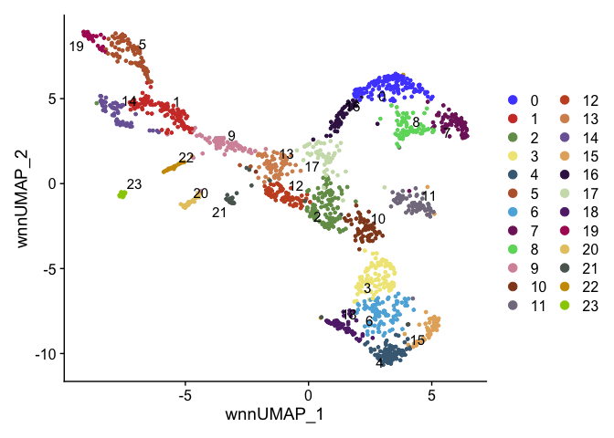
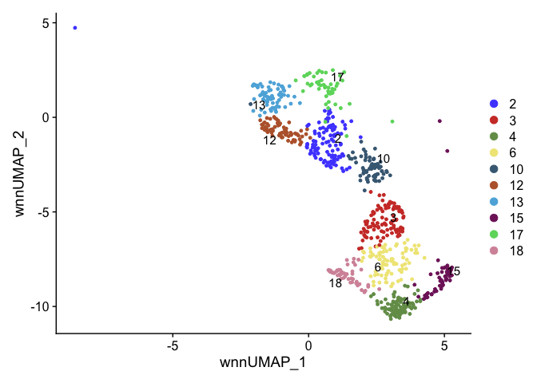
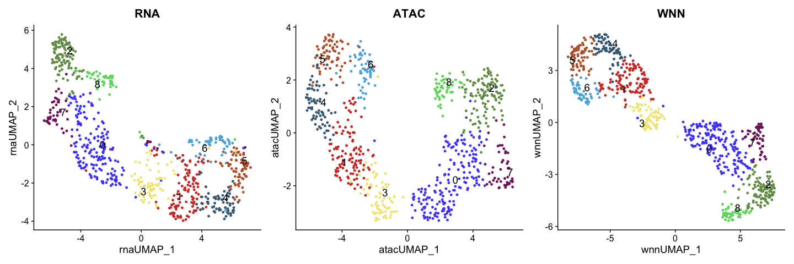
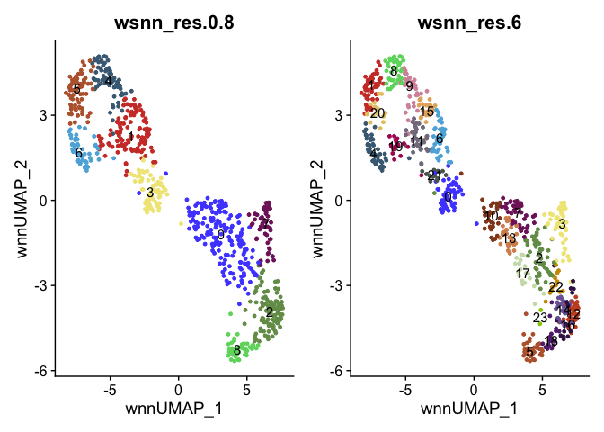
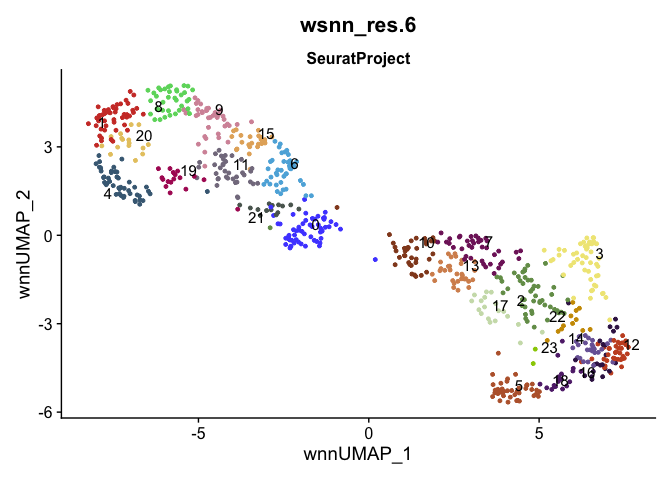

HB10hpf\_neural\_subset
================
Rebecca O’Rourke
8/9/2022

# 1. libraries, palette and functions

``` r
suppressPackageStartupMessages({
  library(Seurat)
  library(org.Dr.eg.db)
  library(BSgenome.Drerio.UCSC.danRer11)
  library(Signac)
  library(knitr)
  library(kableExtra)
  library(dplyr)
  library(ggplot2)
  library(ggsci)
  library(limma)
  library(JASPAR2020)
  library(patchwork)
  library(TFBSTools)
  library(motifmatchr)
  library(harmony)
})
```

    ## Warning: package 'AnnotationDbi' was built under R version 4.1.1

    ## Warning: package 'BiocGenerics' was built under R version 4.1.1

    ## Warning: package 'Biobase' was built under R version 4.1.1

    ## Warning: package 'IRanges' was built under R version 4.1.1

    ## Warning: package 'S4Vectors' was built under R version 4.1.3

    ## Warning: package 'BSgenome' was built under R version 4.1.1

    ## Warning: package 'GenomeInfoDb' was built under R version 4.1.1

    ## Warning: package 'GenomicRanges' was built under R version 4.1.1

    ## Warning: package 'Biostrings' was built under R version 4.1.1

    ## Warning: package 'XVector' was built under R version 4.1.1

    ## Warning: package 'rtracklayer' was built under R version 4.1.1

    ## Warning: package 'limma' was built under R version 4.1.3

    ## Warning: package 'TFBSTools' was built under R version 4.1.1

    ## Warning: package 'motifmatchr' was built under R version 4.1.1

``` r
options(future.globals.maxSize = 4000 * 1024^2)
```

``` r
mypal <- pal_igv(palette = "default",alpha = 1)(50)
```

``` r
GetUMAPandClusters <- function(seurat){
  # RNA analysis
  DefaultAssay(seurat) <- "RNA"
  seurat <- SCTransform(seurat, verbose = FALSE, return.only.var.genes = FALSE) 
  seurat <- RunPCA(seurat) 
  ElbowPlot(seurat,ndims = 50)
  seurat <- RunUMAP(seurat, dims = 1:50, reduction.name = 'umap.rna', reduction.key = 'rnaUMAP_')
  
  # ATAC analysis
  # We exclude the first dimension as this is typically correlated with sequencing depth
  DefaultAssay(seurat) <- "peaks"
  
  seurat <- FindTopFeatures(seurat, min.cutoff = 5)
  seurat <- RunTFIDF(seurat)
  seurat <- RunSVD(seurat)
  seurat <- RunUMAP(seurat, reduction = 'lsi', dims = 2:50, reduction.name = "umap.atac", reduction.key = "atacUMAP_")
  
  DefaultAssay(seurat) <- "SCT"
  seurat <- FindMultiModalNeighbors(seurat, reduction.list = list("pca", "lsi"), dims.list = list(1:50, 2:50))
  seurat <- RunUMAP(seurat, nn.name = "weighted.nn", reduction.name = "wnn.umap", reduction.key = "wnnUMAP_", assay = "RNA")
  seurat <- FindClusters(seurat, graph.name = "wsnn", algorithm = 3, verbose = FALSE)
  seurat <- FindClusters(seurat, graph.name = "wsnn", algorithm = 3, verbose = FALSE, resolution = 6.0)
  
  p1 <- DimPlot(seurat, reduction = "umap.rna", label = TRUE, label.size = 5, repel = TRUE, group.by = "wsnn_res.0.8") + ggtitle("RNA") + scale_color_igv()
  p2 <- DimPlot(seurat, reduction = "umap.atac", label = TRUE, label.size = 5, repel = TRUE, group.by = "wsnn_res.0.8") + ggtitle("ATAC") + scale_color_igv()
  p3 <- DimPlot(seurat, reduction = "wnn.umap", label = TRUE, label.size = 5, repel = TRUE, group.by = "wsnn_res.0.8") + ggtitle("WNN") + scale_color_igv()
  print(p1 + p2 + p3 & NoLegend() & theme(plot.title = element_text(hjust = 0.5)))
  
  return(seurat)
}
```

# 2. Read data

``` r
seurat <- readRDS("RDSfiles/HB10hpf.clustered.RDS")
Idents(seurat) <- "wsnn_res.3"
DimPlot(seurat, label = T, repel = T, reduction = "wnn.umap") + scale_color_igv()
```

<!-- -->

# 3. Neural subset

``` r
neural <- subset(seurat, idents = c("2","3","4","6","10","12","13","15","17","18"))
DimPlot(neural, label = T, repel = T, reduction = "wnn.umap") + scale_color_igv()
```

<!-- -->

# 4. Reprocess only neural cells

Starting with only neural cells, rerun SCTransform, PCA, UMAP, SVD,
Multimodal Neighbors and Clustering

``` r
neural <- GetUMAPandClusters(neural)
```

    ## PC_ 1 
    ## Positive:  zbtb16a, zbtb16b, nr2f5, tenm4, six7, shisa2a, ncam1a, ptprn2, adgrv1, ek1 
    ##     pappab, gli3, crb2a, tet3, epha7, lhx2b, pkdcca, fgfr2, vcana, fgfrl1a 
    ##     zfhx4, si:dkey-91m11.5, hs6st1a, sox5, spns2, plxdc2, traf4a, met, afdna, tcf7l2 
    ## Negative:  hoxc3a, mllt3, raraa, kif26ab, arid3c, nradd, hoxc6b, XKR4, hoxb3a, sulf1 
    ##     phc2a, greb1, cdx4, hoxb7a, evx1, arid3b, smad3a, bcar3, serpinh1b, aopep 
    ##     notum1a, lypd6b, BX936418.1, rarab, chrd, prickle2b, hoxa9a, rarga, wnt5b, hoxb6b 
    ## PC_ 2 
    ## Positive:  six7, cdh6, si:ch211-285f17.1, shisa2a, si:dkey-91m11.5, kif26ab, vcana, il17rd, lhx2b, ek1 
    ##     sox5, crb2a, traf4a, sulf1, hmcn2.1, spns2, met, nectin1b, fgfrl1a, epha2b 
    ##     hoxc3a, XKR4, lamb1a, fras1, tet3, rab11fip4a, pcdh19, tcf7l2, arid3c, si:dkey-22o22.2 
    ## Negative:  greb1l, rnf220a, ntn1a, cntfr, ror1, col4a6, kirrel3l, rfx4, col4a5, prickle2b 
    ##     robo1, agrn, pax2a, ncam1a, NAV1, nrp2b, cdh7a, ephb4a, trim71, si:ch211-191i18.2 
    ##     cgnl1, adgrl2a, lmx1bb, tshz1, nova2, ebf2, map7d1a, pax3b, ulk1b, dtnba 
    ## PC_ 3 
    ## Positive:  pax3a, sema3fb, lmx1bb, unc5b, ror1, msx1b, lamb1a, cdh6, klf7a, col15a1b 
    ##     cdon, kirrel3l, col18a1a, itga5, tnfrsf19, pax2a, rbms1a, prdm1a, efnb1, ror2 
    ##     wnt8b, tfap2a, pax3b, slit3, sema3fa, lama5, alcama, cdh1, tenm3, igdcc4 
    ## Negative:  cdh11, rnf220a, pappab, prickle2b, chrd, rhbdl3, hspg2, mllt3, ntn1a, si:dkey-91m11.5 
    ##     pax6b, ctnnal1, adamts3, sox5, tet3, agrn, hs3st3b1b, robo3, pkd1b, cadm1a 
    ##     hoxc3a, ptch2, NPAS3, pvrl2l, gli1, adcy7, antxr1c, rfx4, gpc4, rab11fip4a 
    ## PC_ 4 
    ## Positive:  pax2a, zbtb16a, lmx1bb, nrp2b, tenm4, zfhx4, sulf1, wnt1, ncam1a, greb1 
    ##     ndst2b, wnt8b, esrrga, mllt3, cachd1, ntn1a, hoxc6b, kirrel3l, her11, SEMA4F 
    ##     pax5, her3, ephb4a, phc2a, il17rd, cplx2, ptprnb, hoxa9a, hoxc3a, evx1 
    ## Negative:  prickle2b, sema3fb, meis3, tshz1, greb1l, bcam, klf7a, dla, myo10l3, gadd45gb.1 
    ##     col18a1a, dld, col7a1l, notch1a, meis2a, notch1b, dlb, inavaa, epha7, onecut2 
    ##     efnb3b, nrip1b, nfasca, cep131, BX530077.1, crabp2a, cbfa2t2, bicd1a, epha2a, srrm4 
    ## PC_ 5 
    ## Positive:  prickle2b, zbtb16b, tshz1, fgfr3, zbtb16a, zfhx4, nrp2b, hspg2, meis3, spsb4a 
    ##     rhbdl3, celsr1a, wnt11, meis1b, gli3, wnt4, tenm4, fgfr2, bicd1a, map7d1a 
    ##     ndst2b, igsf9a, pax2a, fgfr4, plxna1a, zgc:110158, megf10, hs3st3b1b, znfl1k, tenm3 
    ## Negative:  epha7, cntfr, tead1b, sema3fa, si:ch211-191i18.2, cyp26c1, cyp26b1, epha4a, egr2b, sfrp5 
    ##     pkdcca, pax7b, vgll3, adgrv1, nab1b, rras2, qki2, fam189a1, etv4, epha2a 
    ##     efnb1, kaznb, fgf8a, abtb2b, ephb3a, chrd, dusp2, midn, klf12b, CR356242.1

    ## Warning: The default method for RunUMAP has changed from calling Python UMAP via reticulate to the R-native UWOT using the cosine metric
    ## To use Python UMAP via reticulate, set umap.method to 'umap-learn' and metric to 'correlation'
    ## This message will be shown once per session

    ## 12:46:19 UMAP embedding parameters a = 0.9922 b = 1.112

    ## 12:46:19 Read 756 rows and found 50 numeric columns

    ## 12:46:19 Using Annoy for neighbor search, n_neighbors = 30

    ## 12:46:19 Building Annoy index with metric = cosine, n_trees = 50

    ## 0%   10   20   30   40   50   60   70   80   90   100%

    ## [----|----|----|----|----|----|----|----|----|----|

    ## **************************************************|
    ## 12:46:19 Writing NN index file to temp file /var/folders/85/cmygnxr155gdnf4bc3_30jyh0000gp/T//RtmpCHglbS/file118a14b7a4dec
    ## 12:46:19 Searching Annoy index using 1 thread, search_k = 3000
    ## 12:46:19 Annoy recall = 100%
    ## 12:46:20 Commencing smooth kNN distance calibration using 1 thread
    ## 12:46:22 Initializing from normalized Laplacian + noise
    ## 12:46:22 Commencing optimization for 500 epochs, with 28106 positive edges
    ## 12:46:24 Optimization finished
    ## Performing TF-IDF normalization

    ## Warning in RunTFIDF.default(object = GetAssayData(object = object, slot =
    ## "counts"), : Some features contain 0 total counts

    ## Running SVD
    ## Scaling cell embeddings
    ## 12:46:42 UMAP embedding parameters a = 0.9922 b = 1.112
    ## 12:46:42 Read 756 rows and found 49 numeric columns
    ## 12:46:42 Using Annoy for neighbor search, n_neighbors = 30
    ## 12:46:42 Building Annoy index with metric = cosine, n_trees = 50
    ## 0%   10   20   30   40   50   60   70   80   90   100%
    ## [----|----|----|----|----|----|----|----|----|----|
    ## **************************************************|
    ## 12:46:42 Writing NN index file to temp file /var/folders/85/cmygnxr155gdnf4bc3_30jyh0000gp/T//RtmpCHglbS/file118a14a91e7aa
    ## 12:46:42 Searching Annoy index using 1 thread, search_k = 3000
    ## 12:46:42 Annoy recall = 100%
    ## 12:46:43 Commencing smooth kNN distance calibration using 1 thread
    ## 12:46:45 Initializing from normalized Laplacian + noise
    ## 12:46:45 Commencing optimization for 500 epochs, with 30136 positive edges
    ## 12:46:47 Optimization finished
    ## Calculating cell-specific modality weights
    ## Finding 20 nearest neighbors for each modality.
    ## Calculating kernel bandwidths
    ## Finding multimodal neighbors
    ## Constructing multimodal KNN graph
    ## Constructing multimodal SNN graph
    ## 12:46:48 UMAP embedding parameters a = 0.9922 b = 1.112
    ## 12:46:49 Commencing smooth kNN distance calibration using 1 thread
    ## 12:46:51 Initializing from normalized Laplacian + noise
    ## 12:46:51 Commencing optimization for 500 epochs, with 20970 positive edges
    ## 12:46:53 Optimization finished

<!-- -->

``` r
saveRDS(neural, file = "RDSfiles/HB10hpf_neural.RDS")
```

``` r
p1 <- DimPlot(neural, group.by = "wsnn_res.0.8", label = T, reduction = "wnn.umap") + NoLegend() + scale_color_igv()
p2 <- DimPlot(neural, group.by = "wsnn_res.6", label = T, reduction = "wnn.umap") + NoLegend() + scale_color_igv()
p <- p1 + p2 
p
```

<!-- -->

``` r
DimPlot(neural, group.by = "wsnn_res.6",split.by = "orig.ident", reduction = "wnn.umap", ncol = 2, label = T, repel = T, cols = mypal) + NoLegend()
```

<!-- -->

# 5. sessionInfo

``` r
sessionInfo()
```

    ## R version 4.1.0 (2021-05-18)
    ## Platform: x86_64-apple-darwin17.0 (64-bit)
    ## Running under: macOS Big Sur 10.16
    ## 
    ## Matrix products: default
    ## BLAS:   /Library/Frameworks/R.framework/Versions/4.1/Resources/lib/libRblas.dylib
    ## LAPACK: /Library/Frameworks/R.framework/Versions/4.1/Resources/lib/libRlapack.dylib
    ## 
    ## locale:
    ## [1] en_US.UTF-8/en_US.UTF-8/en_US.UTF-8/C/en_US.UTF-8/en_US.UTF-8
    ## 
    ## attached base packages:
    ## [1] stats4    stats     graphics  grDevices utils     datasets  methods  
    ## [8] base     
    ## 
    ## other attached packages:
    ##  [1] harmony_0.1.0                       Rcpp_1.0.7                         
    ##  [3] motifmatchr_1.16.0                  TFBSTools_1.32.0                   
    ##  [5] patchwork_1.1.1                     JASPAR2020_0.99.10                 
    ##  [7] limma_3.50.3                        ggsci_2.9                          
    ##  [9] ggplot2_3.3.5                       dplyr_1.0.7                        
    ## [11] kableExtra_1.3.4                    knitr_1.36                         
    ## [13] Signac_1.2.1                        BSgenome.Drerio.UCSC.danRer11_1.4.2
    ## [15] BSgenome_1.62.0                     rtracklayer_1.54.0                 
    ## [17] Biostrings_2.62.0                   XVector_0.34.0                     
    ## [19] GenomicRanges_1.46.0                GenomeInfoDb_1.30.0                
    ## [21] org.Dr.eg.db_3.14.0                 AnnotationDbi_1.56.1               
    ## [23] IRanges_2.28.0                      S4Vectors_0.32.4                   
    ## [25] Biobase_2.54.0                      BiocGenerics_0.40.0                
    ## [27] SeuratObject_4.0.4                  Seurat_4.0.1                       
    ## 
    ## loaded via a namespace (and not attached):
    ##   [1] utf8_1.2.2                  R.utils_2.11.0             
    ##   [3] reticulate_1.22             tidyselect_1.1.1           
    ##   [5] poweRlaw_0.70.6             RSQLite_2.2.8              
    ##   [7] htmlwidgets_1.5.4           grid_4.1.0                 
    ##   [9] docopt_0.7.1                BiocParallel_1.28.0        
    ##  [11] Rtsne_0.15                  munsell_0.5.0              
    ##  [13] codetools_0.2-18            ica_1.0-2                  
    ##  [15] future_1.26.1               miniUI_0.1.1.1             
    ##  [17] withr_2.4.2                 colorspace_2.0-2           
    ##  [19] highr_0.9                   rstudioapi_0.13            
    ##  [21] ROCR_1.0-11                 tensor_1.5                 
    ##  [23] listenv_0.8.0               labeling_0.4.2             
    ##  [25] MatrixGenerics_1.6.0        slam_0.1-48                
    ##  [27] GenomeInfoDbData_1.2.7      polyclip_1.10-0            
    ##  [29] bit64_4.0.5                 farver_2.1.0               
    ##  [31] parallelly_1.32.0           vctrs_0.4.1                
    ##  [33] generics_0.1.1              xfun_0.27                  
    ##  [35] lsa_0.73.2                  ggseqlogo_0.1              
    ##  [37] R6_2.5.1                    bitops_1.0-7               
    ##  [39] spatstat.utils_2.2-0        cachem_1.0.6               
    ##  [41] DelayedArray_0.20.0         assertthat_0.2.1           
    ##  [43] promises_1.2.0.1            BiocIO_1.4.0               
    ##  [45] scales_1.1.1                gtable_0.3.0               
    ##  [47] globals_0.15.1              goftest_1.2-3              
    ##  [49] seqLogo_1.60.0              rlang_1.0.3                
    ##  [51] systemfonts_1.0.4           RcppRoll_0.3.0             
    ##  [53] splines_4.1.0               lazyeval_0.2.2             
    ##  [55] spatstat.geom_2.3-0         yaml_2.2.1                 
    ##  [57] reshape2_1.4.4              abind_1.4-5                
    ##  [59] httpuv_1.6.3                tools_4.1.0                
    ##  [61] ellipsis_0.3.2              spatstat.core_2.3-0        
    ##  [63] RColorBrewer_1.1-2          ggridges_0.5.3             
    ##  [65] plyr_1.8.6                  zlibbioc_1.40.0            
    ##  [67] purrr_0.3.4                 RCurl_1.98-1.5             
    ##  [69] rpart_4.1-15                deldir_1.0-6               
    ##  [71] pbapply_1.5-0               cowplot_1.1.1              
    ##  [73] zoo_1.8-9                   SummarizedExperiment_1.24.0
    ##  [75] ggrepel_0.9.1               cluster_2.1.2              
    ##  [77] magrittr_2.0.1              RSpectra_0.16-0            
    ##  [79] data.table_1.14.2           scattermore_0.7            
    ##  [81] lmtest_0.9-38               RANN_2.6.1                 
    ##  [83] SnowballC_0.7.0             fitdistrplus_1.1-6         
    ##  [85] matrixStats_0.61.0          hms_1.1.1                  
    ##  [87] mime_0.12                   evaluate_0.14              
    ##  [89] xtable_1.8-4                XML_3.99-0.8               
    ##  [91] sparsesvd_0.2               gridExtra_2.3              
    ##  [93] compiler_4.1.0              tibble_3.1.6               
    ##  [95] KernSmooth_2.23-20          crayon_1.4.2               
    ##  [97] R.oo_1.24.0                 htmltools_0.5.2            
    ##  [99] tzdb_0.2.0                  mgcv_1.8-38                
    ## [101] later_1.3.0                 tidyr_1.1.4                
    ## [103] DBI_1.1.1                   tweenr_1.0.2               
    ## [105] MASS_7.3-54                 readr_2.0.2                
    ## [107] Matrix_1.3-4                cli_3.3.0                  
    ## [109] R.methodsS3_1.8.1           parallel_4.1.0             
    ## [111] igraph_1.2.8                pkgconfig_2.0.3            
    ## [113] TFMPvalue_0.0.8             GenomicAlignments_1.30.0   
    ## [115] plotly_4.10.0               spatstat.sparse_2.0-0      
    ## [117] xml2_1.3.2                  annotate_1.72.0            
    ## [119] svglite_2.0.0               DirichletMultinomial_1.36.0
    ## [121] webshot_0.5.2               rvest_1.0.2                
    ## [123] stringr_1.4.0               digest_0.6.28              
    ## [125] pracma_2.3.3                sctransform_0.3.3          
    ## [127] RcppAnnoy_0.0.19            CNEr_1.30.0                
    ## [129] spatstat.data_2.1-0         rmarkdown_2.11             
    ## [131] leiden_0.3.9                fastmatch_1.1-3            
    ## [133] uwot_0.1.10                 restfulr_0.0.13            
    ## [135] gtools_3.9.2                shiny_1.7.1                
    ## [137] Rsamtools_2.10.0            rjson_0.2.20               
    ## [139] lifecycle_1.0.1             nlme_3.1-153               
    ## [141] jsonlite_1.7.2              viridisLite_0.4.0          
    ## [143] fansi_0.5.0                 pillar_1.6.4               
    ## [145] lattice_0.20-45             GO.db_3.14.0               
    ## [147] KEGGREST_1.34.0             fastmap_1.1.0              
    ## [149] httr_1.4.2                  survival_3.2-13            
    ## [151] glue_1.6.2                  qlcMatrix_0.9.7            
    ## [153] png_0.1-7                   bit_4.0.4                  
    ## [155] ggforce_0.3.3               stringi_1.7.5              
    ## [157] blob_1.2.2                  caTools_1.18.2             
    ## [159] memoise_2.0.0               irlba_2.3.3                
    ## [161] future.apply_1.8.1
