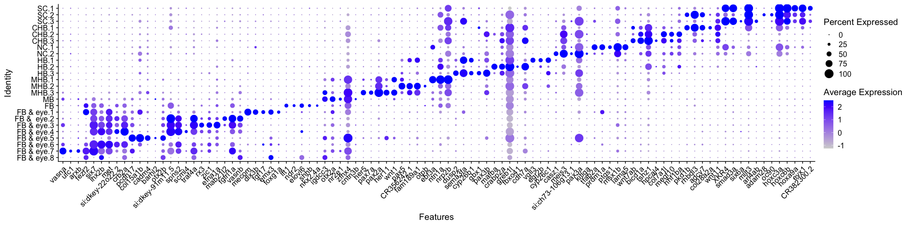

Cluster Naming and plots neural HB10hpf R Notebook
================

# 1. libraries and palette

``` r
suppressPackageStartupMessages({
  library(Seurat)
  library(org.Dr.eg.db)
  library(BSgenome.Drerio.UCSC.danRer11)
  library(Signac)
  library(knitr)
  library(kableExtra)
  library(dplyr)
  library(ggplot2)
  library(ggsci)
  library(limma)
  library(JASPAR2020)
  library(patchwork)
  library(TFBSTools)
  library(motifmatchr)
  library(harmony)
})
```

    ## Warning: package 'AnnotationDbi' was built under R version 4.1.1

    ## Warning: package 'BiocGenerics' was built under R version 4.1.1

    ## Warning: package 'Biobase' was built under R version 4.1.1

    ## Warning: package 'IRanges' was built under R version 4.1.1

    ## Warning: package 'S4Vectors' was built under R version 4.1.3

    ## Warning: package 'BSgenome' was built under R version 4.1.1

    ## Warning: package 'GenomeInfoDb' was built under R version 4.1.1

    ## Warning: package 'GenomicRanges' was built under R version 4.1.1

    ## Warning: package 'Biostrings' was built under R version 4.1.1

    ## Warning: package 'XVector' was built under R version 4.1.1

    ## Warning: package 'rtracklayer' was built under R version 4.1.1

    ## Warning: package 'ggplot2' was built under R version 4.1.2

    ## Warning: package 'limma' was built under R version 4.1.3

    ## Warning: package 'patchwork' was built under R version 4.1.2

    ## Warning: package 'TFBSTools' was built under R version 4.1.1

    ## Warning: package 'motifmatchr' was built under R version 4.1.1

``` r
options(future.globals.maxSize = 4000 * 1024^2)
```

``` r
mypal <- pal_igv(palette = "default",alpha = 1)(35)
```

# 2. Read data

``` r
seurat <- readRDS(file = "RDSfiles/HB10hpf_neural.RDS")
DefaultAssay(seurat) <- "SCT"
Idents(seurat) <- "wsnn_res.6"
DimPlot(seurat, reduction = "wnn.umap", label = T, repel = T) + scale_color_igv()
```

<!-- -->

# 3. Rename Idents

``` r
Idents(seurat) <- "wsnn_res.6"
seurat <- RenameIdents(seurat,
                       "0" = "HB.1",
                       "1" = "SC.1",
                       "2" = "MB",
                       "3" = "FB",
                       "4" = "NC.1",
                       "5" = "FB & eye.1",
                       "6" = "HB.2",
                       "7" = "MHB.1",
                       "8" = "SC.2",
                       "9" = "CHB.1",
                       "10" = "MHB.2",
                       "11" = "CHB.2",
                       "12" = "FB &  eye.2",
                       "13" = "MHB.3",
                       "14" = "FB & eye.3",
                       "15" = "CHB.3",
                       "16" = "FB & eye.4",
                       "17" = "FB & eye.5",
                       "18" = "FB & eye.6",
                       "19" = "NC.2",
                       "20" = "SC.3",
                       "21" = "HB.3",
                       "22" = "FB & eye.7",
                       "23" = "FB & eye.8")
levels(seurat) <- rev(c("SC.1","SC.2","SC.3","CHB.1","CHB.2","CHB.3","NC.1","NC.2","HB.1","HB.2","HB.3",
                    "MHB.1","MHB.2","MHB.3","MB","FB","FB & eye.1","FB &  eye.2","FB & eye.3",
                    "FB & eye.4","FB & eye.5","FB & eye.6","FB & eye.7","FB & eye.8"))
umapPlot <- DimPlot(seurat, reduction = "wnn.umap", pt.size = 3) + scale_color_igv() + guides(color = guide_legend(override.aes = list(size=4), ncol=1) )
umapPlot
```

<!-- -->

``` r
seurat$Clusters <- Idents(seurat)
#ggsave(filename = "../results/Fig3_HB10hpf_umapPlot.png", plot = umapPlot)
```

``` r
saveRDS(seurat, file = "RDSfiles/HB10hpf_neural.RDS")
```

# 4. Find DE genes

``` r
All.markers <- FindAllMarkers(seurat, only.pos = T, verbose = F)
write.table(All.markers, file = "../results/DataS2_Fig3_HB10hpf_markers.txt", sep = "\t", quote = F, col.names = NA)
```

``` r
top5.pval <- All.markers %>% group_by(cluster) %>% top_n(n=-5, wt = p_val) %>% top_n(n=5, wt = avg_log2FC)
top5.pval
```

    ## # A tibble: 115 × 7
    ## # Groups:   cluster [23]
    ##       p_val avg_log2FC pct.1 pct.2 p_val_adj cluster    gene           
    ##       <dbl>      <dbl> <dbl> <dbl>     <dbl> <fct>      <chr>          
    ##  1 6.37e-19      0.989 0.75  0.065  9.66e-15 FB & eye.7 vasna          
    ##  2 4.88e-13      0.308 0.25  0.009  7.40e- 9 FB & eye.7 ufc1           
    ##  3 1.77e-12      0.379 0.333 0.019  2.68e- 8 FB & eye.7 arxb           
    ##  4 2.16e-12      0.783 0.75  0.097  3.28e- 8 FB & eye.7 fezf2          
    ##  5 6.13e-11      1.54  1     0.233  9.29e- 7 FB & eye.7 six7           
    ##  6 6.61e-17      1.44  0.889 0.16   1.00e-12 FB & eye.6 lhx2b          
    ##  7 2.28e-12      1.31  0.944 0.228  3.45e- 8 FB & eye.6 six7           
    ##  8 2.04e-11      1.15  0.833 0.192  3.10e- 7 FB & eye.6 met            
    ##  9 1.60e-10      0.840 0.611 0.108  2.42e- 6 FB & eye.6 si:dkey-22o22.2
    ## 10 4.83e-10      1.14  0.722 0.167  7.32e- 6 FB & eye.6 crb2a          
    ## # … with 105 more rows

# 5. Plots

## 5.1 dotplot

``` r
dotPlot <- DotPlot(seurat, features = unique(top5.pval$gene)) + RotatedAxis()
dotPlot
```

<!-- -->

``` r
#ggsave(filename = "../results/Fig3_HB10hpf_dotPlot.png", plot = dotPlot)
```

## 5.2 heatmap

``` r
heatmapPlot <- DoHeatmap(seurat, features = unique(top5.pval$gene), group.colors = mypal, size = 5, angle = 90) + guides(color = FALSE)
```

    ## Warning: The `<scale>` argument of `guides()` cannot be `FALSE`. Use "none" instead as
    ## of ggplot2 3.3.4.

``` r
heatmapPlot
```

<!-- -->

``` r
#ggsave(filename = "../results/Fig3_HB10hpf_heatmapPlot.png", plot = heatmapPlot)
```

``` r
genes1 <- FeaturePlot(seurat, features = c("sox3","neurod4","zic2b","ntn1a"), reduction = "wnn.umap", max.cutoff = 1)  
genes1
```

<!-- -->

``` r
#ggsave(filename = "../results/Fig3_HB10hpf_genes1_scaledToMin.png", plot = genes1)
```

``` r
genelist <- c("vgll3","egr2b","mafba","crabp2a","cyp26b1","cyp26c1","ppp1r14ab","dusp2")
```

``` r
genes2 <- FeaturePlot(seurat, features = genelist, reduction = "wnn.umap", max.cutoff = 1, combine = FALSE)
violinPlot <- VlnPlot(seurat, features = genelist, same.y.lims = TRUE, combine = FALSE)
```

``` r
genePlusViolin <- genes2[[1]] + violinPlot[[1]] + NoLegend() + genes2[[2]] + violinPlot[[2]] + NoLegend() + 
  genes2[[3]] + violinPlot[[3]] + NoLegend() + genes2[[4]] + violinPlot[[4]] + NoLegend() +
  genes2[[5]] + violinPlot[[5]] + NoLegend() + genes2[[6]] + violinPlot[[6]] + NoLegend() +
  genes2[[7]] + violinPlot[[7]] + NoLegend() + genes2[[8]] + violinPlot[[8]] + NoLegend() +
  plot_layout(ncol = 4, widths = c(1,2,1,2)) #& scale_color_gradient(low = "gray", high = "blue", limits = c(0,2.4))
genePlusViolin
```

    ## Warning: Removed 1 rows containing non-finite values (`stat_ydensity()`).

    ## Warning: Removed 1 rows containing missing values (`geom_point()`).

<!-- -->

``` r
#ggsave(filename = "../results/Fig3_HB10hpf_genePlusViolin.png", plot = genePlusViolin)
```

## Chromvar activity

``` r
seurat <- RunChromVAR(
  object = seurat,
  genome = BSgenome.Drerio.UCSC.danRer11,
  assay = "peaks" 
)
```

    ## Computing GC bias per region

    ## Selecting background regions

    ## Computing deviations from background

    ## Constructing chromVAR assay

``` r
motif.names <- c("EGR2","TEAD1","PKNOX1","MAF","HNF1B","PBX1")
motifs <- c("MA0472.2","MA0090.3","MA0782.2","MA1520.1","MA0153.2","MA0070.1")
names(motifs) <- motif.names
```

``` r
GetChromVarPlots <- function(object, motifs){
  DefaultAssay(object) <- "chromvar"
  mylist <- list()
  for(motif in 1:length(motifs)){
    if(motif == 3){
      p <- FeaturePlot(
        object = object,
        reduction = "wnn.umap",
        features = motifs[[motif]],
        min.cutoff = 'q10',
        max.cutoff = 2,
        pt.size = 1)  +
        ggtitle(paste(motifs[[motif]],names(motifs[motif]), sep = " ")) +
        theme(plot.title = element_text(size = 20))
    }else{
      p <- FeaturePlot(
        object = object,
        reduction = "wnn.umap",
        features = motifs[[motif]],
        min.cutoff = 'q10',
        max.cutoff = 2,
        pt.size = 1)  +
        ggtitle(paste(motifs[[motif]],names(motifs[motif]), sep = " ")) +
        theme(plot.title = element_text(size = 20)) + NoLegend()
    }
    
    mylist[[motifs[[motif]]]] <- p
  }
  
  return(mylist)
}
```

``` r
cv.list <- GetChromVarPlots(seurat, motifs)
wrap_plots(cv.list)
```

<!-- -->

``` r
motif.list <- list()
for(motif in names(motifs)){
  motif.list[[motif]] <- MotifPlot(
    object = seurat,
    motifs = motifs[[motif]],
    assay = 'peaks') + theme(axis.title.y = element_blank(), axis.text.y = element_blank(), strip.text = element_text(size = 20))
}
motif.list[[1]]
```

<!-- -->

``` r
motifPlusChromvar <- motif.list[[1]] + cv.list[[1]] + motif.list[[2]] + cv.list[[2]] +
  motif.list[[3]] + cv.list[[3]] + motif.list[[4]] + cv.list[[4]] +
  motif.list[[5]] + cv.list[[5]] + motif.list[[6]] + cv.list[[6]] +
  plot_layout(ncol = 6)
motifPlusChromvar
```

<!-- -->

``` r
#ggsave(filename = "../results/Fig3_HB10hpf_motifPlusChromvar.png", plot = motifPlusChromvar)
```

``` r
seurat <- BuildClusterTree(seurat, graph = "wsnn")
```

``` r
data.tree <- Tool(object = seurat, slot = "BuildClusterTree")
pdf(file = "../results/Fig3_HB10hpf_clustertree_unrooted_vrs1.pdf")#,width = 800, height = 800)
p1 <- ape::plot.phylo(x = data.tree,  use.edge.length = FALSE, cex = 0.7, type = "u", 
                      align.tip.label = TRUE, label.offset = 0.5, lab4ut = "axial")
p1
```

    ## $type
    ## [1] "unrooted"
    ## 
    ## $use.edge.length
    ## [1] FALSE
    ## 
    ## $node.pos
    ## NULL
    ## 
    ## $node.depth
    ## [1] 1
    ## 
    ## $show.tip.label
    ## [1] TRUE
    ## 
    ## $show.node.label
    ## [1] FALSE
    ## 
    ## $font
    ##  [1] 3 3 3 3 3 3 3 3 3 3 3 3 3 3 3 3 3 3 3 3 3 3 3 3
    ## 
    ## $cex
    ##  [1] 0.7 0.7 0.7 0.7 0.7 0.7 0.7 0.7 0.7 0.7 0.7 0.7 0.7 0.7 0.7 0.7 0.7 0.7 0.7
    ## [20] 0.7 0.7 0.7 0.7 0.7
    ## 
    ## $adj
    ##  [1] 1 0 1 0 1 1 1 1 0 0 0 0 0 0 1 0 0 1 1 1 1 0 1 0
    ## 
    ## $srt
    ## [1] 0
    ## 
    ## $no.margin
    ## [1] FALSE
    ## 
    ## $label.offset
    ## [1] 0.5
    ## 
    ## $x.lim
    ## [1] -1.341347  9.171930
    ## 
    ## $y.lim
    ## [1] -1.341347 11.019171
    ## 
    ## $direction
    ## [1] "rightwards"
    ## 
    ## $tip.color
    ##  [1] "black" "black" "black" "black" "black" "black" "black" "black" "black"
    ## [10] "black" "black" "black" "black" "black" "black" "black" "black" "black"
    ## [19] "black" "black" "black" "black" "black" "black"
    ## 
    ## $Ntip
    ## [1] 24
    ## 
    ## $Nnode
    ## [1] 23
    ## 
    ## $root.time
    ## NULL
    ## 
    ## $align.tip.label
    ## [1] FALSE

``` r
dev.off()
```

    ## quartz_off_screen 
    ##                 2

``` r
pdf(file = "../results/Fig3_HB10hpf_clustertree_unrooted_vrs2.pdf")
p1 <- ape::plot.phylo(x = data.tree,  use.edge.length = FALSE, cex = 0.7, type = "u", 
                      align.tip.label = TRUE, label.offset = 0.5)
p1
```

    ## $type
    ## [1] "unrooted"
    ## 
    ## $use.edge.length
    ## [1] FALSE
    ## 
    ## $node.pos
    ## NULL
    ## 
    ## $node.depth
    ## [1] 1
    ## 
    ## $show.tip.label
    ## [1] TRUE
    ## 
    ## $show.node.label
    ## [1] FALSE
    ## 
    ## $font
    ## [1] 3
    ## 
    ## $cex
    ## [1] 0.7
    ## 
    ## $adj
    ## [1] 0
    ## 
    ## $srt
    ## [1] 0
    ## 
    ## $no.margin
    ## [1] FALSE
    ## 
    ## $label.offset
    ## [1] 0.5
    ## 
    ## $x.lim
    ## [1] -1.341347  9.171930
    ## 
    ## $y.lim
    ## [1] -1.341347 11.019171
    ## 
    ## $direction
    ## [1] "rightwards"
    ## 
    ## $tip.color
    ## [1] "black"
    ## 
    ## $Ntip
    ## [1] 24
    ## 
    ## $Nnode
    ## [1] 23
    ## 
    ## $root.time
    ## NULL
    ## 
    ## $align.tip.label
    ## [1] FALSE

``` r
dev.off()
```

    ## quartz_off_screen 
    ##                 2

## Fig 3 combined

Since unrooted phylogram is not a ggplot, it cannot be combined with
other plots using patchwork.

``` r
combined <- (((umapPlot + 
      theme(legend.text = element_text(size = 20))) |
     (heatmapPlot +
        theme(axis.text = element_blank()))) /
       plot_spacer() /
    (dotPlot + 
       theme(axis.text.x = element_text(size = 12),
             axis.text.y = element_text(size = 12),
             legend.position = "bottom")) /
      plot_spacer() /
  (((genePlusViolin + plot_layout(guides = "collect")) | 
      ((genes1 + plot_layout(guides = "collect")) / plot_spacer()) + plot_layout(heights = c(2.5,3))) 
   + plot_layout(widths = c(2.8,1))) /
    plot_spacer() /
  (motifPlusChromvar + plot_layout(guides = "collect"))) +
    plot_layout(heights = c(2,0.05,1,0.05,3,0.05,1.3))
combined
```

    ## Warning: Removed 1 rows containing non-finite values (`stat_ydensity()`).

    ## Warning: Removed 1 rows containing missing values (`geom_point()`).

<!-- -->

``` r
ggsave(filename = "../results/Fig3_HB10hpf_combinedPlot.png", plot = combined)
```

    ## Saving 23 x 35 in image

    ## Warning: Removed 1 rows containing non-finite values (`stat_ydensity()`).
    ## Removed 1 rows containing missing values (`geom_point()`).

``` r
sessionInfo()
```

    ## R version 4.1.0 (2021-05-18)
    ## Platform: x86_64-apple-darwin17.0 (64-bit)
    ## Running under: macOS Big Sur 10.16
    ## 
    ## Matrix products: default
    ## BLAS:   /Library/Frameworks/R.framework/Versions/4.1/Resources/lib/libRblas.dylib
    ## LAPACK: /Library/Frameworks/R.framework/Versions/4.1/Resources/lib/libRlapack.dylib
    ## 
    ## locale:
    ## [1] en_US.UTF-8/en_US.UTF-8/en_US.UTF-8/C/en_US.UTF-8/en_US.UTF-8
    ## 
    ## attached base packages:
    ## [1] stats4    stats     graphics  grDevices utils     datasets  methods  
    ## [8] base     
    ## 
    ## other attached packages:
    ##  [1] harmony_0.1.0                       Rcpp_1.0.7                         
    ##  [3] motifmatchr_1.16.0                  TFBSTools_1.32.0                   
    ##  [5] patchwork_1.1.2                     JASPAR2020_0.99.10                 
    ##  [7] limma_3.50.3                        ggsci_2.9                          
    ##  [9] ggplot2_3.4.0                       dplyr_1.0.7                        
    ## [11] kableExtra_1.3.4                    knitr_1.36                         
    ## [13] Signac_1.2.1                        BSgenome.Drerio.UCSC.danRer11_1.4.2
    ## [15] BSgenome_1.62.0                     rtracklayer_1.54.0                 
    ## [17] Biostrings_2.62.0                   XVector_0.34.0                     
    ## [19] GenomicRanges_1.46.0                GenomeInfoDb_1.30.0                
    ## [21] org.Dr.eg.db_3.14.0                 AnnotationDbi_1.56.1               
    ## [23] IRanges_2.28.0                      S4Vectors_0.32.4                   
    ## [25] Biobase_2.54.0                      BiocGenerics_0.40.0                
    ## [27] SeuratObject_4.0.4                  Seurat_4.0.1                       
    ## 
    ## loaded via a namespace (and not attached):
    ##   [1] utf8_1.2.2                  R.utils_2.11.0             
    ##   [3] reticulate_1.22             tidyselect_1.1.1           
    ##   [5] poweRlaw_0.70.6             RSQLite_2.2.8              
    ##   [7] htmlwidgets_1.5.4           grid_4.1.0                 
    ##   [9] docopt_0.7.1                BiocParallel_1.28.0        
    ##  [11] Rtsne_0.15                  munsell_0.5.0              
    ##  [13] ragg_1.2.4                  codetools_0.2-18           
    ##  [15] ica_1.0-2                   DT_0.19                    
    ##  [17] future_1.26.1               miniUI_0.1.1.1             
    ##  [19] withr_2.5.0                 colorspace_2.0-2           
    ##  [21] chromVAR_1.16.0             highr_0.9                  
    ##  [23] rstudioapi_0.13             ROCR_1.0-11                
    ##  [25] tensor_1.5                  listenv_0.8.0              
    ##  [27] labeling_0.4.2              MatrixGenerics_1.6.0       
    ##  [29] slam_0.1-48                 GenomeInfoDbData_1.2.7     
    ##  [31] polyclip_1.10-0             bit64_4.0.5                
    ##  [33] farver_2.1.0                parallelly_1.32.0          
    ##  [35] vctrs_0.5.0                 generics_0.1.1             
    ##  [37] xfun_0.27                   lsa_0.73.2                 
    ##  [39] ggseqlogo_0.1               R6_2.5.1                   
    ##  [41] bitops_1.0-7                spatstat.utils_2.2-0       
    ##  [43] cachem_1.0.6                DelayedArray_0.20.0        
    ##  [45] assertthat_0.2.1            promises_1.2.0.1           
    ##  [47] BiocIO_1.4.0                scales_1.2.1               
    ##  [49] gtable_0.3.0                globals_0.15.1             
    ##  [51] goftest_1.2-3               seqLogo_1.60.0             
    ##  [53] rlang_1.0.6                 systemfonts_1.0.4          
    ##  [55] RcppRoll_0.3.0              splines_4.1.0              
    ##  [57] lazyeval_0.2.2              spatstat.geom_2.3-0        
    ##  [59] yaml_2.2.1                  reshape2_1.4.4             
    ##  [61] abind_1.4-5                 httpuv_1.6.3               
    ##  [63] tools_4.1.0                 nabor_0.5.0                
    ##  [65] ellipsis_0.3.2              spatstat.core_2.3-0        
    ##  [67] RColorBrewer_1.1-2          ggridges_0.5.3             
    ##  [69] plyr_1.8.6                  zlibbioc_1.40.0            
    ##  [71] purrr_0.3.4                 RCurl_1.98-1.5             
    ##  [73] rpart_4.1-15                deldir_1.0-6               
    ##  [75] pbapply_1.5-0               cowplot_1.1.1              
    ##  [77] zoo_1.8-9                   SummarizedExperiment_1.24.0
    ##  [79] ggrepel_0.9.1               cluster_2.1.2              
    ##  [81] magrittr_2.0.1              data.table_1.14.2          
    ##  [83] scattermore_0.7             lmtest_0.9-38              
    ##  [85] RANN_2.6.1                  SnowballC_0.7.0            
    ##  [87] fitdistrplus_1.1-6          matrixStats_0.61.0         
    ##  [89] hms_1.1.1                   mime_0.12                  
    ##  [91] evaluate_0.14               xtable_1.8-4               
    ##  [93] XML_3.99-0.8                sparsesvd_0.2              
    ##  [95] gridExtra_2.3               compiler_4.1.0             
    ##  [97] tibble_3.1.6                KernSmooth_2.23-20         
    ##  [99] crayon_1.4.2                R.oo_1.24.0                
    ## [101] htmltools_0.5.2             tzdb_0.2.0                 
    ## [103] mgcv_1.8-38                 later_1.3.0                
    ## [105] tidyr_1.1.4                 DBI_1.1.1                  
    ## [107] tweenr_1.0.2                MASS_7.3-54                
    ## [109] readr_2.0.2                 Matrix_1.3-4               
    ## [111] cli_3.4.1                   R.methodsS3_1.8.1          
    ## [113] parallel_4.1.0              igraph_1.2.8               
    ## [115] pkgconfig_2.0.3             TFMPvalue_0.0.8            
    ## [117] GenomicAlignments_1.30.0    plotly_4.10.0              
    ## [119] spatstat.sparse_2.0-0       xml2_1.3.3                 
    ## [121] annotate_1.72.0             svglite_2.1.0              
    ## [123] DirichletMultinomial_1.36.0 webshot_0.5.4              
    ## [125] rvest_1.0.3                 stringr_1.4.0              
    ## [127] digest_0.6.28               pracma_2.3.3               
    ## [129] sctransform_0.3.3           RcppAnnoy_0.0.19           
    ## [131] CNEr_1.30.0                 spatstat.data_2.1-0        
    ## [133] rmarkdown_2.11              leiden_0.3.9               
    ## [135] fastmatch_1.1-3             uwot_0.1.10                
    ## [137] restfulr_0.0.13             gtools_3.9.2               
    ## [139] shiny_1.7.1                 Rsamtools_2.10.0           
    ## [141] rjson_0.2.20                lifecycle_1.0.3            
    ## [143] nlme_3.1-153                jsonlite_1.7.2             
    ## [145] viridisLite_0.4.0           fansi_0.5.0                
    ## [147] pillar_1.6.4                lattice_0.20-45            
    ## [149] GO.db_3.14.0                KEGGREST_1.34.0            
    ## [151] fastmap_1.1.0               httr_1.4.2                 
    ## [153] survival_3.2-13             glue_1.6.2                 
    ## [155] qlcMatrix_0.9.7             png_0.1-7                  
    ## [157] bit_4.0.4                   ggforce_0.3.3              
    ## [159] stringi_1.7.5               blob_1.2.2                 
    ## [161] textshaping_0.3.6           caTools_1.18.2             
    ## [163] memoise_2.0.0               ape_5.6-2                  
    ## [165] irlba_2.3.3                 future.apply_1.8.1
