HB13hpf and HB16hpf motifs and ChromVar activity R Notebook
================

# 1. libraries and palette

``` r
suppressPackageStartupMessages({
  library(Seurat)
  library(org.Dr.eg.db)
  library(BSgenome.Drerio.UCSC.danRer11)
  library(Signac)
  library(knitr)
  library(kableExtra)
  library(dplyr)
  library(ggplot2)
  library(ggsci)
  library(limma)
  library(JASPAR2020)
  library(patchwork)
  library(TFBSTools)
  library(motifmatchr)
  library(harmony)
})
```

    ## Warning: package 'AnnotationDbi' was built under R version 4.1.1

    ## Warning: package 'BiocGenerics' was built under R version 4.1.1

    ## Warning: package 'Biobase' was built under R version 4.1.1

    ## Warning: package 'IRanges' was built under R version 4.1.1

    ## Warning: package 'S4Vectors' was built under R version 4.1.3

    ## Warning: package 'BSgenome' was built under R version 4.1.1

    ## Warning: package 'GenomeInfoDb' was built under R version 4.1.1

    ## Warning: package 'GenomicRanges' was built under R version 4.1.1

    ## Warning: package 'Biostrings' was built under R version 4.1.1

    ## Warning: package 'XVector' was built under R version 4.1.1

    ## Warning: package 'rtracklayer' was built under R version 4.1.1

    ## Warning: package 'ggplot2' was built under R version 4.1.2

    ## Warning: package 'limma' was built under R version 4.1.3

    ## Warning: package 'patchwork' was built under R version 4.1.2

    ## Warning: package 'TFBSTools' was built under R version 4.1.1

    ## Warning: package 'motifmatchr' was built under R version 4.1.1

``` r
options(future.globals.maxSize = 4000 * 1024^2)
```

``` r
mypal <- pal_igv(palette = "default",alpha = 1)(35)
```

# 2. Read data

``` r
HB13hpf <- readRDS(file = "RDSfiles/HB13hpf_neural.RDS")
DefaultAssay(HB13hpf) <- "SCT"
Idents(HB13hpf) <- "Clusters"
DimPlot(HB13hpf, reduction = "wnn.umap", label = T, repel = T) + scale_color_igv()
```

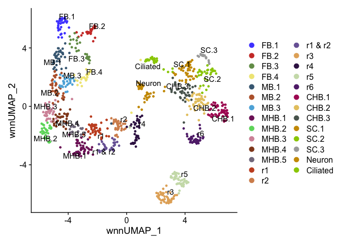<!-- -->

``` r
HB16hpf <- readRDS(file = "RDSfiles/HB16hpf_neural.RDS")
DefaultAssay(HB16hpf) <- "SCT"
Idents(HB16hpf) <- "Clusters"
DimPlot(HB16hpf, reduction = "wnn.umap", label = T, repel = T) + scale_color_igv()
```

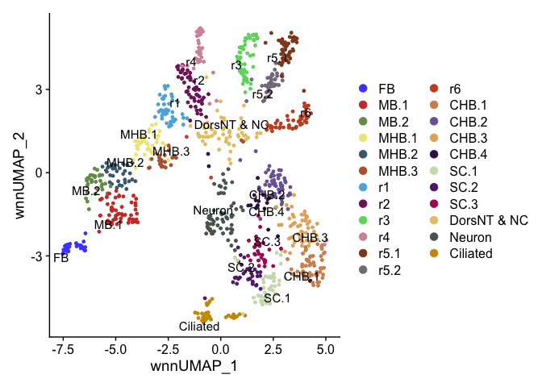<!-- -->

# 3. Gene expression UMAPs

``` r
HB13_tead1b <- FeaturePlot(HB13hpf, features = "tead1b", reduction = "wnn.umap", max.cutoff = 2)  
HB13_tead1b
```

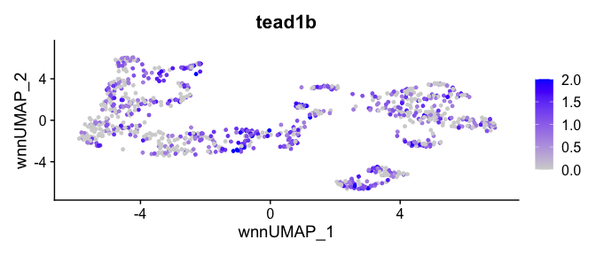<!-- -->

``` r
HB13_tead3b <- FeaturePlot(HB13hpf, features = "tead3b", reduction = "wnn.umap", max.cutoff = 2)  
HB13_tead3b
```

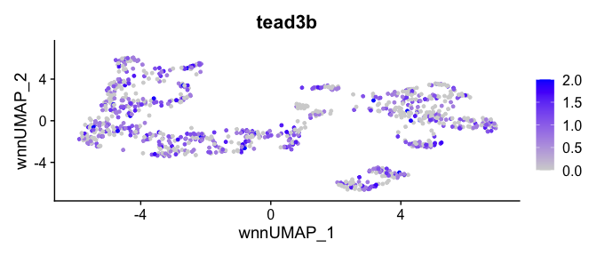<!-- -->

``` r
HB16_tead1b <- FeaturePlot(HB16hpf, features = "tead1b", reduction = "wnn.umap", max.cutoff = 2)  
HB16_tead1b
```

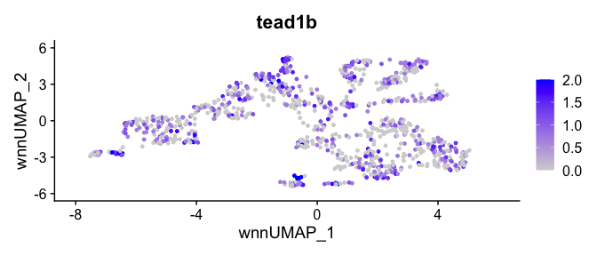<!-- -->

``` r
HB16_tead3b <- FeaturePlot(HB16hpf, features = "tead3b", reduction = "wnn.umap", max.cutoff = 2)  
HB16_tead3b
```

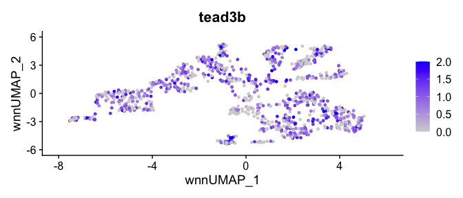<!-- -->

``` r
gene_exp <- plot_spacer() + HB13_tead1b + HB16_tead1b + plot_spacer() + HB13_tead3b + HB16_tead3b + 
  plot_layout(ncol = 6, guides = "collect")
```

# 4. Motif and ChromVar plots

``` r
HB13hpf <- RunChromVAR(
  object = HB13hpf,
  genome = BSgenome.Drerio.UCSC.danRer11,
  assay = "peaks" 
)
```

    ## Computing GC bias per region

    ## Selecting background regions

    ## Computing deviations from background

    ## Constructing chromVAR assay

``` r
HB16hpf <- RunChromVAR(
  object = HB16hpf,
  genome = BSgenome.Drerio.UCSC.danRer11,
  assay = "peaks" 
)
```

    ## Computing GC bias per region

    ## Selecting background regions

    ## Computing deviations from background

    ## Constructing chromVAR assay

``` r
motif.names <- c("EGR2","MAF","PKNOX1","HOXA4","PBX1","TEAD1","NR2F1(var.2)","NR2C2")
motifs <- c("MA0472.2","MA0117.2","MA0782.2","MA1496.1","MA0070.1","MA0090.3","MA1537.1","MA0504.1")
names(motifs) <- motif.names
```

``` r
GetChromVarPlots <- function(object, motifs){
  DefaultAssay(object) <- "chromvar"
  mylist <- list()
  for(motif in 1:length(motifs)){
    p <- FeaturePlot(
      object = object,
      reduction = "wnn.umap",
      features = motifs[[motif]],
      min.cutoff = 'q10',
      max.cutoff = 2,
      pt.size = 1)  +
      ggtitle(paste(motifs[[motif]],names(motifs[motif]), sep = " ")) +
      theme(plot.title = element_text(size = 20)) + NoLegend()
    mylist[[motifs[[motif]]]] <- p
  }
  
  return(mylist)
}
```

``` r
GetChromVarPlotsPlusLegend <- function(object, motifs){
  DefaultAssay(object) <- "chromvar"
  mylist <- list()
  for(motif in 1:length(motifs)){
    p <- FeaturePlot(
      object = object,
      reduction = "wnn.umap",
      features = motifs[[motif]],
      min.cutoff = 'q10',
      max.cutoff = 2,
      pt.size = 1)  +
      ggtitle(paste(motifs[[motif]],names(motifs[motif]), sep = " ")) +
      theme(plot.title = element_text(size = 20))
    mylist[[motifs[[motif]]]] <- p
  }
  
  return(mylist)
}
```

``` r
HB13.cv.motif1 <- GetChromVarPlotsPlusLegend(HB13hpf, motifs[1])
HB13.cv.list <- GetChromVarPlots(HB13hpf, motifs)
wrap_plots(HB13.cv.list)
```

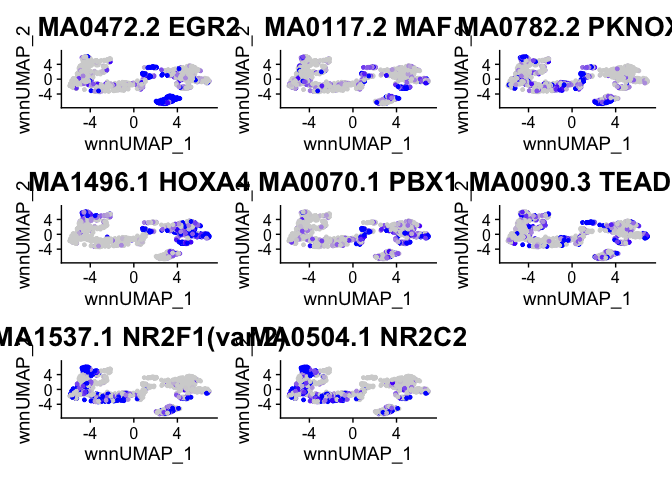<!-- -->

``` r
HB16.cv.list <- GetChromVarPlots(HB16hpf, motifs)
wrap_plots(HB16.cv.list)
```

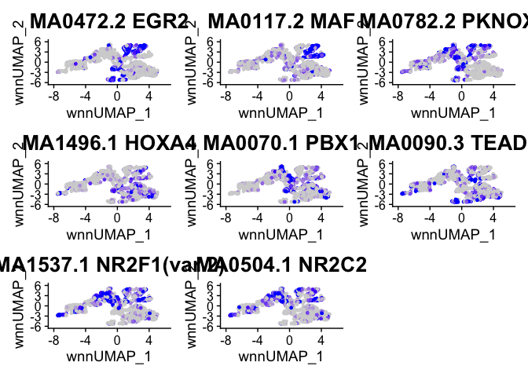<!-- -->

``` r
motif.list <- list()
for(motif in names(motifs)){
  motif.list[[motif]] <- MotifPlot(
    object = HB13hpf,
    motifs = motifs[[motif]],
    assay = 'peaks') + theme(axis.title.y = element_blank(), axis.text.y = element_blank(), strip.text = element_text(size = 20))
}
```

    ## Warning: The `<scale>` argument of `guides()` cannot be `FALSE`. Use "none" instead as
    ## of ggplot2 3.3.4.
    ## ℹ The deprecated feature was likely used in the ggseqlogo package.
    ##   Please report the issue at <https://github.com/omarwagih/ggseqlogo/issues>.

``` r
motif.list[[1]]
```

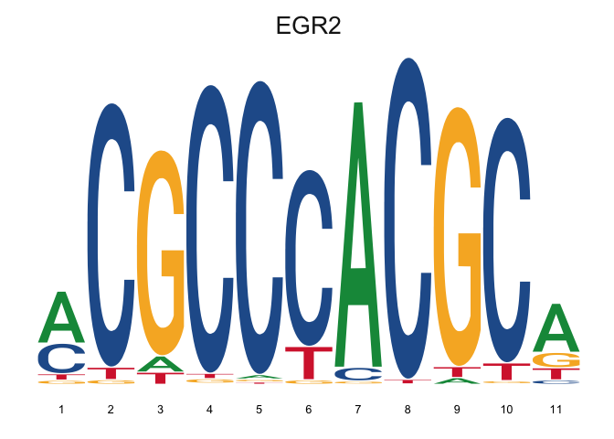<!-- -->

``` r
motifPlusChromvar <- motif.list[[1]] + HB13.cv.motif1[[1]] + HB16.cv.list[[1]] + 
  motif.list[[2]] + HB13.cv.list[[2]] + HB16.cv.list[[2]] +
  motif.list[[3]] + HB13.cv.list[[3]] + HB16.cv.list[[3]] +
  motif.list[[4]] + HB13.cv.list[[4]] + HB16.cv.list[[4]] +
  motif.list[[5]] + HB13.cv.list[[5]] + HB16.cv.list[[5]] +
  motif.list[[6]] + HB13.cv.list[[6]] + HB16.cv.list[[6]] +
  motif.list[[7]] + HB13.cv.list[[7]] + HB16.cv.list[[7]] +
  motif.list[[8]] + HB13.cv.list[[8]] + HB16.cv.list[[8]] +
  plot_layout(ncol = 6, guides = "collect") 
motifPlusChromvar
```

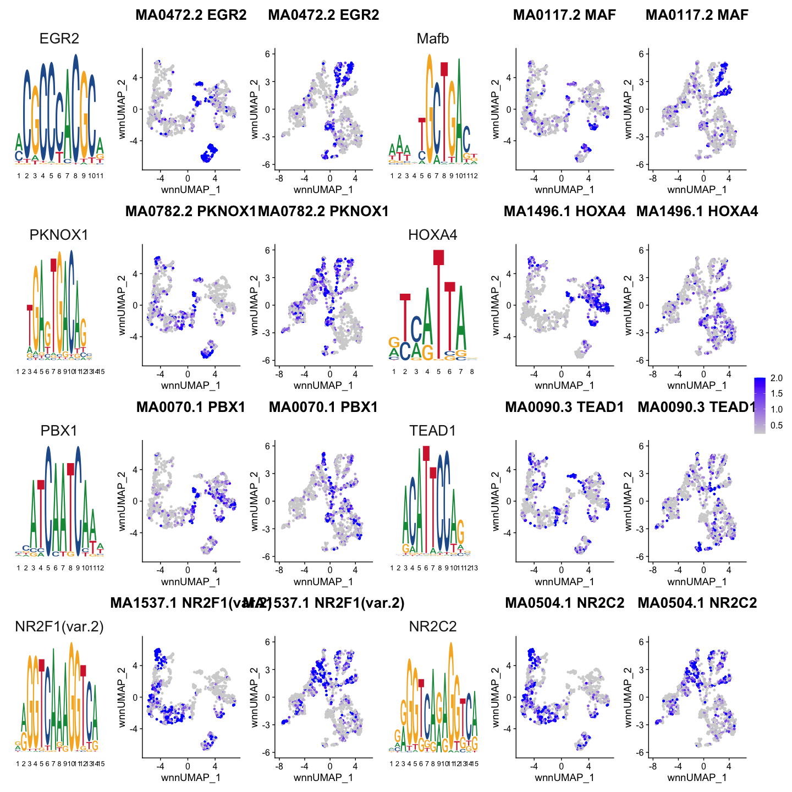<!-- -->

# Fig 4 combined plots

``` r
combined <- gene_exp / motifPlusChromvar + plot_layout(heights = c(1,5))
combined
```

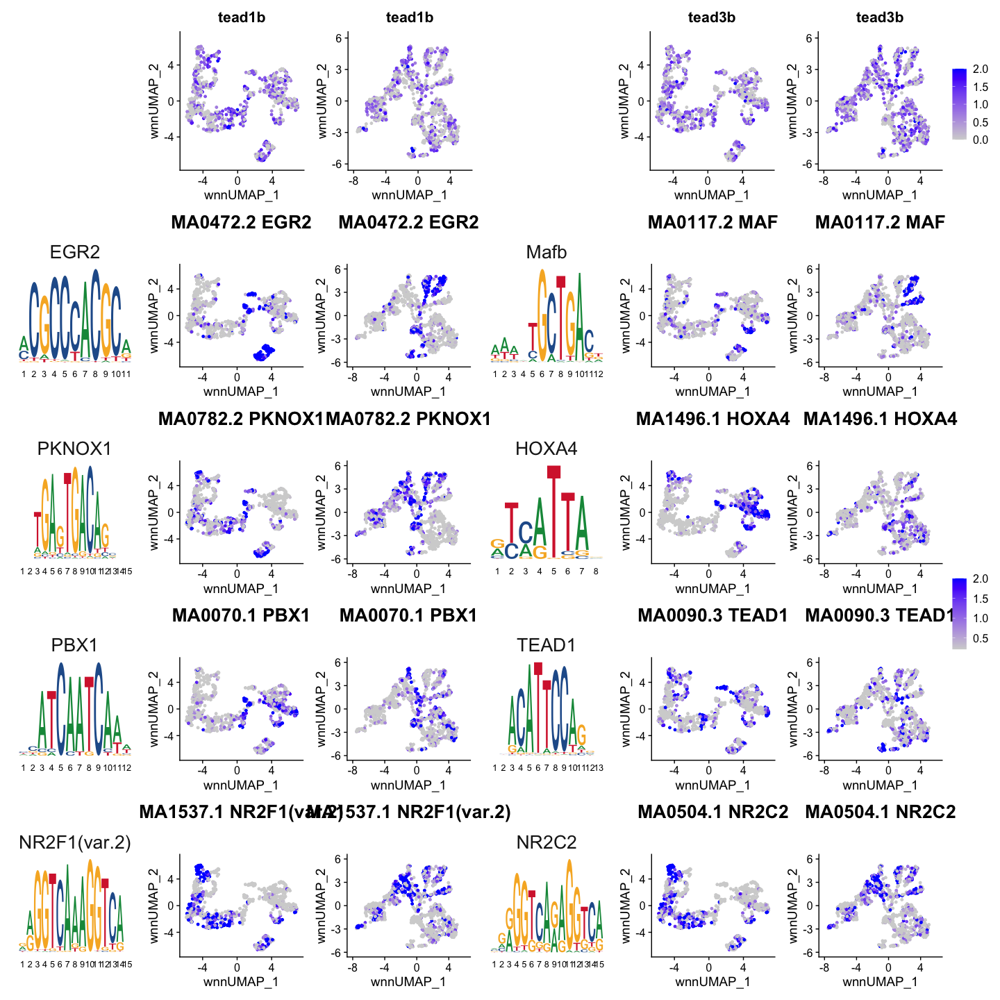<!-- -->

``` r
ggsave(filename = "../results/Fig4_HB13hpf_HB16hpf_combinedPlot.png", plot = combined)
```

    ## Saving 15 x 15 in image

``` r
sessionInfo()
```

    ## R version 4.1.0 (2021-05-18)
    ## Platform: x86_64-apple-darwin17.0 (64-bit)
    ## Running under: macOS Big Sur 10.16
    ## 
    ## Matrix products: default
    ## BLAS:   /Library/Frameworks/R.framework/Versions/4.1/Resources/lib/libRblas.dylib
    ## LAPACK: /Library/Frameworks/R.framework/Versions/4.1/Resources/lib/libRlapack.dylib
    ## 
    ## locale:
    ## [1] en_US.UTF-8/en_US.UTF-8/en_US.UTF-8/C/en_US.UTF-8/en_US.UTF-8
    ## 
    ## attached base packages:
    ## [1] stats4    stats     graphics  grDevices utils     datasets  methods  
    ## [8] base     
    ## 
    ## other attached packages:
    ##  [1] harmony_0.1.0                       Rcpp_1.0.7                         
    ##  [3] motifmatchr_1.16.0                  TFBSTools_1.32.0                   
    ##  [5] patchwork_1.1.2                     JASPAR2020_0.99.10                 
    ##  [7] limma_3.50.3                        ggsci_2.9                          
    ##  [9] ggplot2_3.4.0                       dplyr_1.0.7                        
    ## [11] kableExtra_1.3.4                    knitr_1.36                         
    ## [13] Signac_1.2.1                        BSgenome.Drerio.UCSC.danRer11_1.4.2
    ## [15] BSgenome_1.62.0                     rtracklayer_1.54.0                 
    ## [17] Biostrings_2.62.0                   XVector_0.34.0                     
    ## [19] GenomicRanges_1.46.0                GenomeInfoDb_1.30.0                
    ## [21] org.Dr.eg.db_3.14.0                 AnnotationDbi_1.56.1               
    ## [23] IRanges_2.28.0                      S4Vectors_0.32.4                   
    ## [25] Biobase_2.54.0                      BiocGenerics_0.40.0                
    ## [27] SeuratObject_4.0.4                  Seurat_4.0.1                       
    ## 
    ## loaded via a namespace (and not attached):
    ##   [1] utf8_1.2.2                  R.utils_2.11.0             
    ##   [3] reticulate_1.22             tidyselect_1.1.1           
    ##   [5] poweRlaw_0.70.6             RSQLite_2.2.8              
    ##   [7] htmlwidgets_1.5.4           grid_4.1.0                 
    ##   [9] docopt_0.7.1                BiocParallel_1.28.0        
    ##  [11] Rtsne_0.15                  munsell_0.5.0              
    ##  [13] ragg_1.2.4                  codetools_0.2-18           
    ##  [15] ica_1.0-2                   DT_0.19                    
    ##  [17] future_1.26.1               miniUI_0.1.1.1             
    ##  [19] withr_2.5.0                 colorspace_2.0-2           
    ##  [21] chromVAR_1.16.0             highr_0.9                  
    ##  [23] rstudioapi_0.13             ROCR_1.0-11                
    ##  [25] tensor_1.5                  listenv_0.8.0              
    ##  [27] labeling_0.4.2              MatrixGenerics_1.6.0       
    ##  [29] slam_0.1-48                 GenomeInfoDbData_1.2.7     
    ##  [31] polyclip_1.10-0             bit64_4.0.5                
    ##  [33] farver_2.1.0                parallelly_1.32.0          
    ##  [35] vctrs_0.5.0                 generics_0.1.1             
    ##  [37] xfun_0.27                   lsa_0.73.2                 
    ##  [39] ggseqlogo_0.1               R6_2.5.1                   
    ##  [41] bitops_1.0-7                spatstat.utils_2.2-0       
    ##  [43] cachem_1.0.6                DelayedArray_0.20.0        
    ##  [45] assertthat_0.2.1            promises_1.2.0.1           
    ##  [47] BiocIO_1.4.0                scales_1.2.1               
    ##  [49] gtable_0.3.0                globals_0.15.1             
    ##  [51] goftest_1.2-3               seqLogo_1.60.0             
    ##  [53] rlang_1.0.6                 systemfonts_1.0.4          
    ##  [55] RcppRoll_0.3.0              splines_4.1.0              
    ##  [57] lazyeval_0.2.2              spatstat.geom_2.3-0        
    ##  [59] yaml_2.2.1                  reshape2_1.4.4             
    ##  [61] abind_1.4-5                 httpuv_1.6.3               
    ##  [63] tools_4.1.0                 nabor_0.5.0                
    ##  [65] ellipsis_0.3.2              spatstat.core_2.3-0        
    ##  [67] RColorBrewer_1.1-2          ggridges_0.5.3             
    ##  [69] plyr_1.8.6                  zlibbioc_1.40.0            
    ##  [71] purrr_0.3.4                 RCurl_1.98-1.5             
    ##  [73] rpart_4.1-15                deldir_1.0-6               
    ##  [75] pbapply_1.5-0               cowplot_1.1.1              
    ##  [77] zoo_1.8-9                   SummarizedExperiment_1.24.0
    ##  [79] ggrepel_0.9.1               cluster_2.1.2              
    ##  [81] magrittr_2.0.1              data.table_1.14.2          
    ##  [83] scattermore_0.7             lmtest_0.9-38              
    ##  [85] RANN_2.6.1                  SnowballC_0.7.0            
    ##  [87] fitdistrplus_1.1-6          matrixStats_0.61.0         
    ##  [89] hms_1.1.1                   mime_0.12                  
    ##  [91] evaluate_0.14               xtable_1.8-4               
    ##  [93] XML_3.99-0.8                sparsesvd_0.2              
    ##  [95] gridExtra_2.3               compiler_4.1.0             
    ##  [97] tibble_3.1.6                KernSmooth_2.23-20         
    ##  [99] crayon_1.4.2                R.oo_1.24.0                
    ## [101] htmltools_0.5.2             tzdb_0.2.0                 
    ## [103] mgcv_1.8-38                 later_1.3.0                
    ## [105] tidyr_1.1.4                 DBI_1.1.1                  
    ## [107] tweenr_1.0.2                MASS_7.3-54                
    ## [109] readr_2.0.2                 Matrix_1.3-4               
    ## [111] cli_3.4.1                   R.methodsS3_1.8.1          
    ## [113] parallel_4.1.0              igraph_1.2.8               
    ## [115] pkgconfig_2.0.3             TFMPvalue_0.0.8            
    ## [117] GenomicAlignments_1.30.0    plotly_4.10.0              
    ## [119] spatstat.sparse_2.0-0       xml2_1.3.3                 
    ## [121] annotate_1.72.0             svglite_2.1.0              
    ## [123] DirichletMultinomial_1.36.0 webshot_0.5.4              
    ## [125] rvest_1.0.3                 stringr_1.4.0              
    ## [127] digest_0.6.28               pracma_2.3.3               
    ## [129] sctransform_0.3.3           RcppAnnoy_0.0.19           
    ## [131] CNEr_1.30.0                 spatstat.data_2.1-0        
    ## [133] rmarkdown_2.11              leiden_0.3.9               
    ## [135] fastmatch_1.1-3             uwot_0.1.10                
    ## [137] restfulr_0.0.13             gtools_3.9.2               
    ## [139] shiny_1.7.1                 Rsamtools_2.10.0           
    ## [141] rjson_0.2.20                lifecycle_1.0.3            
    ## [143] nlme_3.1-153                jsonlite_1.7.2             
    ## [145] viridisLite_0.4.0           fansi_0.5.0                
    ## [147] pillar_1.6.4                lattice_0.20-45            
    ## [149] GO.db_3.14.0                KEGGREST_1.34.0            
    ## [151] fastmap_1.1.0               httr_1.4.2                 
    ## [153] survival_3.2-13             glue_1.6.2                 
    ## [155] qlcMatrix_0.9.7             png_0.1-7                  
    ## [157] bit_4.0.4                   ggforce_0.3.3              
    ## [159] stringi_1.7.5               blob_1.2.2                 
    ## [161] textshaping_0.3.6           caTools_1.18.2             
    ## [163] memoise_2.0.0               irlba_2.3.3                
    ## [165] future.apply_1.8.1
