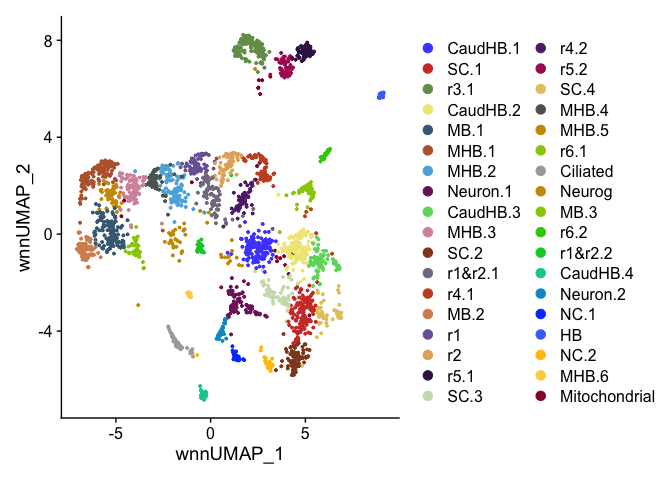
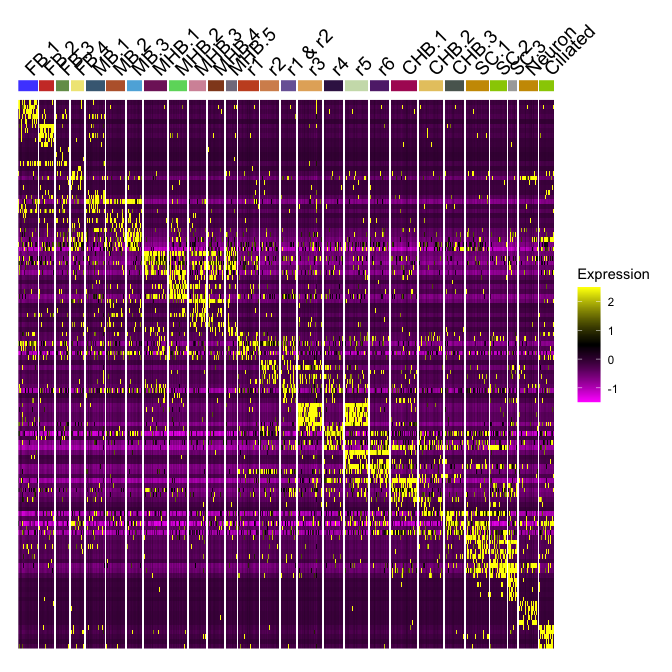
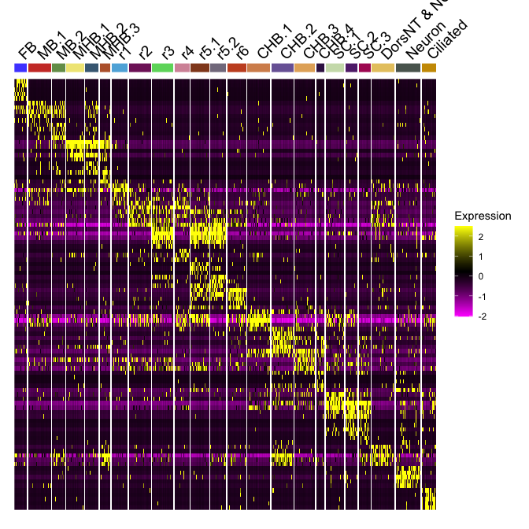
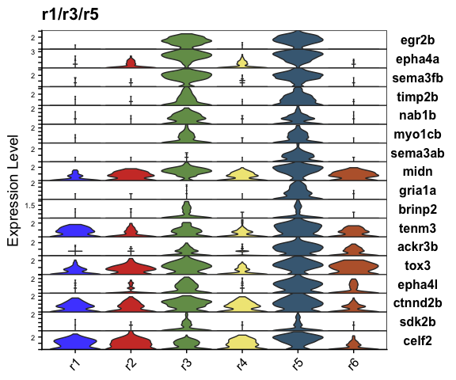
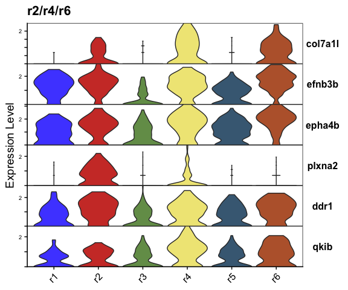
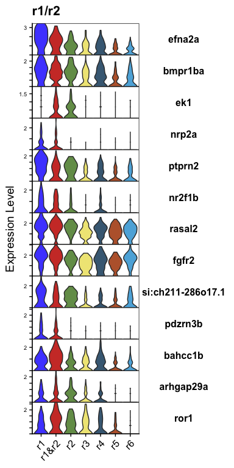
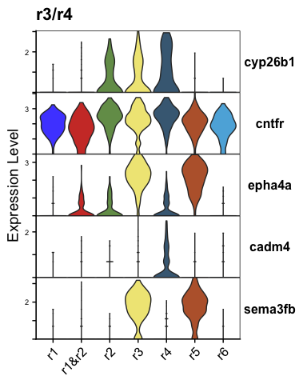
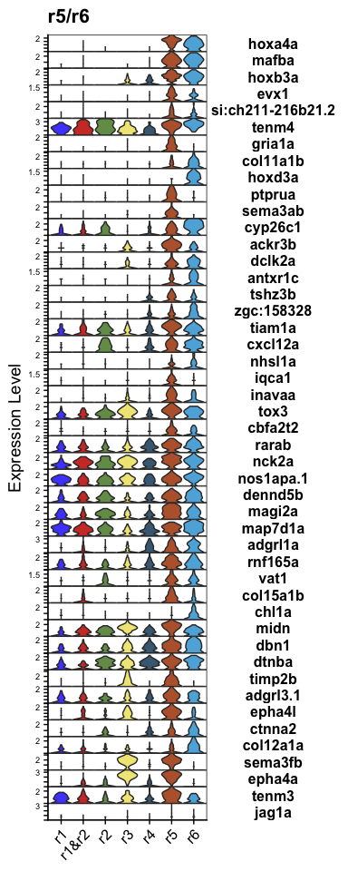
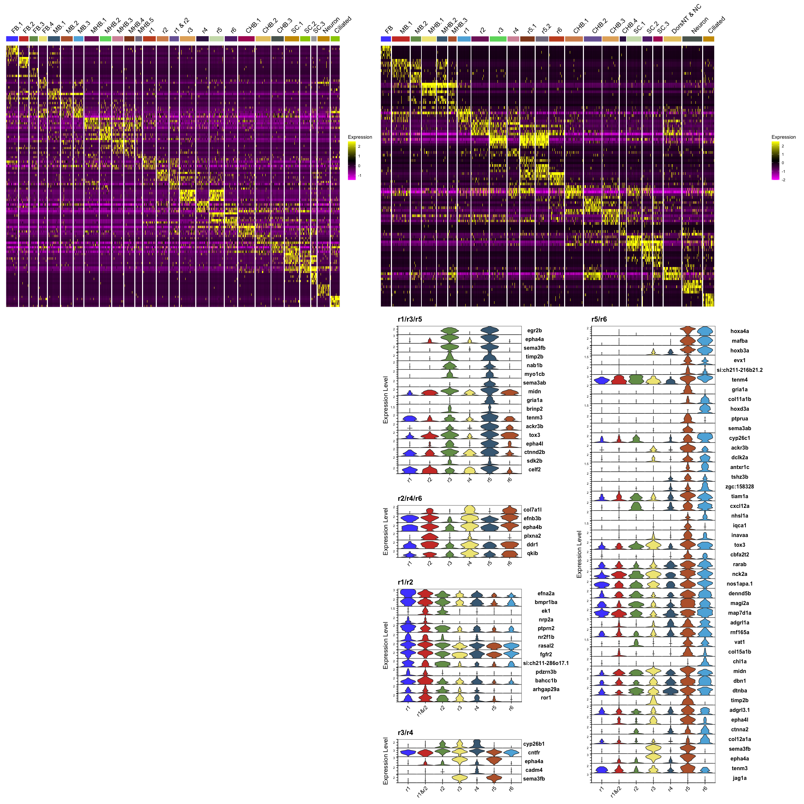

Figure 5 R Notebook
================

``` r
suppressPackageStartupMessages({
  library(Seurat)
  library(org.Dr.eg.db)
  library(BSgenome.Drerio.UCSC.danRer11)
  library(Signac)
  library(knitr)
  library(kableExtra)
  library(dplyr)
  library(ggplot2)
  library(ggsci)
  library(limma)
  library(JASPAR2020)
  library(patchwork)
  library(TFBSTools)
  library(motifmatchr)
  library(AnnotationHub)
  library(harmony)
})
```

    ## Warning: package 'AnnotationDbi' was built under R version 4.1.1

    ## Warning: package 'BiocGenerics' was built under R version 4.1.1

    ## Warning: package 'Biobase' was built under R version 4.1.1

    ## Warning: package 'IRanges' was built under R version 4.1.1

    ## Warning: package 'S4Vectors' was built under R version 4.1.3

    ## Warning: package 'BSgenome' was built under R version 4.1.1

    ## Warning: package 'GenomeInfoDb' was built under R version 4.1.1

    ## Warning: package 'GenomicRanges' was built under R version 4.1.1

    ## Warning: package 'Biostrings' was built under R version 4.1.1

    ## Warning: package 'XVector' was built under R version 4.1.1

    ## Warning: package 'rtracklayer' was built under R version 4.1.1

    ## Warning: package 'ggplot2' was built under R version 4.1.2

    ## Warning: package 'limma' was built under R version 4.1.3

    ## Warning: package 'patchwork' was built under R version 4.1.2

    ## Warning: package 'TFBSTools' was built under R version 4.1.1

    ## Warning: package 'motifmatchr' was built under R version 4.1.1

    ## Warning: package 'AnnotationHub' was built under R version 4.1.1

    ## Warning: package 'BiocFileCache' was built under R version 4.1.1

``` r
options(future.globals.maxSize = 4000 * 1024^2)
```

``` r
mypal <- pal_igv(palette = "default",alpha = 1)(30)
```

# 2. Read data

``` r
HB13hpf <- readRDS(file = "RDSfiles/HB13hpf_neural.RDS")
DefaultAssay(HB13hpf) <- "SCT"
Idents(HB13hpf) <- "Clusters"
HB16hpf <- readRDS(file = "RDSfiles/HB16hpf_neural.RDS")
DefaultAssay(HB16hpf) <- "SCT"
Idents(HB16hpf) <- "Clusters"
```

``` r
HB.int <- readRDS(file = "RDSfiles/int.neural.3WT.subset.RDS")
DefaultAssay(HB.int) <- "SCT"
DimPlot(HB.int, reduction = "wnn.umap") + scale_color_igv()
```

<!-- -->

``` r
HB.int$intClusters <- as.character(HB.int$intClusters)
HB.int$intClusters[HB.int$intClusters %in% c("r1&r2.1","r1&r2.2")] <- "r1&r2"
HB.int$intClusters[HB.int$intClusters %in% c("r3.1")] <- "r3"
HB.int$intClusters[HB.int$intClusters %in% c("r4.1","r4.2")] <- "r4"
HB.int$intClusters[HB.int$intClusters %in% c("r5.1","r5.2")] <- "r5"
HB.int$intClusters[HB.int$intClusters %in% c("r6.1","r6.2")] <- "r6"
HB.int$intClusters <- droplevels(as.factor(HB.int$intClusters))
Idents(HB.int) <- "intClusters"
levels(HB.int)
```

    ##  [1] "CaudHB.1"      "CaudHB.2"      "CaudHB.3"      "CaudHB.4"     
    ##  [5] "Ciliated"      "HB"            "MB.1"          "MB.2"         
    ##  [9] "MB.3"          "MHB.1"         "MHB.2"         "MHB.3"        
    ## [13] "MHB.4"         "MHB.5"         "MHB.6"         "Mitochondrial"
    ## [17] "NC.1"          "NC.2"          "Neurog"        "Neuron.1"     
    ## [21] "Neuron.2"      "r1"            "r1&r2"         "r2"           
    ## [25] "r3"            "r4"            "r5"            "r6"           
    ## [29] "SC.1"          "SC.2"          "SC.3"          "SC.4"

``` r
levels(HB.int) <- c("r1","r1&r2","r2","r3","r4","r5","r6","CaudHB.1","CaudHB.2","CaudHB.3","CaudHB.4","Ciliated","HB","MB.1","MB.2",
                    "MB.3","MHB.1","MHB.2","MHB.3","MHB.4","MHB.5","MHB.6","Mitochondrial","NC.1","NC.2","Neurog","Neuron.1", 
                    "Neuron.2","SC.1","SC.2","SC.3","SC.4")
```

# 3. Heatmaps

## 3.1 HB13hpf top5 DE genes

``` r
All.markers.13 <- FindAllMarkers(HB13hpf, only.pos = T, verbose = F)
```

``` r
top5.pval.13 <- All.markers.13 %>% group_by(cluster) %>% top_n(n=-5, wt = p_val) %>% top_n(n=5, wt = avg_log2FC)
top5.pval.13
```

    ## # A tibble: 135 × 7
    ## # Groups:   cluster [27]
    ##        p_val avg_log2FC pct.1 pct.2 p_val_adj cluster gene           
    ##        <dbl>      <dbl> <dbl> <dbl>     <dbl> <fct>   <chr>          
    ##  1 2.48e- 66      0.800 0.459 0.008 4.54e- 62 FB.1    rx1            
    ##  2 3.31e- 58      1.38  0.649 0.033 6.06e- 54 FB.1    aldh1a3        
    ##  3 4.05e- 45      1.10  0.459 0.02  7.42e- 41 FB.1    rorb           
    ##  4 5.97e- 44      0.976 0.568 0.035 1.09e- 39 FB.1    six3b          
    ##  5 5.36e- 40      0.344 0.216 0.001 9.81e- 36 FB.1    hmx4           
    ##  6 6.25e-112      2.42  1     0.028 1.14e-107 FB.2    si:ch73-215f7.1
    ##  7 6.57e- 89      1.21  0.69  0.013 1.20e- 84 FB.2    foxg1a         
    ##  8 6.22e- 65      1.66  0.724 0.029 1.14e- 60 FB.2    emx3           
    ##  9 2.99e- 47      0.554 0.379 0.008 5.48e- 43 FB.2    dmrta2         
    ## 10 2.01e- 42      0.730 0.379 0.01  3.68e- 38 FB.2    dlx3b          
    ## # … with 125 more rows

``` r
Idents(HB13hpf) <- "Clusters"
HB13hpf <- RenameIdents(HB13hpf, "FB.1" = "FB.1       ") ## this makes the length of longest name same as HB16hpf so they even in combined plot
heatmapPlot.13 <- DoHeatmap(HB13hpf, features = unique(top5.pval.13$gene), group.colors = mypal, 
                         size = 5, angle = 45) + 
  guides(color = FALSE) +
  theme(axis.text = element_blank())
```

    ## Warning: The `<scale>` argument of `guides()` cannot be `FALSE`. Use "none" instead as
    ## of ggplot2 3.3.4.

``` r
heatmapPlot.13
```

<!-- -->

## 3.2 HB16hpf top5 DE genes

``` r
All.markers.16 <- FindAllMarkers(HB16hpf, only.pos = T, verbose = F)
```

``` r
top5.pval.16 <- All.markers.16 %>% group_by(cluster) %>% top_n(n=-5, wt = p_val) %>% top_n(n=5, wt = avg_log2FC)
top5.pval.16
```

    ## # A tibble: 115 × 7
    ## # Groups:   cluster [23]
    ##        p_val avg_log2FC pct.1 pct.2 p_val_adj cluster gene  
    ##        <dbl>      <dbl> <dbl> <dbl>     <dbl> <fct>   <chr> 
    ##  1 2.47e-124      1.53  0.656 0.003 4.46e-120 FB      lhx2b 
    ##  2 1.46e-104      1.45  0.562 0.003 2.64e-100 FB      vax2  
    ##  3 2.01e- 58      0.666 0.344 0.003 3.63e- 54 FB      rx1   
    ##  4 1.75e- 56      0.609 0.312 0.002 3.15e- 52 FB      fezf2 
    ##  5 1.35e- 48      0.425 0.25  0.001 2.44e- 44 FB      rx2   
    ##  6 1.08e- 62      0.763 0.491 0.018 1.96e- 58 MB.1    dmbx1b
    ##  7 4.49e- 33      0.987 0.491 0.054 8.11e- 29 MB.1    otx2a 
    ##  8 3.02e- 29      0.838 0.491 0.063 5.46e- 25 MB.1    otx1  
    ##  9 8.50e- 21      0.444 0.298 0.031 1.53e- 16 MB.1    otx2b 
    ## 10 1.42e- 18      0.516 0.246 0.023 2.56e- 14 MB.1    stra6 
    ## # … with 105 more rows

``` r
heatmapPlot.16 <- DoHeatmap(HB16hpf, features = unique(top5.pval.16$gene), group.colors = mypal, 
                         size = 5, angle = 45) + 
  guides(color = FALSE) +
  theme(axis.text = element_blank())
heatmapPlot.16
```

<!-- -->

# 3. Compare r1, r3 & r5 to r2, r4 and r6

``` r
r135vs246_markers <- FindMarkers(HB.int, 
                                 ident.1 = c("r1","r3","r5"), 
                                 ident.2 = c("r2","r4","r6"), verbose = FALSE)
```

``` r
avg_r135vs246 <- AverageExpression(HB.int, features = rownames(r135vs246_markers), assays = "SCT")$SCT
avg_r135vs246 <- as.data.frame(avg_r135vs246) %>%
  select(r1, r2, r3, r4, r5, r6)
r135vs246_m_avg <- cbind(r135vs246_markers,avg_r135vs246)
```

``` r
r135over246_m_avg <- r135vs246_m_avg %>%
  filter(p_val_adj < 0.05 & avg_log2FC > 0.5 & r1 > 0 & r3 > 0 & r5 > 0)
r135over246_m_avg
```

    ##                p_val avg_log2FC pct.1 pct.2    p_val_adj         r1         r2
    ## egr2b   4.769043e-68  2.0809495 0.726 0.017 9.300588e-64 0.01449275 0.00000000
    ## epha4a  4.012397e-56  2.5092996 0.801 0.260 7.824977e-52 0.34782609 0.68656716
    ## sema3fb 1.013082e-54  2.2469798 0.738 0.159 1.975713e-50 0.20289855 0.17910448
    ## timp2b  7.172154e-31  1.6225750 0.449 0.045 1.398713e-26 0.08695652 0.11940299
    ## nab1b   7.890674e-28  0.8347779 0.464 0.069 1.538839e-23 0.10144928 0.05970149
    ## myo1cb  3.676460e-27  0.9156104 0.368 0.017 7.169833e-23 0.05797101 0.00000000
    ## sema3ab 3.853865e-20  0.7229653 0.290 0.017 7.515807e-16 0.01449275 0.01492537
    ## midn    2.768951e-19  0.9327731 0.773 0.616 5.400009e-15 0.52173913 1.26865672
    ## gria1a  2.073254e-14  0.6606681 0.246 0.031 4.043260e-10 0.01449275 0.04477612
    ## brinp2  1.194275e-11  0.6538225 0.237 0.048 2.329075e-07 0.04347826 0.08955224
    ## tenm3   1.542077e-10  0.6346493 0.623 0.419 3.007359e-06 1.24637681 0.65671642
    ## ackr3b  2.028003e-10  0.6671517 0.533 0.311 3.955011e-06 0.31884058 0.31343284
    ## tox3    2.426812e-10  0.6135021 0.713 0.533 4.732769e-06 0.71014493 1.40298507
    ## epha4l  5.059294e-10  0.5561303 0.505 0.260 9.866635e-06 0.31884058 0.55223881
    ## ctnnd2b 2.271592e-09  0.5166746 0.688 0.509 4.430059e-05 1.01449275 0.97014925
    ## sdk2b   1.523158e-08  0.5109775 0.234 0.073 2.970462e-04 0.07246377 0.11940299
    ## celf2   4.822914e-07  0.5314013 0.679 0.543 9.405646e-03 1.95652174 2.20895522
    ##                 r3          r4        r5         r6
    ## egr2b    3.6111111 0.053030303 4.8730159 0.00000000
    ## epha4a  10.3650794 0.772727273 9.8333333 0.22222222
    ## sema3fb  6.4761905 0.522727273 6.6825397 0.08888889
    ## timp2b   2.8015873 0.030303030 2.9365079 0.06666667
    ## nab1b    1.3174603 0.113636364 1.0634921 0.10000000
    ## myo1cb   1.0476190 0.030303030 1.2619048 0.01111111
    ## sema3ab  0.2539683 0.007575758 1.4682540 0.03333333
    ## midn     3.4285714 1.030303030 4.5079365 1.44444444
    ## gria1a   0.2063492 0.007575758 1.4047619 0.06666667
    ## brinp2   0.8492063 0.053030303 0.8095238 0.03333333
    ## tenm3    1.2698413 0.742424242 2.6031746 0.97777778
    ## ackr3b   0.8095238 0.371212121 2.5714286 0.85555556
    ## tox3     2.3968254 0.598484848 3.3253968 2.00000000
    ## epha4l   1.3650794 0.560606061 2.0952381 0.85555556
    ## ctnnd2b  1.8095238 1.212121212 2.2380952 0.58888889
    ## sdk2b    0.6746032 0.075757576 0.6825397 0.07777778
    ## celf2    1.2698413 1.810606061 4.6031746 0.76666667

``` r
r246over135_m_avg <- r135vs246_m_avg %>%
  filter(p_val_adj < 0.05 & avg_log2FC < -0.5 & r2 > 0 & r4 > 0 & r6 > 0)
r246over135_m_avg
```

    ##                p_val avg_log2FC pct.1 pct.2    p_val_adj         r1        r2
    ## col7a1l 9.593417e-34 -1.1774990 0.128 0.574 1.870908e-29 0.02898551 0.8059701
    ## efnb3b  2.323514e-28 -0.9681545 0.604 0.913 4.531317e-24 3.47826087 4.1492537
    ## epha4b  3.788778e-22 -1.0029168 0.667 0.862 7.388875e-18 2.30434783 4.2835821
    ## plxna2  7.797338e-13 -0.6601154 0.121 0.360 1.520637e-08 0.13043478 1.5373134
    ## ddr1    5.350985e-12 -0.5824929 0.573 0.779 1.043549e-07 1.55072464 3.0000000
    ## qkib    2.722709e-09 -0.5843801 0.523 0.682 5.309827e-05 0.78260870 1.0298507
    ##                r3        r4        r5        r6
    ## col7a1l 0.2460317 2.2424242 0.2460317 1.6111111
    ## efnb3b  0.8888889 3.7651515 1.6746032 5.4777778
    ## epha4b  1.8571429 5.3787879 2.8888889 7.3222222
    ## plxna2  0.2857143 0.9924242 0.1746032 0.3222222
    ## ddr1    1.1904762 2.3181818 1.6587302 2.9444444
    ## qkib    1.0000000 2.5833333 1.1269841 1.8777778

## 3.1 r1/r3/r5 over r2/r4/r6

``` r
p135 <- VlnPlot(HB.int, features = rownames(r135over246_m_avg %>% filter(p_val_adj < 0.05 & abs(avg_log2FC) > 0.5)), 
        idents = c("r1","r2","r3","r4","r5","r6"), stack = TRUE, flip = TRUE, fill.by = "ident", cols = mypal) + NoLegend() +
  theme(axis.title.x = element_blank()) + ggtitle("r1/r3/r5")
p135
```

<!-- -->

## 3.1 r2/r4/r6 over r1/r3/r5

``` r
p246 <- VlnPlot(HB.int, features = rownames(r246over135_m_avg %>% filter(p_val_adj < 0.05 & abs(avg_log2FC) > 0.5)), 
        idents = c("r1","r2","r3","r4","r5","r6"), stack = TRUE, flip = TRUE, fill.by = "ident", cols = mypal) + NoLegend() +
  theme(axis.title.x = element_blank()) + ggtitle("r2/r4/r6")
p246
```

<!-- -->

# 4. Compare r1 & r2 to rest

``` r
r12vsRest_markers <- FindMarkers(HB.int, 
                                 ident.1 = c("r1","r1&r2","r2"), 
                                 ident.2 = c("r3","r5","r4","r6"), verbose = FALSE)
```

``` r
avg_r12vsRest <- AverageExpression(HB.int, features = rownames(r12vsRest_markers), assays = "SCT")$SCT
avg_r12vsRest <- as.data.frame(avg_r12vsRest) %>%
  select(r1, r2, r3, r4, r5, r6)
r12vsRest_m_avg <- cbind(r12vsRest_markers,avg_r12vsRest)
```

``` r
r12overRest_m_avg <- r12vsRest_m_avg %>%
  filter(p_val_adj < 0.05 & avg_log2FC > 0.5 & r1 > 0 & r2 > 0)
r12overRest_m_avg
```

    ##                          p_val avg_log2FC pct.1 pct.2    p_val_adj        r1
    ## efna2a            5.096145e-24  1.3852691 0.765 0.511 9.938501e-20 8.8260870
    ## bmpr1ba           2.504632e-21  0.7390926 0.826 0.525 4.884534e-17 3.0000000
    ## ek1               8.958606e-20  0.5477330 0.393 0.105 1.747107e-15 0.5072464
    ## nrp2a             2.251715e-19  0.7217357 0.283 0.049 4.391294e-15 1.0724638
    ## ptprn2            4.751467e-19  0.7729977 0.696 0.407 9.266312e-15 3.2463768
    ## nr2f1b            1.118403e-16  0.7713178 0.417 0.150 2.181109e-12 1.6086957
    ## rasal2            8.242265e-15  0.5701981 0.935 0.882 1.607407e-10 5.1739130
    ## fgfr2             5.343906e-14  0.5898429 0.923 0.840 1.042169e-09 6.2318841
    ## si:ch211-286o17.1 1.832448e-13  0.7137958 0.591 0.350 3.573640e-09 2.2173913
    ## pdzrn3b           4.011257e-12  0.5663741 0.316 0.116 7.822753e-08 0.9565217
    ## bahcc1b           2.775321e-10  0.5339388 0.652 0.441 5.412431e-06 1.3333333
    ## arhgap29a         3.397249e-10  0.5372371 0.453 0.238 6.625315e-06 0.6956522
    ## ror1              2.223714e-09  0.5172335 0.595 0.367 4.336686e-05 1.2898551
    ##                          r2         r3        r4         r5         r6
    ## efna2a            2.2238806 1.55555556 1.8863636 0.81746032 0.73333333
    ## bmpr1ba           2.6567164 1.19841270 1.5757576 0.77777778 1.08888889
    ## ek1               0.7164179 0.19047619 0.2121212 0.11111111 0.15555556
    ## nrp2a             0.1492537 0.02380952 0.1666667 0.04761905 0.07777778
    ## ptprn2            1.8208955 0.69841270 1.0909091 0.54761905 0.82222222
    ## nr2f1b            0.8059701 0.20634921 0.7045455 0.06349206 0.25555556
    ## rasal2            4.1940299 2.54761905 3.2045455 2.78571429 3.08888889
    ## fgfr2             3.8507463 2.29365079 3.6666667 2.88095238 4.46666667
    ## si:ch211-286o17.1 1.7014925 0.56349206 0.7196970 0.57142857 1.03333333
    ## pdzrn3b           0.3731343 0.10317460 0.2121212 0.12698413 0.13333333
    ## bahcc1b           0.9850746 0.98412698 1.4469697 0.42063492 0.55555556
    ## arhgap29a         0.9552239 0.48412698 0.4545455 0.26190476 0.17777778
    ## ror1              1.5522388 1.59523810 1.3030303 0.57142857 0.36666667

``` r
# Restoverr12_m_avg <- r12vsRest_m_avg %>%
#   filter(p_val_adj < 0.05 & avg_log2FC < -0.5 & r3 > 0 & r4 > 0 & r5 > 0 & r6 > 0)
# Restoverr12_m_avg
```

## 4.1 r1/r2 over r3/r4/r5/r6

``` r
p12 <- VlnPlot(HB.int, features = rownames(r12overRest_m_avg %>% filter(p_val_adj < 0.05 & abs(avg_log2FC) > 0.5)), 
        idents = c("r1","r1&r2","r2","r3","r4","r5","r6"), stack = TRUE, flip = TRUE, fill.by = "ident", cols = mypal) + NoLegend() +
  theme(axis.title.x = element_blank()) + ggtitle("r1/r2")
p12
```

<!-- -->

## 4.2 r3/r4/r5/r6 over r1/r2

``` r
# VlnPlot(HB.int, features = rownames(Restoverr12_m_avg %>% filter(p_val_adj < 0.05 & abs(avg_log2FC) > 0.5)), 
#         idents = c("r1","r1&r2","r2","r3","r4","r5","r6"), stack = TRUE, flip = TRUE, fill.by = "ident", cols = mypal) + NoLegend()
```

# 5. Compare r3 & r4 to rest

``` r
r34vsRest_markers <- FindMarkers(HB.int, 
                                 ident.1 = c("r3","r4"), 
                                 ident.2 = c("r1","r1&r2","r2","r5","r6"), verbose = FALSE)
```

``` r
avg_r34vsRest <- AverageExpression(HB.int, features = rownames(r34vsRest_markers), assays = "SCT")$SCT
avg_r34vsRest <- as.data.frame(avg_r34vsRest) %>%
  select(r1, r2, r3, r4, r5, r6)
r34vsRest_m_avg <- cbind(r34vsRest_markers,avg_r34vsRest)
```

``` r
r34overRest_m_avg <- r34vsRest_m_avg %>%
  filter(p_val_adj < 0.05 & avg_log2FC > 0.5 & r3 > 0 & r4 > 0)
r34overRest_m_avg
```

    ##                p_val avg_log2FC pct.1 pct.2    p_val_adj        r1         r2
    ## cyp26b1 5.068313e-28  1.3642217 0.516 0.147 9.884225e-24 0.1739130  1.6417910
    ## cntfr   4.416093e-12  0.5494943 0.977 0.957 8.612264e-08 7.4927536 12.5522388
    ## epha4a  9.350323e-10  0.6824019 0.647 0.428 1.823500e-05 0.3478261  0.6865672
    ## cadm4   5.950606e-09  0.5938628 0.314 0.143 1.160487e-04 0.1449275  0.3432836
    ## sema3fb 1.084966e-08  0.5134065 0.566 0.343 2.115901e-04 0.2028986  0.1791045
    ##                 r3         r4        r5         r6
    ## cyp26b1  2.1904762  3.5075758 0.1507937 0.02222222
    ## cntfr   11.5793651 13.2878788 8.9682540 6.93333333
    ## epha4a  10.3650794  0.7727273 9.8333333 0.22222222
    ## cadm4    0.6587302  1.1439394 0.1666667 0.40000000
    ## sema3fb  6.4761905  0.5227273 6.6825397 0.08888889

``` r
# Restoverr34_m_avg <- r34vsRest_m_avg %>%
#   filter(p_val_adj < 0.05 & avg_log2FC < -0.5 & r1 > 0 & r2 > 0 & r5 > 0 & r6 > 0)
# Restoverr34_m_avg
```

## 5.1 r3/r4 over r1/r2/r5/r6

``` r
p34 <- VlnPlot(HB.int, features = rownames(r34overRest_m_avg %>% filter(p_val_adj < 0.05 & abs(avg_log2FC) > 0.5)), 
        idents = c("r1","r1&r2","r2","r3","r4","r5","r6"), stack = TRUE, flip = TRUE, fill.by = "ident", cols = mypal) + NoLegend() +
  theme(axis.title.x = element_blank()) + ggtitle("r3/r4")
p34
```

<!-- -->

## 5.2 r1/r2/r5/r6 over r3/r4

``` r
# VlnPlot(HB.int, features = rownames(Restoverr34_m_avg %>% filter(p_val_adj < 0.05 & abs(avg_log2FC) > 0.5)), 
#         idents = c("r1","r1&r2","r2","r3","r4","r5","r6"), stack = TRUE, flip = TRUE, fill.by = "ident", cols = mypal) + NoLegend()
```

# 6. Compare r5 & r6 to rest

``` r
r56vsRest_markers <- FindMarkers(HB.int, 
                                 ident.1 = c("r5","r6"), 
                                 ident.2 = c("r1","r1&r2","r2","r3","r4"), verbose = FALSE)
```

``` r
avg_r56vsRest <- AverageExpression(HB.int, features = rownames(r56vsRest_markers), assays = "SCT")$SCT
avg_r56vsRest <- as.data.frame(avg_r56vsRest) %>%
  select(r1, r2, r3, r4, r5, r6)
r56vsRest_m_avg <- cbind(r56vsRest_markers,avg_r56vsRest)
```

``` r
r56overRest_m_avg <- r56vsRest_m_avg %>%
  filter(p_val_adj < 0.05 & avg_log2FC > 0.5 & r5 > 0 & r6 > 0)
r56overRest_m_avg
```

    ##                           p_val avg_log2FC pct.1 pct.2     p_val_adj         r1
    ## hoxa4a            1.379068e-115  2.0357988 0.833 0.014 2.689458e-111 0.00000000
    ## mafba              2.782261e-99  1.9281558 0.787 0.034  5.425966e-95 0.02898551
    ## hoxb3a             3.422166e-76  1.6333057 0.866 0.196  6.673908e-72 0.04347826
    ## evx1               3.656694e-45  0.6987393 0.431 0.026  7.131285e-41 0.01449275
    ## si:ch211-216b21.2  2.865513e-30  0.9258917 0.352 0.038  5.588323e-26 0.05797101
    ## tenm4              4.454470e-30  1.0021600 0.958 0.743  8.687108e-26 3.89855072
    ## gria1a             2.235426e-29  0.7913555 0.338 0.036  4.359528e-25 0.01449275
    ## col11a1b           3.058525e-29  0.9284935 0.417 0.079  5.964735e-25 0.07246377
    ## hoxd3a             4.231599e-29  0.5604363 0.296 0.020  8.252464e-25 0.02898551
    ## ptprua             1.470512e-28  1.1972377 0.412 0.079  2.867792e-24 0.10144928
    ## sema3ab            3.069640e-27  0.7986552 0.347 0.048  5.986412e-23 0.01449275
    ## cyp26c1            3.987853e-27  1.2723006 0.671 0.289  7.777111e-23 0.69565217
    ## ackr3b             4.032797e-25  0.9669017 0.644 0.295  7.864761e-21 0.31884058
    ## dclk2a             1.173373e-24  0.7935860 0.560 0.190  2.288313e-20 0.27536232
    ## antxr1c            1.136467e-22  0.6376925 0.380 0.089  2.216337e-18 0.10144928
    ## tshz3b             1.558260e-22  0.6030086 0.412 0.107  3.038919e-18 0.02898551
    ## zgc:158328         3.450370e-21  0.8054767 0.435 0.129  6.728911e-17 0.02898551
    ## tiam1a             5.665259e-21  0.6918199 0.750 0.422  1.104839e-16 0.59420290
    ## cxcl12a            2.704531e-20  0.7094442 0.657 0.315  5.274377e-16 0.31884058
    ## nhsl1a             4.165282e-20  0.5801141 0.343 0.075  8.123133e-16 0.04347826
    ## iqca1              3.006648e-19  0.5543501 0.352 0.087  5.863564e-15 0.10144928
    ## inavaa             1.031993e-18  0.9352964 0.477 0.184  2.012593e-14 0.01449275
    ## tox3               1.180898e-18  0.7487034 0.787 0.529  2.302988e-14 0.71014493
    ## cbfa2t2            1.785735e-17  0.5976231 0.458 0.168  3.482540e-13 0.46376812
    ## rarab              2.009081e-17  0.5802345 0.769 0.475  3.918110e-13 0.69565217
    ## nck2a              1.171225e-15  0.7533203 0.819 0.663  2.284123e-11 1.00000000
    ## nos1apa.1          1.502757e-15  0.6721919 0.856 0.618  2.930676e-11 1.85507246
    ## dennd5b            2.411407e-15  0.7271976 0.704 0.444  4.702726e-11 0.84057971
    ## magi2a             2.636877e-15  0.9494622 0.685 0.469  5.142437e-11 1.02898551
    ## map7d1a            1.272624e-14  0.5990933 0.838 0.628  2.481872e-10 2.01449275
    ## adgrl1a            1.653750e-14  0.8567036 0.602 0.309  3.225143e-10 0.42028986
    ## rnf165a            2.660677e-14  0.6631673 0.713 0.440  5.188853e-10 0.71014493
    ## vat1               5.667963e-14  0.5434280 0.509 0.234  1.105366e-09 0.17391304
    ## col15a1b           7.846488e-14  0.7818917 0.454 0.200  1.530222e-09 0.14492754
    ## chl1a              4.910784e-13  0.5965493 0.296 0.089  9.577012e-09 0.26086957
    ## midn               7.212351e-13  0.6960736 0.801 0.632  1.406553e-08 0.52173913
    ## dbn1               2.839665e-12  0.7229922 0.694 0.489  5.537915e-08 0.52173913
    ## dtnba              6.226704e-12  0.5643746 0.769 0.606  1.214332e-07 0.69565217
    ## timp2b             1.266775e-11  0.6145265 0.394 0.158  2.470464e-07 0.08695652
    ## adgrl3.1           1.023142e-09  0.5115563 0.620 0.422  1.995332e-05 0.69565217
    ## epha4l             1.675586e-09  0.5298020 0.537 0.311  3.267728e-05 0.31884058
    ## ctnna2             2.577477e-09  0.6317445 0.468 0.267  5.026596e-05 0.27536232
    ## col12a1a           3.385645e-09  0.6922482 0.444 0.261  6.602685e-05 0.39130435
    ## sema3fb            8.362960e-09  0.7190943 0.565 0.362  1.630945e-04 0.20289855
    ## epha4a             2.294038e-08  0.7475308 0.625 0.455  4.473834e-04 0.34782609
    ## tenm3              9.278361e-08  0.5346794 0.634 0.475  1.809466e-03 1.24637681
    ## jag1a              2.535408e-06  0.6001005 0.157 0.053  4.944553e-02 0.13043478
    ##                           r2           r3          r4         r5          r6
    ## hoxa4a            0.01492537  0.000000000 0.015151515 3.77777778  2.36666667
    ## mafba             0.00000000  0.015873016 0.113636364 2.86507937  3.35555556
    ## hoxb3a            0.00000000  0.507936508 0.651515152 3.38095238  2.78888889
    ## evx1              0.00000000  0.015873016 0.060606061 0.82539683  0.45555556
    ## si:ch211-216b21.2 0.04477612  0.111111111 0.015151515 1.23809524  0.87777778
    ## tenm4             9.50746269  3.746031746 1.954545455 8.38888889 12.03333333
    ## gria1a            0.04477612  0.206349206 0.007575758 1.40476190  0.06666667
    ## col11a1b          0.11940299  0.095238095 0.113636364 0.80158730  1.48888889
    ## hoxd3a            0.00000000  0.007936508 0.015151515 0.08730159  1.12222222
    ## ptprua            0.17910448  0.150793651 0.106060606 2.44444444  0.41111111
    ## sema3ab           0.01492537  0.253968254 0.007575758 1.46825397  0.03333333
    ## cyp26c1           1.38805970  0.301587302 0.818181818 1.80158730  5.46666667
    ## ackr3b            0.31343284  0.809523810 0.371212121 2.57142857  0.85555556
    ## dclk2a            0.17910448  0.547619048 0.257575758 1.17460317  1.46666667
    ## antxr1c           0.07462687  0.071428571 0.113636364 0.50793651  1.00000000
    ## tshz3b            0.04477612  0.063492063 0.492424242 0.92857143  0.54444444
    ## zgc:158328        0.19402985  0.087301587 0.500000000 0.73809524  1.63333333
    ## tiam1a            1.11940299  0.690476190 0.848484848 2.41269841  1.40000000
    ## cxcl12a           1.50746269  0.333333333 0.969696970 1.56349206  1.90000000
    ## nhsl1a            0.13432836  0.111111111 0.060606061 0.46031746  0.95555556
    ## iqca1             0.02985075  0.261904762 0.045454545 0.88095238  0.28888889
    ## inavaa            0.16417910  0.634920635 0.484848485 2.14285714  1.08888889
    ## tox3              1.40298507  2.396825397 0.598484848 3.32539683  2.00000000
    ## cbfa2t2           0.19402985  0.452380952 0.227272727 1.13492063  0.70000000
    ## rarab             0.56716418  0.825396825 1.113636364 1.67460317  1.87777778
    ## nck2a             1.95522388  2.238095238 1.250000000 3.97619048  2.94444444
    ## nos1apa.1         1.49253731  1.746031746 1.484848485 2.65873016  3.70000000
    ## dennd5b           1.20895522  0.523809524 0.734848485 1.84920635  2.23333333
    ## magi2a            1.34328358  0.849206349 0.909090909 3.26190476  2.00000000
    ## map7d1a           1.29850746  0.746031746 1.446969697 2.21428571  3.06666667
    ## adgrl1a           0.50746269  0.857142857 2.393939394 2.88095238  3.37777778
    ## rnf165a           0.62686567  0.984126984 1.106060606 2.30158730  1.91111111
    ## vat1              0.64179104  0.341269841 0.409090909 1.06349206  0.91111111
    ## col15a1b          0.25373134  0.253968254 0.492424242 1.80158730  0.82222222
    ## chl1a             0.08955224  0.111111111 0.075757576 0.30952381  1.37777778
    ## midn              1.26865672  3.428571429 1.030303030 4.50793651  1.44444444
    ## dbn1              0.58208955  1.253968254 1.257575758 2.15873016  2.42222222
    ## dtnba             1.94029851  1.333333333 1.803030303 2.34920635  2.40000000
    ## timp2b            0.11940299  2.801587302 0.030303030 2.93650794  0.06666667
    ## adgrl3.1          0.64179104  0.849206349 0.893939394 1.78571429  1.21111111
    ## epha4l            0.55223881  1.365079365 0.560606061 2.09523810  0.85555556
    ## ctnna2            0.55223881  0.349206349 0.916666667 1.11904762  1.64444444
    ## col12a1a          0.44776119  0.380952381 0.348484848 0.80952381  1.91111111
    ## sema3fb           0.17910448  6.476190476 0.522727273 6.68253968  0.08888889
    ## epha4a            0.68656716 10.365079365 0.772727273 9.83333333  0.22222222
    ## tenm3             0.65671642  1.269841270 0.742424242 2.60317460  0.97777778
    ## jag1a             0.04477612  0.150793651 0.045454545 0.85714286  0.33333333

``` r
# Restoverr56_m_avg <- r56vsRest_m_avg %>%
#   filter(p_val_adj < 0.05 & avg_log2FC < -0.5 & r1 > 0 & r2 > 0 & r3 > 0 & r4 > 0)
# Restoverr56_m_avg
```

## 6.1 r5/r6 over r1/r2/r3/r4

``` r
p56 <- VlnPlot(HB.int, features = rownames(r56overRest_m_avg %>% filter(p_val_adj < 0.05 & abs(avg_log2FC) > 0.5)), 
        idents = c("r1","r1&r2","r2","r3","r4","r5","r6"), stack = TRUE, flip = TRUE, fill.by = "ident", cols = mypal) + NoLegend() +
  theme(axis.title.x = element_blank()) + ggtitle("r5/r6")
p56
```

<!-- -->

## 6.2 r1/r2/r3/r4 over r5/r6

``` r
# VlnPlot(HB.int, features = rownames(Restoverr56_m_avg %>% filter(p_val_adj < 0.05 & abs(avg_log2FC) > 0.5)), 
#         idents = c("r1","r1&r2","r2","r3","r4","r5","r6"), stack = TRUE, flip = TRUE, fill.by = "ident", cols = mypal) + NoLegend() 
```

``` r
write.table(r135vs246_m_avg, file = "../results/rhom_DEgenes_135vs246.txt", sep = "\t", quote = FALSE, col.names = NA)
write.table(r12vsRest_m_avg, file = "../results/rhom_DEgenes_12vs3456.txt", sep = "\t", quote = FALSE, col.names = NA)
write.table(r34vsRest_m_avg, file = "../results/rhom_DEgenes_34vs1256.txt", sep = "\t", quote = FALSE, col.names = NA)
write.table(r56vsRest_m_avg, file = "../results/rhom_DEgenes_56vs1234.txt", sep = "\t", quote = FALSE, col.names = NA)
```

``` r
combined <- 
  (((heatmapPlot.13) +
      #plot_spacer() +
     (heatmapPlot.16) #+ 
     #plot_layout(widths = c(2,0.1,2))
  ) /
  ((plot_spacer()) +
     ((p135 / plot_spacer() / p246 / plot_spacer() / p12 / plot_spacer() / p34) + 
        plot_layout(heights = c(17,0.1,6,0.1,13,0.1,5))) + 
     #plot_spacer() +
     (p56) +
     plot_layout(widths = c(3,1,1))
  )) + 
  plot_layout(heights = c(1,1.5))
combined
```

<!-- -->

``` r
ggsave(filename = "../results/Fig5_combinedPlot.png", plot = combined)
```

    ## Saving 25 x 25 in image

``` r
sessionInfo()
```

    ## R version 4.1.0 (2021-05-18)
    ## Platform: x86_64-apple-darwin17.0 (64-bit)
    ## Running under: macOS Big Sur 10.16
    ## 
    ## Matrix products: default
    ## BLAS:   /Library/Frameworks/R.framework/Versions/4.1/Resources/lib/libRblas.dylib
    ## LAPACK: /Library/Frameworks/R.framework/Versions/4.1/Resources/lib/libRlapack.dylib
    ## 
    ## locale:
    ## [1] en_US.UTF-8/en_US.UTF-8/en_US.UTF-8/C/en_US.UTF-8/en_US.UTF-8
    ## 
    ## attached base packages:
    ## [1] stats4    stats     graphics  grDevices utils     datasets  methods  
    ## [8] base     
    ## 
    ## other attached packages:
    ##  [1] harmony_0.1.0                       Rcpp_1.0.7                         
    ##  [3] AnnotationHub_3.2.0                 BiocFileCache_2.2.0                
    ##  [5] dbplyr_2.1.1                        motifmatchr_1.16.0                 
    ##  [7] TFBSTools_1.32.0                    patchwork_1.1.2                    
    ##  [9] JASPAR2020_0.99.10                  limma_3.50.3                       
    ## [11] ggsci_2.9                           ggplot2_3.4.0                      
    ## [13] dplyr_1.0.7                         kableExtra_1.3.4                   
    ## [15] knitr_1.36                          Signac_1.2.1                       
    ## [17] BSgenome.Drerio.UCSC.danRer11_1.4.2 BSgenome_1.62.0                    
    ## [19] rtracklayer_1.54.0                  Biostrings_2.62.0                  
    ## [21] XVector_0.34.0                      GenomicRanges_1.46.0               
    ## [23] GenomeInfoDb_1.30.0                 org.Dr.eg.db_3.14.0                
    ## [25] AnnotationDbi_1.56.1                IRanges_2.28.0                     
    ## [27] S4Vectors_0.32.4                    Biobase_2.54.0                     
    ## [29] BiocGenerics_0.40.0                 SeuratObject_4.0.4                 
    ## [31] Seurat_4.0.1                       
    ## 
    ## loaded via a namespace (and not attached):
    ##   [1] rappdirs_0.3.3                SnowballC_0.7.0              
    ##   [3] scattermore_0.7               R.methodsS3_1.8.1            
    ##   [5] ragg_1.2.4                    tidyr_1.1.4                  
    ##   [7] bit64_4.0.5                   irlba_2.3.3                  
    ##   [9] DelayedArray_0.20.0           R.utils_2.11.0               
    ##  [11] data.table_1.14.2             rpart_4.1-15                 
    ##  [13] KEGGREST_1.34.0               RCurl_1.98-1.5               
    ##  [15] generics_0.1.1                cowplot_1.1.1                
    ##  [17] RSQLite_2.2.8                 RANN_2.6.1                   
    ##  [19] future_1.26.1                 bit_4.0.4                    
    ##  [21] tzdb_0.2.0                    spatstat.data_2.1-0          
    ##  [23] webshot_0.5.4                 xml2_1.3.3                   
    ##  [25] httpuv_1.6.3                  SummarizedExperiment_1.24.0  
    ##  [27] assertthat_0.2.1              DirichletMultinomial_1.36.0  
    ##  [29] xfun_0.27                     hms_1.1.1                    
    ##  [31] evaluate_0.14                 promises_1.2.0.1             
    ##  [33] fansi_0.5.0                   restfulr_0.0.13              
    ##  [35] caTools_1.18.2                igraph_1.2.8                 
    ##  [37] DBI_1.1.1                     htmlwidgets_1.5.4            
    ##  [39] sparsesvd_0.2                 spatstat.geom_2.3-0          
    ##  [41] purrr_0.3.4                   ellipsis_0.3.2               
    ##  [43] annotate_1.72.0               deldir_1.0-6                 
    ##  [45] MatrixGenerics_1.6.0          vctrs_0.5.0                  
    ##  [47] ROCR_1.0-11                   abind_1.4-5                  
    ##  [49] cachem_1.0.6                  withr_2.5.0                  
    ##  [51] ggforce_0.3.3                 sctransform_0.3.3            
    ##  [53] GenomicAlignments_1.30.0      goftest_1.2-3                
    ##  [55] svglite_2.1.0                 cluster_2.1.2                
    ##  [57] lazyeval_0.2.2                seqLogo_1.60.0               
    ##  [59] crayon_1.4.2                  pkgconfig_2.0.3              
    ##  [61] slam_0.1-48                   labeling_0.4.2               
    ##  [63] tweenr_1.0.2                  nlme_3.1-153                 
    ##  [65] rlang_1.0.6                   globals_0.15.1               
    ##  [67] lifecycle_1.0.3               miniUI_0.1.1.1               
    ##  [69] filelock_1.0.2                polyclip_1.10-0              
    ##  [71] matrixStats_0.61.0            lmtest_0.9-38                
    ##  [73] Matrix_1.3-4                  ggseqlogo_0.1                
    ##  [75] zoo_1.8-9                     ggridges_0.5.3               
    ##  [77] png_0.1-7                     viridisLite_0.4.0            
    ##  [79] rjson_0.2.20                  bitops_1.0-7                 
    ##  [81] R.oo_1.24.0                   KernSmooth_2.23-20           
    ##  [83] blob_1.2.2                    stringr_1.4.0                
    ##  [85] parallelly_1.32.0             readr_2.0.2                  
    ##  [87] CNEr_1.30.0                   scales_1.2.1                 
    ##  [89] memoise_2.0.0                 magrittr_2.0.1               
    ##  [91] plyr_1.8.6                    ica_1.0-2                    
    ##  [93] zlibbioc_1.40.0               compiler_4.1.0               
    ##  [95] BiocIO_1.4.0                  RColorBrewer_1.1-2           
    ##  [97] fitdistrplus_1.1-6            Rsamtools_2.10.0             
    ##  [99] cli_3.4.1                     listenv_0.8.0                
    ## [101] pbapply_1.5-0                 MASS_7.3-54                  
    ## [103] mgcv_1.8-38                   tidyselect_1.1.1             
    ## [105] stringi_1.7.5                 textshaping_0.3.6            
    ## [107] highr_0.9                     yaml_2.2.1                   
    ## [109] ggrepel_0.9.1                 grid_4.1.0                   
    ## [111] fastmatch_1.1-3               tools_4.1.0                  
    ## [113] future.apply_1.8.1            parallel_4.1.0               
    ## [115] rstudioapi_0.13               TFMPvalue_0.0.8              
    ## [117] lsa_0.73.2                    gridExtra_2.3                
    ## [119] farver_2.1.0                  Rtsne_0.15                   
    ## [121] digest_0.6.28                 BiocManager_1.30.19          
    ## [123] shiny_1.7.1                   pracma_2.3.3                 
    ## [125] qlcMatrix_0.9.7               BiocVersion_3.14.0           
    ## [127] later_1.3.0                   RcppAnnoy_0.0.19             
    ## [129] httr_1.4.2                    colorspace_2.0-2             
    ## [131] rvest_1.0.3                   XML_3.99-0.8                 
    ## [133] tensor_1.5                    reticulate_1.22              
    ## [135] splines_4.1.0                 uwot_0.1.10                  
    ## [137] RcppRoll_0.3.0                spatstat.utils_2.2-0         
    ## [139] plotly_4.10.0                 systemfonts_1.0.4            
    ## [141] xtable_1.8-4                  jsonlite_1.7.2               
    ## [143] poweRlaw_0.70.6               R6_2.5.1                     
    ## [145] pillar_1.6.4                  htmltools_0.5.2              
    ## [147] mime_0.12                     glue_1.6.2                   
    ## [149] fastmap_1.1.0                 BiocParallel_1.28.0          
    ## [151] interactiveDisplayBase_1.32.0 codetools_0.2-18             
    ## [153] utf8_1.2.2                    lattice_0.20-45              
    ## [155] spatstat.sparse_2.0-0         tibble_3.1.6                 
    ## [157] curl_4.3.2                    leiden_0.3.9                 
    ## [159] gtools_3.9.2                  GO.db_3.14.0                 
    ## [161] survival_3.2-13               rmarkdown_2.11               
    ## [163] docopt_0.7.1                  munsell_0.5.0                
    ## [165] GenomeInfoDbData_1.2.7        reshape2_1.4.4               
    ## [167] gtable_0.3.0                  spatstat.core_2.3-0
