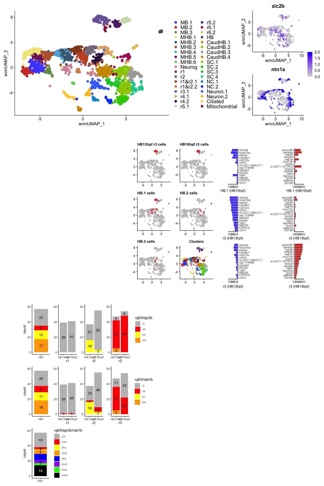

Figure 6 R Notebook
================
Rebecca O’Rourke

# 1 Libraries

``` r
suppressPackageStartupMessages({
  library(Seurat)
  library(org.Dr.eg.db)
  library(BSgenome.Drerio.UCSC.danRer11)
  library(Signac)
  library(knitr)
  library(kableExtra)
  library(dplyr)
  library(ggplot2)
  library(ggsci)
  library(limma)
  library(JASPAR2020)
  library(patchwork)
  library(TFBSTools)
  library(motifmatchr)
  library(AnnotationHub)
  library(harmony)
})
```

    ## Warning: package 'AnnotationDbi' was built under R version 4.1.1

    ## Warning: package 'BiocGenerics' was built under R version 4.1.1

    ## Warning: package 'Biobase' was built under R version 4.1.1

    ## Warning: package 'IRanges' was built under R version 4.1.1

    ## Warning: package 'S4Vectors' was built under R version 4.1.3

    ## Warning: package 'BSgenome' was built under R version 4.1.1

    ## Warning: package 'GenomeInfoDb' was built under R version 4.1.1

    ## Warning: package 'GenomicRanges' was built under R version 4.1.1

    ## Warning: package 'Biostrings' was built under R version 4.1.1

    ## Warning: package 'XVector' was built under R version 4.1.1

    ## Warning: package 'rtracklayer' was built under R version 4.1.1

    ## Warning: package 'ggplot2' was built under R version 4.1.2

    ## Warning: package 'limma' was built under R version 4.1.3

    ## Warning: package 'patchwork' was built under R version 4.1.2

    ## Warning: package 'TFBSTools' was built under R version 4.1.1

    ## Warning: package 'motifmatchr' was built under R version 4.1.1

    ## Warning: package 'AnnotationHub' was built under R version 4.1.1

    ## Warning: package 'BiocFileCache' was built under R version 4.1.1

``` r
options(future.globals.maxSize = 4000 * 1024^2)
```

``` r
mypal <- pal_igv(palette = "default",alpha = 1)(35)
```

# 2. Read data

``` r
seurat <- readRDS(file = "RDSfiles/int.neural.3WT.subset.RDS")
DefaultAssay(seurat) <- "SCT"
Idents(seurat) <- "intClusters"
DimPlot(seurat, reduction = "wnn.umap", label = T, repel = T) + scale_color_igv()
```

<!-- -->

``` r
Idents(seurat) <- "intClusters"
levels(seurat) <- c("MB.1","MB.2","MB.3","MHB.1","MHB.2","MHB.3","MHB.4","MHB.5","MHB.6","Neurog","r1","r2","r1&r2.1","r1&r2.2","r3.1",
                    "r4.1","r4.2","r5.1","r5.2","r6.1","r6.2","HB","CaudHB.1","CaudHB.2","CaudHB.3","CaudHB.4","SC.1","SC.2","SC.3","SC.4",
                    "NC.1","NC.2","Neuron.1","Neuron.2","Ciliated","Mitochondrial")
seurat$intClusters <- Idents(seurat)
umapPlot <- DimPlot(seurat, reduction = "wnn.umap", pt.size = 3) + scale_color_igv() + theme(legend.text = element_text(size = 16))
umapPlot
```

<!-- -->

``` r
seurat$highlight <- as.character(seurat$Clusters)
seurat$highlight[seurat$highlight == "r3" & seurat$orig.ident == "HB13hpf"] <- "HB13hpf r3"
seurat$highlight[seurat$highlight == "r3" & seurat$orig.ident == "HB16hpf"] <- "HB16hpf r3"
seurat$highlight <- as.factor(seurat$highlight)
Idents(seurat) <- "highlight"
HB1cells <- WhichCells(seurat, idents = "HB.1")
HB2cells <- WhichCells(seurat, idents = "HB.2")
HB3cells <- WhichCells(seurat, idents = "HB.3")
HB13r3cells <- WhichCells(seurat, idents = "HB13hpf r3")
HB16r3cells <- WhichCells(seurat, idents = "HB16hpf r3")
gglayer_theme <- list(
  theme(title = element_text(size = 10), axis.text = element_text(size = 10), axis.title = element_blank()),
  NoLegend()
)
p1 <- DimPlot(seurat, cells.highlight = HB13r3cells, reduction = "wnn.umap", pt.size = 0.5, sizes.highlight = 0.5) + 
  ggtitle("HB13hpf r3 cells") + gglayer_theme
p2 <- DimPlot(seurat, cells.highlight = HB16r3cells, reduction = "wnn.umap", pt.size = 0.5, sizes.highlight = 0.5) + 
  ggtitle("HB16hpf r3 cells") + gglayer_theme
p3 <- DimPlot(seurat, cells.highlight = HB1cells, reduction = "wnn.umap", pt.size = 0.5, sizes.highlight = 0.5) + 
  ggtitle("HB.1 cells") + gglayer_theme
p4 <- DimPlot(seurat, cells.highlight = HB2cells, reduction = "wnn.umap", pt.size = 0.5, sizes.highlight = 0.5) + 
  ggtitle("HB.2 cells") + gglayer_theme
p5 <- DimPlot(seurat, cells.highlight = HB3cells, reduction = "wnn.umap", pt.size = 0.5, sizes.highlight = 0.5) + 
  ggtitle("HB.3 cells") + gglayer_theme
p6 <- DimPlot(seurat, group.by = "intClusters", reduction = "wnn.umap", pt.size = 0.5, sizes.highlight = 0.5) + 
  ggtitle("Clusters") + gglayer_theme + scale_color_igv()
highlight_panel <- (p1 + p2) / (p3 + p4) / (p5 + p6) 
highlight_panel
```

<!-- -->

``` r
Idents(seurat) <- "intClusters"
cellcounts <- as.data.frame(table(seurat$intClusters, seurat$orig.ident)) %>%
  #dplyr::filter(Var1 %in% c("r3.1","r5.1","r5.2"))
  tidyr::pivot_wider(names_from = Var2, values_from = Freq) %>%
  rename(Cluster = Var1)
cellcounts
```

    ## # A tibble: 36 × 4
    ##    Cluster HB10hpf HB13hpf HB16hpf
    ##    <fct>     <int>   <int>   <int>
    ##  1 MB.1         20      61      38
    ##  2 MB.2         31      32       8
    ##  3 MB.3          6      21      13
    ##  4 MHB.1        39      39      34
    ##  5 MHB.2        18      50      37
    ##  6 MHB.3        22      37      19
    ##  7 MHB.4        10      20      24
    ##  8 MHB.5        15      22      15
    ##  9 MHB.6        16       0       1
    ## 10 Neurog       19       8      17
    ## # … with 26 more rows

``` r
#write.table(cellcounts, file = "../results/DataS6_intCluster_cellcounts.txt", sep = "\t", quote = FALSE, col.names = NA)
```

``` r
cellcounts.10 <- as.data.frame(table(seurat$intClusters[seurat$orig.ident == "HB10hpf"], seurat$Clusters[seurat$orig.ident == "HB10hpf"])) %>%
  #dplyr::filter(Var1 %in% c("r3.1","r5.1","r5.2"))
  tidyr::pivot_wider(names_from = Var2, values_from = Freq) %>%
  rename(Cluster = Var1)
cellcounts.10
```

    ## # A tibble: 36 × 21
    ##    Cluster CHB.1 CHB.2 CHB.3    FB `FB &  eye.2` `FB & eye.1` `FB & eye.5`
    ##    <fct>   <int> <int> <int> <int>         <int>        <int>        <int>
    ##  1 MB.1        0     0     0     2             0            0            0
    ##  2 MB.2        0     0     0     0             0            0            2
    ##  3 MB.3        0     0     0     4             0            0            0
    ##  4 MHB.1       0     0     0     0             0            1           16
    ##  5 MHB.2       0     0     0     0             0            0            0
    ##  6 MHB.3       0     0     0     0             0            0            0
    ##  7 MHB.4       0     0     0     0             0            0            0
    ##  8 MHB.5       0     0     0     1             0            0            0
    ##  9 MHB.6       0     0     0     0             0            0            0
    ## 10 Neurog      1     0     0     2             0            2            1
    ## # … with 26 more rows, and 13 more variables: FB & eye.8 <int>, HB.1 <int>,
    ## #   HB.2 <int>, HB.3 <int>, MB <int>, MHB.1 <int>, MHB.2 <int>, MHB.3 <int>,
    ## #   NC.1 <int>, NC.2 <int>, SC.1 <int>, SC.2 <int>, SC.3 <int>

``` r
cellcounts.13 <- as.data.frame(table(seurat$intClusters[seurat$orig.ident == "HB13hpf"], seurat$Clusters[seurat$orig.ident == "HB13hpf"])) %>%
  #dplyr::filter(Var1 %in% c("r3.1","r5.1","r5.2"))
  tidyr::pivot_wider(names_from = Var2, values_from = Freq) %>%
  rename(Cluster = Var1)
cellcounts.13
```

    ## # A tibble: 36 × 27
    ##    Cluster CHB.1 CHB.2 CHB.3 Ciliated  FB.1  FB.2  FB.4  MB.1  MB.2  MB.3 MHB.1
    ##    <fct>   <int> <int> <int>    <int> <int> <int> <int> <int> <int> <int> <int>
    ##  1 MB.1        0     0     0        0     0     0     1     1    28    30     0
    ##  2 MB.2        0     0     0        0     0     0     0    30     2     0     0
    ##  3 MB.3        0     0     0        0     0     0    21     0     0     0     0
    ##  4 MHB.1       0     0     0        0     0     0     0     1     0     0     0
    ##  5 MHB.2       0     0     0        0     0     0     0     0     0     0    43
    ##  6 MHB.3       0     0     0        0     0     0     1     0     1     0     0
    ##  7 MHB.4       0     0     0        0     0     0     0     0     0     0     0
    ##  8 MHB.5       0     0     0        0     0     0     0     0     1     0     0
    ##  9 MHB.6       0     0     0        0     0     0     0     0     0     0     0
    ## 10 Neurog      0     0     1        0     1     0     0     2     1     0     1
    ## # … with 26 more rows, and 15 more variables: MHB.2 <int>, MHB.3 <int>,
    ## #   MHB.4 <int>, MHB.5 <int>, Neuron <int>, r1 <int>, r1 & r2 <int>, r2 <int>,
    ## #   r3 <int>, r4 <int>, r5 <int>, r6 <int>, SC.1 <int>, SC.2 <int>, SC.3 <int>

``` r
cellcounts.16 <- as.data.frame(table(seurat$intClusters[seurat$orig.ident == "HB16hpf"], seurat$Clusters[seurat$orig.ident == "HB16hpf"])) %>%
  #dplyr::filter(Var1 %in% c("r3.1","r5.1","r5.2"))
  tidyr::pivot_wider(names_from = Var2, values_from = Freq) %>%
  rename(Cluster = Var1)
cellcounts.16
```

    ## # A tibble: 36 × 24
    ##    Cluster CHB.1 CHB.2 CHB.3 CHB.4 Ciliated `DorsNT & NC`    FB  MB.1  MB.2
    ##    <fct>   <int> <int> <int> <int>    <int>         <int> <int> <int> <int>
    ##  1 MB.1        0     0     0     0        0             0     0    35     3
    ##  2 MB.2        0     0     0     0        0             0     1     4     3
    ##  3 MB.3        0     0     0     0        1             0     0    12     0
    ##  4 MHB.1       0     0     0     0        0             0     0     0    21
    ##  5 MHB.2       0     0     0     0        0             0     0     0     0
    ##  6 MHB.3       0     0     0     0        0             0     0     1     0
    ##  7 MHB.4       0     0     0     0        0             0     0     0     0
    ##  8 MHB.5       0     0     0     0        0             0     0     4     5
    ##  9 MHB.6       0     0     0     0        0             0     0     0     0
    ## 10 Neurog      0     0     0    10        0             1     1     0     1
    ## # … with 26 more rows, and 14 more variables: MHB.1 <int>, MHB.2 <int>,
    ## #   MHB.3 <int>, Neuron <int>, r1 <int>, r2 <int>, r3 <int>, r4 <int>,
    ## #   r5.1 <int>, r5.2 <int>, r6 <int>, SC.1 <int>, SC.2 <int>, SC.3 <int>

``` r
cellcounts.all <- cbind(cellcounts, cellcounts.10, cellcounts.13, cellcounts.16)
cellcounts.all
```

    ##          Cluster HB10hpf HB13hpf HB16hpf       Cluster CHB.1 CHB.2 CHB.3 FB
    ## 1           MB.1      20      61      38          MB.1     0     0     0  2
    ## 2           MB.2      31      32       8          MB.2     0     0     0  0
    ## 3           MB.3       6      21      13          MB.3     0     0     0  4
    ## 4          MHB.1      39      39      34         MHB.1     0     0     0  0
    ## 5          MHB.2      18      50      37         MHB.2     0     0     0  0
    ## 6          MHB.3      22      37      19         MHB.3     0     0     0  0
    ## 7          MHB.4      10      20      24         MHB.4     0     0     0  0
    ## 8          MHB.5      15      22      15         MHB.5     0     0     0  1
    ## 9          MHB.6      16       0       1         MHB.6     0     0     0  0
    ## 10        Neurog      19       8      17        Neurog     1     0     0  2
    ## 11            r1       7      27      35            r1     0     0     0  0
    ## 12            r2       2      35      30            r2     0     0     0  0
    ## 13       r1&r2.1       9      26      38       r1&r2.1     0     0     0  0
    ## 14       r1&r2.2       1      10      27       r1&r2.2     0     0     0  0
    ## 15          r3.1      19      45      62          r3.1     0     0     0  0
    ## 16          r4.1      15      24      33          r4.1     0     0     0  0
    ## 17          r4.2      11      23      26          r4.2     0     0     0  0
    ## 18          r5.1       1      20      45          r5.1     0     0     0  0
    ## 19          r5.2       4      20      36          r5.2     0     0     0  0
    ## 20          r6.1       4      24      23          r6.1     0     0     0  0
    ## 21          r6.2       1      16      22          r6.2     0     0     0  0
    ## 22            HB      27       1       1            HB     0     1     0  0
    ## 23      CaudHB.1      27      46      62      CaudHB.1     0    18     0  0
    ## 24      CaudHB.2      10      44      66      CaudHB.2     1     0     7  0
    ## 25      CaudHB.3       5      31      44      CaudHB.3     3     0     1  0
    ## 26      CaudHB.4      36       0       1      CaudHB.4     6    14    14  0
    ## 27          SC.1      43      38      52          SC.1    18     0     0  0
    ## 28          SC.2      55      12      10          SC.2     0     0     0  1
    ## 29          SC.3      10      22      30          SC.3     3     1     0  0
    ## 30          SC.4      21      14      22          SC.4     4     0     0  0
    ## 31          NC.1      22       7       1          NC.1     0     0     0  0
    ## 32          NC.2      23       2       2          NC.2     0     0     0  0
    ## 33      Neuron.1       7      26      51      Neuron.1     2     1     0  0
    ## 34      Neuron.2       2      18      16      Neuron.2     0     0     0  0
    ## 35      Ciliated       3      24      22      Ciliated     0     0     1  2
    ## 36 Mitochondrial       5      10       2 Mitochondrial     0     1     1  0
    ##    FB &  eye.2 FB & eye.1 FB & eye.5 FB & eye.8 HB.1 HB.2 HB.3 MB MHB.1 MHB.2
    ## 1            0          0          0          0    0    0    0 11     7     0
    ## 2            0          0          2          0    0    0    0 29     0     0
    ## 3            0          0          0          0    0    0    0  1     1     0
    ## 4            0          1         16          0    0    0    0  2     2     0
    ## 5            0          0          0          0    0    0    0  0     0    16
    ## 6            0          0          0          0    0    0    0  0    17     0
    ## 7            0          0          0          0    1    0    0  0     1     7
    ## 8            0          0          0          0    0    0    0  2     8     0
    ## 9            0          0          0          0    1    0    0  0     3    11
    ## 10           0          2          1          1    5    1    2  2     0     1
    ## 11           0          0          0          0    7    0    0  0     0     0
    ## 12           0          0          0          0    2    0    0  0     0     0
    ## 13           0          0          0          0    8    0    0  0     0     0
    ## 14           0          0          0          0    0    0    0  0     0     0
    ## 15           0          0          0          0   19    0    0  0     0     0
    ## 16           0          0          0          0    6    7    1  0     0     1
    ## 17           0          0          0          0    3    2    5  0     0     0
    ## 18           0          0          0          0    0    1    0  0     0     0
    ## 19           0          0          0          0    2    1    0  1     0     0
    ## 20           0          0          0          0    0    4    0  0     0     0
    ## 21           1          0          0          0    0    0    0  0     0     0
    ## 22           0          0          0          0    2   21    2  0     0     0
    ## 23           0          0          0          0    0    1    2  0     0     0
    ## 24           0          0          0          0    0    2    0  0     0     0
    ## 25           0          0          0          0    0    0    0  0     0     0
    ## 26           0          0          0          0    0    1    0  0     0     0
    ## 27           0          0          0          0    0    0    0  0     0     0
    ## 28           0          0          0          0    0    0    0  1     0     0
    ## 29           0          0          0          0    0    0    0  0     0     0
    ## 30           0          0          0          0    0    0    0  0     0     0
    ## 31           0          0          0          0    0    0    0  0     0     0
    ## 32           0          0          0          0    0    0    0  0     0     0
    ## 33           0          0          0          0    0    0    1  0     0     0
    ## 34           0          0          0          0    0    0    0  0     0     0
    ## 35           0          0          0          0    0    0    0  0     0     0
    ## 36           0          0          0          0    1    0    0  0     0     1
    ##    MHB.3 NC.1 NC.2 SC.1 SC.2 SC.3       Cluster CHB.1 CHB.2 CHB.3 Ciliated FB.1
    ## 1      0    0    0    0    0    0          MB.1     0     0     0        0    0
    ## 2      0    0    0    0    0    0          MB.2     0     0     0        0    0
    ## 3      0    0    0    0    0    0          MB.3     0     0     0        0    0
    ## 4     18    0    0    0    0    0         MHB.1     0     0     0        0    0
    ## 5      2    0    0    0    0    0         MHB.2     0     0     0        0    0
    ## 6      5    0    0    0    0    0         MHB.3     0     0     0        0    0
    ## 7      1    0    0    0    0    0         MHB.4     0     0     0        0    0
    ## 8      4    0    0    0    0    0         MHB.5     0     0     0        0    0
    ## 9      1    0    0    0    0    0         MHB.6     0     0     0        0    0
    ## 10     0    1    0    0    0    0        Neurog     0     0     1        0    1
    ## 11     0    0    0    0    0    0            r1     0     0     0        0    0
    ## 12     0    0    0    0    0    0            r2     0     0     0        0    0
    ## 13     0    0    0    1    0    0       r1&r2.1     1     0     0        0    0
    ## 14     0    1    0    0    0    0       r1&r2.2     0     0     1        0    0
    ## 15     0    0    0    0    0    0          r3.1     0     0     0        0    0
    ## 16     0    0    0    0    0    0          r4.1     0     0     2        0    0
    ## 17     0    0    0    0    1    0          r4.2     0     0     0        0    0
    ## 18     0    0    0    0    0    0          r5.1     0     0     0        0    0
    ## 19     0    0    0    0    0    0          r5.2     0     0     0        0    0
    ## 20     0    0    0    0    0    0          r6.1     0     1     0        0    0
    ## 21     0    0    0    0    0    0          r6.2     1     0     0        0    0
    ## 22     0    0    1    0    0    0            HB     0     0     0        0    0
    ## 23     0    0    6    0    0    0      CaudHB.1    46     0     0        0    0
    ## 24     0    0    0    0    0    0      CaudHB.2     0    39     2        0    0
    ## 25     0    0    0    0    1    0      CaudHB.3     0     3    27        0    0
    ## 26     0    0    1    0    0    0      CaudHB.4     0     0     0        0    0
    ## 27     0    0    0    6   16    3          SC.1     0     0     2        0    0
    ## 28     0    1    0   42    2    8          SC.2     0     0     0        0    0
    ## 29     0    0    4    0    0    2          SC.3     1     0     0        0    0
    ## 30     0    0    1    0   16    0          SC.4     0     0     1        4    0
    ## 31     0   20    2    0    0    0          NC.1     1     0     0        0    0
    ## 32     0   20    0    0    0    3          NC.2     0     0     0        0    0
    ## 33     0    1    2    0    0    0      Neuron.1     0     0     2        0    0
    ## 34     0    2    0    0    0    0      Neuron.2     0     0     0        0    0
    ## 35     0    0    0    0    0    0      Ciliated     0     0     0       23    0
    ## 36     0    0    0    0    1    0 Mitochondrial     1     3     0        0    1
    ##    FB.2 FB.4 MB.1 MB.2 MB.3 MHB.1 MHB.2 MHB.3 MHB.4 MHB.5 Neuron r1 r1 & r2 r2
    ## 1     0    1    1   28   30     0     0     0     1     0      0  0       0  0
    ## 2     0    0   30    2    0     0     0     0     0     0      0  0       0  0
    ## 3     0   21    0    0    0     0     0     0     0     0      0  0       0  0
    ## 4     0    0    1    0    0     0    32     3     3     0      0  0       0  0
    ## 5     0    0    0    0    0    43     1     0     0     4      0  2       0  0
    ## 6     0    1    0    1    0     0     1     9    24     1      0  0       0  0
    ## 7     0    0    0    0    0     0     0     0     2    16      0  2       0  0
    ## 8     0    0    0    1    0     0     1    20     0     0      0  0       0  0
    ## 9     0    0    0    0    0     0     0     0     0     0      0  0       0  0
    ## 10    0    0    2    1    0     1     0     0     1     0      0  0       0  0
    ## 11    0    0    0    0    0     0     0     0     0     0      0 26       1  0
    ## 12    0    0    0    0    0     0     0     0     0     0      0  1       4 30
    ## 13    0    0    0    0    0     1     0     0     0     0      0  1      22  0
    ## 14    0    0    0    0    0     0     0     1     0     0      0  5       0  3
    ## 15    0    0    0    0    0     0     0     0     0     0      0  0       0  0
    ## 16    0    1    0    0    0     0     0     0     0     0      0  1       0  4
    ## 17    0    0    0    1    0     0     0     0     0     0      0  0       1  0
    ## 18    0    0    0    0    0     0     0     0     0     0      0  0       0  0
    ## 19    0    0    0    0    0     0     0     0     0     0      0  0       0  0
    ## 20    0    0    0    0    0     0     0     0     0     0      0  0       0  0
    ## 21    0    0    0    0    0     0     0     0     0     0      0  0       0  0
    ## 22    0    0    0    0    0     0     0     0     0     0      0  1       0  0
    ## 23    0    0    0    0    0     0     0     0     0     0      0  0       0  0
    ## 24    0    0    0    0    0     0     0     0     0     0      0  0       0  0
    ## 25    0    0    0    0    0     0     0     0     0     0      0  0       0  0
    ## 26    0    0    0    0    0     0     0     0     0     0      0  0       0  0
    ## 27    0    0    0    0    0     0     0     0     0     0      0  0       0  0
    ## 28    0    0    0    0    0     0     0     0     0     0      0  0       0  0
    ## 29    0    0    0    0    0     0     0     0     0     0      0  0       0  0
    ## 30    0    0    0    0    0     0     0     0     0     0      0  0       0  0
    ## 31    0    0    0    0    0     0     0     0     0     0      1  0       0  0
    ## 32    0    0    0    0    0     0     0     0     0     0      0  0       0  0
    ## 33    1    0    0    0    0     0     0     0     0     0     18  0       1  0
    ## 34    0    0    0    0    0     0     0     0     0     0     18  0       0  0
    ## 35    0    1    0    0    0     0     0     0     0     0      0  0       0  0
    ## 36    0    0    0    1    0     0     0     1     0     0      0  0       0  0
    ##    r3 r4 r5 r6 SC.1 SC.2 SC.3       Cluster CHB.1 CHB.2 CHB.3 CHB.4 Ciliated
    ## 1   0  0  0  0    0    0    0          MB.1     0     0     0     0        0
    ## 2   0  0  0  0    0    0    0          MB.2     0     0     0     0        0
    ## 3   0  0  0  0    0    0    0          MB.3     0     0     0     0        1
    ## 4   0  0  0  0    0    0    0         MHB.1     0     0     0     0        0
    ## 5   0  0  0  0    0    0    0         MHB.2     0     0     0     0        0
    ## 6   0  0  0  0    0    0    0         MHB.3     0     0     0     0        0
    ## 7   0  0  0  0    0    0    0         MHB.4     0     0     0     0        0
    ## 8   0  0  0  0    0    0    0         MHB.5     0     0     0     0        0
    ## 9   0  0  0  0    0    0    0         MHB.6     0     0     0     0        0
    ## 10  1  0  0  0    0    0    0        Neurog     0     0     0    10        0
    ## 11  0  0  0  0    0    0    0            r1     0     0     0     0        0
    ## 12  0  0  0  0    0    0    0            r2     0     0     0     0        0
    ## 13  0  0  1  0    0    0    0       r1&r2.1     0     0     0     0        0
    ## 14  0  0  0  0    0    0    0       r1&r2.2     0     0     0     0        0
    ## 15 44  0  1  0    0    0    0          r3.1     0     0     0     0        0
    ## 16  0 16  0  0    0    0    0          r4.1     0     0     0     0        0
    ## 17  0 21  0  0    0    0    0          r4.2     0     0     0     0        0
    ## 18  0  0 20  0    0    0    0          r5.1     0     0     0     0        0
    ## 19  0  0 20  0    0    0    0          r5.2     0     0     0     0        0
    ## 20  0  0  0 23    0    0    0          r6.1     0     0     0     0        0
    ## 21  0  0  0 15    0    0    0          r6.2     0     0     0     0        0
    ## 22  0  0  0  0    0    0    0            HB     0     0     0     0        1
    ## 23  0  0  0  0    0    0    0      CaudHB.1     0    53     0     8        0
    ## 24  0  0  0  0    0    3    0      CaudHB.2    13     2    51     0        0
    ## 25  0  0  0  0    1    0    0      CaudHB.3    42     0     1     0        0
    ## 26  0  0  0  0    0    0    0      CaudHB.4     0     0     0     0        0
    ## 27  0  0  0  0   31    5    0          SC.1     1     0     0     0        0
    ## 28  0  0  0  0    0    0   12          SC.2     0     0     0     0        0
    ## 29  0  0  0  0    0   21    0          SC.3     0     1     0     0        0
    ## 30  0  0  0  0    9    0    0          SC.4     0     0     0     0       10
    ## 31  0  0  0  0    0    2    3          NC.1     0     0     0     0        1
    ## 32  0  0  0  0    0    0    2          NC.2     0     0     0     0        2
    ## 33  0  1  0  0    3    0    0      Neuron.1     1     0     0     1        0
    ## 34  0  0  0  0    0    0    0      Neuron.2     0     0     0     0        0
    ## 35  0  0  0  0    0    0    0      Ciliated     0     0     0     0       21
    ## 36  2  0  1  0    0    0    0 Mitochondrial     0     0     0     1        0
    ##    DorsNT & NC FB MB.1 MB.2 MHB.1 MHB.2 MHB.3 Neuron r1 r2 r3 r4 r5.1 r5.2 r6
    ## 1            0  0   35    3     0     0     0      0  0  0  0  0    0    0  0
    ## 2            0  1    4    3     0     0     0      0  0  0  0  0    0    0  0
    ## 3            0  0   12    0     0     0     0      0  0  0  0  0    0    0  0
    ## 4            0  0    0   21     0    12     1      0  0  0  0  0    0    0  0
    ## 5            0  0    0    0    15     0    22      0  0  0  0  0    0    0  0
    ## 6            0  0    1    0     3    15     0      0  0  0  0  0    0    0  0
    ## 7            0  0    0    0    23     0     1      0  0  0  0  0    0    0  0
    ## 8            0  0    4    5     0     6     0      0  0  0  0  0    0    0  0
    ## 9            0  0    0    0     0     0     0      1  0  0  0  0    0    0  0
    ## 10           1  1    0    1     1     0     2      0  0  0  0  0    0    0  0
    ## 11           0  0    0    0     2     0     0      0 33  0  0  0    0    0  0
    ## 12           0  0    0    0     0     0     0      0  0 29  0  1    0    0  0
    ## 13          29  0    0    0     0     0     1      0  3  3  0  0    0    0  2
    ## 14           0  0    0    0     0     0     0      0  5 20  0  1    0    0  1
    ## 15           4  0    0    0     0     0     0      0  0  0 54  0    2    2  0
    ## 16           0  0    0    0     0     0     0      0  0  1  0 32    0    0  0
    ## 17          23  0    0    0     0     0     0      0  0  1  0  2    0    0  0
    ## 18           0  0    0    0     0     0     0      0  0  0  0  0   42    3  0
    ## 19           0  0    0    0     0     0     0      0  0  0  0  0    1   35  0
    ## 20           0  0    0    0     0     0     0      0  0  0  0  0    1    0 22
    ## 21           0  0    0    0     0     0     0      0  0  0  0  0    0    0 22
    ## 22           0  0    0    0     0     0     0      0  0  0  0  0    0    0  0
    ## 23           0  0    0    0     0     0     0      0  0  0  0  0    0    0  1
    ## 24           0  0    0    0     0     0     0      0  0  0  0  0    0    0  0
    ## 25           0  0    0    0     0     0     0      0  0  0  0  1    0    0  0
    ## 26           0  0    0    0     0     0     0      0  0  0  0  0    0    0  0
    ## 27           0  0    0    0     0     0     0      0  0  0  0  0    0    0  0
    ## 28           0  0    0    0     0     0     0      0  0  0  0  0    0    0  0
    ## 29           0  0    0    0     0     0     0      0  0  0  0  0    0    0  0
    ## 30           0  0    0    0     0     0     0      0  0  0  0  0    0    0  0
    ## 31           0  0    0    0     0     0     0      0  0  0  0  0    0    0  0
    ## 32           0  0    0    0     0     0     0      0  0  0  0  0    0    0  0
    ## 33           0  0    0    0     1     0     0     44  0  0  0  0    0    0  0
    ## 34           0  0    0    0     0     0     0     16  0  0  0  0    0    0  0
    ## 35           0  0    0    0     0     0     0      0  0  1  0  0    0    0  0
    ## 36           0  0    0    0     0     0     0      0  0  0  0  1    0    0  0
    ##    SC.1 SC.2 SC.3
    ## 1     0    0    0
    ## 2     0    0    0
    ## 3     0    0    0
    ## 4     0    0    0
    ## 5     0    0    0
    ## 6     0    0    0
    ## 7     0    0    0
    ## 8     0    0    0
    ## 9     0    0    0
    ## 10    1    0    0
    ## 11    0    0    0
    ## 12    0    0    0
    ## 13    0    0    0
    ## 14    0    0    0
    ## 15    0    0    0
    ## 16    0    0    0
    ## 17    0    0    0
    ## 18    0    0    0
    ## 19    0    0    0
    ## 20    0    0    0
    ## 21    0    0    0
    ## 22    0    0    0
    ## 23    0    0    0
    ## 24    0    0    0
    ## 25    0    0    0
    ## 26    0    1    0
    ## 27   31   19    1
    ## 28    0    9    1
    ## 29    1    0   28
    ## 30   12    0    0
    ## 31    0    0    0
    ## 32    0    0    0
    ## 33    2    2    0
    ## 34    0    0    0
    ## 35    0    0    0
    ## 36    0    0    0

``` r
write.table(cellcounts.all, file = "../results/DataS6_intCluster_cellcounts.txt", sep = "\t", quote = FALSE, col.names = NA)
```

``` r
genes1 <- FeaturePlot(seurat, features = c("zic2b","ntn1a"), reduction = "wnn.umap", max.cutoff = 2, ncol = 1)
genes1
```

<!-- --> \# Build Cluster
Tree

### Note to rerunning UMAP

The subset has no @graphs due to the nature of removing some of the
cells and how the graphs data is stored. To get the wsnn in @graphs
again will have to rerun FindMultiModalNeighbors and RunUMAP. However
keeping all the same cluster identities for all cells, so which cells
are in which clusters will not change just their position on the UMAP.

Not saving this seurat object so UMAP of int3WT.neural.subset will
remain the same as it has been.

``` r
seurat <- FindMultiModalNeighbors(seurat, reduction.list = list("pca", "harmony"), dims.list = list(1:50, 2:50))
```

    ## Calculating cell-specific modality weights

    ## Finding 20 nearest neighbors for each modality.

    ## Calculating kernel bandwidths

    ## Finding multimodal neighbors

    ## Constructing multimodal KNN graph

    ## Constructing multimodal SNN graph

``` r
seurat <- RunUMAP(seurat, nn.name = "weighted.nn", reduction.name = "wnn.umap", reduction.key = "wnnUMAP_", assay = "RNA")
```

    ## Warning: The default method for RunUMAP has changed from calling Python UMAP via reticulate to the R-native UWOT using the cosine metric
    ## To use Python UMAP via reticulate, set umap.method to 'umap-learn' and metric to 'correlation'
    ## This message will be shown once per session

    ## 11:44:05 UMAP embedding parameters a = 0.9922 b = 1.112

    ## 11:44:06 Commencing smooth kNN distance calibration using 1 thread

    ## 11:44:07 Initializing from normalized Laplacian + noise

    ## 11:44:07 Commencing optimization for 500 epochs, with 65480 positive edges

    ## 11:44:10 Optimization finished

``` r
DimPlot(seurat, reduction = "wnn.umap") + scale_color_igv()
```

<!-- -->

``` r
seurat <- BuildClusterTree(seurat, graph = "wsnn")
```

``` r
PlotClusterTree(seurat,direction = "rightwards")
```

<!-- -->

``` r
data.tree <- Tool(object = seurat, slot = "BuildClusterTree")
pdf(file = "../results/Fig6_int3WT_clustertree_unrooted_vrs1.pdf")
ape::plot.phylo(x = data.tree,  use.edge.length = FALSE, cex = 0.5, type = "u", 
                      label.offset = 0.1, lab4ut = "axial")
dev.off()
```

    ## quartz_off_screen 
    ##                 2

``` r
pdf(file = "../results/Fig6_int3WT_clustertree_unrooted_vrs2.pdf")
ape::plot.phylo(x = data.tree,  use.edge.length = FALSE, cex = 0.5, type = "u")
dev.off()
```

    ## quartz_off_screen 
    ##                 2

# Bar plots

Since the bar plots involve various subsets of the dataset, to prevent
them from being mixed with each other, they will each be generated in
separate R scripts and the resulting plots read into this script for the
final figure.

``` r
r2r3gene_barplots <- readRDS(file = "../results/r2_r3_gene_barplots.RDS")
r2r3gene_barplots
```

<!-- -->

``` r
vgll3_egr2b_barplot <- readRDS(file = "../results/vgll3_egr2b_barplot.RDS")
vgll3_egr2b_barplot
```

<!-- -->

``` r
vgll3_nab1b_barplot <- readRDS(file = "../results/vgll3_nab1b_barplot.RDS")
vgll3_nab1b_barplot
```

<!-- -->

``` r
vgll3_egr2b_nab1b_barplot <- readRDS(file = "../results/vgll3_egr2b_nab1b_barplot.RDS")
vgll3_egr2b_nab1b_barplot
```

<!-- -->

``` r
combined <- (((umapPlot + 
                 (genes1 + plot_layout(guides = "collect"))
               ) + plot_layout(widths = c(3,1))
              ) / 
               plot_spacer() / 
               (plot_spacer() + 
                  highlight_panel + 
                  plot_spacer() + 
                  r2r3gene_barplots + 
                  plot_layout(widths = c(1.5,1,0.1,1))
                ) /
               plot_spacer() /
               ((plot_spacer() +
                   (vgll3_egr2b_barplot / 
                   vgll3_nab1b_barplot / 
                   ((vgll3_egr2b_nab1b_barplot + plot_spacer()) + 
                      plot_layout(widths = c(1,2.5))
                    )
                 ) +
                   plot_spacer()
                 ) +
                  plot_layout(widths = c(0.05,1,1.5))
                )
             ) +
  plot_layout(heights = c(1.2,0.1,1.5,0.1,2))
combined
```

<!-- -->

``` r
ggsave(filename = "../results/Fig6_integrated_combinedPlot.png", plot = combined)
```

    ## Saving 14 x 21 in image

``` r
sessionInfo()
```

    ## R version 4.1.0 (2021-05-18)
    ## Platform: x86_64-apple-darwin17.0 (64-bit)
    ## Running under: macOS Big Sur 10.16
    ## 
    ## Matrix products: default
    ## BLAS:   /Library/Frameworks/R.framework/Versions/4.1/Resources/lib/libRblas.dylib
    ## LAPACK: /Library/Frameworks/R.framework/Versions/4.1/Resources/lib/libRlapack.dylib
    ## 
    ## locale:
    ## [1] en_US.UTF-8/en_US.UTF-8/en_US.UTF-8/C/en_US.UTF-8/en_US.UTF-8
    ## 
    ## attached base packages:
    ## [1] stats4    stats     graphics  grDevices utils     datasets  methods  
    ## [8] base     
    ## 
    ## other attached packages:
    ##  [1] harmony_0.1.0                       Rcpp_1.0.7                         
    ##  [3] AnnotationHub_3.2.0                 BiocFileCache_2.2.0                
    ##  [5] dbplyr_2.1.1                        motifmatchr_1.16.0                 
    ##  [7] TFBSTools_1.32.0                    patchwork_1.1.2                    
    ##  [9] JASPAR2020_0.99.10                  limma_3.50.3                       
    ## [11] ggsci_2.9                           ggplot2_3.4.0                      
    ## [13] dplyr_1.0.7                         kableExtra_1.3.4                   
    ## [15] knitr_1.36                          Signac_1.2.1                       
    ## [17] BSgenome.Drerio.UCSC.danRer11_1.4.2 BSgenome_1.62.0                    
    ## [19] rtracklayer_1.54.0                  Biostrings_2.62.0                  
    ## [21] XVector_0.34.0                      GenomicRanges_1.46.0               
    ## [23] GenomeInfoDb_1.30.0                 org.Dr.eg.db_3.14.0                
    ## [25] AnnotationDbi_1.56.1                IRanges_2.28.0                     
    ## [27] S4Vectors_0.32.4                    Biobase_2.54.0                     
    ## [29] BiocGenerics_0.40.0                 SeuratObject_4.0.4                 
    ## [31] Seurat_4.0.1                       
    ## 
    ## loaded via a namespace (and not attached):
    ##   [1] rappdirs_0.3.3                SnowballC_0.7.0              
    ##   [3] scattermore_0.7               R.methodsS3_1.8.1            
    ##   [5] ragg_1.2.4                    tidyr_1.1.4                  
    ##   [7] bit64_4.0.5                   irlba_2.3.3                  
    ##   [9] DelayedArray_0.20.0           R.utils_2.11.0               
    ##  [11] data.table_1.14.2             rpart_4.1-15                 
    ##  [13] KEGGREST_1.34.0               RCurl_1.98-1.5               
    ##  [15] generics_0.1.1                cowplot_1.1.1                
    ##  [17] RSQLite_2.2.8                 RANN_2.6.1                   
    ##  [19] future_1.26.1                 bit_4.0.4                    
    ##  [21] tzdb_0.2.0                    spatstat.data_2.1-0          
    ##  [23] webshot_0.5.4                 xml2_1.3.3                   
    ##  [25] httpuv_1.6.3                  SummarizedExperiment_1.24.0  
    ##  [27] assertthat_0.2.1              DirichletMultinomial_1.36.0  
    ##  [29] xfun_0.27                     hms_1.1.1                    
    ##  [31] evaluate_0.14                 promises_1.2.0.1             
    ##  [33] fansi_0.5.0                   restfulr_0.0.13              
    ##  [35] caTools_1.18.2                igraph_1.2.8                 
    ##  [37] DBI_1.1.1                     htmlwidgets_1.5.4            
    ##  [39] sparsesvd_0.2                 spatstat.geom_2.3-0          
    ##  [41] purrr_0.3.4                   ellipsis_0.3.2               
    ##  [43] RSpectra_0.16-0               annotate_1.72.0              
    ##  [45] deldir_1.0-6                  MatrixGenerics_1.6.0         
    ##  [47] vctrs_0.5.0                   ROCR_1.0-11                  
    ##  [49] abind_1.4-5                   cachem_1.0.6                 
    ##  [51] withr_2.5.0                   ggforce_0.3.3                
    ##  [53] sctransform_0.3.3             GenomicAlignments_1.30.0     
    ##  [55] goftest_1.2-3                 svglite_2.1.0                
    ##  [57] cluster_2.1.2                 ape_5.6-2                    
    ##  [59] lazyeval_0.2.2                seqLogo_1.60.0               
    ##  [61] crayon_1.4.2                  pkgconfig_2.0.3              
    ##  [63] slam_0.1-48                   labeling_0.4.2               
    ##  [65] tweenr_1.0.2                  nlme_3.1-153                 
    ##  [67] rlang_1.0.6                   globals_0.15.1               
    ##  [69] lifecycle_1.0.3               miniUI_0.1.1.1               
    ##  [71] filelock_1.0.2                polyclip_1.10-0              
    ##  [73] matrixStats_0.61.0            lmtest_0.9-38                
    ##  [75] Matrix_1.3-4                  ggseqlogo_0.1                
    ##  [77] zoo_1.8-9                     ggridges_0.5.3               
    ##  [79] png_0.1-7                     viridisLite_0.4.0            
    ##  [81] rjson_0.2.20                  bitops_1.0-7                 
    ##  [83] R.oo_1.24.0                   KernSmooth_2.23-20           
    ##  [85] blob_1.2.2                    stringr_1.4.0                
    ##  [87] parallelly_1.32.0             readr_2.0.2                  
    ##  [89] CNEr_1.30.0                   scales_1.2.1                 
    ##  [91] memoise_2.0.0                 magrittr_2.0.1               
    ##  [93] plyr_1.8.6                    ica_1.0-2                    
    ##  [95] zlibbioc_1.40.0               compiler_4.1.0               
    ##  [97] BiocIO_1.4.0                  RColorBrewer_1.1-2           
    ##  [99] fitdistrplus_1.1-6            Rsamtools_2.10.0             
    ## [101] cli_3.4.1                     listenv_0.8.0                
    ## [103] pbapply_1.5-0                 MASS_7.3-54                  
    ## [105] mgcv_1.8-38                   tidyselect_1.1.1             
    ## [107] stringi_1.7.5                 textshaping_0.3.6            
    ## [109] highr_0.9                     yaml_2.2.1                   
    ## [111] ggrepel_0.9.1                 grid_4.1.0                   
    ## [113] fastmatch_1.1-3               tools_4.1.0                  
    ## [115] future.apply_1.8.1            parallel_4.1.0               
    ## [117] rstudioapi_0.13               TFMPvalue_0.0.8              
    ## [119] lsa_0.73.2                    gridExtra_2.3                
    ## [121] farver_2.1.0                  Rtsne_0.15                   
    ## [123] digest_0.6.28                 BiocManager_1.30.19          
    ## [125] shiny_1.7.1                   pracma_2.3.3                 
    ## [127] qlcMatrix_0.9.7               BiocVersion_3.14.0           
    ## [129] later_1.3.0                   RcppAnnoy_0.0.19             
    ## [131] httr_1.4.2                    colorspace_2.0-2             
    ## [133] rvest_1.0.3                   XML_3.99-0.8                 
    ## [135] tensor_1.5                    reticulate_1.22              
    ## [137] splines_4.1.0                 uwot_0.1.10                  
    ## [139] RcppRoll_0.3.0                spatstat.utils_2.2-0         
    ## [141] plotly_4.10.0                 systemfonts_1.0.4            
    ## [143] xtable_1.8-4                  jsonlite_1.7.2               
    ## [145] poweRlaw_0.70.6               R6_2.5.1                     
    ## [147] pillar_1.6.4                  htmltools_0.5.2              
    ## [149] mime_0.12                     glue_1.6.2                   
    ## [151] fastmap_1.1.0                 BiocParallel_1.28.0          
    ## [153] interactiveDisplayBase_1.32.0 codetools_0.2-18             
    ## [155] utf8_1.2.2                    lattice_0.20-45              
    ## [157] spatstat.sparse_2.0-0         tibble_3.1.6                 
    ## [159] curl_4.3.2                    leiden_0.3.9                 
    ## [161] gtools_3.9.2                  GO.db_3.14.0                 
    ## [163] survival_3.2-13               rmarkdown_2.11               
    ## [165] docopt_0.7.1                  munsell_0.5.0                
    ## [167] GenomeInfoDbData_1.2.7        reshape2_1.4.4               
    ## [169] gtable_0.3.0                  spatstat.core_2.3-0
