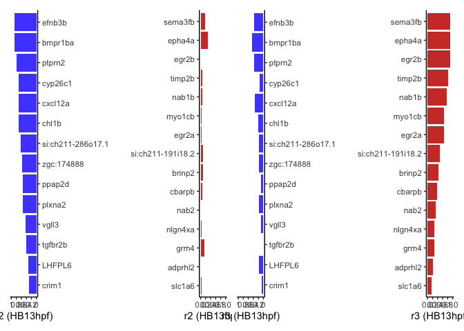
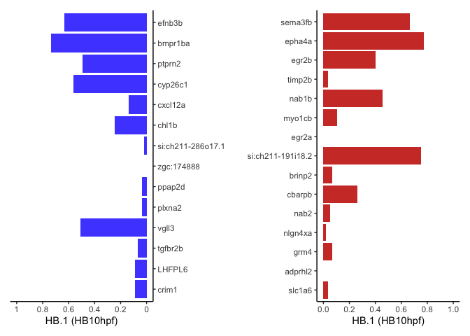
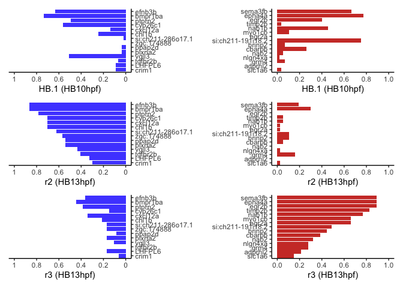

Figure 6 r2 and r3 genes barplots R Notebook
================
Rebecca O’Rourke

# 1 Libraries

``` r
suppressPackageStartupMessages({
  library(Seurat)
  library(org.Dr.eg.db)
  library(BSgenome.Drerio.UCSC.danRer11)
  library(Signac)
  library(knitr)
  library(kableExtra)
  library(dplyr)
  library(ggplot2)
  library(ggsci)
  library(limma)
  library(JASPAR2020)
  library(patchwork)
  library(TFBSTools)
  library(motifmatchr)
  library(AnnotationHub)
  library(harmony)
})
```

    ## Warning: package 'AnnotationDbi' was built under R version 4.1.1

    ## Warning: package 'BiocGenerics' was built under R version 4.1.1

    ## Warning: package 'Biobase' was built under R version 4.1.1

    ## Warning: package 'IRanges' was built under R version 4.1.1

    ## Warning: package 'S4Vectors' was built under R version 4.1.3

    ## Warning: package 'BSgenome' was built under R version 4.1.1

    ## Warning: package 'GenomeInfoDb' was built under R version 4.1.1

    ## Warning: package 'GenomicRanges' was built under R version 4.1.1

    ## Warning: package 'Biostrings' was built under R version 4.1.1

    ## Warning: package 'XVector' was built under R version 4.1.1

    ## Warning: package 'rtracklayer' was built under R version 4.1.1

    ## Warning: package 'ggplot2' was built under R version 4.1.2

    ## Warning: package 'limma' was built under R version 4.1.3

    ## Warning: package 'patchwork' was built under R version 4.1.2

    ## Warning: package 'TFBSTools' was built under R version 4.1.1

    ## Warning: package 'motifmatchr' was built under R version 4.1.1

    ## Warning: package 'AnnotationHub' was built under R version 4.1.1

    ## Warning: package 'BiocFileCache' was built under R version 4.1.1

``` r
options(future.globals.maxSize = 4000 * 1024^2)
```

``` r
mypal <- pal_igv(palette = "default",alpha = 1)(35)
```

# Read data

Subsetting the integrated seurat object to obtain HB13hpf r2 or r3 cells
fails. This could likely be fixed with update of Seurat but that would
affect UMAP so instead will use individual HB13hpf and HB10hpf Seurat
Objects for r2, r3 and HB.1 cells.

``` r
HB10hpf <- readRDS(file = "RDSfiles/HB10hpf_neural.RDS")
HB13hpf <- readRDS(file = "RDSfiles/HB13hpf_neural.RDS")
```

# Bar plots cell counts expressing genes

``` r
r2_genes <- c("ptprn2","efnb3b","chl1b","si:ch211-286o17.1","cyp26c1","vgll3","plxna2","ppap2d","zgc:174888","tgfbr2b","crim1",
              "bmpr1ba","cxcl12a","LHFPL6")
r3_genes <- c("epha4a","sema3fb","egr2b","brinp2","nab2","egr2a","timp2b","myo1cb","nab1b","si:ch211-191i18.2",
              "cbarpb","nlgn4xa","grm4","adprhl2","slc1a6")
```

``` r
Idents(HB13hpf) <- "Clusters"
HB13.r2.r2cells <- subset(HB13hpf, idents = "r2", features = r2_genes)
df.HB13.r2.r2 <- as.data.frame(t(GetAssayData(HB13.r2.r2cells, slot = "data", assay = "SCT")))
df.HB13.r2.r2
```

    ##                       ptprn2    efnb3b     chl1b si:ch211-286o17.1   cyp26c1
    ## AAACGCGCAATTAACC-1 1.7917595 0.6931472 1.0986123         0.6931472 1.0986123
    ## AAATGGCCACGGTTTA-1 0.6931472 1.9459101 0.6931472         1.9459101 1.3862944
    ## AACATAGCATGTTGTG-1 0.0000000 0.0000000 1.0986123         0.0000000 1.3862944
    ## AACTGTTCAGGGAGCT-1 1.3862944 1.0986123 0.0000000         0.6931472 2.3025851
    ## ACCACATAGCTAATTG-1 1.3862944 0.6931472 1.6094379         1.3862944 1.7917595
    ## AGGAAACGTGGACATC-1 0.6931472 2.7080502 1.3862944         0.6931472 1.3862944
    ## AGGTTTGGTTAGGATT-1 0.6931472 1.7917595 0.6931472         0.6931472 0.0000000
    ## AGTAACGAGAACAAGT-1 1.3862944 0.0000000 0.0000000         0.0000000 0.0000000
    ## AGTTATGTCGAAGCGG-1 0.0000000 1.0986123 0.6931472         0.0000000 1.3862944
    ## ATGAATGCATGGTTAT-1 0.0000000 2.4849066 0.0000000         0.0000000 0.6931472
    ## CCTATAGCACTGACTA-1 1.0986123 1.6094379 0.0000000         0.6931472 0.6931472
    ## CCTTACTCATATAACC-1 1.3862944 0.0000000 1.0986123         0.6931472 1.9459101
    ## CGTCAATAGGGTCTAT-1 1.0986123 1.0986123 0.0000000         1.0986123 1.3862944
    ## CTTTGGGAGTCACCAG-1 1.3862944 1.7917595 0.6931472         0.6931472 0.0000000
    ## GCACCTAAGAAAGCAT-1 1.3862944 1.6094379 1.3862944         1.6094379 0.6931472
    ## GCACTTACAGGCAAGC-1 0.0000000 1.6094379 0.0000000         0.6931472 0.0000000
    ## GCAGGCAAGCCACATG-1 1.0986123 0.6931472 0.0000000         1.9459101 1.0986123
    ## GCAGGTTGTCATAGAT-1 1.0986123 2.8903718 1.0986123         1.0986123 0.6931472
    ## GCCTGACAGCATGGTT-1 1.3862944 1.7917595 1.3862944         0.0000000 0.6931472
    ## GCCTTGCGTATTTGCC-1 1.0986123 1.9459101 0.0000000         1.0986123 0.6931472
    ## GGATGGCCAGCACGAA-1 0.0000000 1.3862944 0.0000000         0.0000000 0.6931472
    ## GGTACTTAGGCCTGGT-1 1.0986123 1.7917595 0.6931472         0.6931472 1.3862944
    ## GGTTATATCCTTGCAC-1 1.0986123 1.3862944 1.3862944         0.0000000 0.0000000
    ## GGTTGCATCTTGCAAA-1 1.7917595 1.0986123 0.6931472         0.6931472 1.7917595
    ## GTAATAGCACGAATTT-1 0.0000000 0.6931472 0.6931472         0.0000000 1.0986123
    ## GTATTGTCAGGCATGA-1 1.7917595 0.0000000 1.0986123         0.0000000 0.0000000
    ## GTTTCCTCACGAATCC-1 1.3862944 2.1972246 1.3862944         0.0000000 0.0000000
    ## TCACTGACAATCCCTT-1 0.6931472 1.6094379 0.0000000         0.6931472 1.3862944
    ## TCGCATTGTCATGAGC-1 1.0986123 2.0794415 1.0986123         0.6931472 0.6931472
    ## TCTAATCTCTGTTGCC-1 1.6094379 1.3862944 1.6094379         0.0000000 0.6931472
    ## TGCTGGATCGGGCCAT-1 0.6931472 1.0986123 1.0986123         0.6931472 1.7917595
    ## TGGTTGAGTCAAGTGC-1 1.0986123 1.0986123 1.0986123         1.0986123 1.0986123
    ## TTAGAAGCAAAGCCTC-1 1.3862944 0.0000000 0.6931472         1.0986123 0.0000000
    ## TTAGAAGCAAGGTACG-1 1.3862944 1.7917595 0.6931472         0.0000000 0.0000000
    ## TTGCGTCTCAAAGGCA-1 0.0000000 1.9459101 1.0986123         1.3862944 0.0000000
    ## TTTCCTGAGTTTGCGG-1 2.0794415 0.6931472 0.0000000         0.0000000 0.0000000
    ## TTTGTCTAGAATCGCT-1 0.0000000 2.6390573 0.6931472         0.0000000 1.3862944
    ##                        vgll3    plxna2    ppap2d zgc:174888   tgfbr2b     crim1
    ## AAACGCGCAATTAACC-1 0.0000000 1.0986123 1.0986123  0.0000000 0.0000000 0.0000000
    ## AAATGGCCACGGTTTA-1 0.0000000 0.6931472 1.6094379  1.3862944 1.0986123 0.0000000
    ## AACATAGCATGTTGTG-1 1.0986123 0.0000000 0.0000000  1.0986123 0.0000000 0.0000000
    ## AACTGTTCAGGGAGCT-1 0.6931472 0.0000000 0.0000000  0.6931472 1.0986123 0.6931472
    ## ACCACATAGCTAATTG-1 1.9459101 0.0000000 0.6931472  0.0000000 0.0000000 2.3025851
    ## AGGAAACGTGGACATC-1 0.0000000 0.0000000 0.0000000  0.0000000 0.0000000 0.0000000
    ## AGGTTTGGTTAGGATT-1 0.0000000 0.6931472 1.6094379  0.6931472 0.6931472 0.0000000
    ## AGTAACGAGAACAAGT-1 0.0000000 0.6931472 0.6931472  0.0000000 0.0000000 0.0000000
    ## AGTTATGTCGAAGCGG-1 0.0000000 1.3862944 0.0000000  0.6931472 0.0000000 1.6094379
    ## ATGAATGCATGGTTAT-1 0.0000000 0.6931472 0.0000000  0.6931472 0.6931472 0.0000000
    ## CCTATAGCACTGACTA-1 0.6931472 0.6931472 0.6931472  1.0986123 0.6931472 0.0000000
    ## CCTTACTCATATAACC-1 0.0000000 0.0000000 0.0000000  0.6931472 2.3978953 2.0794415
    ## CGTCAATAGGGTCTAT-1 0.0000000 0.0000000 0.0000000  0.6931472 0.0000000 0.0000000
    ## CTTTGGGAGTCACCAG-1 1.0986123 0.0000000 0.0000000  0.0000000 0.6931472 0.0000000
    ## GCACCTAAGAAAGCAT-1 0.6931472 0.6931472 0.6931472  0.0000000 0.0000000 1.6094379
    ## GCACTTACAGGCAAGC-1 1.7917595 0.6931472 0.0000000  0.0000000 0.6931472 0.0000000
    ## GCAGGCAAGCCACATG-1 0.0000000 1.0986123 0.0000000  0.6931472 0.0000000 0.0000000
    ## GCAGGTTGTCATAGAT-1 1.3862944 0.0000000 0.6931472  0.6931472 0.0000000 0.0000000
    ## GCCTGACAGCATGGTT-1 1.0986123 1.0986123 1.6094379  1.0986123 0.0000000 1.0986123
    ## GCCTTGCGTATTTGCC-1 1.3862944 0.0000000 1.3862944  1.0986123 0.0000000 0.0000000
    ## GGATGGCCAGCACGAA-1 1.0986123 1.3862944 1.0986123  0.6931472 0.6931472 0.0000000
    ## GGTACTTAGGCCTGGT-1 0.6931472 0.6931472 0.0000000  1.0986123 0.0000000 0.0000000
    ## GGTTATATCCTTGCAC-1 0.0000000 0.0000000 0.0000000  0.0000000 0.6931472 0.0000000
    ## GGTTGCATCTTGCAAA-1 0.0000000 1.0986123 0.0000000  0.0000000 0.0000000 1.0986123
    ## GTAATAGCACGAATTT-1 0.0000000 0.0000000 0.6931472  1.0986123 0.0000000 0.6931472
    ## GTATTGTCAGGCATGA-1 0.0000000 0.0000000 0.6931472  0.0000000 0.0000000 0.0000000
    ## GTTTCCTCACGAATCC-1 0.0000000 0.6931472 1.3862944  0.0000000 0.0000000 1.0986123
    ## TCACTGACAATCCCTT-1 0.6931472 0.0000000 2.0794415  1.0986123 0.6931472 0.0000000
    ## TCGCATTGTCATGAGC-1 1.3862944 1.6094379 0.0000000  1.3862944 0.0000000 0.0000000
    ## TCTAATCTCTGTTGCC-1 1.0986123 0.0000000 0.6931472  0.6931472 1.6094379 2.5649494
    ## TGCTGGATCGGGCCAT-1 0.6931472 1.0986123 0.0000000  0.0000000 0.0000000 0.0000000
    ## TGGTTGAGTCAAGTGC-1 0.0000000 0.0000000 0.0000000  0.0000000 0.0000000 0.0000000
    ## TTAGAAGCAAAGCCTC-1 0.0000000 0.6931472 1.0986123  1.6094379 0.6931472 0.0000000
    ## TTAGAAGCAAGGTACG-1 0.0000000 0.0000000 0.6931472  1.3862944 0.0000000 0.0000000
    ## TTGCGTCTCAAAGGCA-1 0.0000000 1.0986123 1.3862944  0.0000000 1.0986123 0.6931472
    ## TTTCCTGAGTTTGCGG-1 0.0000000 0.0000000 0.0000000  0.0000000 0.0000000 0.0000000
    ## TTTGTCTAGAATCGCT-1 0.0000000 0.6931472 1.0986123  0.0000000 2.1972246 0.0000000
    ##                      bmpr1ba   cxcl12a    LHFPL6
    ## AAACGCGCAATTAACC-1 1.0986123 0.6931472 0.0000000
    ## AAATGGCCACGGTTTA-1 0.6931472 2.0794415 0.6931472
    ## AACATAGCATGTTGTG-1 0.6931472 0.6931472 0.0000000
    ## AACTGTTCAGGGAGCT-1 1.0986123 0.6931472 0.0000000
    ## ACCACATAGCTAATTG-1 0.6931472 0.6931472 0.6931472
    ## AGGAAACGTGGACATC-1 0.0000000 1.9459101 1.9459101
    ## AGGTTTGGTTAGGATT-1 1.3862944 0.0000000 0.0000000
    ## AGTAACGAGAACAAGT-1 0.6931472 1.3862944 0.0000000
    ## AGTTATGTCGAAGCGG-1 1.9459101 1.3862944 0.0000000
    ## ATGAATGCATGGTTAT-1 1.6094379 0.0000000 0.6931472
    ## CCTATAGCACTGACTA-1 1.6094379 1.7917595 0.6931472
    ## CCTTACTCATATAACC-1 1.6094379 0.0000000 0.0000000
    ## CGTCAATAGGGTCTAT-1 1.0986123 0.0000000 0.0000000
    ## CTTTGGGAGTCACCAG-1 1.6094379 0.0000000 0.0000000
    ## GCACCTAAGAAAGCAT-1 1.0986123 0.0000000 0.0000000
    ## GCACTTACAGGCAAGC-1 0.6931472 0.6931472 0.0000000
    ## GCAGGCAAGCCACATG-1 1.0986123 0.6931472 0.0000000
    ## GCAGGTTGTCATAGAT-1 1.0986123 1.7917595 1.3862944
    ## GCCTGACAGCATGGTT-1 1.0986123 1.9459101 0.6931472
    ## GCCTTGCGTATTTGCC-1 1.7917595 0.6931472 0.0000000
    ## GGATGGCCAGCACGAA-1 1.3862944 1.0986123 0.0000000
    ## GGTACTTAGGCCTGGT-1 0.6931472 1.7917595 0.0000000
    ## GGTTATATCCTTGCAC-1 1.3862944 1.3862944 0.0000000
    ## GGTTGCATCTTGCAAA-1 1.0986123 1.7917595 1.7917595
    ## GTAATAGCACGAATTT-1 1.0986123 0.6931472 0.0000000
    ## GTATTGTCAGGCATGA-1 0.6931472 0.6931472 0.0000000
    ## GTTTCCTCACGAATCC-1 0.0000000 0.0000000 1.0986123
    ## TCACTGACAATCCCTT-1 1.0986123 1.0986123 1.0986123
    ## TCGCATTGTCATGAGC-1 1.0986123 1.3862944 1.3862944
    ## TCTAATCTCTGTTGCC-1 1.3862944 0.0000000 0.0000000
    ## TGCTGGATCGGGCCAT-1 1.7917595 0.0000000 0.0000000
    ## TGGTTGAGTCAAGTGC-1 0.0000000 1.6094379 0.0000000
    ## TTAGAAGCAAAGCCTC-1 0.0000000 1.0986123 0.0000000
    ## TTAGAAGCAAGGTACG-1 1.0986123 0.0000000 0.0000000
    ## TTGCGTCTCAAAGGCA-1 0.0000000 0.6931472 1.0986123
    ## TTTCCTGAGTTTGCGG-1 1.0986123 0.0000000 0.0000000
    ## TTTGTCTAGAATCGCT-1 1.3862944 1.3862944 0.0000000

``` r
HB13.r2.r3cells <- subset(HB13hpf, idents = "r2", features = r3_genes)
df.HB13.r2.r3 <- as.data.frame(t(GetAssayData(HB13.r2.r3cells, slot = "data", assay = "SCT")))
df.HB13.r2.r3
```

    ##                       epha4a   sema3fb egr2b    brinp2 nab2     egr2a    timp2b
    ## AAACGCGCAATTAACC-1 0.0000000 0.0000000     0 0.0000000    0 0.0000000 0.0000000
    ## AAATGGCCACGGTTTA-1 0.6931472 0.0000000     0 0.0000000    0 0.0000000 0.0000000
    ## AACATAGCATGTTGTG-1 0.0000000 0.6931472     0 0.0000000    0 0.0000000 0.0000000
    ## AACTGTTCAGGGAGCT-1 0.0000000 0.0000000     0 0.0000000    0 0.0000000 0.0000000
    ## ACCACATAGCTAATTG-1 0.0000000 0.0000000     0 0.0000000    0 0.0000000 0.0000000
    ## AGGAAACGTGGACATC-1 1.3862944 0.0000000     0 0.0000000    0 0.0000000 0.0000000
    ## AGGTTTGGTTAGGATT-1 0.0000000 0.0000000     0 0.0000000    0 0.0000000 0.0000000
    ## AGTAACGAGAACAAGT-1 1.3862944 0.0000000     0 0.0000000    0 0.0000000 0.0000000
    ## AGTTATGTCGAAGCGG-1 0.0000000 0.6931472     0 0.0000000    0 0.0000000 0.0000000
    ## ATGAATGCATGGTTAT-1 0.0000000 0.0000000     0 0.0000000    0 0.0000000 0.0000000
    ## CCTATAGCACTGACTA-1 0.0000000 0.0000000     0 0.0000000    0 0.0000000 0.0000000
    ## CCTTACTCATATAACC-1 0.0000000 0.0000000     0 0.6931472    0 0.0000000 0.0000000
    ## CGTCAATAGGGTCTAT-1 0.0000000 0.0000000     0 0.0000000    0 0.0000000 0.0000000
    ## CTTTGGGAGTCACCAG-1 0.6931472 0.0000000     0 0.0000000    0 0.0000000 0.0000000
    ## GCACCTAAGAAAGCAT-1 0.0000000 0.0000000     0 1.0986123    0 0.0000000 0.0000000
    ## GCACTTACAGGCAAGC-1 1.3862944 0.0000000     0 0.0000000    0 0.0000000 0.0000000
    ## GCAGGCAAGCCACATG-1 0.0000000 0.0000000     0 0.6931472    0 0.0000000 0.0000000
    ## GCAGGTTGTCATAGAT-1 0.0000000 0.0000000     0 0.0000000    0 0.0000000 0.6931472
    ## GCCTGACAGCATGGTT-1 0.0000000 0.0000000     0 0.0000000    0 0.0000000 0.0000000
    ## GCCTTGCGTATTTGCC-1 0.0000000 0.6931472     0 0.0000000    0 0.0000000 0.0000000
    ## GGATGGCCAGCACGAA-1 0.0000000 0.0000000     0 0.0000000    0 0.6931472 0.0000000
    ## GGTACTTAGGCCTGGT-1 1.0986123 0.0000000     0 0.0000000    0 0.0000000 0.0000000
    ## GGTTATATCCTTGCAC-1 0.0000000 0.6931472     0 0.0000000    0 0.0000000 0.0000000
    ## GGTTGCATCTTGCAAA-1 0.6931472 0.6931472     0 0.0000000    0 0.0000000 0.0000000
    ## GTAATAGCACGAATTT-1 0.0000000 0.0000000     0 0.0000000    0 0.0000000 0.0000000
    ## GTATTGTCAGGCATGA-1 0.0000000 0.0000000     0 0.0000000    0 0.0000000 0.0000000
    ## GTTTCCTCACGAATCC-1 0.0000000 0.6931472     0 0.0000000    0 0.0000000 0.0000000
    ## TCACTGACAATCCCTT-1 1.0986123 0.0000000     0 0.0000000    0 0.0000000 0.0000000
    ## TCGCATTGTCATGAGC-1 1.0986123 0.0000000     0 0.0000000    0 0.0000000 0.0000000
    ## TCTAATCTCTGTTGCC-1 0.0000000 0.0000000     0 0.0000000    0 0.0000000 0.0000000
    ## TGCTGGATCGGGCCAT-1 0.0000000 0.0000000     0 1.0986123    0 0.0000000 0.0000000
    ## TGGTTGAGTCAAGTGC-1 0.0000000 0.0000000     0 0.0000000    0 0.0000000 0.0000000
    ## TTAGAAGCAAAGCCTC-1 1.3862944 0.0000000     0 0.0000000    0 0.0000000 0.0000000
    ## TTAGAAGCAAGGTACG-1 0.0000000 1.0986123     0 0.0000000    0 0.0000000 0.0000000
    ## TTGCGTCTCAAAGGCA-1 0.0000000 0.0000000     0 0.0000000    0 0.0000000 0.6931472
    ## TTTCCTGAGTTTGCGG-1 1.0986123 0.0000000     0 0.0000000    0 0.0000000 0.0000000
    ## TTTGTCTAGAATCGCT-1 0.0000000 0.0000000     0 0.0000000    0 0.0000000 0.0000000
    ##                       myo1cb     nab1b si:ch211-191i18.2    cbarpb   nlgn4xa
    ## AAACGCGCAATTAACC-1 0.0000000 0.0000000         0.0000000 0.0000000 0.0000000
    ## AAATGGCCACGGTTTA-1 0.0000000 0.0000000         1.0986123 0.0000000 0.0000000
    ## AACATAGCATGTTGTG-1 0.0000000 0.0000000         0.0000000 0.0000000 0.0000000
    ## AACTGTTCAGGGAGCT-1 0.0000000 0.0000000         0.0000000 0.0000000 0.0000000
    ## ACCACATAGCTAATTG-1 0.0000000 0.0000000         0.0000000 0.6931472 0.0000000
    ## AGGAAACGTGGACATC-1 0.0000000 0.0000000         0.0000000 0.0000000 0.0000000
    ## AGGTTTGGTTAGGATT-1 0.0000000 0.0000000         0.0000000 0.0000000 0.0000000
    ## AGTAACGAGAACAAGT-1 0.0000000 0.6931472         0.0000000 0.0000000 0.0000000
    ## AGTTATGTCGAAGCGG-1 0.0000000 0.0000000         0.0000000 0.0000000 0.0000000
    ## ATGAATGCATGGTTAT-1 0.0000000 0.0000000         0.0000000 0.0000000 0.0000000
    ## CCTATAGCACTGACTA-1 0.0000000 0.0000000         0.0000000 0.0000000 0.0000000
    ## CCTTACTCATATAACC-1 0.0000000 0.0000000         0.0000000 0.0000000 0.0000000
    ## CGTCAATAGGGTCTAT-1 0.0000000 0.0000000         0.0000000 0.0000000 0.0000000
    ## CTTTGGGAGTCACCAG-1 0.0000000 0.0000000         0.0000000 0.0000000 0.0000000
    ## GCACCTAAGAAAGCAT-1 0.0000000 0.0000000         0.0000000 0.0000000 0.0000000
    ## GCACTTACAGGCAAGC-1 0.0000000 0.0000000         0.6931472 0.0000000 0.0000000
    ## GCAGGCAAGCCACATG-1 0.0000000 0.0000000         0.0000000 0.0000000 0.0000000
    ## GCAGGTTGTCATAGAT-1 0.0000000 0.0000000         0.0000000 0.0000000 0.0000000
    ## GCCTGACAGCATGGTT-1 0.0000000 0.0000000         0.6931472 0.0000000 0.0000000
    ## GCCTTGCGTATTTGCC-1 0.0000000 0.0000000         0.0000000 0.0000000 0.0000000
    ## GGATGGCCAGCACGAA-1 0.0000000 0.0000000         0.0000000 0.0000000 0.0000000
    ## GGTACTTAGGCCTGGT-1 0.0000000 0.0000000         0.0000000 0.6931472 0.0000000
    ## GGTTATATCCTTGCAC-1 0.0000000 0.0000000         0.0000000 0.0000000 0.0000000
    ## GGTTGCATCTTGCAAA-1 0.0000000 0.0000000         0.0000000 0.0000000 0.0000000
    ## GTAATAGCACGAATTT-1 0.0000000 0.0000000         0.0000000 0.0000000 0.0000000
    ## GTATTGTCAGGCATGA-1 0.0000000 0.0000000         0.0000000 0.0000000 0.0000000
    ## GTTTCCTCACGAATCC-1 0.0000000 1.0986123         0.0000000 0.0000000 0.0000000
    ## TCACTGACAATCCCTT-1 0.0000000 0.0000000         0.0000000 0.0000000 0.0000000
    ## TCGCATTGTCATGAGC-1 0.0000000 0.0000000         0.6931472 0.0000000 0.6931472
    ## TCTAATCTCTGTTGCC-1 0.6931472 0.0000000         0.0000000 0.0000000 0.0000000
    ## TGCTGGATCGGGCCAT-1 0.0000000 0.0000000         0.0000000 0.0000000 0.0000000
    ## TGGTTGAGTCAAGTGC-1 0.0000000 0.0000000         0.0000000 0.0000000 0.0000000
    ## TTAGAAGCAAAGCCTC-1 0.0000000 0.0000000         0.0000000 0.0000000 0.0000000
    ## TTAGAAGCAAGGTACG-1 0.0000000 0.0000000         0.0000000 0.0000000 0.0000000
    ## TTGCGTCTCAAAGGCA-1 0.0000000 0.0000000         0.0000000 0.0000000 0.0000000
    ## TTTCCTGAGTTTGCGG-1 0.0000000 0.0000000         0.0000000 0.0000000 0.0000000
    ## TTTGTCTAGAATCGCT-1 0.0000000 0.0000000         0.0000000 0.0000000 0.0000000
    ##                         grm4 adprhl2    slc1a6
    ## AAACGCGCAATTAACC-1 0.0000000       0 0.0000000
    ## AAATGGCCACGGTTTA-1 0.0000000       0 0.0000000
    ## AACATAGCATGTTGTG-1 0.0000000       0 0.0000000
    ## AACTGTTCAGGGAGCT-1 0.6931472       0 0.0000000
    ## ACCACATAGCTAATTG-1 0.6931472       0 0.0000000
    ## AGGAAACGTGGACATC-1 0.0000000       0 0.0000000
    ## AGGTTTGGTTAGGATT-1 0.0000000       0 0.0000000
    ## AGTAACGAGAACAAGT-1 0.0000000       0 0.0000000
    ## AGTTATGTCGAAGCGG-1 0.0000000       0 0.0000000
    ## ATGAATGCATGGTTAT-1 0.0000000       0 0.0000000
    ## CCTATAGCACTGACTA-1 0.0000000       0 0.0000000
    ## CCTTACTCATATAACC-1 0.0000000       0 0.0000000
    ## CGTCAATAGGGTCTAT-1 0.0000000       0 0.0000000
    ## CTTTGGGAGTCACCAG-1 0.0000000       0 0.0000000
    ## GCACCTAAGAAAGCAT-1 0.0000000       0 0.0000000
    ## GCACTTACAGGCAAGC-1 0.0000000       0 0.0000000
    ## GCAGGCAAGCCACATG-1 0.6931472       0 0.0000000
    ## GCAGGTTGTCATAGAT-1 0.0000000       0 0.0000000
    ## GCCTGACAGCATGGTT-1 0.0000000       0 0.0000000
    ## GCCTTGCGTATTTGCC-1 0.0000000       0 0.0000000
    ## GGATGGCCAGCACGAA-1 0.6931472       0 0.0000000
    ## GGTACTTAGGCCTGGT-1 0.0000000       0 0.0000000
    ## GGTTATATCCTTGCAC-1 0.0000000       0 0.0000000
    ## GGTTGCATCTTGCAAA-1 0.0000000       0 0.0000000
    ## GTAATAGCACGAATTT-1 0.0000000       0 0.0000000
    ## GTATTGTCAGGCATGA-1 0.0000000       0 0.0000000
    ## GTTTCCTCACGAATCC-1 0.6931472       0 0.0000000
    ## TCACTGACAATCCCTT-1 0.0000000       0 0.0000000
    ## TCGCATTGTCATGAGC-1 0.0000000       0 0.6931472
    ## TCTAATCTCTGTTGCC-1 0.0000000       0 0.0000000
    ## TGCTGGATCGGGCCAT-1 0.0000000       0 0.0000000
    ## TGGTTGAGTCAAGTGC-1 0.0000000       0 0.0000000
    ## TTAGAAGCAAAGCCTC-1 0.0000000       0 0.0000000
    ## TTAGAAGCAAGGTACG-1 0.0000000       0 0.0000000
    ## TTGCGTCTCAAAGGCA-1 0.6931472       0 0.0000000
    ## TTTCCTGAGTTTGCGG-1 0.0000000       0 0.0000000
    ## TTTGTCTAGAATCGCT-1 0.0000000       0 0.0000000

``` r
HB13.r3.r2cells <- subset(HB13hpf, idents = "r3", features = r2_genes)
df.HB13.r3.r2 <- as.data.frame(t(GetAssayData(HB13.r3.r2cells, slot = "data", assay = "SCT")))
df.HB13.r3.r2
```

    ##                       ptprn2    efnb3b     chl1b si:ch211-286o17.1   cyp26c1
    ## AATACCGGTGAGGTGA-1 1.0986123 1.0986123 0.0000000         0.0000000 0.0000000
    ## AATGTCCAGGTCGAGG-1 0.6931472 0.0000000 0.0000000         0.0000000 0.0000000
    ## ACCATAATCTAACTGA-1 1.0986123 0.0000000 0.0000000         0.6931472 0.0000000
    ## AGAATCGAGCTCCCTG-1 0.0000000 0.6931472 0.0000000         0.0000000 0.0000000
    ## AGCACAGCACGAATCC-1 0.0000000 0.0000000 0.0000000         0.0000000 0.0000000
    ## AGTTGGCGTTTCGCCA-1 1.0986123 0.0000000 0.0000000         0.6931472 0.0000000
    ## ATGTCCACAGTTTGGC-1 0.0000000 0.0000000 0.0000000         1.0986123 0.0000000
    ## ATTCCTAGTTTGTTGC-1 1.3862944 0.6931472 0.0000000         0.0000000 0.6931472
    ## ATTGCACAGTGAGGGT-1 0.0000000 0.6931472 0.0000000         0.0000000 0.0000000
    ## CCCAAATAGCTAATCA-1 1.7917595 0.6931472 0.6931472         0.0000000 0.0000000
    ## CCGCAAATCACATTGA-1 0.0000000 0.0000000 0.0000000         0.0000000 0.0000000
    ## CCTACTTCACAACAAA-1 0.0000000 1.0986123 0.0000000         1.3862944 0.0000000
    ## CCTGTATGTGGAGCAA-1 0.0000000 0.0000000 0.0000000         0.0000000 0.0000000
    ## CCTTGTTCAAATGCCC-1 0.0000000 0.6931472 0.0000000         0.0000000 0.0000000
    ## CTATTCAGTTACAACG-1 0.0000000 0.6931472 0.0000000         0.0000000 0.0000000
    ## CTTTAGTTCGTTTCTG-1 0.0000000 0.0000000 0.0000000         0.0000000 0.0000000
    ## CTTTCTTGTCACGAAC-1 1.0986123 0.0000000 0.6931472         0.0000000 0.0000000
    ## GACTATTCAGAAACGT-1 0.0000000 1.3862944 0.0000000         1.3862944 0.0000000
    ## GAGGTACAGGTCGATT-1 0.0000000 0.0000000 0.0000000         0.0000000 0.0000000
    ## GATTCGCCACTGGCCA-1 0.0000000 0.0000000 0.0000000         0.0000000 0.0000000
    ## GCAAGTCGTGATCATG-1 0.0000000 0.0000000 1.0986123         0.0000000 0.0000000
    ## GCTATAGGTGATGGCT-1 0.6931472 0.6931472 0.0000000         0.0000000 0.0000000
    ## GGATGAATCTTGCAGG-1 0.6931472 0.0000000 0.6931472         0.0000000 0.0000000
    ## GGCCATCAGCACAGCC-1 0.0000000 1.6094379 0.0000000         0.0000000 0.0000000
    ## GGCTGGTTCTGGCAAT-1 0.0000000 0.0000000 0.6931472         0.0000000 0.0000000
    ## GGTTATATCTTTGACT-1 0.0000000 1.0986123 1.0986123         0.0000000 0.0000000
    ## GGTTATGGTGGGTACT-1 0.0000000 0.6931472 0.0000000         0.0000000 0.0000000
    ## GTATTGTCACTAAATC-1 0.0000000 0.0000000 0.0000000         0.0000000 0.0000000
    ## GTGAACAAGGTTTGAC-1 0.6931472 0.0000000 0.0000000         0.0000000 0.6931472
    ## GTTCTTGTCAGGCTAT-1 0.6931472 0.6931472 0.0000000         0.0000000 0.0000000
    ## GTTGTGAGTTAAGCTG-1 1.3862944 0.0000000 0.0000000         1.3862944 0.6931472
    ## TACTTCGTCATTGCAA-1 1.7917595 0.0000000 1.0986123         1.0986123 0.0000000
    ## TACTTCGTCCTAGTCC-1 1.3862944 0.0000000 0.0000000         0.0000000 0.0000000
    ## TATGACATCCGCATGA-1 1.0986123 0.0000000 1.0986123         1.7917595 0.6931472
    ## TATGACATCTTGCTAT-1 0.0000000 0.0000000 0.0000000         0.0000000 1.0986123
    ## TATTAGGTCTCGACCT-1 0.0000000 0.0000000 0.0000000         0.0000000 0.0000000
    ## TCAAGGTTCGCAAACT-1 1.0986123 0.0000000 0.0000000         0.0000000 0.0000000
    ## TCCATCATCTTTGTAC-1 0.0000000 0.0000000 0.0000000         0.0000000 0.0000000
    ## TCCTAGTGTGAGAAAC-1 0.0000000 0.0000000 0.0000000         0.0000000 0.0000000
    ## TCCTTTACAATTTGGT-1 0.6931472 0.6931472 0.0000000         0.0000000 1.0986123
    ## TCGGTTTGTATTGAGT-1 0.0000000 0.0000000 0.0000000         0.0000000 0.0000000
    ## TGAGGGAGTGTCACGG-1 0.0000000 0.0000000 0.0000000         0.0000000 1.0986123
    ## TGGATTCAGTTGTCAA-1 0.0000000 0.0000000 0.0000000         0.0000000 0.0000000
    ## TGTAAGTGTTCCAGGG-1 0.0000000 1.0986123 1.0986123         0.0000000 0.0000000
    ## TTCACTGTCAAATCGC-1 0.0000000 0.0000000 0.6931472         0.0000000 0.0000000
    ## TTGGCTGAGGACGTAA-1 0.0000000 0.0000000 0.0000000         0.0000000 0.0000000
    ## TTTCTTGCATCCGTAA-1 0.6931472 1.9459101 0.0000000         0.0000000 0.0000000
    ##                        vgll3    plxna2    ppap2d zgc:174888 tgfbr2b     crim1
    ## AATACCGGTGAGGTGA-1 0.0000000 0.0000000 0.0000000  0.6931472       0 0.0000000
    ## AATGTCCAGGTCGAGG-1 0.0000000 0.0000000 1.7917595  0.6931472       0 0.0000000
    ## ACCATAATCTAACTGA-1 0.0000000 0.0000000 0.6931472  0.0000000       0 0.0000000
    ## AGAATCGAGCTCCCTG-1 0.0000000 0.0000000 0.0000000  0.0000000       0 0.0000000
    ## AGCACAGCACGAATCC-1 0.0000000 0.0000000 0.0000000  0.0000000       0 0.0000000
    ## AGTTGGCGTTTCGCCA-1 0.0000000 0.0000000 0.0000000  0.0000000       0 0.0000000
    ## ATGTCCACAGTTTGGC-1 0.0000000 0.6931472 0.0000000  0.0000000       0 0.0000000
    ## ATTCCTAGTTTGTTGC-1 0.0000000 0.6931472 0.0000000  1.6094379       0 0.0000000
    ## ATTGCACAGTGAGGGT-1 0.0000000 0.0000000 0.0000000  0.0000000       0 0.0000000
    ## CCCAAATAGCTAATCA-1 0.0000000 0.0000000 0.0000000  0.6931472       0 0.0000000
    ## CCGCAAATCACATTGA-1 0.0000000 0.6931472 0.0000000  0.0000000       0 0.0000000
    ## CCTACTTCACAACAAA-1 0.6931472 0.0000000 0.0000000  0.0000000       0 0.0000000
    ## CCTGTATGTGGAGCAA-1 0.0000000 0.0000000 0.0000000  0.0000000       0 0.0000000
    ## CCTTGTTCAAATGCCC-1 0.0000000 0.0000000 0.0000000  0.0000000       0 0.0000000
    ## CTATTCAGTTACAACG-1 0.0000000 0.0000000 0.0000000  0.0000000       0 0.0000000
    ## CTTTAGTTCGTTTCTG-1 0.0000000 0.0000000 0.0000000  0.6931472       0 0.6931472
    ## CTTTCTTGTCACGAAC-1 0.0000000 0.0000000 0.0000000  0.0000000       0 0.0000000
    ## GACTATTCAGAAACGT-1 0.0000000 0.0000000 0.0000000  0.0000000       0 0.0000000
    ## GAGGTACAGGTCGATT-1 0.0000000 0.0000000 0.0000000  0.0000000       0 0.0000000
    ## GATTCGCCACTGGCCA-1 0.0000000 0.6931472 0.0000000  0.0000000       0 0.6931472
    ## GCAAGTCGTGATCATG-1 0.0000000 0.0000000 0.0000000  0.0000000       0 0.0000000
    ## GCTATAGGTGATGGCT-1 0.0000000 0.0000000 0.0000000  0.0000000       0 0.0000000
    ## GGATGAATCTTGCAGG-1 0.0000000 0.0000000 0.0000000  0.6931472       0 0.0000000
    ## GGCCATCAGCACAGCC-1 0.0000000 0.0000000 0.6931472  0.0000000       0 0.0000000
    ## GGCTGGTTCTGGCAAT-1 0.0000000 0.0000000 0.0000000  0.6931472       0 0.0000000
    ## GGTTATATCTTTGACT-1 0.6931472 0.0000000 0.0000000  0.0000000       0 0.0000000
    ## GGTTATGGTGGGTACT-1 0.0000000 0.0000000 0.0000000  0.0000000       0 0.6931472
    ## GTATTGTCACTAAATC-1 0.0000000 0.6931472 0.0000000  0.0000000       0 0.0000000
    ## GTGAACAAGGTTTGAC-1 0.0000000 0.0000000 0.0000000  0.0000000       0 0.0000000
    ## GTTCTTGTCAGGCTAT-1 0.0000000 0.0000000 0.0000000  0.0000000       0 0.0000000
    ## GTTGTGAGTTAAGCTG-1 0.0000000 0.0000000 0.0000000  0.0000000       0 0.0000000
    ## TACTTCGTCATTGCAA-1 0.0000000 0.6931472 0.0000000  0.0000000       0 0.0000000
    ## TACTTCGTCCTAGTCC-1 1.0986123 0.0000000 0.0000000  0.0000000       0 0.0000000
    ## TATGACATCCGCATGA-1 0.0000000 0.6931472 0.0000000  0.0000000       0 0.0000000
    ## TATGACATCTTGCTAT-1 0.6931472 0.0000000 1.0986123  0.0000000       0 0.0000000
    ## TATTAGGTCTCGACCT-1 0.0000000 0.0000000 0.0000000  0.0000000       0 0.0000000
    ## TCAAGGTTCGCAAACT-1 0.0000000 0.0000000 0.0000000  0.0000000       0 0.0000000
    ## TCCATCATCTTTGTAC-1 0.0000000 0.0000000 0.0000000  0.0000000       0 0.0000000
    ## TCCTAGTGTGAGAAAC-1 0.0000000 0.0000000 0.0000000  0.0000000       0 0.0000000
    ## TCCTTTACAATTTGGT-1 0.0000000 0.0000000 0.0000000  0.0000000       0 0.0000000
    ## TCGGTTTGTATTGAGT-1 0.0000000 0.0000000 0.0000000  0.0000000       0 0.0000000
    ## TGAGGGAGTGTCACGG-1 0.0000000 0.0000000 0.0000000  1.0986123       0 0.0000000
    ## TGGATTCAGTTGTCAA-1 0.0000000 0.0000000 0.0000000  0.0000000       0 0.0000000
    ## TGTAAGTGTTCCAGGG-1 1.0986123 0.0000000 0.0000000  0.0000000       0 0.0000000
    ## TTCACTGTCAAATCGC-1 0.0000000 0.0000000 0.0000000  0.0000000       0 0.0000000
    ## TTGGCTGAGGACGTAA-1 0.0000000 0.0000000 0.0000000  0.0000000       0 0.0000000
    ## TTTCTTGCATCCGTAA-1 0.0000000 0.6931472 0.0000000  0.0000000       0 0.0000000
    ##                      bmpr1ba   cxcl12a    LHFPL6
    ## AATACCGGTGAGGTGA-1 0.0000000 0.0000000 1.3862944
    ## AATGTCCAGGTCGAGG-1 0.0000000 0.0000000 1.0986123
    ## ACCATAATCTAACTGA-1 0.0000000 0.0000000 0.0000000
    ## AGAATCGAGCTCCCTG-1 0.6931472 0.6931472 0.0000000
    ## AGCACAGCACGAATCC-1 0.6931472 0.0000000 0.0000000
    ## AGTTGGCGTTTCGCCA-1 0.0000000 0.0000000 0.6931472
    ## ATGTCCACAGTTTGGC-1 0.0000000 0.0000000 0.0000000
    ## ATTCCTAGTTTGTTGC-1 0.0000000 1.9459101 0.0000000
    ## ATTGCACAGTGAGGGT-1 0.6931472 1.0986123 0.6931472
    ## CCCAAATAGCTAATCA-1 1.3862944 0.6931472 0.0000000
    ## CCGCAAATCACATTGA-1 0.0000000 0.0000000 0.0000000
    ## CCTACTTCACAACAAA-1 0.6931472 0.0000000 0.0000000
    ## CCTGTATGTGGAGCAA-1 0.0000000 0.6931472 0.0000000
    ## CCTTGTTCAAATGCCC-1 0.0000000 1.0986123 0.0000000
    ## CTATTCAGTTACAACG-1 0.0000000 0.0000000 0.0000000
    ## CTTTAGTTCGTTTCTG-1 1.3862944 0.6931472 0.0000000
    ## CTTTCTTGTCACGAAC-1 1.0986123 0.0000000 0.0000000
    ## GACTATTCAGAAACGT-1 0.6931472 1.0986123 0.6931472
    ## GAGGTACAGGTCGATT-1 1.6094379 0.0000000 0.0000000
    ## GATTCGCCACTGGCCA-1 1.0986123 0.0000000 0.6931472
    ## GCAAGTCGTGATCATG-1 0.0000000 1.0986123 0.0000000
    ## GCTATAGGTGATGGCT-1 1.3862944 0.0000000 0.0000000
    ## GGATGAATCTTGCAGG-1 0.6931472 0.6931472 0.0000000
    ## GGCCATCAGCACAGCC-1 0.6931472 0.0000000 0.0000000
    ## GGCTGGTTCTGGCAAT-1 0.0000000 0.0000000 0.0000000
    ## GGTTATATCTTTGACT-1 0.0000000 0.6931472 0.0000000
    ## GGTTATGGTGGGTACT-1 1.0986123 0.6931472 0.0000000
    ## GTATTGTCACTAAATC-1 0.0000000 0.6931472 0.0000000
    ## GTGAACAAGGTTTGAC-1 0.0000000 0.0000000 0.0000000
    ## GTTCTTGTCAGGCTAT-1 0.6931472 0.0000000 0.0000000
    ## GTTGTGAGTTAAGCTG-1 0.0000000 0.0000000 0.0000000
    ## TACTTCGTCATTGCAA-1 0.6931472 0.0000000 0.0000000
    ## TACTTCGTCCTAGTCC-1 0.0000000 1.0986123 0.0000000
    ## TATGACATCCGCATGA-1 0.0000000 0.0000000 0.0000000
    ## TATGACATCTTGCTAT-1 0.0000000 0.6931472 0.0000000
    ## TATTAGGTCTCGACCT-1 0.6931472 1.0986123 0.0000000
    ## TCAAGGTTCGCAAACT-1 0.6931472 0.0000000 0.0000000
    ## TCCATCATCTTTGTAC-1 0.0000000 0.0000000 0.0000000
    ## TCCTAGTGTGAGAAAC-1 0.0000000 0.0000000 0.0000000
    ## TCCTTTACAATTTGGT-1 1.0986123 0.0000000 1.0986123
    ## TCGGTTTGTATTGAGT-1 1.9459101 0.0000000 0.0000000
    ## TGAGGGAGTGTCACGG-1 0.0000000 0.0000000 0.0000000
    ## TGGATTCAGTTGTCAA-1 0.0000000 0.0000000 0.0000000
    ## TGTAAGTGTTCCAGGG-1 0.0000000 0.0000000 1.0986123
    ## TTCACTGTCAAATCGC-1 0.0000000 0.0000000 0.0000000
    ## TTGGCTGAGGACGTAA-1 1.0986123 0.0000000 0.0000000
    ## TTTCTTGCATCCGTAA-1 0.0000000 0.0000000 0.0000000

``` r
HB13.r3.r3cells <- subset(HB13hpf, idents = "r3", features = r3_genes)
df.HB13.r3.r3 <- as.data.frame(t(GetAssayData(HB13.r3.r3cells, slot = "data", assay = "SCT")))
df.HB13.r3.r3
```

    ##                       epha4a   sema3fb     egr2b    brinp2      nab2     egr2a
    ## AATACCGGTGAGGTGA-1 0.6931472 0.0000000 0.6931472 0.0000000 0.0000000 0.0000000
    ## AATGTCCAGGTCGAGG-1 1.3862944 1.3862944 1.0986123 0.0000000 0.6931472 0.6931472
    ## ACCATAATCTAACTGA-1 1.0986123 2.3025851 0.0000000 0.0000000 0.0000000 1.0986123
    ## AGAATCGAGCTCCCTG-1 1.6094379 1.7917595 1.9459101 1.3862944 1.0986123 1.0986123
    ## AGCACAGCACGAATCC-1 1.6094379 0.0000000 1.6094379 0.0000000 0.0000000 1.9459101
    ## AGTTGGCGTTTCGCCA-1 1.0986123 2.3025851 2.5649494 1.0986123 0.0000000 0.6931472
    ## ATGTCCACAGTTTGGC-1 2.1972246 1.0986123 2.3025851 1.0986123 0.0000000 0.0000000
    ## ATTCCTAGTTTGTTGC-1 2.0794415 2.5649494 0.6931472 0.0000000 0.0000000 0.6931472
    ## ATTGCACAGTGAGGGT-1 2.3025851 1.9459101 0.6931472 1.0986123 0.6931472 1.6094379
    ## CCCAAATAGCTAATCA-1 1.7917595 1.9459101 2.3025851 0.0000000 0.6931472 0.0000000
    ## CCGCAAATCACATTGA-1 1.7917595 0.6931472 0.0000000 1.7917595 0.0000000 0.0000000
    ## CCTACTTCACAACAAA-1 2.1972246 0.6931472 1.3862944 0.0000000 1.0986123 0.0000000
    ## CCTGTATGTGGAGCAA-1 1.7917595 1.7917595 1.0986123 0.0000000 0.0000000 0.0000000
    ## CCTTGTTCAAATGCCC-1 0.0000000 1.6094379 0.0000000 0.0000000 1.0986123 1.6094379
    ## CTATTCAGTTACAACG-1 2.0794415 2.1972246 0.6931472 0.0000000 0.0000000 1.0986123
    ## CTTTAGTTCGTTTCTG-1 0.6931472 0.0000000 1.6094379 1.3862944 0.0000000 0.6931472
    ## CTTTCTTGTCACGAAC-1 2.7080502 1.3862944 2.0794415 1.3862944 0.6931472 0.6931472
    ## GACTATTCAGAAACGT-1 1.9459101 1.0986123 2.0794415 0.0000000 0.0000000 0.6931472
    ## GAGGTACAGGTCGATT-1 2.0794415 1.0986123 1.6094379 0.0000000 0.0000000 0.0000000
    ## GATTCGCCACTGGCCA-1 1.3862944 1.9459101 2.0794415 0.0000000 0.6931472 0.6931472
    ## GCAAGTCGTGATCATG-1 1.0986123 1.7917595 1.0986123 0.0000000 0.0000000 1.3862944
    ## GCTATAGGTGATGGCT-1 0.0000000 0.0000000 2.1972246 0.0000000 0.0000000 2.1972246
    ## GGATGAATCTTGCAGG-1 2.0794415 2.1972246 0.0000000 0.0000000 0.6931472 0.6931472
    ## GGCCATCAGCACAGCC-1 1.9459101 1.9459101 0.0000000 0.0000000 0.0000000 0.0000000
    ## GGCTGGTTCTGGCAAT-1 1.7917595 1.7917595 1.3862944 0.0000000 0.0000000 1.0986123
    ## GGTTATATCTTTGACT-1 1.9459101 1.6094379 1.3862944 0.0000000 0.0000000 0.0000000
    ## GGTTATGGTGGGTACT-1 2.0794415 2.3025851 1.3862944 1.3862944 0.6931472 1.7917595
    ## GTATTGTCACTAAATC-1 1.3862944 2.3025851 1.9459101 1.3862944 0.0000000 1.9459101
    ## GTGAACAAGGTTTGAC-1 1.9459101 0.0000000 2.5649494 0.6931472 0.6931472 2.5649494
    ## GTTCTTGTCAGGCTAT-1 1.6094379 2.0794415 2.0794415 0.0000000 0.0000000 0.0000000
    ## GTTGTGAGTTAAGCTG-1 0.6931472 2.4849066 1.7917595 0.6931472 0.0000000 1.0986123
    ## TACTTCGTCATTGCAA-1 1.7917595 0.6931472 0.6931472 0.0000000 0.0000000 1.0986123
    ## TACTTCGTCCTAGTCC-1 1.3862944 1.3862944 1.7917595 0.6931472 0.6931472 1.3862944
    ## TATGACATCCGCATGA-1 1.7917595 1.6094379 1.3862944 0.6931472 0.0000000 1.3862944
    ## TATGACATCTTGCTAT-1 0.6931472 2.1972246 1.0986123 1.7917595 0.0000000 1.0986123
    ## TATTAGGTCTCGACCT-1 2.0794415 2.1972246 1.0986123 0.6931472 0.0000000 1.6094379
    ## TCAAGGTTCGCAAACT-1 1.0986123 1.9459101 1.3862944 1.7917595 0.0000000 1.6094379
    ## TCCATCATCTTTGTAC-1 1.6094379 2.0794415 1.7917595 1.0986123 0.0000000 2.0794415
    ## TCCTAGTGTGAGAAAC-1 1.0986123 1.9459101 1.0986123 0.0000000 0.0000000 0.6931472
    ## TCCTTTACAATTTGGT-1 1.7917595 0.6931472 1.0986123 0.6931472 0.0000000 0.0000000
    ## TCGGTTTGTATTGAGT-1 1.9459101 1.6094379 2.0794415 0.0000000 0.0000000 0.0000000
    ## TGAGGGAGTGTCACGG-1 0.0000000 2.1972246 1.0986123 0.0000000 0.0000000 1.3862944
    ## TGGATTCAGTTGTCAA-1 0.0000000 2.6390573 0.6931472 0.6931472 0.6931472 0.0000000
    ## TGTAAGTGTTCCAGGG-1 2.1972246 1.3862944 1.3862944 0.0000000 1.0986123 0.0000000
    ## TTCACTGTCAAATCGC-1 2.3025851 1.3862944 1.3862944 0.0000000 0.0000000 0.0000000
    ## TTGGCTGAGGACGTAA-1 0.0000000 1.9459101 2.1972246 1.9459101 0.0000000 0.6931472
    ## TTTCTTGCATCCGTAA-1 1.7917595 1.3862944 1.0986123 1.3862944 0.6931472 0.0000000
    ##                       timp2b    myo1cb     nab1b si:ch211-191i18.2    cbarpb
    ## AATACCGGTGAGGTGA-1 0.6931472 1.3862944 0.6931472         0.0000000 0.0000000
    ## AATGTCCAGGTCGAGG-1 1.0986123 1.0986123 0.6931472         0.0000000 0.0000000
    ## ACCATAATCTAACTGA-1 1.6094379 0.0000000 1.3862944         0.6931472 0.0000000
    ## AGAATCGAGCTCCCTG-1 2.6390573 1.0986123 0.6931472         0.6931472 0.6931472
    ## AGCACAGCACGAATCC-1 1.0986123 2.1972246 1.0986123         0.0000000 0.0000000
    ## AGTTGGCGTTTCGCCA-1 2.3978953 1.0986123 1.0986123         0.0000000 1.3862944
    ## ATGTCCACAGTTTGGC-1 2.4849066 1.0986123 0.6931472         0.0000000 0.6931472
    ## ATTCCTAGTTTGTTGC-1 2.8903718 0.6931472 0.6931472         0.0000000 0.6931472
    ## ATTGCACAGTGAGGGT-1 2.7725887 1.3862944 1.7917595         1.6094379 1.3862944
    ## CCCAAATAGCTAATCA-1 1.7917595 1.9459101 0.6931472         0.6931472 0.0000000
    ## CCGCAAATCACATTGA-1 1.3862944 0.6931472 0.0000000         0.6931472 0.6931472
    ## CCTACTTCACAACAAA-1 0.0000000 1.3862944 0.6931472         0.0000000 0.0000000
    ## CCTGTATGTGGAGCAA-1 2.9444390 1.7917595 1.3862944         1.3862944 0.6931472
    ## CCTTGTTCAAATGCCC-1 1.0986123 0.0000000 0.0000000         0.0000000 0.0000000
    ## CTATTCAGTTACAACG-1 3.3322045 0.0000000 1.3862944         0.0000000 0.0000000
    ## CTTTAGTTCGTTTCTG-1 1.0986123 1.3862944 0.6931472         1.0986123 1.0986123
    ## CTTTCTTGTCACGAAC-1 1.0986123 2.3025851 1.0986123         1.6094379 1.0986123
    ## GACTATTCAGAAACGT-1 0.0000000 1.0986123 0.0000000         0.0000000 0.0000000
    ## GAGGTACAGGTCGATT-1 0.6931472 0.6931472 1.3862944         0.0000000 0.0000000
    ## GATTCGCCACTGGCCA-1 2.3025851 0.0000000 1.6094379         1.9459101 0.0000000
    ## GCAAGTCGTGATCATG-1 0.0000000 1.0986123 0.0000000         1.3862944 0.0000000
    ## GCTATAGGTGATGGCT-1 0.0000000 0.0000000 1.3862944         1.3862944 0.0000000
    ## GGATGAATCTTGCAGG-1 2.3025851 0.6931472 0.6931472         0.0000000 0.0000000
    ## GGCCATCAGCACAGCC-1 0.0000000 0.0000000 1.3862944         0.0000000 0.6931472
    ## GGCTGGTTCTGGCAAT-1 1.0986123 2.4849066 1.0986123         1.7917595 0.0000000
    ## GGTTATATCTTTGACT-1 2.9444390 1.7917595 0.6931472         1.0986123 0.0000000
    ## GGTTATGGTGGGTACT-1 2.3978953 1.7917595 1.7917595         1.3862944 0.0000000
    ## GTATTGTCACTAAATC-1 2.5649494 0.0000000 1.3862944         0.6931472 0.6931472
    ## GTGAACAAGGTTTGAC-1 1.6094379 1.0986123 2.0794415         0.6931472 0.0000000
    ## GTTCTTGTCAGGCTAT-1 0.6931472 0.0000000 0.6931472         0.0000000 0.0000000
    ## GTTGTGAGTTAAGCTG-1 1.6094379 1.0986123 0.0000000         0.0000000 0.0000000
    ## TACTTCGTCATTGCAA-1 1.0986123 0.0000000 0.0000000         0.0000000 0.0000000
    ## TACTTCGTCCTAGTCC-1 2.0794415 1.3862944 1.0986123         0.0000000 0.0000000
    ## TATGACATCCGCATGA-1 1.0986123 0.0000000 1.6094379         0.0000000 0.0000000
    ## TATGACATCTTGCTAT-1 1.9459101 0.0000000 0.6931472         0.6931472 0.6931472
    ## TATTAGGTCTCGACCT-1 3.0910425 0.6931472 1.6094379         1.0986123 0.0000000
    ## TCAAGGTTCGCAAACT-1 2.1972246 0.6931472 1.0986123         1.0986123 0.6931472
    ## TCCATCATCTTTGTAC-1 1.3862944 0.0000000 0.0000000         0.0000000 0.0000000
    ## TCCTAGTGTGAGAAAC-1 0.6931472 0.0000000 0.6931472         1.9459101 0.0000000
    ## TCCTTTACAATTTGGT-1 1.6094379 1.3862944 0.0000000         0.0000000 0.6931472
    ## TCGGTTTGTATTGAGT-1 0.0000000 0.0000000 1.0986123         0.0000000 0.0000000
    ## TGAGGGAGTGTCACGG-1 0.0000000 0.0000000 0.0000000         1.0986123 1.0986123
    ## TGGATTCAGTTGTCAA-1 1.3862944 0.6931472 0.6931472         0.0000000 0.0000000
    ## TGTAAGTGTTCCAGGG-1 0.0000000 1.0986123 1.0986123         0.0000000 1.0986123
    ## TTCACTGTCAAATCGC-1 2.1972246 1.3862944 0.6931472         1.3862944 0.0000000
    ## TTGGCTGAGGACGTAA-1 3.0445224 1.3862944 0.0000000         1.6094379 0.6931472
    ## TTTCTTGCATCCGTAA-1 1.6094379 0.0000000 0.0000000         0.0000000 0.6931472
    ##                      nlgn4xa      grm4   adprhl2    slc1a6
    ## AATACCGGTGAGGTGA-1 0.0000000 0.0000000 0.0000000 0.0000000
    ## AATGTCCAGGTCGAGG-1 0.0000000 0.0000000 0.0000000 0.0000000
    ## ACCATAATCTAACTGA-1 0.0000000 0.0000000 1.0986123 0.0000000
    ## AGAATCGAGCTCCCTG-1 0.6931472 0.0000000 0.0000000 0.6931472
    ## AGCACAGCACGAATCC-1 0.0000000 0.6931472 0.0000000 0.0000000
    ## AGTTGGCGTTTCGCCA-1 0.0000000 0.6931472 0.0000000 0.0000000
    ## ATGTCCACAGTTTGGC-1 0.0000000 0.6931472 0.0000000 0.0000000
    ## ATTCCTAGTTTGTTGC-1 0.0000000 0.0000000 0.6931472 0.0000000
    ## ATTGCACAGTGAGGGT-1 0.0000000 1.0986123 0.0000000 0.0000000
    ## CCCAAATAGCTAATCA-1 0.0000000 0.0000000 0.0000000 0.6931472
    ## CCGCAAATCACATTGA-1 0.0000000 0.6931472 0.0000000 0.0000000
    ## CCTACTTCACAACAAA-1 1.0986123 0.0000000 0.0000000 0.0000000
    ## CCTGTATGTGGAGCAA-1 0.0000000 0.0000000 0.6931472 0.6931472
    ## CCTTGTTCAAATGCCC-1 0.0000000 0.0000000 0.0000000 0.0000000
    ## CTATTCAGTTACAACG-1 0.0000000 0.0000000 0.6931472 0.0000000
    ## CTTTAGTTCGTTTCTG-1 0.0000000 0.0000000 0.0000000 0.0000000
    ## CTTTCTTGTCACGAAC-1 0.0000000 0.0000000 0.0000000 2.1972246
    ## GACTATTCAGAAACGT-1 0.6931472 0.6931472 0.6931472 0.0000000
    ## GAGGTACAGGTCGATT-1 0.0000000 1.3862944 0.0000000 0.0000000
    ## GATTCGCCACTGGCCA-1 0.0000000 1.0986123 0.0000000 0.0000000
    ## GCAAGTCGTGATCATG-1 0.0000000 0.0000000 0.0000000 0.0000000
    ## GCTATAGGTGATGGCT-1 0.0000000 0.0000000 0.0000000 0.0000000
    ## GGATGAATCTTGCAGG-1 0.6931472 0.0000000 0.0000000 0.0000000
    ## GGCCATCAGCACAGCC-1 0.0000000 0.0000000 0.0000000 0.0000000
    ## GGCTGGTTCTGGCAAT-1 1.0986123 0.0000000 0.0000000 0.6931472
    ## GGTTATATCTTTGACT-1 0.6931472 0.0000000 0.0000000 0.0000000
    ## GGTTATGGTGGGTACT-1 0.0000000 0.6931472 0.6931472 0.0000000
    ## GTATTGTCACTAAATC-1 0.0000000 0.0000000 0.0000000 0.6931472
    ## GTGAACAAGGTTTGAC-1 0.0000000 0.0000000 0.6931472 0.0000000
    ## GTTCTTGTCAGGCTAT-1 0.6931472 0.0000000 0.0000000 0.0000000
    ## GTTGTGAGTTAAGCTG-1 1.6094379 0.0000000 0.0000000 0.0000000
    ## TACTTCGTCATTGCAA-1 0.0000000 0.0000000 0.0000000 0.0000000
    ## TACTTCGTCCTAGTCC-1 1.3862944 0.0000000 0.0000000 0.0000000
    ## TATGACATCCGCATGA-1 2.0794415 0.6931472 0.6931472 0.0000000
    ## TATGACATCTTGCTAT-1 0.0000000 0.0000000 0.0000000 0.0000000
    ## TATTAGGTCTCGACCT-1 1.0986123 0.0000000 0.0000000 0.0000000
    ## TCAAGGTTCGCAAACT-1 0.0000000 0.0000000 0.0000000 0.0000000
    ## TCCATCATCTTTGTAC-1 1.0986123 1.0986123 0.0000000 0.0000000
    ## TCCTAGTGTGAGAAAC-1 0.0000000 0.0000000 0.0000000 0.0000000
    ## TCCTTTACAATTTGGT-1 0.0000000 0.0000000 0.0000000 0.0000000
    ## TCGGTTTGTATTGAGT-1 0.0000000 0.6931472 0.0000000 0.0000000
    ## TGAGGGAGTGTCACGG-1 0.0000000 0.0000000 0.0000000 0.0000000
    ## TGGATTCAGTTGTCAA-1 0.0000000 0.0000000 0.0000000 0.0000000
    ## TGTAAGTGTTCCAGGG-1 0.0000000 0.0000000 1.0986123 0.0000000
    ## TTCACTGTCAAATCGC-1 1.3862944 1.7917595 0.0000000 0.0000000
    ## TTGGCTGAGGACGTAA-1 0.0000000 0.0000000 0.6931472 0.0000000
    ## TTTCTTGCATCCGTAA-1 0.0000000 0.0000000 0.0000000 0.6931472

``` r
HB13.r2.r2counts <- as.data.frame(colSums(df.HB13.r2.r2 > 0)) %>%
  dplyr::rename(r2_count = 1) %>%
  tibble::rownames_to_column(var = "gene") %>%
  arrange(desc(r2_count)) %>% 
  mutate(r2_percent_cells = r2_count/nrow(HB13.r2.r2cells@meta.data)) %>%
  mutate(gene = forcats::fct_reorder(gene, r2_count))
HB13.r2.r2counts
```

    ##                 gene r2_count r2_percent_cells
    ## 1             efnb3b       32        0.8648649
    ## 2            bmpr1ba       32        0.8648649
    ## 3             ptprn2       29        0.7837838
    ## 4              chl1b       26        0.7027027
    ## 5            cyp26c1       26        0.7027027
    ## 6            cxcl12a       26        0.7027027
    ## 7  si:ch211-286o17.1       23        0.6216216
    ## 8         zgc:174888       21        0.5675676
    ## 9             plxna2       20        0.5405405
    ## 10            ppap2d       20        0.5405405
    ## 11             vgll3       16        0.4324324
    ## 12           tgfbr2b       15        0.4054054
    ## 13            LHFPL6       12        0.3243243
    ## 14             crim1       11        0.2972973

``` r
r2_order <- levels(HB13.r2.r2counts$gene)

HB13.r3.r3counts <- as.data.frame(colSums(df.HB13.r3.r3 > 0)) %>%
  dplyr::rename(r3_count = 1) %>%
  tibble::rownames_to_column(var = "gene")  %>%
  arrange(desc(r3_count)) %>% 
  mutate(r3_percent_cells = r3_count/nrow(HB13.r3.r3cells@meta.data)) %>%
  mutate(gene = forcats::fct_reorder(gene, r3_count))
HB13.r3.r3counts
```

    ##                 gene r3_count r3_percent_cells
    ## 1             epha4a       42        0.8936170
    ## 2            sema3fb       42        0.8936170
    ## 3              egr2b       42        0.8936170
    ## 4             timp2b       39        0.8297872
    ## 5              nab1b       36        0.7659574
    ## 6              egr2a       31        0.6595745
    ## 7             myo1cb       31        0.6595745
    ## 8  si:ch211-191i18.2       23        0.4893617
    ## 9             brinp2       21        0.4468085
    ## 10            cbarpb       18        0.3829787
    ## 11              nab2       15        0.3191489
    ## 12           nlgn4xa       13        0.2765957
    ## 13              grm4       13        0.2765957
    ## 14           adprhl2       10        0.2127660
    ## 15            slc1a6        7        0.1489362

``` r
r3_order <- levels(HB13.r3.r3counts$gene)

HB13.r2.r3counts <- as.data.frame(colSums(df.HB13.r2.r3 > 0)) %>%
  dplyr::rename(r2_count = 1) %>%
  tibble::rownames_to_column(var = "gene")  %>%
  mutate(r2_percent_cells = r2_count/nrow(HB13.r2.r3cells@meta.data)) %>%
  mutate(gene = forcats::fct_relevel(gene, r3_order))
HB13.r2.r3counts
```

    ##                 gene r2_count r2_percent_cells
    ## 1             epha4a       11       0.29729730
    ## 2            sema3fb        7       0.18918919
    ## 3              egr2b        0       0.00000000
    ## 4             brinp2        4       0.10810811
    ## 5               nab2        0       0.00000000
    ## 6              egr2a        1       0.02702703
    ## 7             timp2b        2       0.05405405
    ## 8             myo1cb        1       0.02702703
    ## 9              nab1b        2       0.05405405
    ## 10 si:ch211-191i18.2        4       0.10810811
    ## 11            cbarpb        2       0.05405405
    ## 12           nlgn4xa        1       0.02702703
    ## 13              grm4        6       0.16216216
    ## 14           adprhl2        0       0.00000000
    ## 15            slc1a6        1       0.02702703

``` r
HB13.r3.r2counts <- as.data.frame(colSums(df.HB13.r3.r2 > 0)) %>%
  dplyr::rename(r3_count = 1) %>%
  tibble::rownames_to_column(var = "gene") %>%
  mutate(r3_percent_cells = r3_count/nrow(HB13.r3.r2cells@meta.data)) %>%
  mutate(gene = forcats::fct_relevel(gene, r2_order))
HB13.r3.r2counts
```

    ##                 gene r3_count r3_percent_cells
    ## 1             ptprn2       18       0.38297872
    ## 2             efnb3b       17       0.36170213
    ## 3              chl1b       10       0.21276596
    ## 4  si:ch211-286o17.1        8       0.17021277
    ## 5            cyp26c1        7       0.14893617
    ## 6              vgll3        5       0.10638298
    ## 7             plxna2        8       0.17021277
    ## 8             ppap2d        4       0.08510638
    ## 9         zgc:174888        8       0.17021277
    ## 10           tgfbr2b        0       0.00000000
    ## 11             crim1        3       0.06382979
    ## 12           bmpr1ba       21       0.44680851
    ## 13           cxcl12a       16       0.34042553
    ## 14            LHFPL6        8       0.17021277

``` r
p3 <- ggplot(HB13.r2.r2counts, aes(y=-r2_percent_cells, x=gene)) + 
  geom_bar(stat="identity", fill = mypal[1]) +
  coord_flip() +
  theme_classic() +
  scale_x_discrete(name = "", position = "top") +     # x axis (before coord_flip) on opposite side
  scale_y_continuous(name = "r2 (HB13hpf)",
                     breaks = seq(0, -1, by = -0.20),  # y axis values (before coord_flip) 
                     labels = seq(0,  1, by =  0.20),
                     limits = c(-1,0))
p4 <- ggplot(HB13.r2.r3counts, aes(y=r2_percent_cells, x=gene)) + 
  geom_bar(stat="identity", fill = mypal[2]) +
  coord_flip() +
  theme_classic() + 
  theme(axis.title.y = element_blank()) +
  scale_y_continuous(name = "r2 (HB13hpf)",
                     breaks = seq(0, 1, by = 0.20),
                     limits = c(0,1))
p5 <- ggplot(HB13.r3.r2counts, aes(y=-r3_percent_cells, x=gene)) + 
  geom_bar(stat="identity", fill = mypal[1]) +
  coord_flip() +
  theme_classic() +
  scale_x_discrete(name = "", position = "top") +     # x axis (before coord_flip) on opposite side
  scale_y_continuous(name = "r3 (HB13hpf)",
                     breaks = seq(0, -1, by = -0.20),  # y axis values (before coord_flip) 
                     labels = seq(0,  1, by =  0.20),
                     limits = c(-1,0))
p6 <- ggplot(HB13.r3.r3counts, aes(y=r3_percent_cells, x=gene)) + 
  geom_bar(stat="identity", fill = mypal[2]) +
  coord_flip() +
  theme_classic() + 
  theme(axis.title.y = element_blank()) +
  scale_y_continuous(name = "r3 (HB13hpf)",
                     breaks = seq(0, 1, by = 0.20),
                     limits = c(0,1))
p3 + p4 + p5 + p6 + plot_layout(ncol = 4)
```

<!-- -->

``` r
Idents(HB10hpf) <- "Clusters"
HB.1.r2cells <- subset(HB10hpf, idents = "HB.1", features = r2_genes)
df.HB1.r2 <- as.data.frame(t(GetAssayData(HB.1.r2cells, slot = "data", assay = "SCT")))
df.HB1.r2
```

    ##                       ptprn2    efnb3b     chl1b si:ch211-286o17.1   cyp26c1
    ## AAGGATGTCCTCCCTC-1 1.0986123 0.0000000 0.0000000         0.0000000 0.0000000
    ## AAGTAGCCATTAAAGG-1 0.0000000 0.0000000 0.0000000         0.0000000 0.0000000
    ## AATCCATCACAGGATG-1 0.0000000 1.0986123 0.0000000         0.0000000 0.0000000
    ## ACCTTGTGTTAACAGT-1 0.6931472 0.6931472 0.0000000         0.0000000 0.0000000
    ## ACTTAGTCATAGCTTG-1 0.0000000 1.0986123 1.0986123         0.0000000 1.7917595
    ## ACTTGAATCCCGAAGC-1 0.0000000 0.6931472 1.3862944         0.0000000 0.0000000
    ## AGGAACCAGAAAGGAA-1 0.0000000 1.0986123 1.0986123         0.0000000 1.3862944
    ## AGGACGTAGTAAGTCC-1 0.0000000 1.6094379 0.0000000         0.0000000 1.6094379
    ## AGGTTTATCCTCCCTC-1 0.0000000 1.0986123 0.0000000         0.0000000 0.0000000
    ## ATGAGCCGTAAGGTCC-1 1.3862944 0.0000000 0.0000000         0.0000000 0.6931472
    ## ATGCGATTCGGGACCT-1 1.3862944 2.0794415 0.6931472         0.0000000 0.0000000
    ## ATGTTTGAGAGGAAGG-1 0.0000000 0.0000000 0.0000000         0.0000000 0.0000000
    ## ATTCCTAGTGGATGTC-1 0.6931472 0.0000000 0.0000000         0.0000000 0.6931472
    ## CACATACAGTTATTCC-1 0.6931472 0.6931472 0.0000000         0.0000000 0.0000000
    ## CATTCATTCCTAAATG-1 0.0000000 0.6931472 0.0000000         0.0000000 1.3862944
    ## CCACATTGTTTGGGTA-1 0.0000000 1.9459101 0.0000000         0.0000000 1.3862944
    ## CCATATTTCATGCATA-1 0.6931472 1.6094379 0.0000000         0.0000000 1.0986123
    ## CCTTACTCAGGATAAC-1 1.3862944 0.0000000 1.0986123         0.0000000 1.3862944
    ## CGAATCTAGCGATACT-1 1.0986123 0.0000000 0.6931472         0.0000000 1.3862944
    ## CGTGACATCGCCTAAG-1 0.6931472 0.0000000 0.0000000         0.0000000 0.0000000
    ## CTAAAGCTCACTCAAA-1 0.6931472 1.0986123 0.0000000         0.0000000 1.0986123
    ## CTGGCTAAGTTTCCGC-1 1.3862944 1.3862944 0.6931472         0.0000000 1.6094379
    ## CTTAAGGGTCGACTAA-1 0.6931472 1.9459101 0.0000000         0.0000000 2.3978953
    ## CTTAGGAGTTTGAGGC-1 1.3862944 1.3862944 0.0000000         0.0000000 1.7917595
    ## CTTAGTTTCACTAAGC-1 0.0000000 0.0000000 0.0000000         0.0000000 1.3862944
    ## CTTTCTTGTAATGACT-1 0.0000000 0.0000000 0.0000000         0.0000000 0.0000000
    ## CTTTGGGAGCTCATAA-1 0.6931472 0.0000000 1.0986123         0.0000000 1.7917595
    ## GACCTCAAGTTAGGCT-1 0.0000000 0.0000000 0.0000000         0.0000000 0.0000000
    ## GAGTAACCAAATATCC-1 0.0000000 1.7917595 0.0000000         0.0000000 0.6931472
    ## GAGTATCTCAAGTGAG-1 0.0000000 0.0000000 0.0000000         0.0000000 0.0000000
    ## GATAACGAGGATTGAG-1 0.0000000 0.0000000 0.0000000         0.0000000 1.0986123
    ## GATTGATGTAATCGCA-1 0.6931472 1.7917595 1.3862944         0.0000000 1.9459101
    ## GCCACTAAGTAGCGCC-1 0.0000000 1.0986123 2.0794415         0.0000000 1.0986123
    ## GCTAACCCAGGTCCTG-1 0.0000000 0.0000000 0.6931472         0.6931472 0.0000000
    ## GCTCTGGCAAACATAG-1 0.0000000 0.6931472 0.0000000         0.0000000 2.1972246
    ## GCTGTAAGTTGTCATC-1 0.0000000 0.6931472 0.0000000         0.0000000 1.6094379
    ## GGATATTGTCCTTCAG-1 1.7917595 0.6931472 0.0000000         0.0000000 1.0986123
    ## GGTCAGGAGGGTTAGA-1 0.6931472 0.0000000 0.0000000         0.0000000 0.0000000
    ## GGTCTTGAGGACTAAG-1 0.0000000 0.6931472 0.6931472         0.0000000 1.7917595
    ## GGTGAGGTCATTGACA-1 0.0000000 0.6931472 0.0000000         0.0000000 1.3862944
    ## GTACAATGTTGTTGCT-1 1.0986123 1.0986123 0.0000000         0.0000000 0.0000000
    ## GTACTTCGTCCTTCTC-1 0.6931472 1.7917595 1.0986123         0.0000000 0.6931472
    ## GTCATCACACGTTACA-1 0.0000000 1.9459101 0.0000000         0.0000000 0.6931472
    ## GTCCGTAAGGTCGAGG-1 0.0000000 0.0000000 0.0000000         0.0000000 0.0000000
    ## GTGCTGGGTGACATGC-1 0.6931472 0.6931472 0.0000000         0.0000000 1.7917595
    ## GTTTACCGTAATCGCA-1 1.6094379 1.0986123 0.0000000         0.0000000 0.0000000
    ## TAATGGTGTCATGCCC-1 0.6931472 0.0000000 0.0000000         0.0000000 0.0000000
    ## TATTACCTCCTTAGGG-1 1.0986123 0.6931472 0.0000000         0.0000000 1.0986123
    ## TATTAGGTCGGTCAAT-1 0.0000000 1.9459101 0.0000000         0.0000000 0.0000000
    ## TCACCTCAGTAACCCG-1 0.6931472 0.6931472 0.6931472         0.0000000 0.0000000
    ## TGAAGGATCCTAGTCC-1 0.6931472 0.0000000 0.0000000         0.0000000 0.0000000
    ## TGACTTAAGTTATGTG-1 0.0000000 0.0000000 0.0000000         0.0000000 0.6931472
    ## TTACGTTTCTGTAATG-1 0.0000000 2.3025851 0.0000000         0.0000000 1.7917595
    ## TTCGCAACACAACCTA-1 0.0000000 1.3862944 0.0000000         0.0000000 1.3862944
    ## TTCGCAACAGAGAGCC-1 1.0986123 0.0000000 0.0000000         0.0000000 0.0000000
    ## TTGGGTTAGGACCTTG-1 0.6931472 0.6931472 0.0000000         0.0000000 0.0000000
    ## TTTGGTGCAAGACTCC-1 0.0000000 0.6931472 0.0000000         0.0000000 0.0000000
    ##                        vgll3   plxna2    ppap2d zgc:174888   tgfbr2b     crim1
    ## AAGGATGTCCTCCCTC-1 0.6931472 0.000000 0.0000000          0 0.0000000 0.0000000
    ## AAGTAGCCATTAAAGG-1 0.0000000 0.000000 0.0000000          0 0.0000000 0.0000000
    ## AATCCATCACAGGATG-1 1.0986123 0.000000 0.0000000          0 0.0000000 0.0000000
    ## ACCTTGTGTTAACAGT-1 0.6931472 0.000000 0.0000000          0 0.0000000 0.0000000
    ## ACTTAGTCATAGCTTG-1 0.6931472 0.000000 0.0000000          0 0.6931472 0.0000000
    ## ACTTGAATCCCGAAGC-1 0.6931472 0.000000 1.0986123          0 0.0000000 0.0000000
    ## AGGAACCAGAAAGGAA-1 1.0986123 0.000000 0.0000000          0 0.0000000 0.0000000
    ## AGGACGTAGTAAGTCC-1 1.6094379 0.000000 0.0000000          0 0.0000000 0.0000000
    ## AGGTTTATCCTCCCTC-1 1.3862944 1.098612 0.0000000          0 0.0000000 0.6931472
    ## ATGAGCCGTAAGGTCC-1 0.0000000 0.000000 0.0000000          0 0.0000000 0.0000000
    ## ATGCGATTCGGGACCT-1 0.6931472 0.000000 0.0000000          0 0.0000000 0.0000000
    ## ATGTTTGAGAGGAAGG-1 0.0000000 0.000000 0.0000000          0 0.0000000 0.0000000
    ## ATTCCTAGTGGATGTC-1 0.6931472 0.000000 0.0000000          0 0.0000000 0.0000000
    ## CACATACAGTTATTCC-1 1.9459101 0.000000 0.0000000          0 0.0000000 0.0000000
    ## CATTCATTCCTAAATG-1 0.0000000 0.000000 0.0000000          0 0.0000000 0.0000000
    ## CCACATTGTTTGGGTA-1 0.0000000 0.000000 0.0000000          0 0.0000000 0.0000000
    ## CCATATTTCATGCATA-1 0.0000000 0.000000 0.0000000          0 0.6931472 0.0000000
    ## CCTTACTCAGGATAAC-1 0.0000000 0.000000 0.0000000          0 0.0000000 0.6931472
    ## CGAATCTAGCGATACT-1 0.0000000 0.000000 0.0000000          0 0.0000000 0.0000000
    ## CGTGACATCGCCTAAG-1 0.0000000 0.000000 0.0000000          0 0.0000000 0.0000000
    ## CTAAAGCTCACTCAAA-1 0.0000000 0.000000 0.0000000          0 0.0000000 0.0000000
    ## CTGGCTAAGTTTCCGC-1 1.6094379 0.000000 0.0000000          0 0.6931472 0.0000000
    ## CTTAAGGGTCGACTAA-1 1.9459101 0.000000 0.0000000          0 0.0000000 0.0000000
    ## CTTAGGAGTTTGAGGC-1 0.0000000 0.000000 0.0000000          0 0.0000000 0.0000000
    ## CTTAGTTTCACTAAGC-1 2.0794415 0.000000 0.0000000          0 0.0000000 0.0000000
    ## CTTTCTTGTAATGACT-1 0.0000000 0.000000 0.0000000          0 0.0000000 0.0000000
    ## CTTTGGGAGCTCATAA-1 1.0986123 0.000000 0.0000000          0 0.0000000 0.0000000
    ## GACCTCAAGTTAGGCT-1 0.6931472 0.000000 0.0000000          0 0.0000000 0.0000000
    ## GAGTAACCAAATATCC-1 0.6931472 0.000000 0.0000000          0 0.6931472 0.0000000
    ## GAGTATCTCAAGTGAG-1 1.3862944 0.000000 0.0000000          0 0.0000000 0.0000000
    ## GATAACGAGGATTGAG-1 0.0000000 0.000000 0.6931472          0 0.0000000 0.0000000
    ## GATTGATGTAATCGCA-1 0.0000000 0.000000 0.0000000          0 0.0000000 0.0000000
    ## GCCACTAAGTAGCGCC-1 0.0000000 0.000000 0.0000000          0 0.0000000 0.0000000
    ## GCTAACCCAGGTCCTG-1 1.6094379 0.000000 0.0000000          0 0.0000000 0.0000000
    ## GCTCTGGCAAACATAG-1 0.6931472 0.000000 0.0000000          0 0.0000000 0.0000000
    ## GCTGTAAGTTGTCATC-1 1.0986123 0.000000 0.0000000          0 0.0000000 0.0000000
    ## GGATATTGTCCTTCAG-1 1.3862944 0.000000 0.0000000          0 0.0000000 0.0000000
    ## GGTCAGGAGGGTTAGA-1 0.0000000 0.000000 0.0000000          0 0.0000000 0.0000000
    ## GGTCTTGAGGACTAAG-1 0.6931472 0.000000 0.0000000          0 0.0000000 0.0000000
    ## GGTGAGGTCATTGACA-1 0.6931472 0.000000 0.0000000          0 0.0000000 0.6931472
    ## GTACAATGTTGTTGCT-1 1.6094379 0.000000 0.0000000          0 0.0000000 0.0000000
    ## GTACTTCGTCCTTCTC-1 0.0000000 0.000000 0.0000000          0 0.0000000 0.0000000
    ## GTCATCACACGTTACA-1 0.0000000 0.000000 0.0000000          0 0.0000000 0.0000000
    ## GTCCGTAAGGTCGAGG-1 0.0000000 0.000000 0.0000000          0 0.0000000 0.0000000
    ## GTGCTGGGTGACATGC-1 0.0000000 0.000000 0.0000000          0 0.0000000 0.0000000
    ## GTTTACCGTAATCGCA-1 0.6931472 0.000000 0.0000000          0 0.0000000 0.0000000
    ## TAATGGTGTCATGCCC-1 0.6931472 0.000000 0.0000000          0 0.0000000 0.6931472
    ## TATTACCTCCTTAGGG-1 0.0000000 0.000000 0.0000000          0 0.0000000 0.0000000
    ## TATTAGGTCGGTCAAT-1 0.0000000 1.386294 0.0000000          0 0.0000000 0.0000000
    ## TCACCTCAGTAACCCG-1 1.0986123 0.000000 0.0000000          0 0.0000000 0.0000000
    ## TGAAGGATCCTAGTCC-1 0.0000000 0.000000 0.0000000          0 0.0000000 0.0000000
    ## TGACTTAAGTTATGTG-1 0.0000000 0.000000 0.0000000          0 0.0000000 0.0000000
    ## TTACGTTTCTGTAATG-1 0.0000000 0.000000 0.0000000          0 0.0000000 0.0000000
    ## TTCGCAACACAACCTA-1 0.0000000 0.000000 0.0000000          0 0.0000000 0.0000000
    ## TTCGCAACAGAGAGCC-1 1.9459101 0.000000 0.0000000          0 0.0000000 0.0000000
    ## TTGGGTTAGGACCTTG-1 0.0000000 0.000000 0.0000000          0 0.0000000 1.0986123
    ## TTTGGTGCAAGACTCC-1 0.0000000 0.000000 0.0000000          0 0.0000000 0.0000000
    ##                      bmpr1ba   cxcl12a    LHFPL6
    ## AAGGATGTCCTCCCTC-1 0.0000000 0.0000000 0.0000000
    ## AAGTAGCCATTAAAGG-1 0.0000000 0.0000000 0.0000000
    ## AATCCATCACAGGATG-1 1.3862944 0.6931472 0.0000000
    ## ACCTTGTGTTAACAGT-1 1.6094379 0.6931472 0.0000000
    ## ACTTAGTCATAGCTTG-1 1.0986123 0.0000000 0.6931472
    ## ACTTGAATCCCGAAGC-1 1.3862944 0.0000000 0.0000000
    ## AGGAACCAGAAAGGAA-1 1.0986123 0.0000000 0.6931472
    ## AGGACGTAGTAAGTCC-1 0.0000000 0.0000000 0.0000000
    ## AGGTTTATCCTCCCTC-1 0.0000000 0.0000000 0.0000000
    ## ATGAGCCGTAAGGTCC-1 0.6931472 0.0000000 0.0000000
    ## ATGCGATTCGGGACCT-1 1.6094379 0.0000000 0.0000000
    ## ATGTTTGAGAGGAAGG-1 0.0000000 0.0000000 0.0000000
    ## ATTCCTAGTGGATGTC-1 1.3862944 0.0000000 0.0000000
    ## CACATACAGTTATTCC-1 1.3862944 0.0000000 0.6931472
    ## CATTCATTCCTAAATG-1 1.6094379 0.6931472 0.0000000
    ## CCACATTGTTTGGGTA-1 1.7917595 0.0000000 0.0000000
    ## CCATATTTCATGCATA-1 1.0986123 1.6094379 0.0000000
    ## CCTTACTCAGGATAAC-1 2.0794415 0.0000000 0.0000000
    ## CGAATCTAGCGATACT-1 1.0986123 0.6931472 0.0000000
    ## CGTGACATCGCCTAAG-1 1.3862944 0.0000000 0.0000000
    ## CTAAAGCTCACTCAAA-1 0.6931472 0.0000000 0.0000000
    ## CTGGCTAAGTTTCCGC-1 1.3862944 0.0000000 0.0000000
    ## CTTAAGGGTCGACTAA-1 1.9459101 1.0986123 0.0000000
    ## CTTAGGAGTTTGAGGC-1 0.0000000 0.0000000 0.0000000
    ## CTTAGTTTCACTAAGC-1 0.0000000 0.0000000 0.0000000
    ## CTTTCTTGTAATGACT-1 0.0000000 0.0000000 0.0000000
    ## CTTTGGGAGCTCATAA-1 1.3862944 0.0000000 0.0000000
    ## GACCTCAAGTTAGGCT-1 0.0000000 0.0000000 0.0000000
    ## GAGTAACCAAATATCC-1 1.0986123 0.0000000 1.0986123
    ## GAGTATCTCAAGTGAG-1 0.6931472 0.0000000 0.0000000
    ## GATAACGAGGATTGAG-1 1.3862944 0.0000000 0.0000000
    ## GATTGATGTAATCGCA-1 1.3862944 0.0000000 0.0000000
    ## GCCACTAAGTAGCGCC-1 0.0000000 0.0000000 0.0000000
    ## GCTAACCCAGGTCCTG-1 0.6931472 0.0000000 0.0000000
    ## GCTCTGGCAAACATAG-1 0.6931472 0.0000000 0.0000000
    ## GCTGTAAGTTGTCATC-1 2.4849066 0.0000000 0.0000000
    ## GGATATTGTCCTTCAG-1 0.0000000 0.0000000 0.0000000
    ## GGTCAGGAGGGTTAGA-1 1.3862944 0.0000000 0.0000000
    ## GGTCTTGAGGACTAAG-1 1.0986123 0.0000000 0.0000000
    ## GGTGAGGTCATTGACA-1 0.0000000 0.0000000 0.0000000
    ## GTACAATGTTGTTGCT-1 0.6931472 0.0000000 0.0000000
    ## GTACTTCGTCCTTCTC-1 1.3862944 0.0000000 0.0000000
    ## GTCATCACACGTTACA-1 1.3862944 0.0000000 0.0000000
    ## GTCCGTAAGGTCGAGG-1 1.0986123 0.0000000 0.0000000
    ## GTGCTGGGTGACATGC-1 1.0986123 0.6931472 0.0000000
    ## GTTTACCGTAATCGCA-1 0.6931472 0.0000000 0.0000000
    ## TAATGGTGTCATGCCC-1 0.0000000 0.0000000 0.0000000
    ## TATTACCTCCTTAGGG-1 0.6931472 0.0000000 0.6931472
    ## TATTAGGTCGGTCAAT-1 1.0986123 0.0000000 0.0000000
    ## TCACCTCAGTAACCCG-1 0.0000000 0.0000000 0.0000000
    ## TGAAGGATCCTAGTCC-1 0.6931472 0.0000000 0.0000000
    ## TGACTTAAGTTATGTG-1 0.0000000 0.0000000 0.0000000
    ## TTACGTTTCTGTAATG-1 1.0986123 0.6931472 0.0000000
    ## TTCGCAACACAACCTA-1 1.6094379 0.0000000 0.0000000
    ## TTCGCAACAGAGAGCC-1 1.0986123 0.0000000 0.0000000
    ## TTGGGTTAGGACCTTG-1 0.6931472 0.0000000 0.0000000
    ## TTTGGTGCAAGACTCC-1 1.3862944 0.0000000 0.0000000

``` r
HB.1.r3cells <- subset(HB10hpf, idents = "HB.1", features = r3_genes)
df.HB1.r3 <- as.data.frame(t(GetAssayData(HB.1.r3cells, slot = "data", assay = "SCT")))
df.HB1.r3
```

    ##                       epha4a   sema3fb     egr2b    brinp2      nab2    timp2b
    ## AAGGATGTCCTCCCTC-1 0.0000000 0.0000000 0.0000000 0.0000000 0.0000000 0.0000000
    ## AAGTAGCCATTAAAGG-1 1.7917595 0.0000000 0.0000000 0.0000000 0.0000000 0.0000000
    ## AATCCATCACAGGATG-1 1.9459101 2.0794415 1.3862944 0.0000000 0.0000000 0.0000000
    ## ACCTTGTGTTAACAGT-1 0.0000000 0.0000000 0.0000000 0.0000000 0.0000000 0.0000000
    ## ACTTAGTCATAGCTTG-1 3.4657359 2.7080502 1.9459101 0.0000000 0.0000000 0.0000000
    ## ACTTGAATCCCGAAGC-1 2.7725887 2.6390573 1.9459101 0.0000000 0.0000000 0.0000000
    ## AGGAACCAGAAAGGAA-1 2.1972246 2.3978953 2.3025851 1.0986123 0.0000000 0.0000000
    ## AGGACGTAGTAAGTCC-1 0.0000000 1.3862944 0.0000000 0.0000000 0.0000000 0.0000000
    ## AGGTTTATCCTCCCTC-1 2.3025851 2.1972246 0.6931472 0.0000000 0.0000000 0.0000000
    ## ATGAGCCGTAAGGTCC-1 0.0000000 0.0000000 0.0000000 0.0000000 0.0000000 0.0000000
    ## ATGCGATTCGGGACCT-1 1.6094379 1.6094379 0.6931472 0.0000000 0.0000000 0.0000000
    ## ATGTTTGAGAGGAAGG-1 2.7725887 1.3862944 2.0794415 0.0000000 0.6931472 0.0000000
    ## ATTCCTAGTGGATGTC-1 2.3978953 2.5649494 1.3862944 0.0000000 0.0000000 0.0000000
    ## CACATACAGTTATTCC-1 2.3025851 2.5649494 1.3862944 0.0000000 0.6931472 0.0000000
    ## CATTCATTCCTAAATG-1 0.0000000 1.0986123 0.0000000 0.6931472 0.0000000 0.0000000
    ## CCACATTGTTTGGGTA-1 0.6931472 0.0000000 0.0000000 0.0000000 0.0000000 0.0000000
    ## CCATATTTCATGCATA-1 0.0000000 1.3862944 0.0000000 0.0000000 0.0000000 0.0000000
    ## CCTTACTCAGGATAAC-1 1.0986123 0.0000000 0.0000000 0.0000000 0.0000000 0.0000000
    ## CGAATCTAGCGATACT-1 0.6931472 0.6931472 0.0000000 0.0000000 0.0000000 0.0000000
    ## CGTGACATCGCCTAAG-1 0.6931472 0.6931472 0.0000000 0.0000000 0.0000000 0.0000000
    ## CTAAAGCTCACTCAAA-1 2.4849066 2.1972246 1.3862944 0.0000000 0.0000000 0.0000000
    ## CTGGCTAAGTTTCCGC-1 1.3862944 0.0000000 0.0000000 0.0000000 0.0000000 0.0000000
    ## CTTAAGGGTCGACTAA-1 1.6094379 0.6931472 0.0000000 0.0000000 0.0000000 0.0000000
    ## CTTAGGAGTTTGAGGC-1 0.6931472 1.3862944 1.0986123 0.0000000 0.0000000 0.0000000
    ## CTTAGTTTCACTAAGC-1 0.6931472 0.0000000 0.0000000 0.0000000 0.0000000 0.0000000
    ## CTTTCTTGTAATGACT-1 3.1354942 1.0986123 1.0986123 0.0000000 0.0000000 0.0000000
    ## CTTTGGGAGCTCATAA-1 2.7080502 2.3025851 1.3862944 0.0000000 0.0000000 0.0000000
    ## GACCTCAAGTTAGGCT-1 1.6094379 1.0986123 0.0000000 0.0000000 0.0000000 0.0000000
    ## GAGTAACCAAATATCC-1 2.0794415 2.6390573 1.3862944 0.0000000 0.0000000 0.0000000
    ## GAGTATCTCAAGTGAG-1 2.0794415 0.0000000 0.0000000 0.0000000 0.0000000 0.0000000
    ## GATAACGAGGATTGAG-1 2.5649494 1.3862944 0.6931472 0.0000000 0.0000000 0.0000000
    ## GATTGATGTAATCGCA-1 0.0000000 0.0000000 0.0000000 0.0000000 0.0000000 0.0000000
    ## GCCACTAAGTAGCGCC-1 0.0000000 2.0794415 0.0000000 0.0000000 0.0000000 0.0000000
    ## GCTAACCCAGGTCCTG-1 2.3978953 2.0794415 1.6094379 0.0000000 0.0000000 0.0000000
    ## GCTCTGGCAAACATAG-1 2.7725887 0.0000000 0.0000000 0.0000000 0.0000000 0.0000000
    ## GCTGTAAGTTGTCATC-1 2.3978953 2.6390573 2.1972246 1.3862944 0.0000000 0.0000000
    ## GGATATTGTCCTTCAG-1 1.0986123 0.0000000 0.0000000 0.0000000 0.0000000 0.0000000
    ## GGTCAGGAGGGTTAGA-1 0.6931472 0.6931472 0.0000000 0.0000000 0.0000000 0.0000000
    ## GGTCTTGAGGACTAAG-1 2.8332133 2.6390573 1.3862944 0.0000000 0.0000000 0.0000000
    ## GGTGAGGTCATTGACA-1 1.7917595 2.3978953 1.0986123 0.0000000 0.0000000 0.6931472
    ## GTACAATGTTGTTGCT-1 2.5649494 1.9459101 1.3862944 0.0000000 0.0000000 0.0000000
    ## GTACTTCGTCCTTCTC-1 0.6931472 0.0000000 0.0000000 0.0000000 0.0000000 0.0000000
    ## GTCATCACACGTTACA-1 0.0000000 1.6094379 0.0000000 0.0000000 0.0000000 0.0000000
    ## GTCCGTAAGGTCGAGG-1 0.0000000 1.0986123 0.0000000 0.0000000 0.0000000 0.6931472
    ## GTGCTGGGTGACATGC-1 1.0986123 1.0986123 0.0000000 0.0000000 0.0000000 0.0000000
    ## GTTTACCGTAATCGCA-1 1.0986123 0.0000000 0.0000000 0.0000000 0.0000000 0.0000000
    ## TAATGGTGTCATGCCC-1 3.2958369 1.6094379 1.9459101 0.0000000 0.0000000 0.0000000
    ## TATTACCTCCTTAGGG-1 2.1972246 0.0000000 0.0000000 0.0000000 0.0000000 0.0000000
    ## TATTAGGTCGGTCAAT-1 3.1780538 2.0794415 1.9459101 0.6931472 0.0000000 0.0000000
    ## TCACCTCAGTAACCCG-1 2.5649494 1.0986123 2.4849066 0.0000000 0.6931472 0.0000000
    ## TGAAGGATCCTAGTCC-1 1.6094379 0.0000000 0.0000000 0.0000000 0.0000000 0.0000000
    ## TGACTTAAGTTATGTG-1 1.0986123 1.0986123 0.0000000 0.0000000 0.0000000 0.0000000
    ## TTACGTTTCTGTAATG-1 0.0000000 0.0000000 0.0000000 0.0000000 0.0000000 0.0000000
    ## TTCGCAACACAACCTA-1 2.1972246 1.3862944 0.0000000 0.0000000 0.0000000 0.0000000
    ## TTCGCAACAGAGAGCC-1 0.0000000 0.0000000 0.0000000 0.0000000 0.0000000 0.0000000
    ## TTGGGTTAGGACCTTG-1 0.0000000 0.0000000 0.0000000 0.0000000 0.0000000 0.0000000
    ## TTTGGTGCAAGACTCC-1 0.6931472 0.6931472 0.0000000 0.0000000 0.0000000 0.0000000
    ##                       myo1cb     nab1b si:ch211-191i18.2    cbarpb   nlgn4xa
    ## AAGGATGTCCTCCCTC-1 0.0000000 0.0000000         1.3862944 0.0000000 0.0000000
    ## AAGTAGCCATTAAAGG-1 0.0000000 0.0000000         0.0000000 0.0000000 0.0000000
    ## AATCCATCACAGGATG-1 0.0000000 0.0000000         0.0000000 0.0000000 0.0000000
    ## ACCTTGTGTTAACAGT-1 0.6931472 1.6094379         1.6094379 0.0000000 0.0000000
    ## ACTTAGTCATAGCTTG-1 0.0000000 1.3862944         1.6094379 0.0000000 0.0000000
    ## ACTTGAATCCCGAAGC-1 0.0000000 1.6094379         1.6094379 0.6931472 0.0000000
    ## AGGAACCAGAAAGGAA-1 0.0000000 0.6931472         0.6931472 0.6931472 0.0000000
    ## AGGACGTAGTAAGTCC-1 0.0000000 0.0000000         1.3862944 0.0000000 0.0000000
    ## AGGTTTATCCTCCCTC-1 0.0000000 0.6931472         0.6931472 0.0000000 0.6931472
    ## ATGAGCCGTAAGGTCC-1 0.0000000 0.0000000         0.6931472 0.0000000 0.0000000
    ## ATGCGATTCGGGACCT-1 0.0000000 0.0000000         0.6931472 0.0000000 0.0000000
    ## ATGTTTGAGAGGAAGG-1 0.0000000 0.6931472         0.0000000 0.6931472 0.0000000
    ## ATTCCTAGTGGATGTC-1 0.0000000 1.0986123         2.0794415 0.0000000 0.0000000
    ## CACATACAGTTATTCC-1 0.0000000 1.6094379         2.4849066 0.6931472 0.0000000
    ## CATTCATTCCTAAATG-1 0.0000000 0.0000000         2.3025851 0.0000000 0.0000000
    ## CCACATTGTTTGGGTA-1 0.0000000 0.0000000         2.0794415 0.0000000 0.0000000
    ## CCATATTTCATGCATA-1 0.0000000 0.0000000         0.0000000 0.0000000 0.0000000
    ## CCTTACTCAGGATAAC-1 0.0000000 0.0000000         0.0000000 0.0000000 0.0000000
    ## CGAATCTAGCGATACT-1 0.0000000 0.0000000         1.6094379 0.0000000 0.0000000
    ## CGTGACATCGCCTAAG-1 0.0000000 0.0000000         1.0986123 0.0000000 0.0000000
    ## CTAAAGCTCACTCAAA-1 0.6931472 0.6931472         1.9459101 0.0000000 0.0000000
    ## CTGGCTAAGTTTCCGC-1 0.0000000 0.6931472         0.6931472 0.6931472 0.0000000
    ## CTTAAGGGTCGACTAA-1 0.0000000 0.0000000         0.6931472 0.0000000 0.0000000
    ## CTTAGGAGTTTGAGGC-1 1.0986123 1.0986123         1.3862944 1.0986123 0.0000000
    ## CTTAGTTTCACTAAGC-1 0.0000000 0.0000000         0.0000000 0.0000000 0.0000000
    ## CTTTCTTGTAATGACT-1 0.0000000 0.0000000         1.6094379 1.0986123 0.0000000
    ## CTTTGGGAGCTCATAA-1 0.0000000 1.0986123         1.3862944 1.3862944 0.0000000
    ## GACCTCAAGTTAGGCT-1 0.0000000 0.0000000         0.0000000 0.0000000 0.0000000
    ## GAGTAACCAAATATCC-1 0.0000000 0.6931472         1.0986123 0.0000000 0.0000000
    ## GAGTATCTCAAGTGAG-1 0.0000000 1.3862944         0.0000000 0.0000000 0.0000000
    ## GATAACGAGGATTGAG-1 0.0000000 0.6931472         0.6931472 0.0000000 0.0000000
    ## GATTGATGTAATCGCA-1 0.0000000 0.0000000         0.0000000 0.0000000 0.0000000
    ## GCCACTAAGTAGCGCC-1 0.0000000 1.0986123         1.0986123 0.0000000 0.0000000
    ## GCTAACCCAGGTCCTG-1 0.6931472 2.0794415         1.6094379 0.0000000 0.0000000
    ## GCTCTGGCAAACATAG-1 0.0000000 0.6931472         2.1972246 0.0000000 0.0000000
    ## GCTGTAAGTTGTCATC-1 0.6931472 1.0986123         0.0000000 0.0000000 0.0000000
    ## GGATATTGTCCTTCAG-1 0.0000000 0.0000000         0.0000000 0.0000000 0.0000000
    ## GGTCAGGAGGGTTAGA-1 0.0000000 0.0000000         1.6094379 0.0000000 0.0000000
    ## GGTCTTGAGGACTAAG-1 0.0000000 1.3862944         2.0794415 0.6931472 0.0000000
    ## GGTGAGGTCATTGACA-1 0.0000000 0.6931472         0.6931472 1.0986123 0.0000000
    ## GTACAATGTTGTTGCT-1 0.0000000 0.0000000         2.1972246 0.0000000 0.0000000
    ## GTACTTCGTCCTTCTC-1 0.0000000 0.0000000         0.6931472 0.0000000 0.0000000
    ## GTCATCACACGTTACA-1 0.0000000 0.0000000         0.6931472 0.0000000 0.0000000
    ## GTCCGTAAGGTCGAGG-1 0.0000000 0.0000000         2.0794415 0.0000000 0.0000000
    ## GTGCTGGGTGACATGC-1 0.0000000 0.6931472         1.7917595 0.0000000 0.0000000
    ## GTTTACCGTAATCGCA-1 0.0000000 0.0000000         1.7917595 0.6931472 0.0000000
    ## TAATGGTGTCATGCCC-1 0.0000000 0.6931472         0.6931472 0.0000000 0.0000000
    ## TATTACCTCCTTAGGG-1 0.0000000 0.6931472         0.6931472 0.0000000 0.0000000
    ## TATTAGGTCGGTCAAT-1 0.0000000 1.3862944         1.0986123 1.0986123 0.0000000
    ## TCACCTCAGTAACCCG-1 0.6931472 2.0794415         1.0986123 0.0000000 0.0000000
    ## TGAAGGATCCTAGTCC-1 0.0000000 0.0000000         0.0000000 0.0000000 0.0000000
    ## TGACTTAAGTTATGTG-1 0.0000000 0.0000000         1.6094379 0.0000000 0.0000000
    ## TTACGTTTCTGTAATG-1 0.0000000 0.0000000         0.0000000 0.6931472 0.0000000
    ## TTCGCAACACAACCTA-1 0.0000000 0.0000000         1.6094379 0.0000000 0.0000000
    ## TTCGCAACAGAGAGCC-1 0.0000000 0.0000000         1.0986123 0.0000000 0.0000000
    ## TTGGGTTAGGACCTTG-1 0.0000000 0.0000000         0.0000000 0.6931472 0.0000000
    ## TTTGGTGCAAGACTCC-1 0.0000000 0.0000000         1.9459101 0.6931472 0.0000000
    ##                         grm4 adprhl2    slc1a6
    ## AAGGATGTCCTCCCTC-1 0.0000000       0 0.0000000
    ## AAGTAGCCATTAAAGG-1 0.0000000       0 0.0000000
    ## AATCCATCACAGGATG-1 0.0000000       0 0.0000000
    ## ACCTTGTGTTAACAGT-1 0.0000000       0 0.0000000
    ## ACTTAGTCATAGCTTG-1 0.6931472       0 0.0000000
    ## ACTTGAATCCCGAAGC-1 0.0000000       0 0.6931472
    ## AGGAACCAGAAAGGAA-1 0.0000000       0 0.0000000
    ## AGGACGTAGTAAGTCC-1 0.0000000       0 0.0000000
    ## AGGTTTATCCTCCCTC-1 0.6931472       0 0.0000000
    ## ATGAGCCGTAAGGTCC-1 0.0000000       0 0.0000000
    ## ATGCGATTCGGGACCT-1 0.0000000       0 0.0000000
    ## ATGTTTGAGAGGAAGG-1 0.0000000       0 0.0000000
    ## ATTCCTAGTGGATGTC-1 0.0000000       0 0.0000000
    ## CACATACAGTTATTCC-1 0.0000000       0 0.0000000
    ## CATTCATTCCTAAATG-1 0.0000000       0 0.0000000
    ## CCACATTGTTTGGGTA-1 0.0000000       0 0.0000000
    ## CCATATTTCATGCATA-1 0.0000000       0 0.0000000
    ## CCTTACTCAGGATAAC-1 0.0000000       0 0.0000000
    ## CGAATCTAGCGATACT-1 0.0000000       0 0.0000000
    ## CGTGACATCGCCTAAG-1 0.0000000       0 0.0000000
    ## CTAAAGCTCACTCAAA-1 0.0000000       0 0.0000000
    ## CTGGCTAAGTTTCCGC-1 0.0000000       0 0.0000000
    ## CTTAAGGGTCGACTAA-1 0.0000000       0 0.0000000
    ## CTTAGGAGTTTGAGGC-1 0.0000000       0 0.0000000
    ## CTTAGTTTCACTAAGC-1 0.0000000       0 0.0000000
    ## CTTTCTTGTAATGACT-1 0.0000000       0 0.0000000
    ## CTTTGGGAGCTCATAA-1 1.3862944       0 0.0000000
    ## GACCTCAAGTTAGGCT-1 0.0000000       0 0.0000000
    ## GAGTAACCAAATATCC-1 0.0000000       0 0.0000000
    ## GAGTATCTCAAGTGAG-1 0.0000000       0 0.0000000
    ## GATAACGAGGATTGAG-1 0.0000000       0 0.0000000
    ## GATTGATGTAATCGCA-1 0.0000000       0 0.0000000
    ## GCCACTAAGTAGCGCC-1 0.0000000       0 0.0000000
    ## GCTAACCCAGGTCCTG-1 0.0000000       0 0.0000000
    ## GCTCTGGCAAACATAG-1 0.0000000       0 0.0000000
    ## GCTGTAAGTTGTCATC-1 0.0000000       0 0.0000000
    ## GGATATTGTCCTTCAG-1 0.0000000       0 0.0000000
    ## GGTCAGGAGGGTTAGA-1 0.0000000       0 0.0000000
    ## GGTCTTGAGGACTAAG-1 0.0000000       0 0.0000000
    ## GGTGAGGTCATTGACA-1 0.0000000       0 0.0000000
    ## GTACAATGTTGTTGCT-1 0.0000000       0 0.0000000
    ## GTACTTCGTCCTTCTC-1 0.0000000       0 0.0000000
    ## GTCATCACACGTTACA-1 0.0000000       0 0.0000000
    ## GTCCGTAAGGTCGAGG-1 0.0000000       0 0.0000000
    ## GTGCTGGGTGACATGC-1 0.0000000       0 0.0000000
    ## GTTTACCGTAATCGCA-1 0.0000000       0 0.0000000
    ## TAATGGTGTCATGCCC-1 0.0000000       0 0.0000000
    ## TATTACCTCCTTAGGG-1 0.0000000       0 0.0000000
    ## TATTAGGTCGGTCAAT-1 0.0000000       0 1.3862944
    ## TCACCTCAGTAACCCG-1 0.0000000       0 0.0000000
    ## TGAAGGATCCTAGTCC-1 0.0000000       0 0.0000000
    ## TGACTTAAGTTATGTG-1 0.0000000       0 0.0000000
    ## TTACGTTTCTGTAATG-1 0.0000000       0 0.0000000
    ## TTCGCAACACAACCTA-1 0.6931472       0 0.0000000
    ## TTCGCAACAGAGAGCC-1 0.0000000       0 0.0000000
    ## TTGGGTTAGGACCTTG-1 0.0000000       0 0.0000000
    ## TTTGGTGCAAGACTCC-1 0.0000000       0 0.0000000

``` r
HB.1.r2counts <- as.data.frame(colSums(df.HB1.r2 > 0)) %>%
  dplyr::rename(HB.1_count = 1) %>%
  tibble::rownames_to_column(var = "gene") %>%
  arrange(desc(HB.1_count)) %>% 
  mutate(HB.1_percent_cells = HB.1_count/nrow(HB.1.r2cells@meta.data)) %>%
  mutate(gene = forcats::fct_relevel(gene, r2_order))
HB.1.r2counts
```

    ##                 gene HB.1_count HB.1_percent_cells
    ## 1            bmpr1ba         42         0.73684211
    ## 2             efnb3b         36         0.63157895
    ## 3            cyp26c1         32         0.56140351
    ## 4              vgll3         29         0.50877193
    ## 5             ptprn2         28         0.49122807
    ## 6              chl1b         14         0.24561404
    ## 7            cxcl12a          8         0.14035088
    ## 8              crim1          5         0.08771930
    ## 9             LHFPL6          5         0.08771930
    ## 10           tgfbr2b          4         0.07017544
    ## 11            plxna2          2         0.03508772
    ## 12            ppap2d          2         0.03508772
    ## 13 si:ch211-286o17.1          1         0.01754386
    ## 14        zgc:174888          0         0.00000000

``` r
HB.1.r3counts <- as.data.frame(colSums(df.HB1.r3 > 0)) %>%
  dplyr::rename(HB.1_count = 1) %>%
  tibble::rownames_to_column(var = "gene")  %>%
  tibble::add_row(gene = "egr2a", HB.1_count = 0) %>% ## egr2a not in HB10hpf dataset so adding to df, cell count = 0
  arrange(desc(HB.1_count)) %>% 
  mutate(HB.1_percent_cells = HB.1_count/nrow(HB.1.r3cells@meta.data)) %>%
  mutate(gene = forcats::fct_relevel(gene, r3_order))
HB.1.r3counts
```

    ##                 gene HB.1_count HB.1_percent_cells
    ## 1             epha4a         44         0.77192982
    ## 2  si:ch211-191i18.2         43         0.75438596
    ## 3            sema3fb         38         0.66666667
    ## 4              nab1b         26         0.45614035
    ## 5              egr2b         23         0.40350877
    ## 6             cbarpb         15         0.26315789
    ## 7             myo1cb          6         0.10526316
    ## 8             brinp2          4         0.07017544
    ## 9               grm4          4         0.07017544
    ## 10              nab2          3         0.05263158
    ## 11            timp2b          2         0.03508772
    ## 12            slc1a6          2         0.03508772
    ## 13           nlgn4xa          1         0.01754386
    ## 14           adprhl2          0         0.00000000
    ## 15             egr2a          0         0.00000000

``` r
p1 <- ggplot(HB.1.r2counts, aes(y=-HB.1_percent_cells, x=gene)) + 
  geom_bar(stat="identity", fill = mypal[1]) +
  coord_flip() +
  theme_classic() +
  scale_x_discrete(name = "", position = "top") + # x axis (before coord_flip) on opposite side
  scale_y_continuous(name = "HB.1 (HB10hpf)",
                     breaks = seq(0, -1, by = -0.20),  # y axis values (before coord_flip) 
                     labels = seq(0,  1, by =  0.20),
                     limits = c(-1,0))
p2 <- ggplot(HB.1.r3counts, aes(y=HB.1_percent_cells, x=gene)) + 
  geom_bar(stat="identity", fill = mypal[2]) +
  coord_flip() +
  theme_classic() +
  theme(axis.title.y = element_blank()) +
  scale_y_continuous(name = "HB.1 (HB10hpf)",
                     breaks = seq(0, 1, by = 0.20),
                     limits = c(0,1))
  
p1 + p2
```

<!-- -->

``` r
barplots <- (p1 + p2) / (p3 + p4) / (p5 + p6)
barplots
```

<!-- -->

``` r
saveRDS(barplots, file = "../results/r2_r3_gene_barplots.RDS")
```

``` r
sessionInfo()
```

    ## R version 4.1.0 (2021-05-18)
    ## Platform: x86_64-apple-darwin17.0 (64-bit)
    ## Running under: macOS Big Sur 10.16
    ## 
    ## Matrix products: default
    ## BLAS:   /Library/Frameworks/R.framework/Versions/4.1/Resources/lib/libRblas.dylib
    ## LAPACK: /Library/Frameworks/R.framework/Versions/4.1/Resources/lib/libRlapack.dylib
    ## 
    ## locale:
    ## [1] en_US.UTF-8/en_US.UTF-8/en_US.UTF-8/C/en_US.UTF-8/en_US.UTF-8
    ## 
    ## attached base packages:
    ## [1] stats4    stats     graphics  grDevices utils     datasets  methods  
    ## [8] base     
    ## 
    ## other attached packages:
    ##  [1] harmony_0.1.0                       Rcpp_1.0.7                         
    ##  [3] AnnotationHub_3.2.0                 BiocFileCache_2.2.0                
    ##  [5] dbplyr_2.1.1                        motifmatchr_1.16.0                 
    ##  [7] TFBSTools_1.32.0                    patchwork_1.1.2                    
    ##  [9] JASPAR2020_0.99.10                  limma_3.50.3                       
    ## [11] ggsci_2.9                           ggplot2_3.4.0                      
    ## [13] dplyr_1.0.7                         kableExtra_1.3.4                   
    ## [15] knitr_1.36                          Signac_1.2.1                       
    ## [17] BSgenome.Drerio.UCSC.danRer11_1.4.2 BSgenome_1.62.0                    
    ## [19] rtracklayer_1.54.0                  Biostrings_2.62.0                  
    ## [21] XVector_0.34.0                      GenomicRanges_1.46.0               
    ## [23] GenomeInfoDb_1.30.0                 org.Dr.eg.db_3.14.0                
    ## [25] AnnotationDbi_1.56.1                IRanges_2.28.0                     
    ## [27] S4Vectors_0.32.4                    Biobase_2.54.0                     
    ## [29] BiocGenerics_0.40.0                 SeuratObject_4.0.4                 
    ## [31] Seurat_4.0.1                       
    ## 
    ## loaded via a namespace (and not attached):
    ##   [1] utf8_1.2.2                    R.utils_2.11.0               
    ##   [3] reticulate_1.22               tidyselect_1.1.1             
    ##   [5] poweRlaw_0.70.6               RSQLite_2.2.8                
    ##   [7] htmlwidgets_1.5.4             grid_4.1.0                   
    ##   [9] docopt_0.7.1                  BiocParallel_1.28.0          
    ##  [11] Rtsne_0.15                    munsell_0.5.0                
    ##  [13] codetools_0.2-18              ica_1.0-2                    
    ##  [15] future_1.26.1                 miniUI_0.1.1.1               
    ##  [17] withr_2.5.0                   colorspace_2.0-2             
    ##  [19] filelock_1.0.2                highr_0.9                    
    ##  [21] rstudioapi_0.13               ROCR_1.0-11                  
    ##  [23] tensor_1.5                    listenv_0.8.0                
    ##  [25] MatrixGenerics_1.6.0          slam_0.1-48                  
    ##  [27] GenomeInfoDbData_1.2.7        polyclip_1.10-0              
    ##  [29] bit64_4.0.5                   farver_2.1.0                 
    ##  [31] parallelly_1.32.0             vctrs_0.5.0                  
    ##  [33] generics_0.1.1                xfun_0.27                    
    ##  [35] lsa_0.73.2                    ggseqlogo_0.1                
    ##  [37] R6_2.5.1                      bitops_1.0-7                 
    ##  [39] spatstat.utils_2.2-0          cachem_1.0.6                 
    ##  [41] DelayedArray_0.20.0           assertthat_0.2.1             
    ##  [43] promises_1.2.0.1              BiocIO_1.4.0                 
    ##  [45] scales_1.2.1                  gtable_0.3.0                 
    ##  [47] globals_0.15.1                goftest_1.2-3                
    ##  [49] seqLogo_1.60.0                rlang_1.0.6                  
    ##  [51] systemfonts_1.0.4             RcppRoll_0.3.0               
    ##  [53] splines_4.1.0                 lazyeval_0.2.2               
    ##  [55] spatstat.geom_2.3-0           BiocManager_1.30.19          
    ##  [57] yaml_2.2.1                    reshape2_1.4.4               
    ##  [59] abind_1.4-5                   httpuv_1.6.3                 
    ##  [61] tools_4.1.0                   ellipsis_0.3.2               
    ##  [63] spatstat.core_2.3-0           RColorBrewer_1.1-2           
    ##  [65] ggridges_0.5.3                plyr_1.8.6                   
    ##  [67] zlibbioc_1.40.0               purrr_0.3.4                  
    ##  [69] RCurl_1.98-1.5                rpart_4.1-15                 
    ##  [71] deldir_1.0-6                  pbapply_1.5-0                
    ##  [73] cowplot_1.1.1                 zoo_1.8-9                    
    ##  [75] SummarizedExperiment_1.24.0   ggrepel_0.9.1                
    ##  [77] cluster_2.1.2                 magrittr_2.0.1               
    ##  [79] data.table_1.14.2             scattermore_0.7              
    ##  [81] lmtest_0.9-38                 RANN_2.6.1                   
    ##  [83] SnowballC_0.7.0               fitdistrplus_1.1-6           
    ##  [85] matrixStats_0.61.0            hms_1.1.1                    
    ##  [87] mime_0.12                     evaluate_0.14                
    ##  [89] xtable_1.8-4                  XML_3.99-0.8                 
    ##  [91] sparsesvd_0.2                 gridExtra_2.3                
    ##  [93] compiler_4.1.0                tibble_3.1.6                 
    ##  [95] KernSmooth_2.23-20            crayon_1.4.2                 
    ##  [97] R.oo_1.24.0                   htmltools_0.5.2              
    ##  [99] tzdb_0.2.0                    mgcv_1.8-38                  
    ## [101] later_1.3.0                   tidyr_1.1.4                  
    ## [103] DBI_1.1.1                     tweenr_1.0.2                 
    ## [105] rappdirs_0.3.3                MASS_7.3-54                  
    ## [107] readr_2.0.2                   Matrix_1.3-4                 
    ## [109] cli_3.4.1                     R.methodsS3_1.8.1            
    ## [111] parallel_4.1.0                igraph_1.2.8                 
    ## [113] forcats_0.5.2                 pkgconfig_2.0.3              
    ## [115] TFMPvalue_0.0.8               GenomicAlignments_1.30.0     
    ## [117] plotly_4.10.0                 spatstat.sparse_2.0-0        
    ## [119] xml2_1.3.3                    annotate_1.72.0              
    ## [121] svglite_2.1.0                 DirichletMultinomial_1.36.0  
    ## [123] webshot_0.5.4                 rvest_1.0.3                  
    ## [125] stringr_1.4.0                 digest_0.6.28                
    ## [127] pracma_2.3.3                  sctransform_0.3.3            
    ## [129] RcppAnnoy_0.0.19              CNEr_1.30.0                  
    ## [131] spatstat.data_2.1-0           rmarkdown_2.11               
    ## [133] leiden_0.3.9                  fastmatch_1.1-3              
    ## [135] uwot_0.1.10                   curl_4.3.2                   
    ## [137] restfulr_0.0.13               gtools_3.9.2                 
    ## [139] shiny_1.7.1                   Rsamtools_2.10.0             
    ## [141] rjson_0.2.20                  lifecycle_1.0.3              
    ## [143] nlme_3.1-153                  jsonlite_1.7.2               
    ## [145] viridisLite_0.4.0             fansi_0.5.0                  
    ## [147] pillar_1.6.4                  lattice_0.20-45              
    ## [149] GO.db_3.14.0                  KEGGREST_1.34.0              
    ## [151] fastmap_1.1.0                 httr_1.4.2                   
    ## [153] survival_3.2-13               interactiveDisplayBase_1.32.0
    ## [155] glue_1.6.2                    qlcMatrix_0.9.7              
    ## [157] png_0.1-7                     BiocVersion_3.14.0           
    ## [159] bit_4.0.4                     ggforce_0.3.3                
    ## [161] stringi_1.7.5                 blob_1.2.2                   
    ## [163] caTools_1.18.2                memoise_2.0.0                
    ## [165] irlba_2.3.3                   future.apply_1.8.1
