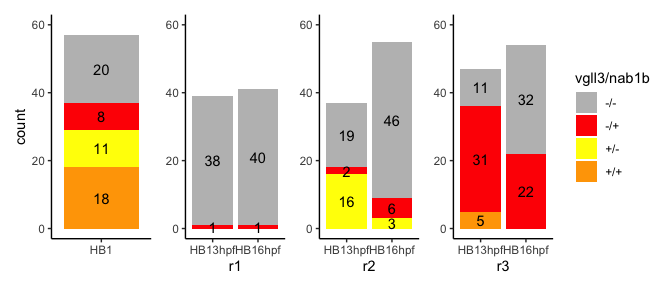

HB16hpf r1, r2, r3 vgll3 & nab1b expression R Notebook
================
Rebecca O’Rourke

# 1 libraries

``` r
suppressPackageStartupMessages({
  library(Seurat)
  library(Signac)
  library(knitr)
  library(kableExtra)
  library(dplyr)
  library(ggplot2)
  library(ggalluvial)
  library(ggsci)
  library(patchwork)
  library(dittoSeq)
  library(ComplexHeatmap)
  library(JASPAR2020)
  library(TFBSTools)
  library(motifmatchr)
  library(org.Dr.eg.db)
  library(BSgenome.Drerio.UCSC.danRer11)
})
```

    ## Warning: package 'ggplot2' was built under R version 4.1.2

    ## Warning: package 'patchwork' was built under R version 4.1.2

    ## Warning: package 'dittoSeq' was built under R version 4.1.1

    ## Warning: package 'TFBSTools' was built under R version 4.1.1

    ## Warning: package 'motifmatchr' was built under R version 4.1.1

    ## Warning: package 'AnnotationDbi' was built under R version 4.1.1

    ## Warning: package 'BiocGenerics' was built under R version 4.1.1

    ## Warning: package 'Biobase' was built under R version 4.1.1

    ## Warning: package 'IRanges' was built under R version 4.1.1

    ## Warning: package 'S4Vectors' was built under R version 4.1.3

    ## Warning: package 'BSgenome' was built under R version 4.1.1

    ## Warning: package 'GenomeInfoDb' was built under R version 4.1.1

    ## Warning: package 'GenomicRanges' was built under R version 4.1.1

    ## Warning: package 'Biostrings' was built under R version 4.1.1

    ## Warning: package 'XVector' was built under R version 4.1.1

    ## Warning: package 'rtracklayer' was built under R version 4.1.1

``` r
options(future.globals.maxSize = 4000 * 1024^2)
```

# 2 read data

``` r
HB10hpf <- readRDS(file = "RDSfiles/HB10hpf_neural.RDS")
HB13hpf <- readRDS(file = "RDSfiles/HB13hpf_neural.RDS")
HB16hpf <- readRDS(file = "RDSfiles/HB16hpf_neural.RDS")
```

# 3. Expression of vgll3 and nab1b by cell in r1, r2 or r3

## 3.1 HB.1

    ##   rhombomere vgll3.nab1b count
    ## 1        HB1         +/-    11
    ## 2        HB1         -/+     8
    ## 3        HB1         +/+    18
    ## 4        HB1         -/-    20

## 3.1 r1

### 3.1.2 HB13hpf

### 3.1.2 HB16hpf

``` r
r1cells.16 <- subset(HB16hpf, idents = "r1", features = c("vgll3","nab1b"))
df.r1.16 <- as.data.frame(t(GetAssayData(r1cells.16, slot = "data", assay = "SCT")))

r1.vgll3.16 <- sum(df.r1.16$vgll3 > 0 & df.r1.16$nab1b == 0) 
r1.nab1b.16 <- sum(df.r1.16$vgll3 == 0 & df.r1.16$nab1b > 0) 
r1.vgll3.nab1b.16 <- sum(df.r1.16$vgll3 > 0 & df.r1.16$nab1b > 0) 
r1.none.16 <- sum(df.r1.16$vgll3 == 0 & df.r1.16$nab1b == 0)
r1.cellcount.16 <- nrow(df.r1.16)
```

### 3.1.3 r1 cellcount df

``` r
# create a dataset
rhombomere <- c("HB13hpf","HB13hpf","HB13hpf","HB13hpf",
                "HB16hpf","HB16hpf","HB16hpf","HB16hpf")
# condition <- c("+vgll3/-nab1b","-vgll3/+nab1b","+vgll3/+nab1b","-vgll3/-nab1b",
#                "+vgll3/-nab1b","-vgll3/+nab1b","+vgll3/+nab1b","-vgll3/-nab1b")
vgll3.nab1b <- c("+/-","-/+","+/+","-/-",
               "+/-","-/+","+/+","-/-")
count <- c(r1.vgll3.13,r1.nab1b.13,r1.vgll3.nab1b.13,r1.none.13,
           r1.vgll3.16,r1.nab1b.16,r1.vgll3.nab1b.16,r1.none.16)
#data1 <- data.frame(rhombomere,condition,count)
data1 <- data.frame(rhombomere,vgll3.nab1b,count)
data1
```

    ##   rhombomere vgll3.nab1b count
    ## 1    HB13hpf         +/-     0
    ## 2    HB13hpf         -/+     1
    ## 3    HB13hpf         +/+     0
    ## 4    HB13hpf         -/-    38
    ## 5    HB16hpf         +/-     0
    ## 6    HB16hpf         -/+     1
    ## 7    HB16hpf         +/+     0
    ## 8    HB16hpf         -/-    40

## 3.2 r2

### 3.2.1 HB13hpf

### 3.2.2. HB16hpf

``` r
r2cells.16 <- subset(HB16hpf, idents = "r2", features = c("vgll3","nab1b"))
df.r2.16 <- as.data.frame(t(GetAssayData(r2cells.16, slot = "data", assay = "SCT")))

r2.vgll3.16 <- sum(df.r2.16$vgll3 > 0 & df.r2.16$nab1b == 0) 
r2.nab1b.16 <- sum(df.r2.16$vgll3 == 0 & df.r2.16$nab1b > 0) 
r2.vgll3.nab1b.16 <- sum(df.r2.16$vgll3 > 0 & df.r2.16$nab1b > 0) 
r2.none.16 <- sum(df.r2.16$vgll3 == 0 & df.r2.16$nab1b == 0)
r2.cellcount.16 <- nrow(df.r2.16)
```

### 3.2.3 r2 cellcount df

``` r
# create a dataset
rhombomere <- c("HB13hpf","HB13hpf","HB13hpf","HB13hpf",
                "HB16hpf","HB16hpf","HB16hpf","HB16hpf")
# condition <- c("+vgll3/-nab1b","-vgll3/+nab1b","+vgll3/+nab1b","-vgll3/-nab1b",
#                "+vgll3/-nab1b","-vgll3/+nab1b","+vgll3/+nab1b","-vgll3/-nab1b")
vgll3.nab1b <- c("+/-","-/+","+/+","-/-",
               "+/-","-/+","+/+","-/-")
count <- c(r2.vgll3.13,r2.nab1b.13,r2.vgll3.nab1b.13,r2.none.13,
           r2.vgll3.16,r2.nab1b.16,r2.vgll3.nab1b.16,r2.none.16)
#data2 <- data.frame(rhombomere,condition,count)
data2 <- data.frame(rhombomere,vgll3.nab1b,count)
data2
```

    ##   rhombomere vgll3.nab1b count
    ## 1    HB13hpf         +/-    16
    ## 2    HB13hpf         -/+     2
    ## 3    HB13hpf         +/+     0
    ## 4    HB13hpf         -/-    19
    ## 5    HB16hpf         +/-     3
    ## 6    HB16hpf         -/+     6
    ## 7    HB16hpf         +/+     0
    ## 8    HB16hpf         -/-    46

## 3.3 r3

### 3.3.1 HB13hpf

## 3.3.2 HB16hpf

``` r
r3cells.16 <- subset(HB16hpf, idents = "r3", features = c("vgll3","nab1b"))
df.r3.16 <- as.data.frame(t(GetAssayData(r3cells.16, slot = "data", assay = "SCT")))

r3.vgll3.16 <- sum(df.r3.16$vgll3 > 0 & df.r3.16$nab1b == 0) 
r3.nab1b.16 <- sum(df.r3.16$vgll3 == 0 & df.r3.16$nab1b > 0) 
r3.vgll3.nab1b.16 <- sum(df.r3.16$vgll3 > 0 & df.r3.16$nab1b > 0) 
r3.none.16 <- sum(df.r3.16$vgll3 == 0 & df.r3.16$nab1b == 0)
r3.cellcount.16 <- nrow(df.r3.16)
```

### 3.3.3 r3 cellcount df

``` r
# create a dataset
rhombomere <- c("HB13hpf","HB13hpf","HB13hpf","HB13hpf",
                "HB16hpf","HB16hpf","HB16hpf","HB16hpf")
# condition <- c("+vgll3/-nab1b","-vgll3/+nab1b","+vgll3/+nab1b","-vgll3/-nab1b",
#                "+vgll3/-nab1b","-vgll3/+nab1b","+vgll3/+nab1b","-vgll3/-nab1b")
vgll3.nab1b <- c("+/-","-/+","+/+","-/-",
               "+/-","-/+","+/+","-/-")
count <- c(r3.vgll3.13,r3.nab1b.13,r3.vgll3.nab1b.13,r3.none.13,
           r3.vgll3.16,r3.nab1b.16,r3.vgll3.nab1b.16,r3.none.16)
#data3 <- data.frame(rhombomere,condition,count)
data3 <- data.frame(rhombomere,vgll3.nab1b,count)
data3
```

    ##   rhombomere vgll3.nab1b count
    ## 1    HB13hpf         +/-     0
    ## 2    HB13hpf         -/+    31
    ## 3    HB13hpf         +/+     5
    ## 4    HB13hpf         -/-    11
    ## 5    HB16hpf         +/-     0
    ## 6    HB16hpf         -/+    22
    ## 7    HB16hpf         +/+     0
    ## 8    HB16hpf         -/-    32

# 4 barplot cellcount expressing vgll3 or nab1b

``` r
p5 <- ggplot(data4, aes(fill=vgll3.nab1b, y=count, x=rhombomere)) + 
  geom_bar(stat="identity") + ylim(0,60) +
  geom_text(data = subset(data4, count !=0),aes(label = count), position = position_stack(vjust = 0.5)) +
  scale_fill_manual(values = c("grey","red","yellow","orange","blue","purple","green","black")) +
  theme_classic() + theme(axis.title.x = element_blank(), legend.position = "none")
p6 <- ggplot(data1, aes(fill=vgll3.nab1b, y=count, x=rhombomere)) + 
  geom_bar(stat="identity") + ylim(0,60) +xlab("r1") +
  geom_text(data = subset(data1, count !=0),aes(label = count), position = position_stack(vjust = 0.5)) +
  scale_fill_manual(values = c("grey","red","yellow","orange","blue","purple","green","black")) +
  theme_classic() + theme(axis.title.y = element_blank(), legend.position = "none")
p7 <- ggplot(data2, aes(fill=vgll3.nab1b, y=count, x=rhombomere)) + 
  geom_bar(stat="identity") + ylim(0,60) + xlab("r2") +
  geom_text(data = subset(data2, count !=0),aes(label = count), position = position_stack(vjust = 0.5)) +
  scale_fill_manual(values = c("grey","red","yellow","orange","blue","purple","green","black")) +
  theme_classic() + theme(axis.title.y = element_blank(), legend.position = "none")
p8 <- ggplot(data3, aes(fill=vgll3.nab1b, y=count, x=rhombomere)) + 
  geom_bar(stat="identity") + ylim(0,60) + xlab("r3") +
  geom_text(data = subset(data3, count !=0),aes(label = count), position = position_stack(vjust = 0.5)) +
  scale_fill_manual(values = c("grey","red","yellow","orange","blue","purple","green","black")) +
  theme_classic() + theme(axis.title.y = element_blank())
vgll3_nab1b_barplot <- wrap_plots(list(p5,p6,p7,p8), nrow = 1, guides = "collect") + guides(fill=guide_legend(title="vgll3/nab1b"))
vgll3_nab1b_barplot
```

<!-- -->

``` r
saveRDS(vgll3_nab1b_barplot, file = "../results/vgll3_nab1b_barplot.RDS")
```

``` r
sessionInfo()
```

    ## R version 4.1.0 (2021-05-18)
    ## Platform: x86_64-apple-darwin17.0 (64-bit)
    ## Running under: macOS Big Sur 10.16
    ## 
    ## Matrix products: default
    ## BLAS:   /Library/Frameworks/R.framework/Versions/4.1/Resources/lib/libRblas.dylib
    ## LAPACK: /Library/Frameworks/R.framework/Versions/4.1/Resources/lib/libRlapack.dylib
    ## 
    ## locale:
    ## [1] en_US.UTF-8/en_US.UTF-8/en_US.UTF-8/C/en_US.UTF-8/en_US.UTF-8
    ## 
    ## attached base packages:
    ## [1] stats4    grid      stats     graphics  grDevices utils     datasets 
    ## [8] methods   base     
    ## 
    ## other attached packages:
    ##  [1] BSgenome.Drerio.UCSC.danRer11_1.4.2 BSgenome_1.62.0                    
    ##  [3] rtracklayer_1.54.0                  Biostrings_2.62.0                  
    ##  [5] XVector_0.34.0                      GenomicRanges_1.46.0               
    ##  [7] GenomeInfoDb_1.30.0                 org.Dr.eg.db_3.14.0                
    ##  [9] AnnotationDbi_1.56.1                IRanges_2.28.0                     
    ## [11] S4Vectors_0.32.4                    Biobase_2.54.0                     
    ## [13] BiocGenerics_0.40.0                 motifmatchr_1.16.0                 
    ## [15] TFBSTools_1.32.0                    JASPAR2020_0.99.10                 
    ## [17] ComplexHeatmap_2.11.1               dittoSeq_1.6.0                     
    ## [19] patchwork_1.1.2                     ggsci_2.9                          
    ## [21] ggalluvial_0.12.3                   ggplot2_3.4.0                      
    ## [23] dplyr_1.0.7                         kableExtra_1.3.4                   
    ## [25] knitr_1.36                          Signac_1.2.1                       
    ## [27] SeuratObject_4.0.4                  Seurat_4.0.1                       
    ## 
    ## loaded via a namespace (and not attached):
    ##   [1] utf8_1.2.2                  R.utils_2.11.0             
    ##   [3] reticulate_1.22             tidyselect_1.1.1           
    ##   [5] poweRlaw_0.70.6             RSQLite_2.2.8              
    ##   [7] htmlwidgets_1.5.4           docopt_0.7.1               
    ##   [9] BiocParallel_1.28.0         Rtsne_0.15                 
    ##  [11] munsell_0.5.0               codetools_0.2-18           
    ##  [13] ica_1.0-2                   future_1.26.1              
    ##  [15] miniUI_0.1.1.1              withr_2.5.0                
    ##  [17] colorspace_2.0-2            highr_0.9                  
    ##  [19] rstudioapi_0.13             SingleCellExperiment_1.16.0
    ##  [21] ROCR_1.0-11                 tensor_1.5                 
    ##  [23] listenv_0.8.0               labeling_0.4.2             
    ##  [25] MatrixGenerics_1.6.0        slam_0.1-48                
    ##  [27] GenomeInfoDbData_1.2.7      polyclip_1.10-0            
    ##  [29] bit64_4.0.5                 farver_2.1.0               
    ##  [31] pheatmap_1.0.12             parallelly_1.32.0          
    ##  [33] vctrs_0.5.0                 generics_0.1.1             
    ##  [35] xfun_0.27                   lsa_0.73.2                 
    ##  [37] ggseqlogo_0.1               R6_2.5.1                   
    ##  [39] doParallel_1.0.17           clue_0.3-62                
    ##  [41] cachem_1.0.6                bitops_1.0-7               
    ##  [43] spatstat.utils_2.2-0        DelayedArray_0.20.0        
    ##  [45] assertthat_0.2.1            BiocIO_1.4.0               
    ##  [47] promises_1.2.0.1            scales_1.2.1               
    ##  [49] gtable_0.3.0                globals_0.15.1             
    ##  [51] goftest_1.2-3               seqLogo_1.60.0             
    ##  [53] rlang_1.0.6                 systemfonts_1.0.4          
    ##  [55] RcppRoll_0.3.0              GlobalOptions_0.1.2        
    ##  [57] splines_4.1.0               lazyeval_0.2.2             
    ##  [59] spatstat.geom_2.3-0         yaml_2.2.1                 
    ##  [61] reshape2_1.4.4              abind_1.4-5                
    ##  [63] httpuv_1.6.3                tools_4.1.0                
    ##  [65] ellipsis_0.3.2              spatstat.core_2.3-0        
    ##  [67] RColorBrewer_1.1-2          ggridges_0.5.3             
    ##  [69] Rcpp_1.0.7                  plyr_1.8.6                 
    ##  [71] zlibbioc_1.40.0             purrr_0.3.4                
    ##  [73] RCurl_1.98-1.5              rpart_4.1-15               
    ##  [75] deldir_1.0-6                pbapply_1.5-0              
    ##  [77] GetoptLong_1.0.5            cowplot_1.1.1              
    ##  [79] zoo_1.8-9                   SummarizedExperiment_1.24.0
    ##  [81] ggrepel_0.9.1               cluster_2.1.2              
    ##  [83] magrittr_2.0.1              data.table_1.14.2          
    ##  [85] scattermore_0.7             circlize_0.4.15            
    ##  [87] lmtest_0.9-38               RANN_2.6.1                 
    ##  [89] SnowballC_0.7.0             fitdistrplus_1.1-6         
    ##  [91] matrixStats_0.61.0          hms_1.1.1                  
    ##  [93] mime_0.12                   evaluate_0.14              
    ##  [95] xtable_1.8-4                XML_3.99-0.8               
    ##  [97] sparsesvd_0.2               gridExtra_2.3              
    ##  [99] shape_1.4.6                 compiler_4.1.0             
    ## [101] tibble_3.1.6                KernSmooth_2.23-20         
    ## [103] crayon_1.4.2                R.oo_1.24.0                
    ## [105] htmltools_0.5.2             tzdb_0.2.0                 
    ## [107] mgcv_1.8-38                 later_1.3.0                
    ## [109] tidyr_1.1.4                 DBI_1.1.1                  
    ## [111] tweenr_1.0.2                MASS_7.3-54                
    ## [113] readr_2.0.2                 Matrix_1.3-4               
    ## [115] cli_3.4.1                   R.methodsS3_1.8.1          
    ## [117] parallel_4.1.0              igraph_1.2.8               
    ## [119] pkgconfig_2.0.3             GenomicAlignments_1.30.0   
    ## [121] TFMPvalue_0.0.8             plotly_4.10.0              
    ## [123] spatstat.sparse_2.0-0       xml2_1.3.3                 
    ## [125] foreach_1.5.2               annotate_1.72.0            
    ## [127] svglite_2.1.0               DirichletMultinomial_1.36.0
    ## [129] webshot_0.5.4               rvest_1.0.3                
    ## [131] stringr_1.4.0               digest_0.6.28              
    ## [133] pracma_2.3.3                sctransform_0.3.3          
    ## [135] RcppAnnoy_0.0.19            CNEr_1.30.0                
    ## [137] spatstat.data_2.1-0         rmarkdown_2.11             
    ## [139] leiden_0.3.9                fastmatch_1.1-3            
    ## [141] uwot_0.1.10                 restfulr_0.0.13            
    ## [143] gtools_3.9.2                shiny_1.7.1                
    ## [145] Rsamtools_2.10.0            rjson_0.2.20               
    ## [147] lifecycle_1.0.3             nlme_3.1-153               
    ## [149] jsonlite_1.7.2              viridisLite_0.4.0          
    ## [151] fansi_0.5.0                 pillar_1.6.4               
    ## [153] lattice_0.20-45             GO.db_3.14.0               
    ## [155] KEGGREST_1.34.0             fastmap_1.1.0              
    ## [157] httr_1.4.2                  survival_3.2-13            
    ## [159] glue_1.6.2                  qlcMatrix_0.9.7            
    ## [161] png_0.1-7                   iterators_1.0.14           
    ## [163] bit_4.0.4                   ggforce_0.3.3              
    ## [165] stringi_1.7.5               blob_1.2.2                 
    ## [167] memoise_2.0.0               caTools_1.18.2             
    ## [169] irlba_2.3.3                 future.apply_1.8.1
