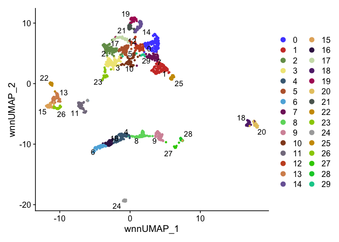
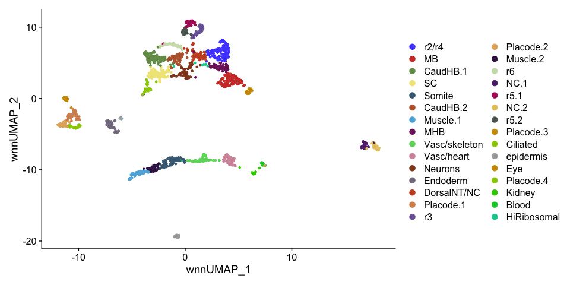
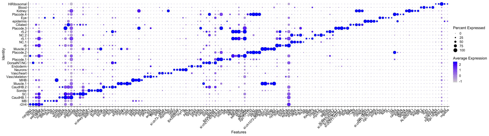
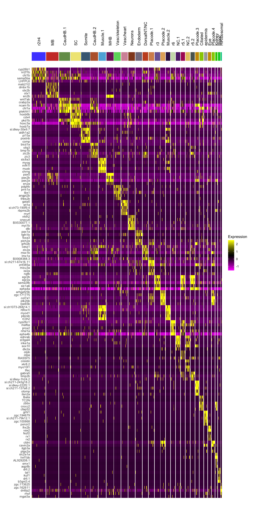
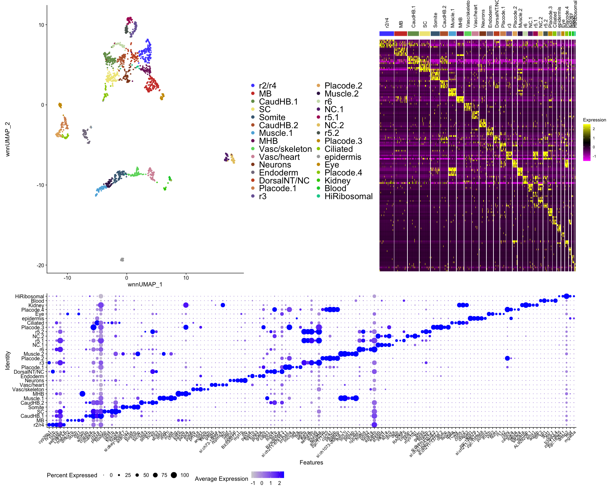

Cluster Naming and plots HB13hpf R Notebook
================

# 1. libraries

``` r
suppressPackageStartupMessages({
  library(Seurat)
  library(org.Dr.eg.db)
  library(BSgenome.Drerio.UCSC.danRer11)
  library(Signac)
  library(knitr)
  library(kableExtra)
  library(dplyr)
  library(ggplot2)
  library(ggsci)
  library(limma)
  library(JASPAR2020)
  library(patchwork)
  library(TFBSTools)
  library(motifmatchr)
  library(harmony)
})
```

    ## Warning: package 'AnnotationDbi' was built under R version 4.1.1

    ## Warning: package 'BiocGenerics' was built under R version 4.1.1

    ## Warning: package 'Biobase' was built under R version 4.1.1

    ## Warning: package 'IRanges' was built under R version 4.1.1

    ## Warning: package 'S4Vectors' was built under R version 4.1.3

    ## Warning: package 'BSgenome' was built under R version 4.1.1

    ## Warning: package 'GenomeInfoDb' was built under R version 4.1.1

    ## Warning: package 'GenomicRanges' was built under R version 4.1.1

    ## Warning: package 'Biostrings' was built under R version 4.1.1

    ## Warning: package 'XVector' was built under R version 4.1.1

    ## Warning: package 'rtracklayer' was built under R version 4.1.1

    ## Warning: package 'limma' was built under R version 4.1.3

    ## Warning: package 'TFBSTools' was built under R version 4.1.1

    ## Warning: package 'motifmatchr' was built under R version 4.1.1

``` r
options(future.globals.maxSize = 4000 * 1024^2)
```

``` r
mypal <- pal_igv(palette = "default",alpha = 1)(35) ## updated from 30 because HB13hpf has 31 clusters and this was causing DoHeatmap to hang
```

# 2. Read data

``` r
seurat <- readRDS(file = "RDSfiles/HB13hpf.clustered.RDS")
DefaultAssay(seurat) <- "SCT"
Idents(seurat) <- "wsnn_res.3"
DimPlot(seurat, reduction = "wnn.umap", label = T, repel = T) + scale_color_igv()
```

<!-- -->

# 3. Rename Idents

``` r
Idents(seurat) <- "wsnn_res.3"
seurat <- RenameIdents(seurat,
                       "0" = "r1 r2 & r4",
                       "1" = "FB & MB",
                       "2" = "MHB.1",
                       "3" = "Placode.1",
                       "4" = "SC",
                       "5" = "NC.1",
                       "6" = "CaudHB.1",
                       "7" = "Muscle.1",
                       "8" = "Heart",
                       "9" = "MHB.2",
                       "10" = "Muscle.2",
                       "11" = "Skeletal",
                       "12" = "Somite",
                       "13" = "Endoderm",
                       "14" = "Placode.2",
                       "15" = "CaudHB.2",
                       "16" = "r3",
                       "17" = "r5",
                       "18" = "Placode.3",
                       "19" = "Neuron",
                       "20" = "r6",
                       "21" = "Blood",
                       "22" = "Eye.1",
                       "23" = "NC.2",
                       "24" = "Eye.2",
                       "25" = "HiRibosomal",
                       "26" = "Placode.4",
                       "27" = "FB & eye",
                       "28" = "Ciliated",
                       "29" = "Notochord",
                       "30" = "Kidney")
umapPlot <- DimPlot(seurat, reduction = "wnn.umap") + scale_color_igv()
umapPlot
```

<!-- -->

``` r
ggsave(filename = "../results/FigureS3_HB13hpf_umapPlot.png", plot = umapPlot)
```

    ## Saving 10 x 5 in image

# 4. Find DE genes

``` r
All.markers <- FindAllMarkers(seurat, only.pos = T, verbose = F)
write.table(All.markers, file = "../results/FigureS3_HB13hpf_markers.txt", sep = "\t", quote = F, col.names = NA)
```

``` r
top5.pval <- All.markers %>% group_by(cluster) %>% top_n(n=-5, wt = p_val) %>% top_n(n=5, wt = avg_log2FC)
top5.pval
```

    ## # A tibble: 155 × 7
    ## # Groups:   cluster [31]
    ##       p_val avg_log2FC pct.1 pct.2 p_val_adj cluster    gene   
    ##       <dbl>      <dbl> <dbl> <dbl>     <dbl> <fct>      <chr>  
    ##  1 3.20e-52      1.02  0.538 0.093  6.51e-48 r1 r2 & r4 cyp26c1
    ##  2 5.49e-51      1.08  0.826 0.249  1.12e-46 r1 r2 & r4 plp1a  
    ##  3 1.69e-41      0.872 0.439 0.075  3.43e-37 r1 r2 & r4 skap2  
    ##  4 1.13e-39      0.930 0.705 0.205  2.31e-35 r1 r2 & r4 lamb2  
    ##  5 9.22e-36      1.11  0.742 0.271  1.87e-31 r1 r2 & r4 nr2f2  
    ##  6 1.28e-81      1.81  0.66  0.078  2.61e-77 FB & MB    stra6  
    ##  7 1.00e-39      0.808 0.396 0.054  2.04e-35 FB & MB    kif5c  
    ##  8 8.03e-35      0.980 0.425 0.074  1.63e-30 FB & MB    afap1l2
    ##  9 6.41e-33      0.765 0.425 0.078  1.30e-28 FB & MB    sall3b 
    ## 10 1.10e-32      0.273 0.189 0.012  2.24e-28 FB & MB    dmbx1b 
    ## # … with 145 more rows

# 5. Plots

## 5.1 dotplot

``` r
dotPlot <- DotPlot(seurat, features = unique(top5.pval$gene)) + RotatedAxis()
dotPlot
```

<!-- -->

``` r
ggsave(filename = "../results/FigureS3_HB13hpf_dotPlot.png", plot = dotPlot)
```

    ## Saving 25 x 7 in image

## 5.2 heatmap

``` r
heatmapPlot <- DoHeatmap(seurat, features = unique(top5.pval$gene), group.colors = mypal, size = 5, angle = 90) + guides(color = FALSE)
```

    ## Warning: `guides(<scale> = FALSE)` is deprecated. Please use `guides(<scale> =
    ## "none")` instead.

``` r
heatmapPlot
```

<!-- -->

``` r
ggsave(filename = "../results/FigureS3_HB13hpf_heatmapPlot.png", plot = heatmapPlot)
```

    ## Saving 10 x 20 in image

## 5.3 combine umap, dotplot and heatmap

``` r
combined <- (((umapPlot + 
      theme(legend.text = element_text(size = 20))) |
     (heatmapPlot +
        theme(axis.text = element_blank()))) / 
    (dotPlot + 
       theme(axis.text.x = element_text(size = 10),
             axis.text.y = element_text(size = 12),
             legend.position = "bottom"))) +
    plot_layout(heights = c(2,1))
combined
```

<!-- -->

``` r
ggsave(filename = "../results/FigureS3_HB13hpf_combinedPlot.png", plot = combined)
```

    ## Saving 20 x 16 in image

``` r
sessionInfo()
```

    ## R version 4.1.0 (2021-05-18)
    ## Platform: x86_64-apple-darwin17.0 (64-bit)
    ## Running under: macOS Big Sur 10.16
    ## 
    ## Matrix products: default
    ## BLAS:   /Library/Frameworks/R.framework/Versions/4.1/Resources/lib/libRblas.dylib
    ## LAPACK: /Library/Frameworks/R.framework/Versions/4.1/Resources/lib/libRlapack.dylib
    ## 
    ## locale:
    ## [1] en_US.UTF-8/en_US.UTF-8/en_US.UTF-8/C/en_US.UTF-8/en_US.UTF-8
    ## 
    ## attached base packages:
    ## [1] stats4    stats     graphics  grDevices utils     datasets  methods  
    ## [8] base     
    ## 
    ## other attached packages:
    ##  [1] harmony_0.1.0                       Rcpp_1.0.7                         
    ##  [3] motifmatchr_1.16.0                  TFBSTools_1.32.0                   
    ##  [5] patchwork_1.1.1                     JASPAR2020_0.99.10                 
    ##  [7] limma_3.50.3                        ggsci_2.9                          
    ##  [9] ggplot2_3.3.5                       dplyr_1.0.7                        
    ## [11] kableExtra_1.3.4                    knitr_1.36                         
    ## [13] Signac_1.2.1                        BSgenome.Drerio.UCSC.danRer11_1.4.2
    ## [15] BSgenome_1.62.0                     rtracklayer_1.54.0                 
    ## [17] Biostrings_2.62.0                   XVector_0.34.0                     
    ## [19] GenomicRanges_1.46.0                GenomeInfoDb_1.30.0                
    ## [21] org.Dr.eg.db_3.14.0                 AnnotationDbi_1.56.1               
    ## [23] IRanges_2.28.0                      S4Vectors_0.32.4                   
    ## [25] Biobase_2.54.0                      BiocGenerics_0.40.0                
    ## [27] SeuratObject_4.0.4                  Seurat_4.0.1                       
    ## 
    ## loaded via a namespace (and not attached):
    ##   [1] utf8_1.2.2                  R.utils_2.11.0             
    ##   [3] reticulate_1.22             tidyselect_1.1.1           
    ##   [5] poweRlaw_0.70.6             RSQLite_2.2.8              
    ##   [7] htmlwidgets_1.5.4           grid_4.1.0                 
    ##   [9] docopt_0.7.1                BiocParallel_1.28.0        
    ##  [11] Rtsne_0.15                  munsell_0.5.0              
    ##  [13] ragg_1.2.2                  codetools_0.2-18           
    ##  [15] ica_1.0-2                   future_1.26.1              
    ##  [17] miniUI_0.1.1.1              withr_2.4.2                
    ##  [19] colorspace_2.0-2            highr_0.9                  
    ##  [21] rstudioapi_0.13             ROCR_1.0-11                
    ##  [23] tensor_1.5                  listenv_0.8.0              
    ##  [25] labeling_0.4.2              MatrixGenerics_1.6.0       
    ##  [27] slam_0.1-48                 GenomeInfoDbData_1.2.7     
    ##  [29] polyclip_1.10-0             bit64_4.0.5                
    ##  [31] farver_2.1.0                parallelly_1.32.0          
    ##  [33] vctrs_0.4.1                 generics_0.1.1             
    ##  [35] xfun_0.27                   lsa_0.73.2                 
    ##  [37] ggseqlogo_0.1               R6_2.5.1                   
    ##  [39] bitops_1.0-7                spatstat.utils_2.2-0       
    ##  [41] cachem_1.0.6                DelayedArray_0.20.0        
    ##  [43] assertthat_0.2.1            promises_1.2.0.1           
    ##  [45] BiocIO_1.4.0                scales_1.1.1               
    ##  [47] gtable_0.3.0                globals_0.15.1             
    ##  [49] goftest_1.2-3               seqLogo_1.60.0             
    ##  [51] rlang_1.0.3                 systemfonts_1.0.4          
    ##  [53] RcppRoll_0.3.0              splines_4.1.0              
    ##  [55] lazyeval_0.2.2              spatstat.geom_2.3-0        
    ##  [57] yaml_2.2.1                  reshape2_1.4.4             
    ##  [59] abind_1.4-5                 httpuv_1.6.3               
    ##  [61] tools_4.1.0                 ellipsis_0.3.2             
    ##  [63] spatstat.core_2.3-0         RColorBrewer_1.1-2         
    ##  [65] ggridges_0.5.3              plyr_1.8.6                 
    ##  [67] zlibbioc_1.40.0             purrr_0.3.4                
    ##  [69] RCurl_1.98-1.5              rpart_4.1-15               
    ##  [71] deldir_1.0-6                pbapply_1.5-0              
    ##  [73] cowplot_1.1.1               zoo_1.8-9                  
    ##  [75] SummarizedExperiment_1.24.0 ggrepel_0.9.1              
    ##  [77] cluster_2.1.2               magrittr_2.0.1             
    ##  [79] data.table_1.14.2           scattermore_0.7            
    ##  [81] lmtest_0.9-38               RANN_2.6.1                 
    ##  [83] SnowballC_0.7.0             fitdistrplus_1.1-6         
    ##  [85] matrixStats_0.61.0          hms_1.1.1                  
    ##  [87] mime_0.12                   evaluate_0.14              
    ##  [89] xtable_1.8-4                XML_3.99-0.8               
    ##  [91] sparsesvd_0.2               gridExtra_2.3              
    ##  [93] compiler_4.1.0              tibble_3.1.6               
    ##  [95] KernSmooth_2.23-20          crayon_1.4.2               
    ##  [97] R.oo_1.24.0                 htmltools_0.5.2            
    ##  [99] tzdb_0.2.0                  mgcv_1.8-38                
    ## [101] later_1.3.0                 tidyr_1.1.4                
    ## [103] DBI_1.1.1                   tweenr_1.0.2               
    ## [105] MASS_7.3-54                 readr_2.0.2                
    ## [107] Matrix_1.3-4                cli_3.3.0                  
    ## [109] R.methodsS3_1.8.1           parallel_4.1.0             
    ## [111] igraph_1.2.8                pkgconfig_2.0.3            
    ## [113] TFMPvalue_0.0.8             GenomicAlignments_1.30.0   
    ## [115] plotly_4.10.0               spatstat.sparse_2.0-0      
    ## [117] xml2_1.3.2                  annotate_1.72.0            
    ## [119] svglite_2.0.0               DirichletMultinomial_1.36.0
    ## [121] webshot_0.5.2               rvest_1.0.2                
    ## [123] stringr_1.4.0               digest_0.6.28              
    ## [125] pracma_2.3.3                sctransform_0.3.3          
    ## [127] RcppAnnoy_0.0.19            CNEr_1.30.0                
    ## [129] spatstat.data_2.1-0         rmarkdown_2.11             
    ## [131] leiden_0.3.9                fastmatch_1.1-3            
    ## [133] uwot_0.1.10                 restfulr_0.0.13            
    ## [135] gtools_3.9.2                shiny_1.7.1                
    ## [137] Rsamtools_2.10.0            rjson_0.2.20               
    ## [139] lifecycle_1.0.1             nlme_3.1-153               
    ## [141] jsonlite_1.7.2              viridisLite_0.4.0          
    ## [143] fansi_0.5.0                 pillar_1.6.4               
    ## [145] lattice_0.20-45             GO.db_3.14.0               
    ## [147] KEGGREST_1.34.0             fastmap_1.1.0              
    ## [149] httr_1.4.2                  survival_3.2-13            
    ## [151] glue_1.6.2                  qlcMatrix_0.9.7            
    ## [153] png_0.1-7                   bit_4.0.4                  
    ## [155] ggforce_0.3.3               stringi_1.7.5              
    ## [157] blob_1.2.2                  textshaping_0.3.6          
    ## [159] caTools_1.18.2              memoise_2.0.0              
    ## [161] irlba_2.3.3                 future.apply_1.8.1
